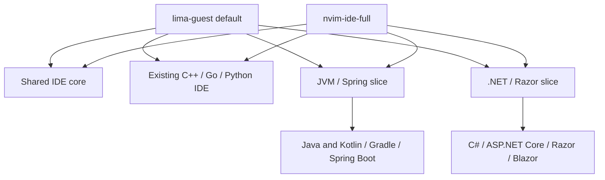

# Lima NvChad JVM and .NET IDE - Plan

## Goal Capsule

- **Objective:** MacBook의 Lima Ubuntu guest에서 NvChad 하나로 기존 C++·Go·Python과 Java·Kotlin·C# 프로젝트를 개발할 수 있는 재현 가능한 전체 IDE 환경을 제공한다.
- **Product authority:** 이 Product Contract를 Notion `배경`의 canonical 요구사항 문서와 동기화해야 한다.
- **Execution:** `projects/my-desk-setup`의 기존 plan/apply/doctor, exact pin, ownership, 실제 대상 검증 경계를 확장한다.
- **Workflow exceptions:** 사용자의 2026-08-21 지시에 따라 별도 `ce-ideate` 산출물과 Linear 티켓은 면제하며 canonical Notion 요구사항, 로컬 계획·work evidence와 project PR 흐름은 유지한다.

---

## Product Contract

### Summary

Lima guest의 기본 NvChad 환경은 기존 언어 지원을 보존하면서 JVM과 .NET 개발을 전체 프로필로 제공한다.
Spring Boot와 ASP.NET Core API·MVC/Razor·Blazor 프로젝트에서 편집, 빌드, 테스트, 실행, watch와 중단점 디버깅을 실제 프로젝트로 검증한다.

### Problem Frame

현재 관리형 NvChad IDE는 Lima에서 C++·Go·Python 개발만 지원한다.
Java·Kotlin·Gradle은 catalog와 lock에 존재하지만 Linux guest target에서는 지원되지 않으며, .NET SDK와 C# 편집 도구는 catalog와 NvChad configuration에 없다.
따라서 MacBook 사용자는 Spring Boot 또는 ASP.NET Core 프로젝트를 NvChad로 시작할 수 없고, 설정을 수동 조합하면 프로젝트가 보장하는 exact version, repair, doctor와 ownership 계약을 잃는다.

### Key Decisions

- **Lima first:** 1차 지원 대상은 macOS host가 아니라 Lima Ubuntu guest이며 WSL은 후속 범위로 둔다.
- **Composable profiles:** JVM과 .NET을 각각 선택할 수 있고 각 profile이 profile nesting 없이 필요한 component/capability root를 직접 합성한다.
- **Full by default:** `lima-guest` 기본 profile은 `nvim-ide-full`과 동일한 full root closure를 직접 선택하되 언어별 profile도 유지한다.
- **End-to-end IDE outcome:** 단순 LSP 연결이 아니라 편집, build, test, run, watch와 DAP debugging까지 완료 기준에 포함한다.
- **Pinned experimental Kotlin:** 공식 Kotlin LSP의 Alpha 상태를 숨기지 않고 exact version과 실제 Gradle/Spring Boot 검증을 통과한 경우에만 ready로 판정한다.
- **Bounded Kotlin Spring support:** Kotlin은 언어·Gradle·debug와 Spring 설정 파일 지원을 필수로 하되 Java Spring Tools와 동일한 bean·endpoint 인식은 완료 조건에서 제외한다.
- **Razor and Blazor included:** ASP.NET Core는 Web API뿐 아니라 MVC/Razor와 Blazor의 혼합 문서 편집, 실행과 debugging을 포함한다.
- **Verified Neovim upgrade:** Razor/Blazor 지원에 필요한 Neovim 0.12 이상을 exact artifact로 고정하고 기존 NvChad 기능의 회귀가 없을 때만 이동한다.

### Requirements

**Profiles and target ownership**

- R1. 1차 지원은 Lima Ubuntu guest에 한정하며 language runtime, build tool, language server, debugger와 NvChad configuration은 guest가 소유해야 한다.
- R2. `nvim-ide-jvm`, `nvim-ide-dotnet`, `nvim-ide-full`은 profile nesting 없이 각각 shared core와 필요한 JVM, .NET, 기존 C++·Go·Python component/capability root 조합을 직접 선택해야 한다.
- R3. `lima-guest` 기본 profile은 `nvim-ide-full`과 동일한 full root closure를 직접 선택해야 한다.
- R4. 신규 runtime, build tool, language server, debugger와 plugin은 review 가능한 immutable identity로 고정되어야 하며 normal apply가 이를 몰래 갱신해서는 안 된다.
- R5. 기존 사용자 소유 `~/.config/nvim`은 명시적인 adoption 없이 변경하지 않고, 기존 mds-managed configuration의 누락이나 drift만 안전하게 복구해야 한다. Project-controlled import와 실행은 canonical root의 명시적 workspace trust 뒤에만 허용하며 사용자는 trust를 철회해 현재 NvChad instance가 해당 root에 대해 추적하는 process와 LSP를 즉시 종료할 수 있어야 한다.

**JVM and Spring Boot**

- R6. Java와 Kotlin source에서 project-aware navigation, completion, diagnostics, refactoring, formatting과 import 관리가 동작해야 한다.
- R7. Gradle wrapper 기반 Java·Kotlin 프로젝트의 import, build, test와 run이 project root에서 동작해야 한다.
- R8. Java Spring Boot source와 `application*.properties` 및 YAML에서 framework-aware navigation, completion과 diagnostics를 제공해야 한다.
- R9. Kotlin Spring Boot source는 Kotlin LSP의 언어 기능, Gradle project model과 Spring 설정 파일 지원을 제공해야 한다.
- R10. Java와 Kotlin application 및 test는 NvChad의 공통 debugging UI에서 breakpoint, continue, step-in, step-over와 variable inspection을 지원해야 한다.
- R11. 공식 Kotlin LSP가 선택된 Gradle/Spring Boot fixture에서 기능 검증을 통과하지 못하면 JVM profile을 ready로 판정해서는 안 된다.

**.NET and ASP.NET Core**

- R12. .NET SDK는 C# console, library와 test project 및 ASP.NET Core Web API·MVC/Razor·Blazor project를 restore, build, test와 run할 수 있어야 한다.
- R13. C# source에서 solution-aware navigation, completion, diagnostics, refactoring과 formatting이 동작해야 한다.
- R14. `.cshtml`과 `.razor`의 C#·HTML 혼합 문서에서 completion, diagnostics, navigation과 formatting을 제공해야 한다.
- R15. ASP.NET Core project는 사용자가 선택한 `launchSettings.json` profile의 project와 environment를 존중하되 managed run/watch/debug의 최종 바인딩은 loopback으로 제한하고 non-loopback profile은 실행 전에 거부해야 한다.
- R16. C# application, ASP.NET Core server와 test는 NvChad의 공통 debugging UI에서 breakpoint, continue, step-in, step-over와 variable inspection을 지원해야 한다.

**Execution experience and verification**

- R17. 사용자는 NvChad 안에서 현재 project의 build, test, run, watch와 debug action을 발견하고 실행할 수 있어야 하며 실패 결과를 terminal 또는 diagnostic surface에서 확인할 수 있어야 한다.
- R18. 관리형 Neovim은 0.12 이상의 검토된 exact release를 사용하고 기존 C++·Go·Python LSP, formatter, lint와 DAP 기능을 보존해야 한다.
- R19. doctor는 executable 존재뿐 아니라 managed configuration, exact plugin/runtime identity와 언어별 실제 project capability를 검증해야 한다.
- R20. 선택된 profile의 필수 capability 하나라도 실패하면 apply 또는 doctor는 ready를 반환하지 않고 실패 지점을 식별해야 한다.

### Key Flows

- F1. Lima default provisioning
  - **Trigger:** 사용자가 MacBook의 Lima target에 기본 `lima-guest` profile을 plan한 뒤 reviewed digest로 apply한다.
  - **Steps:** resolver가 `nvim-ide-full`과 동일한 normalized shared-core·legacy·JVM·.NET root closure를 `lima-guest`에서 직접 계산하고 guest 안에 고정된 runtime, IDE tool과 managed NvChad configuration을 적용한다.
  - **Outcome:** 기존 언어와 JVM·.NET capability가 같은 ownership 및 verification 계약 아래 준비된다.
  - **Covered by:** R1-R5, R18-R20
- F2. JVM project workflow
  - **Trigger:** 사용자가 Gradle 기반 Java 또는 Kotlin Spring Boot project를 NvChad로 연다.
  - **Steps:** project model과 language service가 준비되고 사용자는 편집, build, test, run과 debugging action을 실행한다.
  - **Outcome:** 언어별 필수 기능이 동작하며 실패한 기능은 profile readiness를 차단한다.
  - **Covered by:** R6-R11, R17, R19-R20
- F3. ASP.NET Core workflow
  - **Trigger:** 사용자가 Web API, MVC/Razor 또는 Blazor project를 NvChad로 연다.
  - **Steps:** solution과 launch profile을 해석하고 C#·Razor language service, run/watch와 debugging action을 제공한다.
  - **Outcome:** source와 혼합 문서 편집부터 server 실행 및 breakpoint debugging까지 하나의 환경에서 동작한다.
  - **Covered by:** R12-R17, R19-R20
- F4. Managed repair
  - **Trigger:** 관리형 configuration 또는 pinned plugin/runtime tree가 누락되거나 drift된다.
  - **Steps:** plan과 doctor가 drift를 식별하고 reviewed apply가 선택된 profile 범위만 exact state로 복구한다.
  - **Outcome:** 사용자 소유 configuration은 보존되고 managed environment만 재현 가능한 상태로 돌아온다.
  - **Covered by:** R4-R5, R18-R20

### Acceptance Examples

- AE1. 깨끗한 Apple Silicon Lima Ubuntu guest에서 기본 `lima-guest` profile을 plan하면 `nvim-ide-full`과 동일한 normalized shared-core·legacy·JVM·.NET root closure를 직접 resolve하고, apply 후 repeat plan은 같은 identity를 유지한다.
- AE2. 사용자 소유 `~/.config/nvim`이 있는 Lima guest에서 일반 apply는 원본을 변경하지 않고 conflict를 보고하며, 명시적인 adoption만 기존 backup을 보존한 뒤 관리 상태로 전환한다.
- AE3. Gradle Java Spring Boot fixture를 열면 Java navigation·completion·diagnostics, Spring bean·endpoint 및 설정 지원, format, build, test, run과 breakpoint debugging이 통과한다.
- AE4. Gradle Kotlin Spring Boot fixture를 열면 Kotlin navigation·completion·diagnostics·format, Spring 설정 지원, build, test, run과 breakpoint debugging이 통과한다.
- AE5. Kotlin fixture에서 Java Spring Tools와 동일한 bean·endpoint 인식이 제공되지 않아도 AE4의 필수 capability가 통과하면 JVM profile은 ready일 수 있다.
- AE6. ASP.NET Core Web API와 MVC/Razor fixture에서 C# 및 `.cshtml` 편집, restore, build, test, launch-profile run, watch와 breakpoint debugging이 통과한다.
- AE7. Blazor fixture에서 `.razor`의 C#·HTML completion·diagnostics·navigation·formatting, run, watch와 breakpoint debugging이 통과한다.
- AE8. 관리형 Neovim upgrade 후 기존 C++·Go·Python 실제 smoke와 전체 plugin checkout identity 검사가 모두 통과한다.
- AE9. language server, debugger, mixed-document support 또는 실제 build/test/run probe 중 하나가 실패하면 doctor는 target을 certified 또는 ready로 보고하지 않는다.

### Scope Boundaries

- WSL guest 지원과 Windows target certification
- macOS host에 JDK, Kotlin, Gradle 또는 .NET SDK를 직접 설치하는 구성
- Kotlin Spring source에 Java Spring Tools와 동일한 bean·endpoint 인식을 제공하기 위한 custom integration 개발
- Android, Kotlin Multiplatform, Unity, Xamarin 또는 .NET MAUI 전용 개발 환경
- 인증, package feed credential 또는 개발용 HTTPS certificate trust의 자동 승인
- 기존 사용자 소유 Neovim configuration의 무단 교체

### Dependencies and Assumptions

- Lima Ubuntu target에서 Apple Silicon용 Neovim, JVM, Kotlin LSP, .NET SDK, Roslyn/Razor language service와 debugger artifact를 검토 가능한 source와 checksum으로 확보할 수 있어야 한다.
- Razor/Blazor의 Neovim 지원은 Roslyn language server의 Razor co-hosting과 이를 연결하는 maintained Neovim integration에 의존한다.
- 공식 Kotlin LSP는 Alpha이므로 upstream 안정성을 가정하지 않으며 pinned fixture 검증이 readiness의 authority다.
- Java Spring framework-aware 기능은 Spring Boot language server와 Java language server가 project model을 공유할 수 있다는 전제에 의존한다.
- 실행 자동화는 project가 제공하는 Gradle wrapper, .NET project/solution과 launch profile을 우선하며 project source를 임의로 수정하지 않는다.

### Outstanding Questions

**Resolved Before Planning**

- Linear 티켓과 별도 persistent ideation artifact는 사용자의 명시 지시로 면제했다.
- Notion `배경`에 canonical 요구사항 문서를 생성하고 이 문서와 동기화했다.

**Deferred to Planning**

- Neovim 0.12 계열과 각 language server, debugger 및 plugin의 exact version과 artifact source
- language profile composition을 기존 component graph에 반영하는 세부 경계
- build, test, run, watch와 debug action의 NvChad command 및 key mapping UX
- 실제 Lima certification fixture의 project template과 probe command

### Sources and Research

- `docs/ideation/2026-07-29-cross-platform-development-environment-ideation.html`
- `docs/plans/2026-08-01-ZZA-102-wsl-nvchad-ide-plan.md`
- `docs/works/2026-08-01-ZZA-102-wsl-nvchad-ide-work.md`
- `docs/kb/developer-environments/2026-08-03-ZZA-102-wsl-nvchad-ide.md`
- `docs/solutions/architecture-patterns/managed-neovim-runtime-repair-boundaries.md`
- `projects/my-desk-setup/catalog/components/guest.yaml`
- `projects/my-desk-setup/catalog/profiles/lima-guest.yaml`
- `projects/my-desk-setup/catalog/locks/versions.lock.yaml`
- `projects/my-desk-setup/internal/adapters/guest/editor_config.go`
- `projects/my-desk-setup/internal/adapters/guest/ide.go`
- [Eclipse JDT Language Server](https://github.com/eclipse-jdtls/eclipse.jdt.ls)
- [nvim-jdtls](https://github.com/mfussenegger/nvim-jdtls)
- [Kotlin Language Server](https://github.com/Kotlin/kotlin-lsp)
- [Spring Boot Language Server](https://github.com/spring-projects/spring-tools/blob/main/vscode-extensions/vscode-spring-boot/README.md)
- [Roslyn Neovim integration](https://github.com/seblyng/roslyn.nvim)
- [NetCoreDbg](https://github.com/Samsung/netcoredbg)
- [ASP.NET Core Blazor tooling](https://learn.microsoft.com/en-us/aspnet/core/blazor/tooling?view=aspnetcore-10.0)
- [Neovim releases](https://github.com/neovim/neovim/releases)
