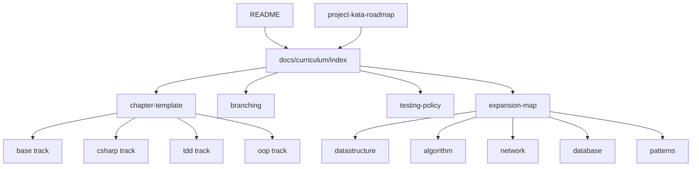

# Sokoban C# Foundation Curriculum - Plan

## Goal Capsule

- **Objective:** Build the documentation system that lets
  `projects/dotnet-foundation-lab` teach C# fundamentals through a Sokoban
  project, without creating production code yet.
- **Product authority:** The Product Contract from the brainstorm document is
  the source of truth. The plan may resolve planning questions, but it must not
  change the learning contract.
- **Execution profile:** Documentation and curriculum-structure work only.
  Future branches will create the .NET solution and Sokoban implementation.
- **Stop conditions:** Stop and ask before creating .NET projects, sample C#
  code, branches, or UI scaffolding.
- **Tail ownership:** After this plan is executed, the repo owner can start the
  first implementation branch from `base/ch01-string-map`.

---

## Product Contract

### Summary

Sokoban C# Foundation Curriculum teaches C# fundamentals by pairing Microsoft
Learn concepts with small examples and then applying the same concepts to a
Sokoban project using TDD-first project code.
The curriculum starts procedural, introduces object-oriented structure only
when the procedural version becomes painful, and leaves a runway for data
structures, algorithms, network, database, and design-pattern extensions.

### Problem Frame

The learner prefers building over isolated exercises, but direct project work
can hide gaps in C# syntax and .NET fundamentals.
The curriculum must keep official Microsoft documentation as the syntax
baseline while still making each concept useful inside a small project.

### Product Contract Preservation

Product Contract unchanged.
The plan resolves the brainstorm's planning questions as implementation
choices: the first implementation branch is `base/ch01-string-map`, and the
canonical chapter docs live under `projects/dotnet-foundation-lab/docs/curriculum/`.

### Key Decisions

- **KD1. Sokoban remains the foundation project.** It keeps the first learning
  loop turn-based, small, and testable.
- **KD2. Microsoft Learn is the syntax authority.** Chapter docs link to
  official Microsoft pages before introducing local examples.
- **KD3. Example and project code have different gates.** Example snippets are
  exploratory; Sokoban project behavior is TDD-first.
- **KD4. Procedural comes before OOP.** The curriculum starts with strings,
  arrays, variables, loops, and methods before introducing named domain types.
- **KD5. Expansion tracks are pressure-driven.** Later concepts appear when
  Sokoban creates a real need for them.

### Requirements

#### Chapter contract

- R1. Each chapter follows `MS Learn → micro example → Sokoban TDD application
  → reflection`.
- R2. Each chapter links to the relevant Microsoft Learn source.
- R3. Each micro example demonstrates one concept before project application.
- R4. Each Sokoban application explains where the concept appears in game
  rules, state, input, output, or tests.
- R5. Each chapter asks why the new structure is better than the previous one.

#### TDD policy

- R6. Tiny syntax examples do not require TDD.
- R7. Sokoban rules, parsing, state transitions, win conditions, and validation
  start from tests.
- R8. Tests prioritize domain logic over console input or rendering.
- R9. Test names should read like Sokoban rule statements.
- R10. Regressions become regression tests.

#### Procedural to OOP progression

- R11. Early chapters may use `string`, `char[,]`, coordinate variables,
  conditionals, loops, and methods.
- R12. OOP appears after observable pain such as duplication, tangled state, or
  hard-to-test logic.
- R13. Names such as `Position`, `Direction`, `Board`, `MoveResult`, and
  `GameState` appear when needed.
- R14. DDD-lite means domain-language refactoring, not folder ceremony.
- R15. Heavy DDD concepts stay out of the early foundation track.

#### Branch model

- R16. `main` remains the documentation and curriculum index.
- R17. Implementation branches are learning snapshots.
- R18. Branch families are `base`, `csharp`, `tdd`, `oop`, `datastructure`,
  `algorithm`, `network`, `database`, and `patterns`.
- R19. Branches are chapter-sized, not tiny syntax-sized.
- R20. Each branch records what changed, why the previous shape was limited,
  and what the next extension unlocks.

#### Expansion runway

- R21. Data-structure expansion starts from collision, lookup, undo, and solver
  needs.
- R22. Algorithm expansion starts from validation, BFS solver, and deadlock
  detection needs.
- R23. Network expansion waits for level download or score submission needs.
- R24. Database expansion waits for progress, score, or level metadata needs.
- R25. Design patterns appear after repeated problems need names.

### Key Flows

- F1. **Daily learning loop**
  - **Trigger:** The learner starts the daily 1-hour session.
  - **Steps:** Read the previous note, read a Microsoft Learn concept, run or
    inspect a micro example, apply the concept to Sokoban with TDD, and record
    a short reflection.
  - **Outcome:** The next small learning action is obvious.
  - **Covers:** R1, R2, R3, R5, R6, R7

- F2. **Concept application loop**
  - **Trigger:** A new C# or .NET concept is introduced.
  - **Steps:** Confirm the official source, observe the concept in isolation,
    choose its Sokoban use, and define expected behavior before implementation.
  - **Outcome:** The concept becomes project knowledge rather than memorized
    syntax.
  - **Covers:** R1, R4, R7, R8

- F3. **Refactoring transition loop**
  - **Trigger:** Procedural code becomes hard to reason about.
  - **Steps:** Name the pain, introduce a domain term, keep behavior covered by
    tests, and document why the new structure is better.
  - **Outcome:** OOP and DDD-lite arrive as a response to pressure.
  - **Covers:** R11, R12, R13, R14

- F4. **Expansion track loop**
  - **Trigger:** A later Sokoban capability creates a need for a broader topic.
  - **Steps:** Name the problem, choose the concept, isolate it in a branch,
    and document what the extension teaches.
  - **Outcome:** Later tracks remain connected to the project.
  - **Covers:** R21, R22, R23, R24, R25

### Acceptance Examples

- AE1. **Chapter structure**
  - **Given:** The learner opens a chapter document.
  - **When:** They scan the headings.
  - **Then:** They can find the MS Learn link, micro example, Sokoban
    application, and reflection prompt.
  - **Covers:** R1, R2, R3, R5

- AE2. **Project code uses TDD**
  - **Given:** The learner starts a Sokoban rule.
  - **When:** The chapter describes project application.
  - **Then:** The expected rule is described as a test-first behavior.
  - **Covers:** R7, R8, R9

- AE3. **Procedural first is allowed**
  - **Given:** The learner works in an early `base` branch.
  - **When:** They read the chapter notes.
  - **Then:** Simple procedural code is treated as intentional learning state.
  - **Covers:** R11

- AE4. **OOP transition has a reason**
  - **Given:** The learner moves to an `oop` branch.
  - **When:** They read the transition note.
  - **Then:** The note names the pain that caused each new domain concept.
  - **Covers:** R12, R13, R14

- AE5. **Expansion remains connected**
  - **Given:** The learner opens an `algorithm` branch.
  - **When:** They read the branch objective.
  - **Then:** The algorithm is tied to a Sokoban need such as solving or
    validation.
  - **Covers:** R21, R22

### Success Criteria

- S1. The learner can choose the next daily 1-hour action from the curriculum.
- S2. Each chapter connects an official C# concept to Sokoban usage.
- S3. Project behavior remains test-first.
- S4. Procedural-to-OOP transitions are explained by code pressure.
- S5. Extension tracks do not blur the foundation track.

### Scope Boundaries

#### In scope

- Curriculum documentation structure.
- Chapter and daily-note templates.
- Branch naming and branch completion rules.
- TDD policy and Sokoban rulebook documentation.
- Expansion-track maps for later study.
- README and roadmap alignment with the new canonical docs.

#### Deferred to Follow-Up Work

- Creating .NET solution or project files.
- Creating actual Sokoban C# code.
- Creating git branches for each chapter.
- Building Console, Blazor, Unity, API, or database implementations.
- Automating Notion or Linear synchronization.

#### Outside this Curriculum's Identity

- SRE AI Lab product work.
- Economy or finance content.
- Shipping a commercial game.

### Dependencies / Assumptions

- A1. Microsoft Learn links remain the canonical syntax source.
- A2. The learner keeps the daily 1-hour rhythm.
- A3. `main` in `projects/dotnet-foundation-lab` remains documentation-first.
- A4. Implementation happens in future branches.
- A5. No code or solution scaffolding is created while executing this plan.

---

## Planning Contract

### Key Technical Decisions

- **KTD1. Create a canonical curriculum subtree.** Put the active curriculum in
  `projects/dotnet-foundation-lab/docs/curriculum/` so README and older roadmap
  docs can link to one source of truth.
- **KTD2. Start implementation history at `base/ch01-string-map`.** The first
  branch should prove the most primitive representation before any C# project
  sophistication or OOP vocabulary appears.
- **KTD3. Keep branch docs lightweight.** Canonical curriculum docs define the
  system; branch-local notes explain the diff and reflection for that branch.
- **KTD4. Treat official links as chapter metadata.** Each chapter stores the
  Microsoft Learn source near the top so the learner sees official context
  before local examples.
- **KTD5. Use templates instead of early code.** Templates define how future
  implementation branches behave without accidentally creating code now.

### High-Level Technical Design



The plan creates a documentation spine that future branches can follow.
`README.md` remains the entrypoint, but `docs/curriculum/index.md` becomes the
canonical map for chapters, branch families, templates, and extension tracks.

### Output Structure

```text
projects/dotnet-foundation-lab/
  README.md
  docs/
    project-kata-roadmap.md
    curriculum/
      index.md
      mslearn-index.md
      chapter-template.md
      daily-note-template.md
      branching.md
      testing-policy.md
      sokoban-rulebook.md
      expansion-map.md
      maintenance.md
      tracks/
        base.md
        csharp.md
        tdd.md
        oop.md
        datastructure.md
        algorithm.md
        network.md
        database.md
        patterns.md
```

### Sequencing and Parallelization

U1 and U2 should land first because they define the document spine and reusable
chapter contract.
After U2, U3, U4, U5, and U6 can be drafted in parallel because they target
separate curriculum concerns.
U7 should run after those drafts so README and the existing roadmap point to the
final canonical locations.
U8 closes the loop by adding maintenance and verification guidance.

---

## Implementation Units

### U1. Create the curriculum entrypoint

- **Goal:** Add a canonical curriculum index that explains the learning system,
  the daily rhythm, and where each track lives.
- **Requirements:** R1, R16, R17, S1
- **Dependencies:** None
- **Files:**
  - `projects/dotnet-foundation-lab/docs/curriculum/index.md`
  - `projects/dotnet-foundation-lab/docs/curriculum/mslearn-index.md`
- **Approach:** Make `index.md` the single starting point for the curriculum.
  It should summarize the three-step chapter contract, the two-lane code
  policy, the procedural-to-OOP progression, and the extension runway.
  Put Microsoft Learn source links in `mslearn-index.md` so chapter docs can
  cite one curated source list.
- **Execution note:** Documentation-only; do not create C# files.
- **Patterns to follow:** Keep the tone and daily rhythm from
  `projects/dotnet-foundation-lab/README.md`.
- **Test scenarios:**
  - Opening `index.md` shows the daily learning loop and links to every track.
  - Opening `mslearn-index.md` shows official-source categories for C# basics,
    OOP, async, collections, and .NET testing.
  - No link points outside the repo except official Microsoft documentation.
- **Verification:** The curriculum can be understood from `index.md` without
  reading the older roadmap first.

### U2. Create reusable chapter and daily-note templates

- **Goal:** Define the reusable shape every chapter and daily note must follow.
- **Requirements:** R1, R2, R3, R4, R5, AE1
- **Dependencies:** U1
- **Files:**
  - `projects/dotnet-foundation-lab/docs/curriculum/chapter-template.md`
  - `projects/dotnet-foundation-lab/docs/curriculum/daily-note-template.md`
- **Approach:** The chapter template should contain fields for Microsoft Learn
  source, concept summary, micro example, Sokoban application, TDD expectation,
  reflection, and next branch.
  The daily-note template should support the 10/35/10/5 routine from the
  existing roadmap.
- **Execution note:** Keep templates example-shaped, not implementation-shaped.
- **Patterns to follow:** Reuse the reflection prompts already present in the
  repo README.
- **Test scenarios:**
  - Covers AE1. A new chapter can be copied from the template and still contain
    all four required chapter phases.
  - A daily note has a place to record what changed and the next 1-hour action.
  - The template distinguishes exploratory examples from project TDD work.
- **Verification:** A future branch author can start a new chapter without
  inventing headings.

### U3. Map the foundation tracks

- **Goal:** Define the first curriculum tracks that teach C# basics, TDD, and
  procedural-to-OOP progression.
- **Requirements:** R11, R12, R13, R14, R15, R18, R19, R20, AE3, AE4
- **Dependencies:** U1, U2
- **Files:**
  - `projects/dotnet-foundation-lab/docs/curriculum/tracks/base.md`
  - `projects/dotnet-foundation-lab/docs/curriculum/tracks/csharp.md`
  - `projects/dotnet-foundation-lab/docs/curriculum/tracks/tdd.md`
  - `projects/dotnet-foundation-lab/docs/curriculum/tracks/oop.md`
- **Approach:** `base.md` should start with `base/ch01-string-map` and preserve
  intentionally procedural learning states.
  `csharp.md` should map official C# concepts to chapter-sized practice.
  `tdd.md` should define when project code becomes test-first.
  `oop.md` should show how pain in procedural code justifies domain names.
- **Execution note:** Avoid introducing clean architecture or DDD folders in
  the first foundation track.
- **Patterns to follow:** Use branch families already named in the existing
  project roadmap.
- **Test scenarios:**
  - Covers AE3. The `base` track clearly allows primitive procedural code.
  - Covers AE4. The `oop` track explains the pain that triggers each new
    domain concept.
  - Each track contains chapter names that are large enough to produce useful
    diffs.
- **Verification:** The first month can be followed without opening extension
  tracks.

### U4. Define branch workflow and completion contract

- **Goal:** Make branch naming, branch completion, and branch notes explicit.
- **Requirements:** R16, R17, R18, R19, R20
- **Dependencies:** U1, U2
- **Files:**
  - `projects/dotnet-foundation-lab/docs/curriculum/branching.md`
- **Approach:** Document branch families, naming examples, what belongs on
  `main`, what belongs on implementation branches, and what every branch note
  must capture.
  Include a branch completion checklist that asks for concept learned, previous
  structure limit, tests added or deferred, and next extension.
- **Execution note:** Do not create branches while executing this plan.
- **Patterns to follow:** Preserve the current repo decision that `main` keeps
  documents and curriculum.
- **Test scenarios:**
  - A reader can tell whether `base/ch01-string-map` or
    `csharp/ch01-console-variables-io` should come first.
  - A reader can tell why `main` should not contain implementation code.
  - Branch naming examples exist for every branch family.
- **Verification:** The branch workflow resolves the brainstorm's branch
  questions without requiring a follow-up conversation.

### U5. Create TDD policy and Sokoban executable rulebook docs

- **Goal:** Turn the TDD-first rule into concrete writing guidance for future
  project code.
- **Requirements:** R6, R7, R8, R9, R10, AE2
- **Dependencies:** U1, U2
- **Files:**
  - `projects/dotnet-foundation-lab/docs/curriculum/testing-policy.md`
  - `projects/dotnet-foundation-lab/docs/curriculum/sokoban-rulebook.md`
- **Approach:** `testing-policy.md` should define the two-lane rule: examples
  may be exploratory, but Sokoban behavior starts from tests.
  `sokoban-rulebook.md` should list rule statements that can become tests,
  such as wall collision, box push, blocked push, win condition, invalid map,
  and regression cases.
- **Execution note:** Describe expected tests; do not write test code yet.
- **Patterns to follow:** Use the rule examples already listed in
  `projects/dotnet-foundation-lab/docs/project-kata-roadmap.md`.
- **Test scenarios:**
  - Covers AE2. A future movement-rule chapter has test-first guidance before
    implementation guidance.
  - A syntax-only chapter can opt out of TDD without violating the policy.
  - A regression rule has a documented place to live.
- **Verification:** A future implementer can identify which behavior needs a
  failing test before code.

### U6. Map the expansion runway

- **Goal:** Document how later tracks extend Sokoban without polluting the C#
  foundation track.
- **Requirements:** R21, R22, R23, R24, R25, AE5
- **Dependencies:** U1, U2
- **Files:**
  - `projects/dotnet-foundation-lab/docs/curriculum/expansion-map.md`
  - `projects/dotnet-foundation-lab/docs/curriculum/tracks/datastructure.md`
  - `projects/dotnet-foundation-lab/docs/curriculum/tracks/algorithm.md`
  - `projects/dotnet-foundation-lab/docs/curriculum/tracks/network.md`
  - `projects/dotnet-foundation-lab/docs/curriculum/tracks/database.md`
  - `projects/dotnet-foundation-lab/docs/curriculum/tracks/patterns.md`
- **Approach:** `expansion-map.md` should show which Sokoban pressure introduces
  each advanced topic.
  Track docs should stay short and name example branches, learning goals, and
  the Sokoban need that unlocks the concept.
- **Execution note:** Keep extension tracks as runway docs, not detailed future
  implementation specs.
- **Patterns to follow:** Use the expansion examples in the existing project
  roadmap as source material.
- **Test scenarios:**
  - Covers AE5. BFS is introduced as solver pressure, not a standalone quiz.
  - Database work is deferred until progress, score, or level metadata exists.
  - Pattern docs describe the pain that justifies the pattern name.
- **Verification:** The extension docs make clear what is deferred and why.

### U7. Align README and existing roadmap with canonical docs

- **Goal:** Update existing entry documents so they point to the new curriculum
  spine instead of duplicating it.
- **Requirements:** R16, S1, S5
- **Dependencies:** U1, U2, U3, U4, U5, U6
- **Files:**
  - `projects/dotnet-foundation-lab/README.md`
  - `projects/dotnet-foundation-lab/docs/project-kata-roadmap.md`
- **Approach:** Keep README concise: purpose, daily rhythm, canonical curriculum
  link, and current first branch.
  Preserve `project-kata-roadmap.md` as rationale and background, but link to
  `docs/curriculum/index.md` for current operating guidance.
- **Execution note:** Remove or demote duplicated lists only after the canonical
  docs exist.
- **Patterns to follow:** Keep the current Korean explanatory tone.
- **Test scenarios:**
  - README points to the canonical curriculum index.
  - The roadmap no longer competes with the curriculum index as the source of
    branch truth.
  - Existing Notion and Linear links remain intact.
- **Verification:** A newcomer starts from README and reaches the canonical
  curriculum without ambiguity.

### U8. Add maintenance and verification guidance

- **Goal:** Make the curriculum maintainable after the first authoring pass.
- **Requirements:** R5, R10, R20, S1, S4
- **Dependencies:** U1, U2, U3, U4, U5, U6, U7
- **Files:**
  - `projects/dotnet-foundation-lab/docs/curriculum/maintenance.md`
- **Approach:** Document how to add a chapter, update Microsoft Learn links,
  decide when to add a branch, and keep reflections useful.
  Include a small review checklist for future curriculum changes.
- **Execution note:** Maintenance docs should not prescribe exact future code
  structure.
- **Patterns to follow:** Mirror the workspace-level preference for durable
  docs in `docs/solutions/` without creating a solution note yet.
- **Test scenarios:**
  - A future chapter addition has a checklist.
  - A future MS Learn link update has a documented place.
  - The maintainer can tell when a concept deserves a branch.
- **Verification:** The curriculum has a clear update path after this plan is
  implemented.

---

## Verification Contract

### Required checks

- Run markdown diagnostics on the changed markdown files.
- Confirm no C# project, solution, source, or test files were created.
- Confirm `projects/dotnet-foundation-lab` internal git status only shows
  expected documentation changes.
- Confirm every new curriculum doc is linked from
  `projects/dotnet-foundation-lab/docs/curriculum/index.md` or README.
- Confirm every track referenced by the branch model has a track document.

### Suggested commands

```bash
find projects/dotnet-foundation-lab/docs/curriculum -maxdepth 3 -type f | sort
git -C projects/dotnet-foundation-lab status --short
```

Use `lens_diagnostics mode=all` after edits to catch markdown warnings.
Do not run `dotnet test` for this plan because no .NET code should be created.

---

## Definition of Done

- D1. `projects/dotnet-foundation-lab/docs/curriculum/index.md` is the canonical
  curriculum entrypoint.
- D2. Chapter and daily-note templates exist and express the MS Learn → example
  → Sokoban TDD → reflection loop.
- D3. Foundation tracks cover `base`, `csharp`, `tdd`, and `oop`.
- D4. Expansion tracks cover `datastructure`, `algorithm`, `network`,
  `database`, and `patterns`.
- D5. Branch workflow explains why `base/ch01-string-map` is first.
- D6. Testing policy distinguishes exploratory examples from TDD-first project
  behavior.
- D7. README and existing roadmap point to the canonical curriculum docs.
- D8. Markdown diagnostics are clean.
- D9. No code, solution, project, or test files are introduced by this plan.

---

## System-Wide Impact

This plan affects the documentation shape of `projects/dotnet-foundation-lab`
and the workspace-level planning trail under `docs/`.
It does not affect runtime code, application behavior, deployment, data, or
external services.

---

## Risks & Dependencies

- **Risk: documentation taxonomy becomes too large.** Keep each curriculum doc
  short and point to templates instead of repeating full instructions.
- **Risk: branch explosion.** Branch docs should be chapter-sized and tied to a
  meaningful diff, not to every syntax keyword.
- **Risk: official links drift.** Centralize Microsoft Learn links in
  `mslearn-index.md` so future updates do not require editing every chapter.
- **Risk: accidental code creation.** Verification must check that no .NET
  project or source file appears during this documentation-only pass.

---

## Open Questions

### Deferred to Implementation

- OQ1. Exact chapter wording can evolve during execution as long as the chapter
  contract remains intact.
- OQ2. Future branch-local note locations can be adjusted when the first real
  implementation branch is created.
- OQ3. Actual .NET solution layout is intentionally deferred to a later plan.

---

## Sources & Research

- `docs/brainstorms/2026-07-03-sokoban-csharp-foundation-curriculum-requirements.md`
- `docs/ideation/2026-07-03-sokoban-csharp-foundation-lab-ideation.html`
- `projects/dotnet-foundation-lab/README.md`
- `projects/dotnet-foundation-lab/docs/project-kata-roadmap.md`
- Microsoft Learn C# tutorials:
  <https://learn.microsoft.com/en-us/dotnet/csharp/tour-of-csharp/tutorials/>
- Microsoft Learn C# OOP fundamentals:
  <https://learn.microsoft.com/en-us/dotnet/csharp/fundamentals/object-oriented/>
- Microsoft Learn .NET unit testing with xUnit:
  <https://learn.microsoft.com/en-us/dotnet/core/testing/unit-testing-csharp-with-xunit>
