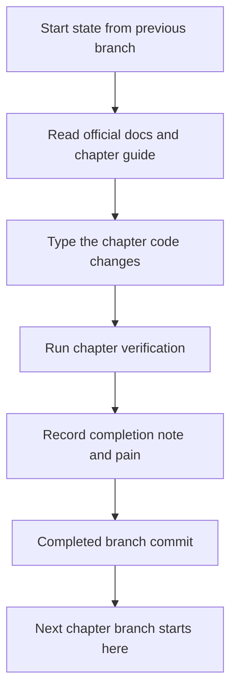
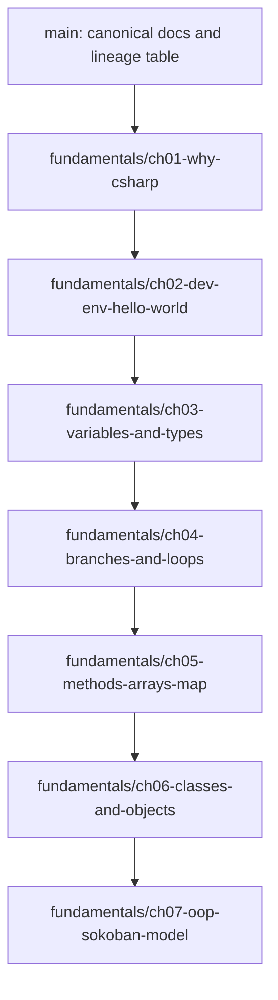

<!-- markdownlint-disable MD013 MD025 -->

# Programming Fundamentals Branch Chain - Plan

## Goal Capsule

- **Objective:** `projects/dotnet-foundation-lab`에 36장짜리 초보자용 C# 프로그래밍 기초 챕터와 실제 코드 스냅샷 Git branch chain을 만든다.
- **Target repo:** `projects/dotnet-foundation-lab`; 이 계획의 파일 경로는 workspace root 기준으로 적는다.
- **Product authority:** 기존 Sokoban C# Foundation Curriculum 요구사항과 2026-07-06 사용자 결정이 함께 기준이다.
- **Execution profile:** 문서, .NET console app, 테스트 프로젝트, 학습 브랜치/태그를 만든다.
- **Stop conditions:** 지원 SDK 버전 선택이 Microsoft Learn 또는 로컬 검증과 충돌하면 멈추고 확인한다; branch chain이 깨지는 방식의 squash/force rewrite는 확인 없이 하지 않는다.
- **Tail ownership:** 실행 후 사용자는 `fundamentals/ch01-*`부터 순서대로 읽고 따라 치며, 각 챕터 완성 상태에서 다음 챕터를 시작할 수 있어야 한다.

---

## Product Contract

### Summary

Programming Fundamentals Branch Chain은 C#을 처음 배우는 사용자가 `왜 C#인가`에서 시작해 개발환경 설정, 변수와 타입, 제어문, 반복문, 메서드, 문자열/배열, 객체 지향 프로그래밍, 컬렉션, nullable, 예외, 테스트, record, interface, generic, LINQ, file I/O, JSON, async, logging, configuration까지 따라 치며 익히는 36장 장기 학습 경로다.
각 챕터는 문서만 읽어도 시작 상태, 작성할 코드, 완성 기준, 다음 챕터 시작 상태를 알 수 있어야 한다.
코드 스냅샷은 사용자가 선택한 대로 Git branch chain으로 제공하며, `fundamentals/chNN+1`은 `fundamentals/chNN`의 완성 커밋에서 시작한다.

### Problem Frame

기존 curriculum은 Sokoban 중심의 학습 운영 체계와 트랙을 정의했지만, 완전 초보자가 첫날 무엇을 설치하고 왜 C#을 배우는지 이해한 뒤 직접 코드를 누적해 가는 챕터형 완성본 체계는 부족하다.
문서만 있으면 실제 시작점이 불분명하고, 완성 코드만 있으면 학습자가 따라 치며 얻는 경험이 사라진다.
이 계획은 canonical docs와 실제 branch lineage를 연결해 “문서를 따라 완성하면 다음 장의 시작점이 된다”는 학습 계약을 저장소 구조로 보장한다.

### Product Contract Preservation

기존 brainstorm의 Sokoban 기반, Microsoft Learn 우선, 작은 예제 후 프로젝트 적용, main 문서 기준점 원칙은 유지한다.
사용자 결정으로 Product Contract를 확장한다: 프로그래밍 기초 필수 주제와 Git branch chain 코드 스냅샷을 active scope에 추가한다.

### Requirements

#### Beginner curriculum scope

- R1. 첫 챕터는 C#을 배우는 이유를 공식 Microsoft 자료와 사용자 목표에 연결해야 한다.
- R2. 개발환경 챕터는 macOS, Linux, Windows의 .NET SDK 설치 경로와 검증 방법을 각각 다뤄야 한다.
- R3. 기초 문법 챕터는 변수, 타입, 문자열, 숫자, 콘솔 입출력, 표현식을 직접 작성하게 해야 한다.
- R4. 제어 흐름 챕터는 조건문, boolean 표현식, 반복문을 Sokoban 입력/맵 검사 맥락에 연결해야 한다.
- R5. 메서드와 컬렉션 전환 챕터는 문자열/배열 기반 Sokoban map 처리를 다음 구조의 재료로 만들어야 한다.
- R6. 객체 지향 챕터는 class/object, encapsulation, value object 후보, domain language를 절차형 코드의 pain 뒤에 도입해야 한다.

#### Chapter completion contract

- R7. 각 챕터 문서는 `시작 상태`, `읽을 공식 문서`, `따라 칠 작업`, `완성 상태`, `검증`, `다음 챕터 시작점`을 포함해야 한다.
- R8. 각 챕터의 완성 커밋은 다음 챕터 브랜치의 시작 커밋이 되어야 한다.
- R9. 각 브랜치에는 해당 챕터에서 배운 개념, 이전 상태의 한계, 다음 챕터로 넘길 불편함이 기록되어야 한다.
- R10. 초반 문법 예제는 smoke/run 검증을 우선하고, Sokoban domain logic이 생기는 시점부터 테스트를 추가해야 한다.

#### Repository and source-of-truth rules

- R11. `main`은 curriculum docs, chapter index, branch lineage table의 기준점이어야 한다.
- R12. 실제 C# implementation snapshots는 `fundamentals/chNN-*` branch chain에 남겨야 한다.
- R13. Microsoft Learn links는 `mslearn-index.md`와 챕터 문서에서 관리해야 한다.
- R14. parent workspace는 target repo의 default-branch 문서 변경 포인터만 반영하고, 학습 branch chain 전체를 parent pointer로 추적하려고 하지 않아야 한다.

#### Scope discipline

- R15. Console-first 학습에 집중하고 Blazor, Unity, API, DB, solver, persistence는 후속 트랙으로 미룬다.
- R16. OOP는 초반부터 architecture ceremony로 도입하지 않고, 중복과 상태 꼬임을 경험한 뒤 이름을 붙이는 방식으로 설명해야 한다.

### Key Flows

- F1. **First-time learner setup**
  - **Trigger:** 사용자가 `.NET Foundation Lab`을 처음 시작한다.
  - **Steps:** 왜 C#인지 읽고, OS별 설치 문서를 따라 SDK를 설치하고, CLI/VS Code 환경을 검증하고, 첫 console app을 실행한다.
  - **Outcome:** 사용자는 `fundamentals/ch02-dev-env-hello-world` 완성 상태에서 다음 문법 챕터를 시작할 수 있다.
  - **Covers:** R1, R2, R7, R8

- F2. **Chapter-to-chapter handoff**
  - **Trigger:** 사용자가 챕터 N을 끝낸다.
  - **Steps:** 완성 체크리스트를 확인하고, branch completion note를 남기고, N+1 브랜치가 N 완성 커밋에서 시작하는지 확인한다.
  - **Outcome:** 다음 챕터 문서의 시작 상태가 실제 Git history와 일치한다.
  - **Covers:** R7, R8, R9, R12

- F3. **Programming basics to Sokoban pressure**
  - **Trigger:** 사용자가 변수, 제어문, 반복문, 메서드를 익힌다.
  - **Steps:** 작은 console 예제로 개념을 관찰하고, 문자열 맵/좌표/이동 후보로 Sokoban에 연결하고, 불편함을 다음 챕터의 리팩터링 재료로 남긴다.
  - **Outcome:** 기초 문법이 독립 퀴즈가 아니라 Sokoban model로 이동한다.
  - **Covers:** R3, R4, R5, R10

- F4. **Procedural to OOP transition**
  - **Trigger:** 문자열/배열/좌표 변수가 여러 곳에 흩어져 수정이 불편해진다.
  - **Steps:** pain을 문서에 적고, `Position`, `Direction`, `Board` 같은 이름을 도입하고, 기존 동작 검증을 유지한다.
  - **Outcome:** 객체 지향은 이론 암기가 아니라 구조 변경의 이유로 학습된다.
  - **Covers:** R6, R10, R16

### Acceptance Examples

- AE1. **Next chapter starts from previous completion**
  - **Given:** `fundamentals/ch03-variables-and-types`가 완성되어 있다.
  - **When:** `fundamentals/ch04-branches-and-loops`를 확인한다.
  - **Then:** ch04의 첫 커밋 또는 base lineage가 ch03 완성 커밋을 가리킨다.
  - **Covers:** R7, R8, R12

- AE2. **OS-specific setup is actionable**
  - **Given:** 사용자가 macOS, Linux, Windows 중 하나를 사용한다.
  - **When:** 개발환경 챕터를 읽는다.
  - **Then:** 자기 OS에서 SDK 설치 문서, CLI 검증, editor setup 확인 항목을 찾을 수 있다.
  - **Covers:** R2, R13

- AE3. **Basics chapter can be typed through**
  - **Given:** 사용자가 변수/타입 챕터를 연다.
  - **When:** 문서의 작업 순서를 따라 코드를 작성한다.
  - **Then:** console output으로 입력, 변수, 문자열 보간, 숫자 계산을 확인하고 다음 챕터 시작 상태에 도달한다.
  - **Covers:** R3, R7

- AE4. **OOP has a visible reason**
  - **Given:** 사용자가 OOP 챕터를 시작한다.
  - **When:** 문서와 diff를 비교한다.
  - **Then:** 어떤 중복이나 상태 꼬임 때문에 class/value object 후보가 생겼는지 설명되어 있다.
  - **Covers:** R6, R16

- AE5. **Main docs and branch code do not drift**
  - **Given:** main의 chapter index가 특정 branch를 안내한다.
  - **When:** 해당 branch를 열어 실행한다.
  - **Then:** 문서의 완성 상태와 실제 code snapshot이 같은 파일/동작을 보여준다.
  - **Covers:** R7, R11, R12

### Success Criteria

- S1. 사용자는 왜 C#을 배우는지, 어떤 OS에서 어떻게 시작하는지, 첫 1시간에 무엇을 할지 알 수 있다.
- S2. 모든 필수 주제는 최소 하나 이상의 챕터에서 공식 문서, 직접 작성 작업, 완료 검증으로 연결된다.
- S3. `fundamentals/chNN-*` branch chain은 Git history로 이전 완성본과 다음 시작점을 보장한다.
- S4. 코드 스냅샷은 chapter docs와 실행 결과가 일치한다.
- S5. 기존 Sokoban/TDD/OOP expansion docs는 대체되지 않고 fundamentals track 뒤에 이어진다.

### Scope Boundaries

#### In scope

- Fundamentals track 문서와 chapter docs.
- `fundamentals/chNN-*` Git branch chain.
- Console-first .NET app code snapshots.
- Sokoban map/string/control-flow/OOP seed code.
- xUnit 또는 동등한 테스트 프로젝트가 필요한 첫 domain-logic 지점.
- Target repo default-branch docs update와 parent workspace pointer update.

#### Deferred to Follow-Up Work

- 기존 `base`, `csharp`, `tdd`, `oop` track 전체 재작성.
- 자료구조, 알고리즘, 네트워크, 데이터베이스, 디자인 패턴 extension 구현.
- Blazor, Unity, Web API, EF Core, persistence.
- 각 챕터를 블로그/Notion 콘텐츠로 변환.
- 자동 branch lineage 검증 스크립트.

#### Outside this Product's Identity

- 상용 게임 완성.
- SRE AI Lab 제품 기능.
- 경제/금융 콘텐츠.

### Dependencies / Assumptions

- A1. 구현 시점에 설치된 .NET SDK와 Microsoft Learn의 지원 버전 표를 대조해 target framework를 하나로 고정한다.
- A2. 현재 로컬에는 .NET SDK `9.0.203`이 있으므로, 실행자가 더 최신 LTS를 요구하지 않는 한 로컬 검증 가능한 target을 선택할 수 있다.
- A3. `projects/dotnet-foundation-lab`는 parent workspace에서 gitlink로 추적되므로 default branch 문서 변경 후 parent pointer bump가 필요하다.
- A4. `fundamentals/chNN-*` branch chain은 remote branch 또는 tag로 보존하고, parent workspace가 모든 학습 브랜치를 포인터로 추적하지 않는다.

### Sources / Research

- `docs/brainstorms/2026-07-03-sokoban-csharp-foundation-curriculum-requirements.md`
- `docs/plans/2026-07-03-sokoban-csharp-foundation-curriculum-plan.md`
- `docs/solutions/documentation-gaps/canonical-curriculum-docs-before-learning-branches.md`
- `docs/solutions/workflow/submodule-edit-and-pointer-bump.md`
- Microsoft Learn .NET install docs for Windows, macOS, and Linux.
- Microsoft Learn .NET CLI and installed-version detection docs.
- Microsoft Learn C# tutorial sequence and “What you can build with C#”.

---

## Planning Contract

### Key Technical Decisions

- KTD1. Add a `fundamentals` track before existing Sokoban tracks. The required beginner topics do not fit cleanly inside the existing `base` branch family because `why C#` and environment setup happen before Sokoban implementation.
- KTD2. Use Git branch chain as the code snapshot mechanism. The user chose branch lineage over snapshot directories, so each `fundamentals/chNN-*` branch must be created from the previous chapter's completed branch.
- KTD3. Keep canonical reading docs on main and code snapshots on learning branches. Main should explain the path and branch lineage; it should not accumulate every chapter's generated C# state.
- KTD4. Start with one minimal console app and evolve it. A single app lets the learner see cumulative change without switching projects every chapter.
- KTD5. Introduce tests only when project/domain logic appears. Early language exploration uses run/smoke checks; Sokoban map parsing, movement helpers, and OOP refactors should get tests because they are durable behavior.
- KTD6. Pin one supported target framework during the environment chapter. The implementation should prefer the current Microsoft-supported SDK that can be validated locally, and record the choice in docs and project files.
- KTD7. Treat branch notes as the handoff contract. Every branch should state start branch, completion state, verification, and next branch base so the “chapter N complete equals chapter N+1 start” rule remains visible.

### High-Level Technical Design

#### Chapter state contract



#### Branch lineage



### Output Structure

```text
projects/dotnet-foundation-lab/
  docs/
    curriculum/
      index.md
      branching.md
      chapter-template.md
      mslearn-index.md
      tracks/
        fundamentals.md
      chapters/
        fundamentals/
          ch01-why-csharp.md
          ch02-dev-env-hello-world.md
          ch03-variables-and-types.md
          ch04-branches-and-loops.md
          ch05-methods-arrays-map.md
          ch06-classes-and-objects.md
          ch07-oop-sokoban-model.md
  notes/
    fundamentals/
      chNN-*.md                 # branch-local completion notes
  src/
    Sokoban.Fundamentals/       # introduced on learning branches
  tests/
    Sokoban.Fundamentals.Tests/ # introduced when durable logic appears
```

### Sequencing

1. Update canonical docs on a target-repo docs branch and merge or prepare it as the root of the branch chain.
2. Create `fundamentals/ch01-*` from that docs baseline.
3. Create each later `fundamentals/chNN-*` from the previous chapter's completed branch.
4. Push branches in lineage order so remote history preserves the chain.
5. Update parent workspace pointer only for target default-branch documentation changes.

### Risks and Mitigations

- **Risk: branch chain becomes hard to review.** Mitigate by keeping main chapter docs as the reviewable syllabus and using each branch's note/diff as the code proof.
- **Risk: SDK version drift.** Mitigate by linking official install docs and recording the selected target framework in the environment chapter.
- **Risk: OOP arrives too early.** Mitigate by requiring each OOP chapter to name the procedural pain it resolves.
- **Risk: parent workspace points at the wrong target commit.** Mitigate with a final pointer-bump unit for default-branch docs only.

---

## Implementation Units

### Unit Index

| Unit | Title | Key files | Depends on |
| --- | --- | --- | --- |
| U1 | Sync target baseline and branch policy | `projects/dotnet-foundation-lab/docs/curriculum/branching.md` | None |
| U2 | Add fundamentals track and chapter docs | `projects/dotnet-foundation-lab/docs/curriculum/tracks/fundamentals.md` | U1 |
| U3 | Create ch01 why C# branch snapshot | `projects/dotnet-foundation-lab/notes/fundamentals/ch01-why-csharp.md` | U2 |
| U4 | Create ch02 environment and hello-world branch | `projects/dotnet-foundation-lab/src/Sokoban.Fundamentals/` | U3 |
| U5 | Create ch03 variables and types branch | `projects/dotnet-foundation-lab/src/Sokoban.Fundamentals/` | U4 |
| U6 | Create ch04 branches and loops branch | `projects/dotnet-foundation-lab/src/Sokoban.Fundamentals/` | U5 |
| U7 | Create ch05 methods, arrays, and map branch | `projects/dotnet-foundation-lab/src/Sokoban.Fundamentals/`, `projects/dotnet-foundation-lab/tests/Sokoban.Fundamentals.Tests/` | U6 |
| U8 | Create ch06 classes and objects branch | `projects/dotnet-foundation-lab/src/Sokoban.Fundamentals/`, `projects/dotnet-foundation-lab/tests/Sokoban.Fundamentals.Tests/` | U7 |
| U9 | Create ch07 OOP Sokoban model branch | `projects/dotnet-foundation-lab/src/Sokoban.Fundamentals/`, `projects/dotnet-foundation-lab/tests/Sokoban.Fundamentals.Tests/` | U8 |
| U10 | Verify lineage and parent pointer | `projects/dotnet-foundation-lab/README.md`, parent gitlink | U1-U9 |

### U1. Sync target baseline and branch policy

- **Goal:** Bring the target repo branch policy up to date before adding a new branch family.
- **Requirements:** R8, R11, R12, R14, S3
- **Dependencies:** None
- **Files:**
  - `projects/dotnet-foundation-lab/docs/curriculum/branching.md`
  - `projects/dotnet-foundation-lab/docs/curriculum/index.md`
  - `projects/dotnet-foundation-lab/README.md`
- **Approach:** Start from the latest target default branch, because local branches currently do not all point at `origin/main`. Add `fundamentals` to the branch family list, document that each branch starts from the previous branch's completed commit, and clarify which updates require a parent workspace pointer bump.
- **Patterns to follow:** Existing `Branching Guide` and the `submodule-edit-and-pointer-bump` solution note.
- **Test scenarios:**
  - Opening the branch guide shows `fundamentals/chNN-*` as an allowed family.
  - The guide states that `fundamentals/chNN+1` starts from `fundamentals/chNN` completion.
  - README still points newcomers to canonical curriculum docs before implementation branches.
- **Verification:** The target repo docs explain the branch chain before any code branch is created; no C# files are introduced by this unit.

### U2. Add fundamentals track and chapter docs

- **Goal:** Create the reader-facing curriculum that covers all required beginner programming topics.
- **Requirements:** R1, R2, R3, R4, R5, R6, R7, R13, S1, S2
- **Dependencies:** U1
- **Files:**
  - `projects/dotnet-foundation-lab/docs/curriculum/tracks/fundamentals.md`
  - `projects/dotnet-foundation-lab/docs/curriculum/chapters/fundamentals/ch01-why-csharp.md`
  - `projects/dotnet-foundation-lab/docs/curriculum/chapters/fundamentals/ch02-dev-env-hello-world.md`
  - `projects/dotnet-foundation-lab/docs/curriculum/chapters/fundamentals/ch03-variables-and-types.md`
  - `projects/dotnet-foundation-lab/docs/curriculum/chapters/fundamentals/ch04-branches-and-loops.md`
  - `projects/dotnet-foundation-lab/docs/curriculum/chapters/fundamentals/ch05-methods-arrays-map.md`
  - `projects/dotnet-foundation-lab/docs/curriculum/chapters/fundamentals/ch06-classes-and-objects.md`
  - `projects/dotnet-foundation-lab/docs/curriculum/chapters/fundamentals/ch07-oop-sokoban-model.md`
  - `projects/dotnet-foundation-lab/docs/curriculum/chapter-template.md`
  - `projects/dotnet-foundation-lab/docs/curriculum/mslearn-index.md`
- **Approach:** Extend the template with explicit `Start state`, `Type-through work`, `Completed state`, and `Next chapter starts from` fields. Add official links for install docs, CLI verification, C# tutorials, and OOP fundamentals. Keep each chapter concrete enough for a learner to follow without inventing missing steps, but avoid embedding full final code in main docs when the branch snapshot will carry the source.
- **Execution note:** Treat these docs as the reviewable source of truth before creating branch snapshots.
- **Patterns to follow:** Existing chapter template and `canonical-curriculum-docs-before-learning-branches.md`.
- **Test scenarios:**
  - Covers AE2. The development environment chapter has macOS, Linux, and Windows sections with official links and verification checks.
  - Covers AE3. Variables/control chapters state the exact concept, typing exercise, expected output, and next branch state.
  - Covers AE4. OOP chapters name the procedural pain before introducing objects.
  - Every chapter has a `Next chapter starts from` field.
- **Verification:** The curriculum index links to the new fundamentals track and each chapter; link scan or manual link review finds no missing local docs.

### U3. Create ch01 why C# branch snapshot

- **Goal:** Create the first branch snapshot that orients the learner before any project code exists.
- **Requirements:** R1, R7, R8, R9, S1, AE1
- **Dependencies:** U2
- **Files:**
  - `projects/dotnet-foundation-lab/notes/fundamentals/ch01-why-csharp.md`
  - `projects/dotnet-foundation-lab/README.md`
- **Approach:** Branch from the docs baseline and add a completion note that captures why this learner is using C#: cross-platform .NET, backend/SRE relevance, Unity/game optionality, and the path from console basics to Sokoban. This branch may be docs-only, but it still becomes the base for ch02.
- **Patterns to follow:** Existing daily note template and branch completion checklist.
- **Test scenarios:**
  - The branch note explains why C# is relevant to the user's .NET and SRE AI goals.
  - The note records that no code exists yet and why that is acceptable for this orientation chapter.
  - The ch02 chapter doc names this completed branch as its starting state.
- **Verification:** `fundamentals/ch01-why-csharp` is based on the docs baseline and contains a completed note without introducing premature project scaffolding.

### U4. Create ch02 environment and hello-world branch

- **Goal:** Add the first runnable .NET console app snapshot after environment setup.
- **Requirements:** R2, R7, R8, R9, R13, S1, AE2
- **Dependencies:** U3
- **Files:**
  - `projects/dotnet-foundation-lab/src/Sokoban.Fundamentals/Sokoban.Fundamentals.csproj`
  - `projects/dotnet-foundation-lab/src/Sokoban.Fundamentals/Program.cs`
  - `projects/dotnet-foundation-lab/global.json` or documented equivalent SDK pin when chosen
  - `projects/dotnet-foundation-lab/notes/fundamentals/ch02-dev-env-hello-world.md`
- **Approach:** Branch from ch01 completion, choose one supported target framework, create a minimal console app, and document SDK/editor verification. Keep the app to hello-world plus a tiny “environment is ready” output so the learner's first success is small.
- **Execution note:** Prefer runtime smoke verification over unit tests in this setup chapter.
- **Patterns to follow:** Microsoft Learn .NET install docs, .NET CLI docs, and console app tutorial.
- **Test scenarios:**
  - The learner can verify installed SDK versions using the official CLI detection guidance.
  - Running the console app prints a clear hello/setup success message.
  - If SDK version selection differs from local `9.0.203`, the branch note records why.
- **Verification:** The branch builds and runs on the selected SDK; ch03 starts from this branch's completed commit.

### U5. Create ch03 variables and types branch

- **Goal:** Teach variables, primitive types, strings, interpolation, numeric operations, and console input through cumulative code.
- **Requirements:** R3, R7, R8, R9, S2, AE3
- **Dependencies:** U4
- **Files:**
  - `projects/dotnet-foundation-lab/src/Sokoban.Fundamentals/Program.cs`
  - `projects/dotnet-foundation-lab/notes/fundamentals/ch03-variables-and-types.md`
- **Approach:** Branch from ch02 completion and evolve the console app into a small “player profile / map facts” exercise that uses `string`, `int`, `bool`, interpolation, and input. Avoid Sokoban domain objects; the point is seeing values move through a program.
- **Execution note:** This remains micro-example lane; verify by deterministic sample input/output rather than unit tests.
- **Patterns to follow:** Microsoft Learn Hello World and Numbers in C# tutorials.
- **Test scenarios:**
  - With sample input for name and board size, the program prints the expected interpolated summary.
  - Numeric operations show at least one calculated value that the learner can predict.
  - The branch note records which variable/type mistakes were easy to make.
- **Verification:** The app runs after the learner follows the chapter; ch04 starts from this completed state.

### U6. Create ch04 branches and loops branch

- **Goal:** Teach conditionals, boolean expressions, loops, and simple validation by extending the same app.
- **Requirements:** R4, R7, R8, R9, S2, AE3
- **Dependencies:** U5
- **Files:**
  - `projects/dotnet-foundation-lab/src/Sokoban.Fundamentals/Program.cs`
  - `projects/dotnet-foundation-lab/notes/fundamentals/ch04-branches-and-loops.md`
- **Approach:** Branch from ch03 completion and add simple map/input checks that require `if`, `else`, `switch` or equivalent branching, and loops over characters or rows. Keep failures visible through console messages before introducing test projects.
- **Patterns to follow:** Microsoft Learn Branches and loops tutorial and existing Base Track language.
- **Test scenarios:**
  - Given a valid movement key, the app prints the interpreted direction.
  - Given an invalid key, the app prints a beginner-readable validation message.
  - Given a short map string, a loop counts walls, goals, or player markers correctly in console output.
- **Verification:** The app runs with valid and invalid sample inputs; ch05 starts from this completed state.

### U7. Create ch05 methods, arrays, and map branch

- **Goal:** Move repeated logic into methods and introduce arrays/string maps as the first durable Sokoban behavior.
- **Requirements:** R5, R7, R8, R9, R10, S2, AE1, AE5
- **Dependencies:** U6
- **Files:**
  - `projects/dotnet-foundation-lab/src/Sokoban.Fundamentals/Program.cs`
  - `projects/dotnet-foundation-lab/src/Sokoban.Fundamentals/SokobanMap.cs`
  - `projects/dotnet-foundation-lab/tests/Sokoban.Fundamentals.Tests/Sokoban.Fundamentals.Tests.csproj`
  - `projects/dotnet-foundation-lab/tests/Sokoban.Fundamentals.Tests/SokobanMapTests.cs`
  - `projects/dotnet-foundation-lab/notes/fundamentals/ch05-methods-arrays-map.md`
- **Approach:** Branch from ch04 completion, extract map parsing/counting into methods, and introduce the first test project for behavior that should not drift. Keep the design procedural and name the pain that will motivate OOP later.
- **Execution note:** Add tests before or alongside the first durable map parsing behavior.
- **Patterns to follow:** Existing Testing Policy two-lane rule and Sokoban rulebook style.
- **Test scenarios:**
  - A map with one player marker reports exactly one player.
  - A map with no player marker reports invalid or not-ready according to the chapter doc.
  - A map with walls and goals returns expected counts.
  - Console output still runs after extracting methods.
- **Verification:** Build, run, and test all pass on the selected target framework; ch06 starts from this completed state.

### U8. Create ch06 classes and objects branch

- **Goal:** Introduce classes and objects by wrapping procedural map data only after duplication is visible.
- **Requirements:** R6, R7, R8, R9, R10, R16, S4, AE4
- **Dependencies:** U7
- **Files:**
  - `projects/dotnet-foundation-lab/src/Sokoban.Fundamentals/SokobanMap.cs`
  - `projects/dotnet-foundation-lab/src/Sokoban.Fundamentals/Program.cs`
  - `projects/dotnet-foundation-lab/tests/Sokoban.Fundamentals.Tests/SokobanMapTests.cs`
  - `projects/dotnet-foundation-lab/notes/fundamentals/ch06-classes-and-objects.md`
- **Approach:** Branch from ch05 completion and turn map-related behavior into a small class with clear responsibilities. Avoid repository/service/event vocabulary. The lesson should show object state, methods, constructor or factory choices, and encapsulation through tests that already exist.
- **Execution note:** Preserve existing tests while changing internal structure.
- **Patterns to follow:** Microsoft Learn classes/OOP docs and existing OOP Track pain-first style.
- **Test scenarios:**
  - Existing map parsing/counting tests still pass after moving behavior into a class.
  - Creating a map from text exposes only the beginner-approved operations needed by the console app.
  - Invalid or incomplete map input remains understandable to the learner.
- **Verification:** The diff makes the procedural pain and class responsibility visible; ch07 starts from this completed state.

### U9. Create ch07 OOP Sokoban model branch

- **Goal:** Introduce beginner-friendly domain language such as position, direction, and board without full DDD ceremony.
- **Requirements:** R6, R7, R8, R9, R10, R16, S4, AE4, AE5
- **Dependencies:** U8
- **Files:**
  - `projects/dotnet-foundation-lab/src/Sokoban.Fundamentals/Position.cs`
  - `projects/dotnet-foundation-lab/src/Sokoban.Fundamentals/Direction.cs`
  - `projects/dotnet-foundation-lab/src/Sokoban.Fundamentals/Board.cs`
  - `projects/dotnet-foundation-lab/src/Sokoban.Fundamentals/Program.cs`
  - `projects/dotnet-foundation-lab/tests/Sokoban.Fundamentals.Tests/PositionTests.cs`
  - `projects/dotnet-foundation-lab/tests/Sokoban.Fundamentals.Tests/BoardTests.cs`
  - `projects/dotnet-foundation-lab/notes/fundamentals/ch07-oop-sokoban-model.md`
- **Approach:** Branch from ch06 completion and introduce the smallest domain names needed to make map and movement reasoning clearer. Keep this as OOP fundamentals, not full architecture.
- **Execution note:** Implement domain behavior test-first where behavior is no longer just console output.
- **Patterns to follow:** Existing OOP Track terms and `sokoban-rulebook.md` rule statements.
- **Test scenarios:**
  - A position moved by a direction produces the expected next position.
  - A board can identify wall/empty/player-related cells according to the beginner rulebook subset.
  - Existing map tests continue to pass after renaming structures.
  - The console app still demonstrates the same visible behavior using the new names.
- **Verification:** The branch note explains which procedural pain caused each new name; no advanced DDD concepts are introduced.

### U10. Verify lineage and parent pointer

- **Goal:** Prove the docs, branch chain, and parent workspace references are coherent after all snapshots exist.
- **Requirements:** R8, R11, R12, R14, S3, S4, S5, AE1, AE5
- **Dependencies:** U1, U2, U3, U4, U5, U6, U7, U8, U9
- **Files:**
  - `projects/dotnet-foundation-lab/docs/curriculum/tracks/fundamentals.md`
  - `projects/dotnet-foundation-lab/docs/curriculum/branching.md`
  - `projects/dotnet-foundation-lab/README.md`
  - Parent workspace gitlink for `projects/dotnet-foundation-lab`
- **Approach:** Check that every chapter doc points to the correct branch, every branch starts from the previous completed state, and the parent workspace records the target repo default-branch documentation update. Do not try to make the parent workspace point at each learning branch.
- **Patterns to follow:** `docs/solutions/workflow/submodule-edit-and-pointer-bump.md`.
- **Test scenarios:**
  - Covers AE1. Branch ancestry shows ch04 descends from ch03, ch05 descends from ch04, and so on.
  - Covers AE5. Main docs link to existing remote branches or documented branch names.
  - Parent workspace diff shows only the intended target repo pointer bump and this plan document.
- **Verification:** A fresh reader can start from README, find the fundamentals track, open ch01, and follow branch names in order without ambiguity.

---

## Verification Contract

| Gate | Applies to | Expected signal |
| --- | --- | --- |
| Markdown link and heading review | U1, U2, U10 | Curriculum index, fundamentals track, and all chapter docs link to existing local docs or official Microsoft docs. |
| No accidental main code | U1, U2 | Target default branch docs update does not introduce `src/`, `tests/`, `.sln`, or `.csproj` before the branch chain starts. |
| SDK verification | U4-U9 | Selected SDK/target framework is recorded and `dotnet --info` or equivalent confirms the implementation environment. |
| Build/run smoke | U4-U9 | Console app builds and runs on every code-bearing branch. |
| Unit tests | U7-U9 | Test project passes once durable Sokoban map/domain logic appears. |
| Branch lineage | U3-U10 | Each `fundamentals/chNN+1-*` branch starts from `fundamentals/chNN-*` completion. |
| Parent pointer | U10 | Parent workspace records the target default-branch documentation update without pretending to track all learning branches. |
| Lens diagnostics | Plan and edited markdown | Session diagnostics show no blocking markdown or project warnings introduced by edited files. |

---

## Definition of Done

- D1. `projects/dotnet-foundation-lab/docs/curriculum/tracks/fundamentals.md` exists and is linked from the curriculum index.
- D2. Chapter docs cover why C#, OS-specific development environment setup, variables/types, control flow, methods/arrays, OOP, collections, nullable, exceptions, testing, records, interfaces, generics, LINQ, file I/O, JSON, async, debugging, logging, configuration, refactoring, and capstone readiness.
- D3. Every chapter doc includes start state, type-through work, completed state, verification, and next chapter start state.
- D4. `fundamentals/ch01-*` through `fundamentals/ch07-*` exist as a Git branch chain.
- D5. Code-bearing branches build and run; branches with durable map/domain logic also pass tests.
- D6. OOP branches name the procedural pain that caused new objects or value concepts.
- D7. Main docs remain canonical and do not contain all generated chapter code.
- D8. Parent workspace pointer is updated for target default-branch documentation changes when applicable.
- D9. No deferred expansion topics are implemented as part of this work.
- D10. Abandoned experimental code or failed scaffolding attempts are removed before the work is considered complete.
