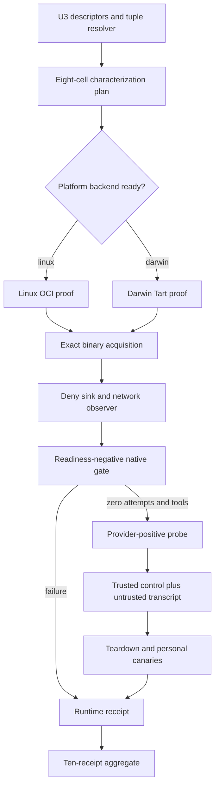
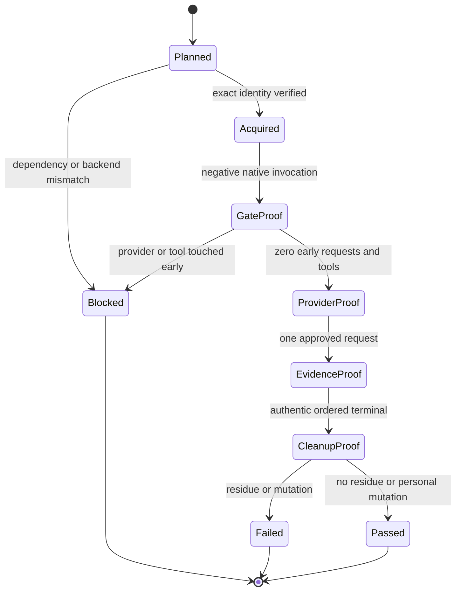

<!-- markdownlint-disable MD013 MD025 -->

# Exact runtime baseline and native gate feasibility - Plan

## Goal Capsule

- **Objective:** Implement parent-plan U16 by proving or explicitly blocking eight exact runtime/platform tuples plus the Linux OCI and Darwin Tart isolation backends before broader harness work.
- **Authority:** Parent ZZA-70 R3/R7–R9/R13/R18–R20, F5, AE2 and KTD7/KTD12/KTD14 govern this slice; ZZA-72/U3 descriptors and tuple helpers are mandatory inputs.
- **Execution profile:** Characterization-first, fail-closed, and evidence-driven. Synthetic hostile fixtures establish receipt semantics before exact binaries and disposable backends are exercised.
- **Stop conditions:** Stop a support lane if it lacks an unavoidable pre-model native gate, immutable binary acquisition, authenticated headless evidence, provider redirection, or required isolation; never substitute wrapper-only, tool-only, host, `sandbox-exec`, skipped, or fabricated passing evidence.
- **Tail ownership:** ZZA-73 is a stacked PR on ZZA-72. Planning and source research may proceed in parallel, but production writes start only after the U3 contract is finalized and imported.

---

## Product Contract

### Summary

U16 characterizes each exact runtime through its ordinary native CLI inside a platform-native disposable boundary. It publishes deterministic, secret-free receipts only for observed proof, and preserves unsupported or unavailable conditions as non-passing blocked results that halt dependent breadth work.

### Problem Frame

U3 can declare expected binary identities and native surface candidates, but a declaration cannot prove that a hook fires before the first model request, a provider can be safely redirected, structured evidence cannot be forged by model output, or a sandbox actually denies host access. Building renderers, coordinators, and product adapters before these seams exist would institutionalize untestable assumptions.

Current operator tools also differ from the v1 baseline: Codex is exact, while installed OpenCode, Claude Code, and Pi versions are newer or older and Tart is absent. Characterization therefore must acquire exact versions into disposable locations rather than trusting or modifying personal installations.

### Requirements

#### Dependency and exact identity

- R1. U16 must import the finalized U3 descriptor/profile/inventory resolver and derive exactly eight runtime/platform tuples; it must not create a parallel tuple or expected-key implementation.
- R2. Every run must verify the U3 release owner/repository/tag/asset, provider-published archive digest, normalized executable member and digest, runtime version/variant, OS/architecture, descriptor digest, U1 source identity, and substrate manifest identity before plugin load or provider response.
- R3. Exact standalone runtimes must be acquired into disposable roots from the eight U3-pinned GitHub release assets without modifying personal runtime homes, following redirects outside the reviewed release identity, or executing package lifecycle scripts. The U1-pinned immutable Compound Engineering payload must also be provisioned and natively discovered before a runtime probe can pass.

#### Native gate and side-effect proof

- R4. A negative readiness probe must enter through every relevant ordinary native CLI mode and show a native pre-model/session/input gate decision with zero provider connection attempts and zero tool side effects. A cell-local deny sink and namespace-level DNS/TCP/HTTP accounting must be active from process start so an attempted request cannot be confused with a blocked connection.
- R5. A tool/permission probe must separately prove that later side effects remain blocked; a tool-only late hook cannot satisfy R4. Each runtime must exercise a bypass matrix covering interactive/headless entry points, config precedence/disable paths, project/trust scope, alternate provider/config flags, missing/malformed/timeout/crashing probe, and plugin load failure.
- R6. Runtime-specific seams remain adapter-local facts: Codex `UserPromptSubmit`, Claude Code `UserPromptSubmit`, Pi `input` handling, and OpenCode's pre-request/plugin surfaces must be behaviorally characterized at the exact versions rather than accepted from rolling docs.
- R7. If OpenCode or another exact runtime cannot produce an unavoidable fail-closed pre-model decision, that tuple and support lane must be blocked and the parent support assumption reported as invalidated.

#### Provider and evidence proof

- R8. The cell-local token-bound OpenAI-compatible or Anthropic-compatible observer is reachable from process start but remains a deny sink that never supplies a model response during negative proof. After the negative gate succeeds it may switch to deterministic response mode; exactly one modeled request is allowed and external egress remains zero.
- R9. Headless output must use the runtime's native JSON, JSONL, stream-JSON, or RPC surface. The generation retains a secret-free canonical transcript envelope containing frame kind/channel, cell identity, monotonic sequence, payload-nesting digest, terminal marker/count, and payload digest—but no prompt/model/tool/provider body—so static verification can independently check framing and exactly one terminal event.
- R10. Runtime stdout/stderr and native protocol frames are untrusted transcripts. Passing control evidence must come from harness-owned probe code invoked through the declared native surface and a harness-owned provider/network observer, over a dedicated inherited control FD or Unix socket with a one-use capability that is never exposed to prompt/model/tool/stdout. Collector evidence binds cell identity, monotonic sequence, payload nesting, process exit, broker counts, and exactly one terminal event; duplicate/replayed/wrong-channel evidence fails.

#### Isolation and lifecycle proof

- R11. Linux x64 cells must run in a digest-pinned OCI image with read-only root, empty capabilities, no-new-privileges, PID/process/CPU/memory limits, isolated mounts/namespaces, broker-only network, and teardown verification.
- R12. Darwin arm64 cells must run in a disposable clone of a digest-pinned macOS 15 image under a pinned Tart executable, with isolated workspace/HOME/auth, bounded resources/processes, broker-only networking, clean-state verification, shutdown/delete, and residual checks.
- R13. Missing OCI/Tart runtime, image/policy mismatch, unavailable virtualization, dirty snapshot, failed teardown, host visibility, broad egress, or residual process/mount/socket/VM must block affected tuples; host execution and `sandbox-exec` are never passing fallbacks.
- R14. Characterization must preserve hashes/canaries for personal config and outside-root paths and report any mutation as non-pass.

#### Receipt and failure semantics

- R15. U16 must define closed runtime/backend receipt and normalized proof-attestation contracts that record expected/observed identities, trusted emitter/observer identity, proof digests, stable reason codes, recovery actions, terminal status, and `countsAsPass` without raw prompts, tokens, auth headers, local personal paths, or mutable timestamps.
- R16. Only `passed` may set `countsAsPass: true`; blocked, failed, timeout, cancelled, infra-error, not-run, and expired remain explicit non-pass.
- R17. Read-only static verification and every pre-write failure must mutate neither committed receipts nor personal state; live re-characterization is a separate command. Explicit write may publish any complete schema-valid ten-receipt generation, including blocked truth: it validates/scans an immutable generation directory, atomically replaces `current.json`, then exits non-zero unless all ten receipts pass.
- R18. U16 must publish or verify eight tuple receipts, two backend receipts, their normalized proof attestations, and one substrate manifest as one logically atomic generation; readers trust only the generation named by `current.json`, and missing, duplicate, extra, stale, unbound, or mixed files cannot pass.

#### Scope and compatibility

- R19. U16 must not implement parent U4 overlay/apply, parent U6 production provider doubles, parent U14 coordinator/evidence store, parent U7–U10 product adapters, parent U15 scenarios, or root Pi dependency upgrades. U16-only probes, deny sink, collectors, and substrate enforcement are test/characterization infrastructure and are not exported as reusable product services.
- R20. Existing parent U1–U3, profile, connector, setup-doctor, OMP, and package behavior must remain compatible; package contents/installability and Pi extension ordering are regression-gated.

### Acceptance Examples

- AE1. Given a readiness-negative and bypass-matrix probe for each exact runtime, invoking every relevant ordinary CLI path produces a trusted probe control record while the deny sink, DNS/TCP/HTTP counters, and tool canaries prove zero provider attempts and side effects; otherwise the tuple is blocked.
- AE2. Given a readiness-positive probe after AE1, the exact runtime sends one token-bound request to the approved local provider, emits valid native structured evidence, and cannot reach external DNS/IP, other loopback ports, or Unix sockets.
- AE3. Given a wrong binary/version/platform/acquisition/source/descriptor/backend identity, characterization stops before plugin load and returns a stable blocked reason with recovery guidance.
- AE4. Given forged, duplicated, reordered, replayed, wrong-channel, or nesting-changed event-shaped payloads, evidence validation rejects them and never publishes a passing receipt.
- AE5. Given hostile OCI configuration or a Tart VM with broad networking, host mounts, dirty state, or teardown residue, backend and dependent tuples remain non-passing without host fallback.
- AE6. Given unchanged approved proof inputs, static read-only verification validates the `current.json`-selected immutable generation byte-for-byte without executing a runtime, while explicit live re-characterization reproduces a new equivalent generation and leaves project/personal canaries unchanged.
- AE7. Given any exact tuple, the U1-pinned Compound Engineering payload is provisioned and discovered through that runtime's documented native package/plugin mechanism before characterization invocations; source files copied directly into a temp directory do not satisfy discovery.

### Success Criteria

- The finalized U3 resolver yields eight exact tuples consumed without semantic duplication and each tuple proves native discovery of the U1-pinned CE payload.
- **`characterizer-implementation-complete/support-blocked`:** pure contracts, real non-injectable drivers, hostile fixtures, static verification, and truthful blocked generation are reviewable, but ZZA-73 remains `In Progress`, parent breadth remains locked, and `/lfg` is not complete.
- **`u16-gate-passed`:** every runtime proves the bypass-resistant native pre-model block, later tool denial, provider route, trusted control evidence, and cleanup at both platform tuples; OCI and Tart prove effective policy/teardown; all ten receipts count as pass.
- The `current.json`-selected generation is deterministic, secret-free, source/descriptor/substrate/proof-bound, and fails closed on any one-field mutation.
- Only `u16-gate-passed` completes ZZA-73, satisfies this plan, and unlocks dependent breadth. Any existential seam failure is an explicit invalidated-assumption blocker rather than a normalized success.

### Scope Boundaries

#### Included

- Closed runtime/backend characterization receipt contract
- Pure receipt/lifecycle validation and a shell-free exact-binary characterizer
- Exact U3-pinned release acquisition and U1-pinned CE payload provisioning/native discovery in disposable roots
- U16-only native negative/positive hook, deny-sink/provider, trusted control collector, structured-transcript, bypass-matrix, and cleanup probes
- Digest-pinned OCI and Tart substrate manifest plus policy/teardown probes
- One immutable generation containing ten proof or blocked receipts, normalized attestations, a `current.json` pointer, and hostile fixtures

#### Deferred to Follow-Up Work

- Parent U4/U5 project overlay ownership and apply journal
- Parent U6 reusable scripted provider services
- Parent U14 production test coordinator, evidence store, redaction pipeline, and retry/resume
- Parent U7–U10 product runtime adapters and user-home installation
- Parent U15 feature scenarios and 116-cell execution

#### Outside This Slice

- Weakening the four-runtime product promise without an explicit parent-plan revision
- Treating fixture-only, source-attested, local-host, wrapper, tool-only, skipped, or stale evidence as a pass
- Installing into or editing personal runtime configuration
- Committing credentials, model prompts, provider payloads, auth paths, machine-specific personal paths, or mutable download URLs

### Dependencies and Assumptions

- Start gate: after ZZA-72/U3 is implemented and verified, record its exact head SHA plus exported descriptor resolver path/symbol in work evidence, rebase/stack ZZA-73 on that commit, and only then begin U16 production writes. Until then this plan is implementation-ready but dependency-blocked.
- The eight exact provider release artifacts and archive/member/executable hashes are supplied by U3 and are extractable without global installation; a missing or provenance-mismatched artifact blocks that tuple.
- Tart `2.32.0` is the provisional executable baseline (`openai/tart` release asset `tart.tar.gz`, SHA-256 `65adc1c6d0aefb55e9fa82f683bb93b62550b8dc1b9d0a26e1d5abc66500ef80`); a macOS 15 arm64 image reference/digest and enforceable network topology must be fixed in the substrate manifest before Darwin can pass.
- Tart Softnet or an equivalent pinned policy can enforce broker-only guest egress; if black-box probes disprove this, Darwin support is blocked rather than weakened.
- OpenCode `1.18.0` has a pre-request plugin surface, but its fail-closed behavior is unproven and must be treated as the highest-risk runtime characterization.

---

## Planning Contract

### Product Contract Preservation

This slice preserves parent requirements R3, R7–R9, R13, R18–R20, F5, AE2 and KTD7/KTD12/KTD14. It does not reduce exact-version, pre-model, provider, evidence, isolation, or ten-receipt obligations.

### Key Technical Decisions

- KTD1. **Stack U16 on the finalized U3 contract.** U16 may research in parallel but imports descriptor and tuple semantics after ZZA-72; it never guesses absent exports or duplicates their logic.
- KTD2. **Use a closed characterization receipt schema.** Ten long-lived JSON artifacts need machine-enforced structure and pass accounting; a dedicated U16 schema is narrower and safer than ad hoc semantic validation alone.
- KTD3. **Separate pure lifecycle/receipt logic from real substrate drivers.** Deterministic fixture mode exercises orchestration and hostile events but cannot call publication or produce `countsAsPass:true`; production write mode constructs non-injectable real CLI/OCI/Tart drivers internally and binds their identities into proof.
- KTD4. **Observe negative-before-positive proof.** A cell-local deny sink and namespace network observer exist from process start and count DNS/TCP/HTTP attempts while returning no model response. Only after native negative proof may the same endpoint enter deterministic response mode.
- KTD5. **Use independent control evidence.** Native stdout/stderr remains untrusted transcript. Harness-owned probe code emits over a dedicated inherited FD/socket protected by a one-use capability unavailable to prompt/model/tool channels; provider/network observers and process exit independently cross-bind the claim.
- KTD6. **Attest effective isolation state.** OCI receipts bind effective bundle/runtime/image/network state and negative probes; Tart receipts bind executable/image/clone lineage, enforceable broker topology, guest probes, VM state, deletion, and post-delete absence.
- KTD7. **Separate implementation completeness from feasibility success.** Truthful blocked receipts may establish `characterizer-implementation-complete/support-blocked`, but only ten passing receipts establish `u16-gate-passed`, complete ZZA-73, and unlock parent units.
- KTD8. **Consume exact standalone artifacts from U3.** Current personal versions and NPM wrappers/postinstall paths are diagnostic only; U3-pinned release archives are downloaded, verified against reviewed provenance, safely extracted, and executed inside approved substrates without changing global packages or locks.
- KTD9. **Publish one logical generation atomically.** Explicit write validates all receipts, canonical transcript envelopes, and attestations in a fresh immutable generation directory, fsyncs it, and atomically replaces only `current.json`; readers ignore unreferenced partial generations. A fully valid blocked generation may become authoritative for review but the command returns non-zero and never unlocks breadth. Static verify never executes environments; live re-characterization is separate.
- KTD10. **Keep actual model credentials out of U16.** Local deterministic provider probes use one-use capabilities generated in memory and passed only over dedicated control channels; hosted credentials and model-quality certification remain separate.
- KTD11. **Provision the immutable CE payload through native discovery.** Every tuple installs the U1-pinned payload using the runtime's documented package/plugin mechanism and proves discovery before characterization, without widening into parent U15's 29-feature scenarios.

### Assumptions

- Docker/OCI is available for Linux characterization, but effective runtime/image/policy receipts still need black-box proof.
- Tart is not currently installed; U16 may extract the pinned executable into a disposable root, but it must not perform a global/Homebrew installation. Absence of an approved macOS image or enforceable network topology remains blocked.
- Current installed OpenCode `1.18.2`, Claude Code `2.1.211`, and Pi `0.80.6` do not satisfy the v1 tuple and will not be reused.
- U3's standalone GitHub release archives avoid NPM postinstall and interpreter/dependency-closure ambiguity for all four runtimes.
- A source-backed native hook name is only a candidate until the exact binary produces the expected ordinary-CLI behavior.

### High-Level Technical Design





The runtime cell lifecycle is strictly monotonic. A failed prerequisite prevents later drivers from starting, and no downstream event can upgrade an earlier non-pass.

### Output Structure

```text
harness/
├── baselines/
│   ├── current.json
│   └── generations/<generation-digest>/
│       ├── manifest.json
│       ├── receipts/                 # eight runtime + linux-oci + darwin-tart
│       ├── transcripts/              # canonical framing/channel/sequence/nesting metadata + payload digests
│       └── attestations/             # normalized secret-free control/network/backend proof
├── contracts/
│   ├── baseline-generation.schema.json
│   ├── baseline-receipt.schema.json
│   ├── characterization-attestation.schema.json
│   └── characterization-transcript.schema.json
└── substrates/
    └── u16-v1.json
scripts/
└── harness/
    ├── characterize.mjs              # CLI and non-injectable production composition root
    └── characterize/
        ├── acquisition.mjs
        ├── collector.mjs
        ├── oci.mjs
        ├── provider.mjs
        ├── receipts.mjs
        ├── runtimes.mjs
        └── tart.mjs
tests/
└── harness/
    ├── characterize.test.mjs
    └── fixtures/characterize/
        ├── acquisition/
        ├── evidence/
        ├── oci/
        ├── runtimes/
        └── tart/
```

### Substrate Decisions

- Linux uses `ubuntu:24.04@sha256:52df9b1ee71626e0088f7d400d5c6b5f7bb916f8f0c82b474289a4ece6cf3faf` for `linux/amd64`, Docker Engine `29.2.0`, and `runc 1.3.4`; implementation records and verifies effective image config plus engine/runtime executable identities in `u16-v1.json` before a pass.
- Linux networking uses a fresh Docker `--internal` bridge containing only the runtime cell and U16 deny-sink/provider peer, with no default external route, no host mounts/sockets, and DNS disabled except an explicit broker mapping. Namespace counters and hostile peer/DNS/IP/loopback/Unix-socket probes attest the effective topology.
- Darwin uses the pinned Tart `2.32.0` release executable and resolves `ghcr.io/cirruslabs/macos-sequoia-base:latest` to one immutable macOS 15 arm64 image digest before clone; the mutable tag is never stored as the passing identity.
- Darwin runs the U16 deny-sink/provider on one exact guest loopback address/port. Softnet blocks host/private-network access; administrator-owned PF uses default deny and allows only that broker address/port, including on loopback; the runtime executes as non-admin. Runtime HOME/temp contain no shared sockets, listener inventory must equal the allowlist, and accessible Unix sockets are denied by isolated roots/permissions. Effective PF/listener/socket state plus host/private/public/DNS/alternate-loopback/Unix-socket probes must prove enforcement; if not, Darwin remains blocked.

### Implementation Constraints

- Use Node ESM and built-in modules; no shell invocation or runtime SDK import in neutral code.
- Import U3 descriptor/tuple resolution and release-member identities rather than parsing profile/descriptors independently.
- Acquisition and extraction inherit U3's host/owner/tag/asset redirect allowlist and bounded regular-file-only extraction rules.
- Use absolute allowlisted executable paths only after exact digest verification and spawn structured argv with bounded piped stdout/stderr, time/process cleanup, and no unredacted console tee.
- Build minimal environments from allowlisted keys and strip inherited auth, credential, socket, preload, startup, Git object, and runtime-home variables; capabilities travel only over dedicated control FD/socket, never argv or environment visible to the runtime.
- Never read the project `.env` or personal agent auth/config as characterization inputs.
- Bind observers to cell-specific approved interfaces/ports; reject wildcard binds, redirects, unknown paths, oversized input, and capability replay.
- Persist allowlisted normalized attestations plus canonical transcript envelopes containing only framing/channel/sequence/terminal metadata and payload/nesting digests. Raw stdout/stderr/prompt/model/tool/provider bodies are bounded ephemeral buffers; spill files, if unavoidable, are owner-only and removed on every exit. Errors, receipts, and diffs contain redacted/allowlisted fields only.
- Fixture drivers are available only through test-only pure APIs and cannot enter production write mode or set `countsAsPass:true`. The CLI production composition root internally constructs real drivers and binds their observed identity to attestations.
- U16 does not change `@earendil-works/pi-coding-agent` dependency or `package-lock.json`; only minimal package scripts may change.

### Sources and Research

- `docs/plans/2026-07-15-ZZA-70-oh-my-harness-plan.md` parent U16/KTD7/KTD12/KTD14
- `harness/contracts/runtime-adapter.schema.json` U3 descriptor shape
- `harness/contracts/conformance-result.schema.json` terminal/pass semantics precedent
- `scripts/harness/upstream.mjs` verify-before-write, bounded Git subprocess, atomic publication, and no-mutation precedent
- [Codex 0.144.4 hook implementation and release](https://github.com/openai/codex/releases/tag/rust-v0.144.4)
- [OpenCode 1.18.0 plugin ABI at release commit](https://github.com/anomalyco/opencode/blob/32696c425fc0fa1ec285389346cfa1fbe22b670a/packages/plugin/src/index.ts)
- [OpenCode 1.18.0 JSON run implementation](https://github.com/anomalyco/opencode/blob/32696c425fc0fa1ec285389346cfa1fbe22b670a/packages/opencode/src/cli/cmd/run.ts)
- [Claude Code hooks](https://code.claude.com/docs/en/hooks) and [2.1.210 release](https://github.com/anthropics/claude-code/releases/tag/v2.1.210)
- [Pi 0.80.7 extension lifecycle](https://github.com/earendil-works/pi/blob/v0.80.7/packages/coding-agent/docs/extensions.md) and [RPC protocol](https://github.com/earendil-works/pi/blob/v0.80.7/packages/coding-agent/docs/rpc.md)
- [OCI Runtime Specification 1.3.0](https://github.com/opencontainers/runtime-spec/tree/v1.3.0)
- [Tart 2.32.0 restricted networking guidance](https://github.com/cirruslabs/tart/blob/2.32.0/docs/faq.md)

### Risk Analysis and Mitigation

- **OpenCode pre-model blocker:** its exact plugin ABI shows mutation hooks but no proven explicit deny result. Run the full bypass matrix first; if throw/cancellation/permission paths are not unavoidable and fail-closed, block both OpenCode tuples and stop U16 completion.
- **Acquisition provenance:** use only U3-pinned standalone GitHub release assets and archive/member/executable digests; reject NPM wrappers/postinstall, wrong owner/signer/redirect, and metadata/digest learned solely from the same unreviewed download.
- **Tart network policy:** Softnet alone permits public egress. Require guest-loopback broker plus administrator-owned PF default deny, non-admin runtime, effective-state capture, and hostile public/private/host/DNS probes; otherwise block Darwin support.
- **OCI claim drift:** Docker launch flags are insufficient. Capture effective OCI configuration/runtime/image/internal-network state and run hostile filesystem/process/network probes against the two-peer topology.
- **Evidence forgery:** runtime native output is transcript, not control proof. A dedicated harness-owned capability channel, provider/network observer, process exit, and normalized attestation must cross-bind every passing claim.
- **Fixture escalation:** test injection is isolated from the production composition root; fixture mode cannot publish or count as pass, and forged observed-fact injection is a required negative test.
- **Local baseline mismatch:** never use currently installed non-exact OpenCode/Claude/Pi binaries; acquire U3-pinned versions ephemerally.

---

## Implementation Units

### U16.1. U3 import boundary and closed receipt/attestation contracts

- **Goal:** Bind U16 to finalized U3 tuple semantics and define the ten-receipt fail-closed data contract.
- **Requirements:** R1, R2, R15–R20; AE3, AE6; KTD1, KTD2, KTD7, KTD9.
- **Dependencies:** ZZA-72/U3 finalized branch.
- **Files:** `harness/contracts/baseline-receipt.schema.json`, `harness/contracts/characterization-attestation.schema.json`, `harness/contracts/characterization-transcript.schema.json`, `harness/contracts/baseline-generation.schema.json`, `harness/substrates/u16-v1.json`, `scripts/harness/characterize.mjs`, `scripts/harness/characterize/receipts.mjs`, `tests/harness/characterize.test.mjs`, `tests/harness/fixtures/characterize/`.
- **Approach:** After the start gate records the ZZA-72 commit/export, import U3 resolution; define closed runtime/backend receipt, trusted normalized attestation, substrate manifest, stable reason/recovery, pass accounting, and logical generation contracts.
- **Execution note:** Start with failing schema/semantic tests for valid, one-field-mutated, incomplete, secret-bearing, and forged-pass receipts.
- **Test scenarios:**
  - U3 returns exactly eight tuples and the receipt filenames/identities match them.
  - Every expected/observed tuple, source, descriptor, backend, proof, status, and pass-accounting mutation fails or blocks appropriately.
  - Seven, nine, duplicate, extra, mixed-generation, stale, or path-escaping receipt sets fail.
  - Secret-like fields/values, raw prompts, provider bodies, tokens, auth headers, personal paths, and unknown properties fail.
  - Fixture/synthetic driver identity, self-asserted native stdout, missing trusted-emitter binding, or forged observed facts cannot publish or set `countsAsPass:true`.
- **Verification:** Receipt/attestation validation is deterministic, closed, secret-free, and impossible to pass without exact U3/substrate identity and real-driver proof binding.

### U16.2. Exact acquisition and safe extraction plan

- **Goal:** Acquire and safely extract exact runtime and CE payload artifacts inside disposable substrate staging roots without executing a coding-agent binary.
- **Requirements:** R2, R3, R14, R17–R20; AE3, AE6; KTD3, KTD8, KTD9.
- **Dependencies:** U16.1.
- **Files:** `scripts/harness/characterize/acquisition.mjs`, `tests/harness/characterize.test.mjs`, `tests/harness/fixtures/characterize/acquisition/`.
- **Approach:** Consume U3's eight release identities, verify provider-published provenance before bytes, safely extract exact archive members without scripts, stage the U1-pinned CE payload, and build shell-free execution plans. Version/platform invocation, native discovery, and child cleanup occur only after U16.4/U16.5 approve a backend.
- **Test scenarios:**
  - Exact Codex/OpenCode/Claude/Pi artifacts match U3 tuples on both platforms.
  - Missing artifact, mutable URL/ref, wrong owner/repository/tag/asset/digest/member, unreviewed redirect, path shim, hardlink/symlink/device/FIFO/socket, traversal, path collision, unsafe mode, file-count/size/ratio overflow, or lifecycle script blocks before execution.
  - Personal runtime configuration and canary hashes remain unchanged on success and failure.
  - Current non-exact installed binaries are rejected and never substituted.
- **Verification:** Exact acquisition/staging is reproducible from U3 provenance and no runtime binary executes before a passing backend exists.

### U16.3. Native discovery, gate, provider, and trusted-control probes

- **Goal:** Prove each exact runtime's pre-model block, later side-effect denial, one-request provider route, authentic structured evidence, and cleanup.
- **Requirements:** R4–R10, R14–R20; AE1–AE4, AE6; KTD3–KTD5, KTD7, KTD10.
- **Dependencies:** U16.2 plus an approved U16.4 or U16.5 backend. Implementation order is `U16.1 → U16.2 → U16.4/U16.5 → U16.3 → U16.6`.
- **Files:** `scripts/harness/characterize/collector.mjs`, `scripts/harness/characterize/provider.mjs`, `scripts/harness/characterize/runtimes.mjs`, `tests/harness/characterize.test.mjs`, `tests/harness/fixtures/characterize/runtimes/`, `tests/harness/fixtures/characterize/evidence/`.
- **Approach:** Verify executable version/platform inside the approved substrate, provision and prove native discovery of the U1 CE payload, start the deny sink/network observer, run each runtime's bypass matrix and readiness-negative/tool-negative invocations, then switch only a proved cell to one-response mode. Treat native protocol output as transcript and accept control claims only from the capability-bound collector plus independent provider/network/process observations.
- **Test scenarios:**
  - Codex, Claude Code, Pi, and OpenCode exact-version bypass matrices either show an unavoidable native pre-model block with zero DNS/TCP/HTTP attempts/tool counts or produce a support-blocking reason.
  - Native CE payload discovery is required; direct source copying, missing/disabled/malformed/crashing/timed-out probes, alternate headless/config/provider/trust paths, tool-only gate, early request attempt, side-effect mutation, wrong endpoint/token, duplicate request, redirect, or external egress fails.
  - Forged stdout/stderr/model/tool JSON, leaked capability, wrong emitter/channel/cell, duplicate/replayed/out-of-order control event, changed nesting, missing/multiple terminal, malformed JSON/JSONL/RPC transcript, disconnect, cancellation, and timeout fail.
  - Canonical transcript-envelope mutations to frame kind, channel, sequence, nesting digest, payload digest, terminal marker/count, or generation binding fail static verification without retaining sensitive bodies.
  - Successful probes preserve personal state and leave no listener, child, port, socket, temp root, or runtime cache.
- **Verification:** Every passing runtime receipt is backed by observed exact-version native events; unproven surfaces remain blocked and cannot unlock dependent units.

### U16.4. Digest-pinned Linux OCI proof

- **Goal:** Prove the Linux x64 backend's effective isolation policy and teardown.
- **Requirements:** R11, R13–R18, R20; AE2, AE5, AE6; KTD3, KTD6, KTD7, KTD9.
- **Dependencies:** U16.1–U16.2.
- **Files:** `harness/substrates/u16-v1.json`, `scripts/harness/characterize/oci.mjs`, `tests/harness/characterize.test.mjs`, `tests/harness/fixtures/characterize/oci/`.
- **Approach:** Verify the decided image/engine/runc identities, create the isolated two-peer internal network, inspect effective OCI configuration and routes, then run filesystem, capability, privilege, syscall, namespace, host-process, mount, DNS/IP/loopback/Unix-socket/remote-git, resource, daemon, and teardown probes.
- **Test scenarios:**
  - Read-only root, empty capabilities, no-new-privileges, non-root user, seccomp, namespace, resource/PID limits, isolated mounts, broker-only network, and image/runtime digests are all observed.
  - Writable root, retained capability, privilege escalation, missing limit/namespace/seccomp, host mount/process/socket visibility, external or unapproved loopback egress, remote git, double-fork daemon, or failed deletion blocks.
  - Broker capability is cell-bound and cannot be replayed by another cell.
- **Verification:** The backend receipt binds effective policy and negative-probe output digests, and all four Linux tuples depend on its passing generation.

### U16.5. Digest-pinned Darwin Tart proof

- **Goal:** Prove the Darwin arm64 VM backend's immutable image, disposable clone, broker-only networking, guest isolation, and teardown.
- **Requirements:** R12–R18, R20; AE2, AE5, AE6; KTD3, KTD6, KTD7, KTD9.
- **Dependencies:** U16.1–U16.2.
- **Files:** `harness/substrates/u16-v1.json`, `scripts/harness/characterize/tart.mjs`, `tests/harness/characterize.test.mjs`, `tests/harness/fixtures/characterize/tart/`.
- **Approach:** Verify the pinned Tart executable, resolve and bind one macOS 15 arm64 image digest, clone a stopped clean image, start one exact guest-loopback broker, apply administrator-owned PF default deny with only that address/port allowed plus Softnet, run the runtime as non-admin with isolated socket roots, capture effective PF/routes/listeners/socket permissions, execute alternate-loopback/Unix-socket/host/network/process/mount canaries, then shut down/delete and verify unchanged base/post-delete absence.
- **Test scenarios:**
  - Exact Tart/image/platform, Apple virtualization, stopped clean base, disposable clone lineage, isolated mounts, bounds, broker-only network, guest canaries, shutdown/delete, and residual zero pass.
  - Missing Tart, wrong version/digest/image, unsupported host, locked-keychain failure, dirty/reused snapshot, shared NAT/host network, broad egress, host mount, base mutation, failed stop/delete, or residual VM/process blocks.
  - No host or `sandbox-exec` fallback is attempted after any blocked condition.
- **Verification:** The backend receipt is observed on an approved Darwin arm64 host and all four Darwin tuples depend on the same passing generation.

### U16.6. Logical generation publication, CLI, and regression audit

- **Goal:** Publish and verify the complete runtime/backend proof set without partial success or compatibility drift.
- **Requirements:** R15–R20; AE3–AE6; KTD7, KTD9.
- **Dependencies:** U16.1–U16.5.
- **Files:** `harness/baselines/current.json`, `harness/baselines/generations/**`, `scripts/harness/characterize.mjs`, `scripts/harness/characterize/receipts.mjs`, `tests/harness/characterize.test.mjs`, `package.json`.
- **Approach:** Expose static read-only `--verify`, separate live characterization, and explicit production `--write`; validate and secret-scan all receipts/transcript envelopes/attestations in a fresh immutable generation, fsync it, then atomically replace `current.json` even for complete blocked truth. Return non-zero unless all required proofs pass; only a passing authoritative generation unlocks breadth.
- **Test scenarios:**
  - All eight tuple and two backend receipts in one generation verify byte-identically.
  - Interruption before pointer replacement leaves the prior generation authoritative; an unreferenced partial directory is non-authoritative and safely removable. Pointer replacement is the sole logical commit point.
  - Any blocked/failed/timeout/cancelled/infra-error/not-run/expired receipt keeps `countsAsPass:false` and aggregate non-zero.
  - Existing harness, profile, connector/setup/OMP suites remain green; `npm pack --dry-run` preserves package contents/installability and Pi extension ordering; import/package scans show no parent U4+ or runtime-adapter product code.
- **Verification:** `harness:characterize` reports truthful per-tuple/backend status and only a complete passing ten-receipt generation satisfies U16.

---

## Verification Contract

| Gate | Command | Passing signal |
| --- | --- | --- |
| U16 pure lifecycle/receipt tests | `npm run test:harness` | Parent U1–U3 regressions plus U16 identity, forged-control, fixture-escalation, provider/network, OCI, Tart, cleanup, logical-publication, and secret fixtures pass |
| Exact live characterization | `npm run harness:characterize -- --live` | Real non-injectable drivers produce eight passing tuple plus two passing backend models in a temporary generation; any unavailable/failed seam returns non-zero and remains explicit |
| Explicit logical publication | `npm run harness:characterize -- --write` | Any complete validated immutable generation—including blocked truth—is written and selected atomically; the command returns zero and unlocks breadth only when all ten receipts pass |
| Static read-only verification | `npm run harness:characterize -- --verify` | The `current.json`-selected generation, attestations, substrate and cross-digests verify byte-for-byte with no runtime execution or project/personal mutation |
| U1 source compatibility evidence | `npm run harness:upstream:verify -- --source "$CE_SOURCE_DIR"` | During implementation, the separately acquired canonical CE checkout reproduces the 3.19.0 lock/inventory and the command/source commit are recorded in work evidence |
| Existing profile compatibility | `npm run profile:verify` | Existing profiles and lock remain deterministic and secret-free |
| Existing integration/package compatibility | `npm run test:workspace-connectors && npm pack --dry-run` | Connector, setup-doctor, OMP, package contents/installability, and Pi extension ordering remain compatible |
| Static, secret, and scope audit | `git diff --check` plus diff/import/package/canary scans | No secret, personal path, copied CE body, host fallback, parent U4+ implementation, root Pi dependency update, abandoned experiment, or personal mutation remains |

Browser testing is not applicable because U16 adds CLI characterization, JSON receipts, and Node tests without a browser route or UI.

---

## Definition of Done

- ZZA-73 has an implementation-ready local/Notion plan, synchronized ticket document, and a branch stacked on finalized ZZA-72.
- U16 is stacked on the recorded finalized ZZA-72 commit/export, imports U3 descriptors/tuples, and defines closed receipt, attestation, substrate and generation contracts.
- Exact U3 release artifacts and the U1 CE payload are acquired only into disposable substrate roots; every tuple proves native CE discovery before probing and no personal installation mutates.
- All four runtimes pass the bypass matrix, native pre-model denial, later side-effect denial, one approved provider request, trusted control evidence, native structured transcript, and cleanup at both platform tuples.
- Linux OCI and Darwin Tart receipts pass effective isolation, broker-only network and teardown hostile probes without host or `sandbox-exec` fallback.
- Eight tuple receipts, two backend receipts, canonical transcript envelopes, and normalized attestations form one immutable deterministic secret-free generation selected by atomic `current.json`; a blocked generation may be authoritative review evidence but cannot satisfy aggregate success.
- `u16-gate-passed` is achieved. If an existential seam remains blocked, this Definition of Done is not met, ZZA-73 remains open, and parent breadth remains stopped even if the implementation itself is reviewable.
- Parent U1–U3, profile, connector/setup/OMP, package, static, secret, scope, and personal-canary gates pass.
- Downloaded binaries/images outside approved caches, temp homes, VM clones, containers, listeners, child processes, and dead-end experimental code are removed before completion.
