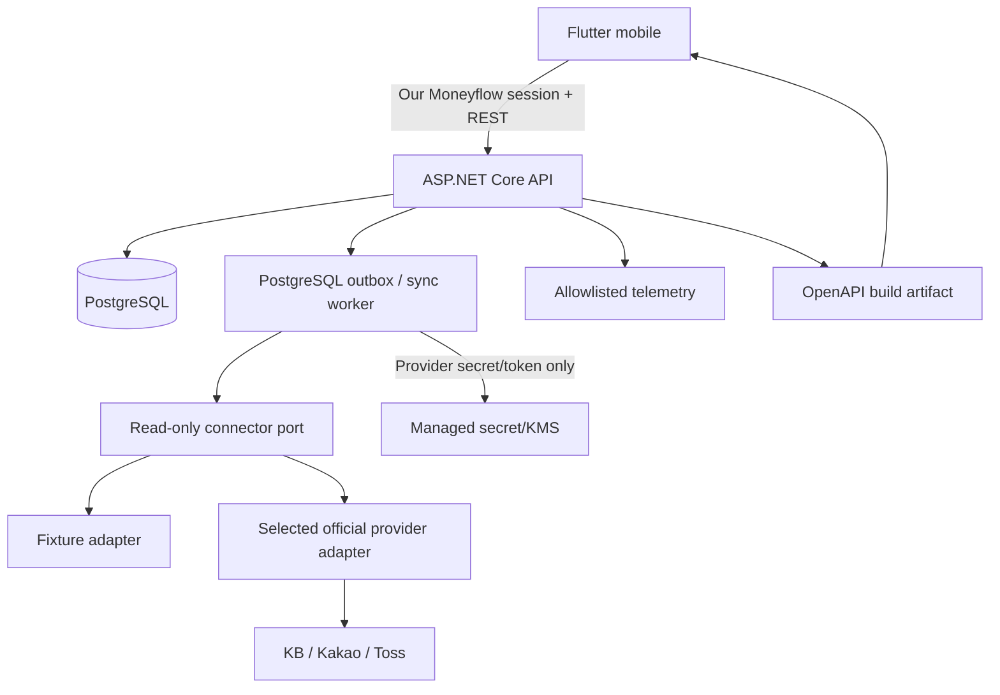
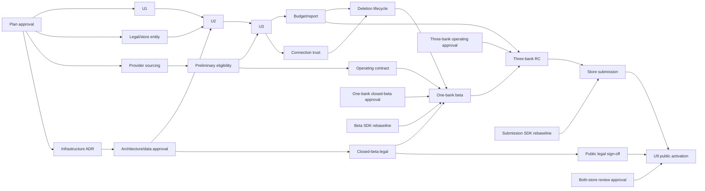

# Our Moneyflow 1차 제품 출시 - Plan

> Canonical Notion:
> [2026-07-21 ZZA-86 Our Moneyflow 1차 제품 출시 계획](https://app.notion.com/p/3a4ef22ad4fc8154b087c4a6a6c65396)
>
> Linear:
> [ZZA-86 Our Moneyflow 1차 제품 출시](https://linear.app/zzanghyunmoo/issue/ZZA-86/our-moneyflow-1차-제품-출시)

## Goal Capsule

- **Objective:** Our Moneyflow를 내부 데모나 MVP가 아니라 한국의 Apple App Store와 Google Play에 공개된 1차 제품으로 출시한다.
- **Execution:** Deep / high-risk software plan. Flutter 모바일, 금융 OAuth, 서버, 데이터 수명주기와 두 스토어 출시를 포함한다.
- **Readiness:** P1~P7 사용자 검증을 반영한 implementation-ready 계획이다. 구현 시작은 U1의 저장소 직접 전환 결정과 Linear `In Progress` 전환 뒤에 가능하다.
- **Authority:** 사용자 승인 결정 → canonical Notion 계획 → 이 로컬 동기화 계획 → 구현 중 세부 판단 순서다.
- **Tail ownership:** 각 slice는 프로젝트 PR, work evidence, Notion/KB closeout과 workspace submodule pointer 동기화까지 소유한다. ZZA-86은 양 스토어 공개와 최종 closeout 뒤에만 Done으로 전환한다.

### Stop Conditions

- `projects/ReplaceMe`가 의도된 diff에 포함된다.
- U1 완료 뒤에도 `projects/sre-ai-lab` 경로나 SRE AI Lab 제품 정체성이 남는다.
- 송금·결제 scope, endpoint, credential 또는 transfer capability가 제품에 들어온다.
- 샘플, sandbox 또는 한 은행 beta를 1차 제품 출시로 표시한다.
- 프로젝트 PR이 프로젝트 저장소 안의 ideation, plan, work evidence를 검증하지 못한다.
- 법인·공식 금융 provider·규제·스토어 조직 계정 gate가 불명확한데 공개 출시일을 확정한다.
- 부분 데이터가 완전한 합계나 행동 지표로 노출된다.

---

## Product Contract

### Summary

이 계획은 현재 SRE AI Lab 저장소를 별도 이력 보존 절차 없이 Our Moneyflow 저장소로 직접 전환하고, Flutter 앱과 안전한 서버를 내부 배포부터 fixture 제품, 연결 신뢰, 삭제 수명주기, 첫 공식 은행, 세 은행 release candidate, 양 스토어 공개까지 아홉 개 deployable slice로 전개한다.

### Product Contract Preservation

원 요구사항의 공개 출시, 읽기 전용, 세 은행, 계좌별 가계부·예산과 주·월·연 보고서 범위는 유지한다. R5, R8, R12의 동작과 provider sourcing·배포 경계·보안/UX·출시 threshold는 2026-07-21 승인된 P1~P7을 따른다.

| Origin contract | Plan contract |
| --- | --- |
| Actors: 사용자·공식 제공자·세 은행·운영자·심사자 | A1~A4와 운영/심사 trust boundary |
| F1 가입·첫 연결 | F1 로그인과 F2 공식 연결 |
| F2 동기화·정합성 | F3 observation → event → override → projection |
| F3 예산 홈·F4 보고서 | F4 예산·비교·주월연 보고서 |
| F5 장애·재인증 | F5 partial/stale·retry·reauth |
| F6 연결 해제·삭제 | F6 연결 해제·은행 데이터 삭제·계정 삭제 |
| AC1~AC10 | AE1~AE12와 Verification Contract의 read-only·store·workflow gate |

### Problem Frame

여러 계좌의 잔액만으로는 사용자가 지금 얼마를 써도 안전한지 판단하기 어렵다. 단순 거래 합산은 이체, 환불, 지연과 부분 실패 때문에 실제 소비를 왜곡한다. 금융 앱은 계산이 맞는 것뿐 아니라 무엇이 누락되었고 언제 기준인지 설명할 수 있어야 한다.

### Actors

- A1. 한국의 단일 개인 사용자: 본인 명의 KRW 입출금 계좌를 연결하고 예산과 보고서를 관리한다.
- A2. 선택한 공식 금융 provider·참가 은행: 공식 인증·동의·계좌 등록·조회·해지와 은행별 응답을 제공한다.
- A3. 운영자: 비식별 상태와 감사 기록으로 장애를 복구하며 금융 원문을 기본 관측 도구에서 보지 않는다.
- A4. Apple·Google 심사자: 실계좌 자격증명 없이 명시된 review fixture로 기능과 정책을 검증한다.

### Requirements

**Release and account connection**

- R1. 한국 사용자가 동일 제품 계약의 iOS·Android 앱을 양 스토어에서 설치할 수 있어야 1차 출시로 인정한다.
- R2. 국민은행·카카오뱅크·토스뱅크의 개인 명의 KRW 입출금 계좌를 공식 read-only 흐름으로 연결하고, 사용자가 지원 계좌를 명시적으로 선택한다.
- R3. 동의, callback 결합, 재인증, 외부 철회, `revocation_pending`, 연결 해제 상태를 은행별로 관리한다. 재연결은 검증된 provider identity나 사용자 확인으로만 기존 계좌에 결합하고 masked account·connection handle만으로 자동 병합하지 않는다.

**Ledger and household bookkeeping**

- R4. 조회 원본은 보유기간 안에서 append-only observation으로 보존하고 페이지 저장과 checkpoint 전진을 하나의 transaction으로 처리한다.
- R5. 원본을 economic event로 정규화하며 결정적 환불·취소만 자동 반영한다. 이체·중복 후보는 사용자 확인 전 자동 제외하지 않으며, 신용카드 feed는 연결하지 않는다. 카드대금 출금은 일반 지출로 유지하고 사용자가 직접 제외·복원한다.
- R6. 카테고리, 메모, 포함·제외와 후보 확인은 가역적인 user override revision으로 기록하고 재동기화·재정규화 뒤에도 보존한다.

**Budget and reports**

- R7. 예산은 계좌별 달력 월 snapshot이며 은행 잔액, 확정 순지출, 남은 예산을 분리한다. 현재 월 수정은 해당 월을 재계산하고 완료된 과거 월은 명시적 편집 없이는 바꾸지 않는다.
- R8. 홈은 `남은 예산 = 월 예산 - 확정 순지출`과 `오늘부터 일평균 사용 가능액 = max(남은 예산, 0) / 오늘 포함 남은 일수`를 별도 값으로 제공한다. 지난달 비교는 Asia/Seoul 반개구간 `[이전 달 시작, min(이전 달 종료, 이전 달 시작 + (data_as_of - 현재 달 시작)))`을 사용하고 현재·이전 구간 모두 coverage가 완전한 범위까지만 월 예산 소진률·기간 경과율·확정 순지출을 비교한다.
- R9. 주·월·연 보고서는 Asia/Seoul 반개구간과 동일 economic event/coverage 계약을 사용한다. 주는 월요일 시작이며 짧은 데이터 범위는 부분 기간으로 표시한다. 각 보고서는 수입·지출·순흐름·예산 대비·주요 카테고리·계좌별 내역을 제공하고 진행 중 기간과 완료 기간을 구분한다.

**Trust, privacy, and operations**

- R10. 잔액과 거래의 watermark, 계좌별 `data_as_of`, `complete/partial/stale`, 누락 계좌와 reason을 모든 집계에 전파한다. 포함 계좌가 불완전하면 합산 행동 지표를 숨긴다.
- R11. fixture, 개발, 심사, sandbox, closed beta와 운영 환경을 화면, 자격증명과 데이터 저장소에서 분리한다.
- R12. 연결 해제, 은행 데이터 삭제와 앱 계정 삭제를 별도 행위로 제공한다. 연결 해제는 token과 미래 sync만 중단하고 과거 가계부·보고 이력을 유지한다. 은행 데이터 삭제는 token을 revoke·폐기하고 해당 연결의 원본·파생·캐시를 제거한 뒤 `disconnected-data-deleted` terminal 상태가 되며, 다시 수집하려면 새로운 동의·연결이 필요하다. 앱 계정 삭제는 법적 보존 외 전체 데이터를 제거한다.
- R13. 선택한 공식 금융 provider 계약·승인과 필요한 규제 검토, Apple·Google 조직 계정, 개인정보처리방침, App Privacy, Data Safety, 금융 기능 선언과 앱·웹 삭제 경로를 공개 전에 검증한다.
- R14. telemetry는 필드 allowlist를 사용하고 token, 계좌, 금액, merchant와 원문을 금지한다. 은행별 connector/sync kill switch와 앱 N/N-1 API 호환을 유지한다.

### Key Flows

- F1. 가입·로그인 → 읽기 전용·개인정보 안내 → 빈 홈 또는 기존 세션 복구.
- F2. 은행 선택 → 공식 동의 → 앱 복귀 → 계좌 발견. 지원 계좌 없음은 범위·해제·도움말로, 미선택은 계좌 선택으로, 선택 완료는 첫 sync와 coverage/freshness가 있는 계좌 홈으로 이동한다.
- F3. 페이지 sync → source observation → economic event → user override → projection 재계산.
- F4. 월 예산 설정 → 남은 예산·소비 속도 → 주·월·연 기간 이동 → category/account 상세 → 같은 기간·filter로 복귀.
- F5. 은행별 실패·만료 → partial/stale 표시 → retry 또는 기존 identity 재인증.
- F6. 연결 해제·은행 데이터 삭제·계정 삭제 → 최근 재인증·확인 → 즉시 신규 접근 차단 → 멱등 revoke/delete → terminal/비민감 완료 상태.
- F7. fixture 내부 배포 → 첫 은행 closed beta → 세 은행 RC → 양 스토어 한국 공개.

### Acceptance Examples

- AE1. 같은 은행의 지원 계좌 3개 중 2개를 선택하면 두 계좌만 수집되고 재선택해도 중복이 없다.
- AE2. 같은 page를 10회 재수집해도 economic event 수와 보고서 금액이 변하지 않는다.
- AE3. 동일 시각·금액·문구의 실제 거래 2건은 모두 보존된다.
- AE4. page 중간 실패 뒤 재개하면 완료 page까지만 checkpoint가 전진하고 누락·중복이 없다.
- AE5. 카드대금으로 보이는 출금은 사용자 확인 전 지출로 유지되고, 제외 교정과 되돌리기에 따라 집계가 재현된다.
- AE6. 2월, 윤년, 31일, 월말, 예산 초과와 환불 fixture에서 앱과 API가 같은 남은 예산과 소비 속도를 낸다.
- AE7. KB 정상, 카카오 timeout, 토스 재인증 필요 상태에서 KB 상세는 보이지만 전체 행동 지표는 숨겨지고 전체 보고서는 partial이다.
- AE8. 위조, 재사용, 만료와 다른 사용자 OAuth callback은 token, connection, account를 만들지 않는다.
- AE9. 연결 해제는 즉시 sync를 막고 과거 이력을 유지한다. 은행 데이터 삭제는 token과 파생·캐시까지 제거해 `disconnected-data-deleted`가 되고 재수집 전 새 동의를 요구하며, 계정 삭제는 법적 보존 외 전부 제거한다.
- AE10. synthetic token, 계좌, 금액과 merchant canary가 로그, trace와 crash sink에 0건이다.
- AE11. 구버전 앱이 새 API·migration 배포 중에도 N/N-1 계약을 유지하고 특정 은행 kill switch가 다른 은행 읽기를 막지 않는다.
- AE12. 국민·카카오·토스 운영 연결과 양 스토어 한국 공개가 모두 확인된 뒤에만 출시 완료를 선언한다.

### Scope Boundaries

**Included:** Flutter Android/iOS, 한국어·KRW·단일 사용자, 개인 입출금 계좌, 세 은행 공식 read-only 연결, 계좌별 가계부·예산, 주·월·연 보고서, 개인정보·운영·스토어 출시.

**Deferred:** 알림, AI 자동 분류, 미래 예측, 공유 가계부, 다중 통화와 웹·데스크톱 앱.

**Outside product identity:** 송금·결제, 계좌 개설, 신용카드 transaction feed, 대출·투자·보험·가상자산과 스크래핑.

### Approved Decisions

- P1. 신용카드는 제외하고 카드대금 출금은 일반 지출로 유지하며 사용자 제외·복원만 허용한다.
- P2. 홈은 `남은 예산`과 `오늘부터 일평균 사용 가능액`을 분리한다.
- P3. 연결 해제는 과거 가계부·보고 이력을 유지하고 은행 데이터 삭제를 별도 제공한다.
- P4. KFTC 직접 연동과 운영 승인된 공식 제공자를 U3 전에 비교하고 선택한다.
- P5. 연결 신뢰와 삭제 수명주기를 별도 deployable unit으로 분리하고 보고서와 연결 기반을 U3 뒤 병렬화한다.
- P6. 객체 권한, 재인증 삭제, 저장 암호화, OAuth code 보호, 모바일 보안 저장소, abuse control, trust-state UX와 접근성을 필수 gate로 둔다.
- P7. 성능, beta 최소 노출량과 공개 후 안정화 threshold를 activation 전에 수치로 고정한다.

---

## Planning Contract

### Key Technical Decisions

- KTD1. **Direct repository transition:** 현재 `projects/sre-ai-lab` 저장소를 history rewrite·복구 ref·별도 보존 절차 없이 `projects/our-moneyflow`로 직접 전환하고 정상 submodule로 등록한다. ReplaceMe는 변경하지 않는다.
- KTD2. **Client/server split:** Flutter 3.44.x/Dart 3.12.x 모바일과 ASP.NET Core 10 LTS API·sync worker를 한 독립 제품 repo에서 관리한다. G3p ADR이 선택하고 G3a가 승인한 PostgreSQL major 하나를 U2에서 pin한다. API는 사용자 session·연결 state/command·projection query만, worker는 금융 제공자 secret/token·code exchange·refresh·inquiry·revoke만 소유한다. 앱 로그인은 system-browser OIDC Authorization Code + PKCE S256, state·nonce, exact redirect URI와 app-link 결합을 검증한다.
- KTD3. **Provider sourcing before commitment:** G2a에서 KFTC 직접 이용기관 방식과 운영 승인된 공식 제공자를 세 은행 범위, read-only 권한, 비용·승인 기간, 데이터 이용·삭제 권리와 운영 책임으로 비교한다. 선택 전 fixture는 provider-neutral contract를 사용하고 선택 결과를 U3 connector shape와 후속 gate에 고정한다.
- KTD4. **Confidential OAuth backend:** 모바일은 시스템 브라우저로 연결하고 callback은 API가 state·사용자 결합을 검증한 뒤 암호화된 일회성 code work를 worker에 전달한다. API는 성공·취소·실패별 landing과 opaque connection-attempt ID만 담은 Universal Link/App Link를 반환하고, 앱은 복귀·재실행 시 attempt 상태를 조회한다. 모바일과 API runtime에는 금융 제공자 secret·token 권한을 주지 않는다. PKCE·code TTL·callback 응답 제약은 G2a 공식 명세에서 확인하기 전 사실로 가정하지 않는다.
- KTD5. **Capability-level read-only:** 선택 provider가 정의한 read-only scope, 조회 endpoint allowlist, connector port와 egress 정책에서 transfer operation을 제거한다. UI 부재는 증거로 인정하지 않는다.
- KTD6. **Layered ledger:** `source_sync_run → source_observation → economic_event → user_annotation_revision → report_projection`으로 분리한다. source observation identity와 logical event identity를 분리하고 versioned lineage·occurrence cardinality로 실제 동일 거래를 보존한다. 공식 거래 항목에 영구 transaction ID가 없을 수 있으므로 단일 hash unique key를 사용하지 않는다.
- KTD7. **One completeness and period engine:** ingestion·normalization·projection watermark와 coverage를 API contract에 포함하고 Asia/Seoul 기간 계산을 서버 domain에서 소유한다. projection은 한 세대를 atomic하게 승격해 summary와 detail이 같은 generation을 읽는다.
- KTD8. **Contract-first client:** ASP.NET Core build-time OpenAPI를 사용한다. Dart generator가 3.1을 입증하기 전 OpenAPI 3.0을 명시하고 deprecated `ApiDescription.Client`, `dotnet openapi`, `.WithOpenApi()`를 사용하지 않는다. 서버는 현재·직전 Dart client를 contract test하는 N/N-1 정책을 U2부터 적용한다.
- KTD9. **Flutter architecture:** View/ViewModel/Repository/Service와 별도 Domain/use-case 계층을 사용한다. 은행·예산 규칙을 widget에 두지 않는다.
- KTD10. **Production data boundary:** G3p ADR에서 OIDC·cloud·KMS·telemetry와 PostgreSQL major를 선택하고 G3a가 residency·보존·법률 조건을 승인한다. containerized server, managed PostgreSQL, managed secret/KMS와 TLS server verification을 요구한다. PostgreSQL·KMS public ingress를 금지하고 private endpoint, service identity별 최소 network path, provider egress allowlist와 default-deny를 적용한다. production storage·backup 암호화, 환경별 versioned key, API·worker·operator 최소 권한 DB role과 raw 금융 원문 접근 감사를 요구한다.
- KTD11. **Project-local workflow evidence:** Notion을 canonical로 유지하되 승인된 ideation/plan을 product repo `docs/`에 동기화해 첫 code PR 전 existing workflow gate가 project checkout에서 통과하도록 한다.
- KTD12. **Durable work dispatch:** v1은 새 broker를 도입하지 않고 PostgreSQL transactional outbox와 만료 가능한 lease로 work를 전달한다. `oauth-exchange`, `revoke-delete`, `manual-sync`, `scheduled-sync` class를 immutable message type·schema version과 함께 기록하고, 이 순서의 우선순위 index·긴급 class 예약 worker concurrency·scheduled-sync admission cap을 적용한다. queue depth·oldest-age가 중단 기준을 넘으면 scheduled sync를 먼저 억제하며 OAuth exchange는 code TTL 안에, revoke/delete는 고지된 처리 기한 안에 시작해야 한다. OAuth code payload는 KMS 암호화, 짧은 TTL, 사용자·state·connection 결합, 단일 소비와 즉시 폐기·redaction을 적용한다. handler는 fencing token과 멱등 key를 검증하고 N/N-1 envelope를 upcaster 또는 dual handler로 처리한다. consumer-first 배포 뒤 producer를 전환하며 미지원 version은 격리·감사하고 호환 worker로 재처리한다.
- KTD13. **Authorization invariant:** account, connection, transaction, budget, report와 deletion query/command는 인증 주체와 서버가 도출한 owner key에 결합한다. client가 보낸 owner ID를 권한 근거로 신뢰하지 않으며 operator role은 별도 JIT·MFA·감사 경계를 갖는다.
- KTD14. **Mobile data minimization:** app session은 iOS Keychain·Android Keystore 기반 보안 저장소에만 보관하고 raw 금융 응답은 v1에서 영속 저장하지 않는다. logout·계정 삭제는 session material과 허용된 cache를 제거하며 device backup에서 복원되지 않는다.
- KTD15. **Credential rotation:** provider client secret과 KMS key는 versioned rotation, 새 key 재보호, 구 key 폐기와 긴급 revoke 절차를 갖는다. rotation 중 sync·revoke·delete work는 멱등하게 재개되고 connector kill switch로 노출을 차단한다.
- KTD16. **Provider input validation:** connector trust boundary에서 content type·schema·account ownership·currency·amount·timestamp·encoding과 문자열/page/record 크기를 검증한다. malformed·oversized·schema-drift 응답은 raw ledger와 checkpoint에 반영하지 않고 격리·감사한다.

### High-Level Technical Design



```mermaid
sequenceDiagram
  participant U as User
  participant M as Mobile
  participant A as API
  participant O as Official provider
  participant W as Sync worker
  participant D as Ledger DB
  U->>M: Connect bank
  M->>A: Start one-time connection
  A-->>M: Official consent URL
  M->>O: System-browser consent
  O->>A: HTTPS callback
  A->>A: Validate state and user binding
  A->>W: Enqueue one-use code via outbox
  A-->>M: Safe landing + opaque attempt app link
  M->>A: Poll attempt state after return/relaunch
  W->>O: Exchange code; encrypt token
  W->>W: Schedule account sync
  W->>O: Inquiry-only balance/transactions
  W->>D: Atomic page observation + checkpoint
  D-->>A: Events, coverage, projections
  A-->>M: Account/report with completeness
```

### Mobile Experience Contract

- **Navigation:** Home을 기본 진입점으로 하고 Accounts와 Reports를 주요 목적지로 둔다. Settings는 보조 목적지이며 예산 편집은 Home·Account 문맥에서 진입하고 완료·취소 뒤 원래 문맥으로 돌아간다.
- **Connection return:** OAuth 성공·취소·만료는 browser 종료와 앱 복귀를 제공한다. 앱 미설치·browser back은 안전한 web landing을 보이고, 앱은 `exchange-pending/connected/code-expired/reconsent-required`를 복원해 pending·계좌 선택·재동의로 이동한다.
- **Account discovery:** `discovering-accounts/no-eligible-accounts/eligible-accounts-unselected/accounts-selected/initial-sync-pending`를 구분한다. 지원 계좌 없음은 지원 범위·해제·도움말, 미선택은 완료 조건, 첫 sync 대기는 기준 시각과 복귀 경로를 제공한다.
- **Reports interaction:** 기본은 현재 월이다. 주·월·연 segmented 전환과 이전/다음 기간 이동을 제공하고 category/account drilldown은 같은 period·coverage generation을 유지한다. 뒤로가기는 기간·scroll·filter를 복원하며 header에 진행/완료와 partial 상태를 함께 표시한다.
- **Trust-state precedence:** `reauth-required/connector-disabled/error → stale/partial → syncing → complete → no-budget/no-transactions/first-empty` 순으로 더 위험한 상태를 우선 표시한다.

| State | Visible data | Hidden or guarded | Required explanation/action |
| --- | --- | --- | --- |
| loading/first-empty | skeleton 또는 연결 전 안내 | 금융 합계·행동 지표 | 은행 연결 또는 retry |
| no-transactions/no-budget | 잔액·coverage와 빈 내역 | 예산 기반 행동 지표 | 예산 설정 또는 기간 설명 |
| syncing/complete | last good data와 sync progress | 미확정 새 합계 | 기준 시각, 완료 후 갱신 |
| partial/stale | 계좌별 last good detail | 전체 행동 지표 | 누락 계좌·reason·retry/reauth |
| reauth/disabled/error | 영향 없는 은행의 cached read | 문제 은행 신규 값·fixture 대체 | 재인증, 운영 중단 설명, 지원 경로 |
| recovered | 새 기준 시각과 재계산 결과 | 이전 stale indicator | 복구 완료와 변경 범위 |
| sync-requested/queued | last good data와 접수 상태 | 중복 CTA | queue 상태와 취소 불가 여부 |
| rate-limited/backpressure | last good data와 reason | 반복 retry | retry-after, CTA disable/re-enable |

- **Accessibility from U2:** semantic label·heading·focus order, OS text scaling, 최소 touch target과 색상 외 상태 표현을 공통 component contract와 widget test에 포함한다.
- **Destructive UX:** 연결 해제·은행 데이터 삭제·계정 삭제의 영향 비교 → 최근 OIDC 재인증과 행위 결합 일회성 challenge → 명시적 확인 → accepted/pending/retryable-failure/completed 상태를 앱·웹에서 동일하게 표시한다. 법적 보존 범위와 계정 삭제 후 logout을 설명한다.

### Output Structure

```text
projects/our-moneyflow/
├── AGENTS.md
├── README.md
├── Makefile
├── global.json
├── OurMoneyflow.sln
├── apps/mobile/
│   ├── pubspec.yaml
│   ├── lib/{app,domain,data,features}/
│   ├── test/
│   ├── integration_test/
│   ├── android/
│   └── ios/
├── services/
│   ├── OurMoneyflow.Api/
│   └── OurMoneyflow.Sync/
├── src/
│   ├── OurMoneyflow.Domain/
│   ├── OurMoneyflow.Application/
│   └── OurMoneyflow.Infrastructure/
├── tests/
├── contracts/openapi/
├── infra/
└── docs/{ideation,plans,works,kb,solutions}/
```

### External Gate Track

| Gate | Owner | Required evidence | Blocks |
| --- | --- | --- | --- |
| G0 계획 승인 | Product owner | 2026-07-21 P1~P7 승인과 canonical 문서 | 완료 |
| G1 법인·스토어 조직 | Product owner | 법인 주체, D-U-N-S, Apple·Google organization account와 책임자 | U2 signed internal distribution |
| G2a provider sourcing | Product/engineering | KFTC 직접 방식과 승인된 공식 제공자의 세 은행·권한·비용·기간·데이터 권리·운영 책임 비교 ADR, 공식 명세 접근 | G2b, U3 |
| G2b 예비 적격성 | Product/legal | 선택 경로의 사업모델·조회 전용 이용 자격에 대한 기관/제공자 서면 확인 | U3 activation |
| G2c provider 운영 계약 | Product/security | 선택 provider의 최종 조회 전용 계약과 플랫폼 기능·보안 점검 완료 | U7 live beta |
| G3p infrastructure ADR | Engineering/legal/security | OIDC·cloud·KMS·telemetry·private network와 PostgreSQL major 후보 비교·선택 | G3a |
| G3a architecture/data approval | Legal/security | G3p 선택의 MyData·신용정보법 적용 가능성, 처리 주체, residency, 보존·삭제 승인 | U2 |
| G3b closed-beta legal | Legal/privacy | beta 운영 데이터 처리·보존·provider와 참가자 고지 승인 | U7 |
| G3c public-release legal | Legal/privacy | 확정 데이터 흐름·정책·store disclosure 공개 출시 sign-off | U9 public activation |
| G4 one-bank access | Provider/bank | 한 은행 sandbox·운영 closed-beta 승인 | U7 |
| G5a three-bank operations | Provider/banks | 국민·카카오·토스 운영 범위와 bank operation 승인 | U8 |
| G5b store review | Apple/Google | 양 스토어 심사 승인과 한국 공개 가능 상태 | U9 public activation |
| G6a beta rebaseline | Engineering/release | iOS/Android min/latest, reference devices, cold/warm benchmark, 당시 필수 SDK·Flutter/.NET security minor와 plugin·contract 재검증 | U7 |
| G6b submission rebaseline | Engineering/release | compatibility/benchmark matrix, 제출 시점 toolchain·store policy·signed artifact 재검증 | U9 submission |

G2a/G2b가 실패하면 U3 이후 provider-shaped 투자로 진행하지 않고 다른 공식 provider 경로 또는 사업 범위를 다시 결정한다. G2c·G3b·G4가 실패하면 실은행 beta를, G3c·G5b가 실패하면 공개 activation을 중단한다. 어떤 경우에도 sample 앱을 실제 연결 제품처럼 공개하지 않는다.

### Sequencing



### System-Wide Impact

- **Data lifecycle:** raw, derived, cache, queue, analytics, backup와 deletion tombstone이 같은 retention map을 따른다.
- **Auth boundary:** Our Moneyflow session, 금융 provider consent/token과 operator identity를 서로 분리한다.
- **Failure propagation:** 은행·계좌 실패는 다른 은행을 rollback하지 않으며 completeness를 통해 집계까지 전파한다.
- **Mobile and worker compatibility:** store binary는 즉시 회수할 수 없으므로 API N/N-1과 additive migration, 은행별 kill switch가 rollback 수단이다. outbox는 N/N-1 envelope와 consumer-first 배포를 지키고 신·구 message가 섞인 backlog를 이전 worker가 계속 처리할 수 있어야 한다.
- **Documentation:** Notion 원본, root discovery copy와 project-owned workflow evidence가 canonical link로 연결된다.
- **Operations:** allowlisted telemetry와 audit log를 분리하고 원문 열람은 승인된 break-glass 절차만 허용한다.

### Deployment Control Contract

각 unit은 배포 전에 아래 항목을 work evidence에 채우며, 미정 항목이 있으면 activation하지 않는다.

| Control | Required evidence |
| --- | --- |
| Surface and invariants | 활성화할 mobile/API/schema/connector surface와 반드시 보존할 데이터·권한 불변식 |
| Baseline and owner | 배포 전 지표·fixture, gate owner, activation·rollback 결정권자 |
| Activation boundary | internal/closed cohort/bank/region/store 상태와 feature·connector flag |
| Observation and stop | 관찰 기간, 정상 threshold, 즉시 중단 조건과 사용자 영향 표시 |
| Rollback class | mobile forward-fix, API rollback, additive schema, connector kill, delete roll-forward 중 적용 class |
| Completion evidence | 검증 결과, incident·rollback rehearsal, Notion/work/KB 링크와 root pointer 상태 |

---

## Implementation Units

### U1. Transition the repository to Our Moneyflow

- **Linear:** [ZZA-87](https://linear.app/zzanghyunmoo/issue/ZZA-87/u1-sre-ai-lab을-our-moneyflow-저장소로-직접-전환)
- **Goal:** 현재 SRE AI Lab 저장소를 Our Moneyflow repo로 직접 전환하고 재현 가능한 workspace submodule 경계를 만든다.
- **Requirements:** R1, R11, R13
- **Dependencies:** G0 승인
- **Files:** `.gitmodules`, `AGENTS.md`, `README.md`, `runbooks/install-main-guard-hooks.sh`, `runbooks/tests/test_workflow_shell_guards.sh`, `projects/our-moneyflow/{README.md,AGENTS.md,docs/}`
- **Approach:** 현재 프로젝트 checkout에서 ZZA-87 ticket branch를 만들고 경로·제품 정체성·project-local workflow 문서와 main 보호를 Our Moneyflow 기준으로 전환한다. 별도 복구 ref나 history bootstrap은 만들지 않는다. 원격 생성·push·PR은 로컬 전환 검증 뒤 후속 단계로 수행하며, root gitlink와 `.gitmodules`는 `projects/our-moneyflow`를 가리키게 한다. ReplaceMe는 변경하지 않는다.
- **Test Scenarios:** old path 부재와 new path Git checkout 확인, project main commit·push 차단과 ticket branch 허용, stale SRE identity 검색 0건, ReplaceMe diff 없음, project checkout에서 workflow evidence 해석.
- **Deploy/Rollback:** local path·identity 전환 → project branch 검증 → remote/PR → root pointer publication 순으로 완료한다. 로컬 실패 시 경로 rename을 되돌릴 수 있지만 Git history rewrite나 remote 강제 갱신은 하지 않는다.
- **Verification:** 새 경로의 Git checkout·branch·제품 정체성, `.gitmodules` path·URL, mode 160000, guard tests, stale SRE identity 검색과 root diff를 증빙한다.

### U2. Build reproducible mobile/API delivery shells

- **Linear:** [ZZA-88](https://linear.app/zzanghyunmoo/issue/ZZA-88/u2-재현-가능한-flutterapi-배포-골격)
- **Goal:** 로그인, 환경 표시와 health만 가진 signed internal iOS·Android와 API/sync shell을 반복 배포한다.
- **Requirements:** R1, R3, R11, R13, R14
- **Dependencies:** U1, G1, G3a
- **Files:** `projects/our-moneyflow/{global.json,OurMoneyflow.sln,Makefile,.github/workflows/,apps/mobile/,services/,src/,tests/,contracts/openapi/,infra/}`
- **Approach:** Flutter 3.44.x, Xcode 26/iOS 26 SDK, Android compile/target API 36과 .NET 10을 initial tested baseline으로 고정한다. 1차 지원 범위는 iOS 16~출시 시점 latest와 Android 10(API 29)~출시 시점 latest다. G3p가 선택하고 G3a가 승인한 managed OIDC·cloud/KMS·telemetry와 PostgreSQL major 하나를 pin한다. build-time OpenAPI와 현재·직전 Dart client compatibility spike를 끝낸다. Home/Accounts/Reports/Settings navigation, trust-state·접근성 component와 secure session storage를 공통 shell에 넣는다. 성능 기준 기기는 iPhone SE 2세대와 Pixel 6a이며 cold/warm 각각 5회 예열 뒤 30회 측정한 nearest-rank p95를 사용한다. server instance·PostgreSQL tier·connection pool·dataset seed·region을 benchmark profile로 version 고정한다.
- **Test Scenarios:** OIDC PKCE/state/nonce와 intercepted·replayed·mismatched redirect 거부, login·logout·session expiry, cross-user resource 거부, Keychain/Keystore와 device-backup 비복원, fixture·production badge 격리, trust-state·screen-reader·text-scale widget, minimum/latest OS matrix, unauthorized source의 DB/KMS 접근 거부, API health·readiness, OpenAPI regeneration no-diff, Android AAB·iOS archive·TestFlight internal install, secret·signing material 미추적.
- **Deploy/Rollback:** internal tracks와 non-production server에 배포한다. DB migration은 additive이고 shell feature flags는 기본 off다.
- **Verification:** 같은 SDK pin의 CI가 mobile, server, contracts와 security target과 signed internal artifact를 재현한다.

### U3. Deliver the fixture ledger vertical slice

- **Linear:** [ZZA-89](https://linear.app/zzanghyunmoo/issue/ZZA-89/u3-공식-provider형-fixture-원장-vertical-slice)
- **Goal:** 선택한 공식 provider-shaped fixture로 계좌 선택부터 immutable observation, economic event와 가계부 교정까지 내부 사용 가능한 slice를 만든다.
- **Requirements:** R2~R6, R10, R11
- **Dependencies:** U2, G2a, G2b
- **Files:** `projects/our-moneyflow/{src/OurMoneyflow.Domain/Ledger/,src/OurMoneyflow.Infrastructure/Connectors/,services/OurMoneyflow.Sync/,apps/mobile/lib/features/{accounts,transactions}/,tests/,apps/mobile/test/,apps/mobile/integration_test/}`
- **Approach:** G2a ADR에서 선택한 공식 provider contract 모양으로 fixture를 고정한다. ADR이 확정한 cursor, min/default/max page limit, ordering과 overlap window로 pagination·occurrence-aware matching을 구현한다. observation identity와 logical event identity를 분리하고 ambiguity에서는 event를 보존한다. PostgreSQL outbox·lease로 page observation과 checkpoint를 atomic하게 전진하며 ingestion·normalization·projection watermark를 분리한다. override는 stable event identity에 immutable revision과 compare-and-swap으로 결합한다. 모든 데이터 owner가 구현할 deletion-participant port와 등록 규칙을 domain에 둔다.
- **Test Scenarios:** AE1~AE5, discovering/no-eligible/unselected/selected/initial-sync account states, provider min/default/max page, late arrival, reordered page, malformed·oversized·schema-drift·wrong-owner response 격리와 checkpoint 불변, crash 전후 outbox 재처리, lease 만료·fencing, normalization version·lineage 변경, 두 기기 override conflict와 empty transaction.
- **Deploy/Rollback:** fixture-only internal build로 배포하고 `샘플 데이터`를 항상 표시한다. projection은 재생성 가능하며 raw·override migration을 파괴하지 않는다.
- **Verification:** provider ADR·예비 적격성 증빙, replay·pagination·dedupe golden tests의 exact count/amount와 fixture의 production credential 접근 불가를 증명한다.

### U4. Deliver budgets and one period-report engine

- **Linear:** [ZZA-90](https://linear.app/zzanghyunmoo/issue/ZZA-90/u4-예산-및-주월연-보고서-엔진)
- **Goal:** 계좌별 월 예산, 남은 예산, 승인된 P2 지표, 예산 소진·지난달 동일 경과기간 비교와 주·월·연 보고서를 같은 domain engine으로 제공한다.
- **Requirements:** R7~R10
- **Dependencies:** U3
- **Files:** `projects/our-moneyflow/{src/OurMoneyflow.Domain/{Budgets,Reporting}/,apps/mobile/lib/features/{budgets,reports}/,services/OurMoneyflow.Api/,contracts/openapi/,tests/,apps/mobile/test/}`
- **Approach:** KRW 정수, Asia/Seoul 반개구간, 월요일 주 시작, 월 budget snapshot과 coverage를 server domain에서 계산한다. 홈은 R8의 clamped 동일 경과기간으로 월 예산 소진률·기간 경과율·지난달 순지출을 계산한다. Reports는 현재 월 기본, 주·월·연 전환, 이전/다음 기간과 같은 generation의 category/account drilldown·복귀 상태를 제공한다. projection은 expand → backfill → reconcile → atomic promote → retire 순으로 세대를 교체하고 summary/detail은 같은 generation만 읽는다. U3 deletion-participant port로 projection purge 동작과 fixture test를 U4가 독립 제공하고 U6 orchestration이 이를 호출한다. incomplete input이면 행동 지표를 숨기고 상세의 마지막 정상 데이터를 기준 시각과 함께 제공한다.
- **Test Scenarios:** AE6~AE7, 2월·윤년·31일·연말, 월 경계 주, 현재 월 수정, 과거 월 불변, 0·음수 예산, 환불, 지난달 동일 경과기간·예산 소진률·기간 경과율, 수입/지출/순흐름/카테고리/계좌 상세 reconciliation, 짧은 coverage와 summary/detail 합계.
- **Deploy/Rollback:** fixture internal product로 배포한다. 새 projection은 old projection과 병행 계산 후 switch하고 rollback 시 old read model을 유지한다.
- **Verification:** mobile/API contract fixture가 모든 경계에서 같은 exact KRW 결과, 예산·지난달 비교와 completeness를 내고 projection 독립 purge와 10계좌·24개월·5만 event 성능 gate를 통과한다.

### U5. Establish connection security and operational trust

- **Linear:** [ZZA-91](https://linear.app/zzanghyunmoo/issue/ZZA-91/u5-연결-보안-및-운영-신뢰-기반)
- **Goal:** 실제 token을 받기 전에 OAuth callback·code/token, 객체 권한, data-at-rest, abuse control, privacy-safe observability와 bank kill switch를 fixture로 증명한다.
- **Requirements:** R3, R10, R11, R13, R14
- **Dependencies:** U3
- **Files:** `projects/our-moneyflow/{src/OurMoneyflow.Application/Connections/,src/OurMoneyflow.Infrastructure/{Security,Telemetry}/,services/,apps/mobile/lib/features/connections/,infra/,docs/}`
- **Approach:** connection state를 `callback-accepted → exchange-pending → connected | code-expired | reconsent-required`로 정의한다. OAuth code는 암호화·TTL·binding·single-consume·redaction을 적용하고 worker만 secret/token을 사용한다. 모든 API resource를 owner key에 결합하고 storage/backup 암호화와 역할별 DB 권한을 둔다. 연결·재인증·manual sync는 user/account rate limit, idempotency, bounded queue와 per-bank quota/backpressure를 사용한다. outbox class별 우선순위와 긴급 class 예약 worker capacity를 적용하고 scheduled-sync queue가 중단 기준에 닿으면 신규 scheduled work admission을 먼저 닫는다. trust-state UX와 allowlisted telemetry·audit을 적용한다.
- **Test Scenarios:** AE7, AE8, AE10, AE11, callback 위조·재사용·다른 사용자, safe landing·app return·relaunch와 앱 미설치, worker 중단·queue saturation·code 만료·중복 소비, scheduled-sync 포화 중에도 code TTL 안의 OAuth exchange와 revoke/delete 시작 기한 보장, 신·구 outbox message가 섞인 backlog에서 이전 worker rollback·격리·재처리, sync-requested/queued/rate-limited/backpressure/retry-available CTA, cross-user read/write/disconnect 거부, malformed provider response 격리, storage/backup restore 암호화, rate-limit 격리, connector off, credential/KMS rotation과 N/N-1 app/API.
- **Deploy/Rollback:** non-production server와 internal app에 reversible feature/connector flag로 배포한다. outbox consumer를 먼저 배포하고 producer를 전환하며, bank별 sync·connection kill switch와 API N/N-1·worker N/N-1 rollback을 독립 운영한다.
- **Verification:** code/token secret lifecycle, IDOR 거부, canary leak 0건, class별 queue depth·oldest-age·처리 지연 경보, 예약 concurrency, old app compatibility와 server/connector/혼합-version backlog rollback rehearsal가 통과한다.

### U6. Establish deletion and retention lifecycle

- **Linear:** [ZZA-92](https://linear.app/zzanghyunmoo/issue/ZZA-92/u6-삭제보존-수명주기)
- **Goal:** 연결 해제, 은행 데이터 삭제와 계정 삭제를 별도 상태·영향·증거로 구현하고 완료된 삭제가 restore나 late worker로 되살아나지 않음을 증명한다.
- **Requirements:** R3, R10~R14
- **Dependencies:** U4, U5
- **Files:** `projects/our-moneyflow/{src/OurMoneyflow.Application/Deletion/,src/OurMoneyflow.Infrastructure/Retention/,services/,apps/mobile/lib/features/settings/,apps/deletion-web/,tests/,docs/}`
- **Approach:** 연결 해제는 token·미래 sync만 중단하고 과거 이력을 유지한다. 은행 데이터 삭제는 token revoke·폐기와 `disconnected-data-deleted` terminal 상태로 끝나며 이후 수집은 새 동의를 요구한다. 은행 데이터 삭제와 계정 삭제는 최근 OIDC 재인증, user/session/action 결합 one-time challenge, web CSRF 방어와 최종 확인을 거친다. 요청 즉시 session/token/sync를 fencing하고 등록된 deletion participant 전체와 raw·derived·cache·queue·analytics·backup tombstone을 deletion ledger로 추적한다. 격리 restore는 deletion ledger 재생 전 service/worker를 활성화하지 않는다.
- **Test Scenarios:** AE9, 연결 해제 후 history 보존, 은행 데이터 삭제 후 terminal 상태·새 동의 전 재수집 거부, 전체 계정 삭제, U4 projection participant 통합 삭제, cross-user·replay·stale-session·CSRF 거부, revoke timeout·중복 요청, scheduled-sync 포화 중 revoke/delete 예약 capacity와 시작 기한, 신·구 delete message 혼합 backlog rollback, late worker write 거부, 삭제 job 재시작, restore 후 재삭제, accepted/pending/retryable-failure/completed UX.
- **Deploy/Rollback:** fixture tenant에서 먼저 활성화한다. 완료된 삭제는 rollback으로 복원하지 않고 실패 단계부터 멱등 roll-forward한다. code rollback은 진행 중 request와 tombstone을 계속 해석해야 한다.
- **Verification:** retention/deletion matrix, delete 후 write 0건, restore drill, 앱·웹 상태 일치와 법적 보존 evidence가 통과한다.

### U7. Prove one official bank in closed beta

- **Linear:** [ZZA-93](https://linear.app/zzanghyunmoo/issue/ZZA-93/u7-공식-은행-1곳-closed-beta)
- **Goal:** 승인 접근이 가장 먼저 가능한 한 은행에서 공식 OAuth, 잔액·거래 조회, 해지와 정합성을 실제 기기로 검증한다.
- **Requirements:** R2~R6, R10, R12~R14
- **Dependencies:** U5, U6, G2c, G3b, G4, G6a
- **Files:** `projects/our-moneyflow/{src/OurMoneyflow.Infrastructure/Connectors/SelectedProvider/,services/,apps/mobile/lib/features/connections/,tests/contract/,docs/runbooks/}`
- **Approach:** 선택한 공식 provider의 server HTTPS callback과 system browser를 사용한다. API는 provider credential/token 권한이 없고 worker만 inquiry-only credential·endpoint/egress allowlist를 가진다. 첫 은행은 제품 우선순위가 아니라 test·운영 접근 순서로 정한다. U2 baseline을 G6a 시점 요구사항으로 재고정한다.
- **Test Scenarios:** 동의 승인·취소, callback negative cases, token expiry·refresh·revoke, 실제 history coverage, provider ADR page boundary, malformed response 격리, retry·backoff, statement 표본 대조, disconnect/delete, credential/KMS emergency rotation과 실제 기기 trust-state UX.
- **Deploy/Rollback:** TestFlight·Play closed cohort와 server allowlist에만 배포한다. connector 또는 sync kill switch로 fixture·cached-read mode로 돌아간다.
- **Verification:** provider 기능·보안 점검, 선택 은행 14일·live account 10개·scheduled opportunity 560건·평가 가능한 app session 300건과 beta quality threshold, transfer capability 부재, beta 법률·개인정보 sign-off와 SDK rebaseline을 남긴다.

### U8. Qualify KB, Kakao Bank, and Toss Bank release candidate

- **Linear:** [ZZA-94](https://linear.app/zzanghyunmoo/issue/ZZA-94/u8-국민카카오토스뱅크-release-candidate)
- **Goal:** 같은 connector contract로 세 은행을 동시에 운영하고 부분 실패, 재인증과 cross-bank 정합성을 release candidate에서 증명한다.
- **Requirements:** R2~R14
- **Dependencies:** U4, U7, G5a
- **Files:** `projects/our-moneyflow/{src/OurMoneyflow.Infrastructure/Connectors/SelectedProvider/,tests/contract/,apps/mobile/integration_test/,docs/runbooks/}`
- **Approach:** 은행별 mapping, limit와 error normalization만 adapter 안에 두고 domain contract는 공유한다. 각 은행 job, checkpoint, circuit과 kill switch를 격리한다. production cohort에는 장애 시 fixture로 대체하지 않고 cached read·partial/stale와 명시적 재시도만 제공한다.
- **Test Scenarios:** AE7, AE12, 세 은행 동시 sync, cross-bank own transfer candidate, 한 은행 timeout·reauth, late transaction, balance reconciliation, 24개월·5만 event load/soak, 예산·지난달 비교와 partial/stale 이해 과업.
- **Deploy/Rollback:** 세 은행 RC cohort를 점진 확대한다. 문제 은행만 신규 연결과 sync를 끄고 다른 은행 cached read를 유지한다.
- **Verification:** 세 은행 live reconciliation, 최소 beta 노출량·사용자 과업·14일 안정성, critical/high security/privacy finding 0과 incident runbook rehearsal를 증빙한다.

### U9. Publish the first product to both stores

- **Linear:** [ZZA-95](https://linear.app/zzanghyunmoo/issue/ZZA-95/u9-app-storegoogle-play-1차-제품-공개)
- **Goal:** 정책, 삭제, 심사, 지원과 release evidence를 완결하고 한국 양 스토어에 같은 제품을 공개한다.
- **Requirements:** R1, R11~R14
- **Dependencies:** U8, G6b
- **Files:** `projects/our-moneyflow/{apps/mobile/android/,apps/mobile/ios/,docs/release/,docs/support/,privacy/}`와 App Store Connect·Play Console metadata.
- **Approach:** reviewer fixture는 allowlisted account·build로 격리하고 전체에 `심사용 샘플`을 표시한다. 제출 시점 SDK·policy를 G6b로 재고정한다. store 제출과 심사 준비는 U9 안에서 수행하고 G3c·G5b는 공개 activation gate다. release day에는 DB/API 호환성 확인 → 세 은행 connector cohort 확인 → G3c/G5b 확인 → 한국 수동 공개 → 관찰 window 순으로 진행한다. 첫 버전은 store staged·phased rollout에 의존하지 않는다.
- **Test Scenarios:** Xcode 26 archive·TestFlight install, API 36 AAB closed install, in-app·web account deletion, privacy·data·financial declarations diff, third-party SDK manifest, accessibility, 한 스토어만 승인된 partial-release 상태, backend rollback과 양 플랫폼 fresh production user smoke.
- **Deploy/Rollback:** 두 스토어 승인 뒤 수동 공개한다. 한쪽만 공개되면 출시 미완료다. mobile 결함은 server 호환·기능 off와 긴급 forward-fix, API는 N/N-1 rollback, schema는 expand 상태 유지, 은행은 connector kill, 삭제는 중단 없이 roll-forward한다. 심각하면 신규 설치 availability를 중단한다.
- **Verification:** 한국 production listing 두 개, 세 은행 운영 connection, reviewer path, privacy·legal·support on-call과 최종 release checklist를 증빙한다.

---

## Verification Contract

| Gate | Applies | Required evidence |
| --- | --- | --- |
| Workspace boundary | U1 | root unittest·shell guard, `git diff --check`, submodule mode·path·URL, fresh clone, ReplaceMe unchanged |
| Product aggregate | U2~U9 | `make verify`가 mobile, server, contracts, security, privacy와 UX 하위 gate를 모두 실행 |
| Flutter | U2~U9 | analyze, unit·widget tests, coverage report, trust-state/accessibility와 fixture integration tests |
| Server | U2~U9 | .NET restore·build·test, pinned PostgreSQL integration·migration tests와 readiness tests |
| Contracts | U2~U9 | deterministic OpenAPI build, pinned Dart generation no-diff와 N/N-1 consumer tests |
| Private network | U2~U9 | PostgreSQL·KMS public ingress 0, service identity별 path와 provider egress 외 default-deny |
| Session authorization | U2~U9 | OIDC PKCE/state/nonce/redirect와 server-derived subject/session 경계 |
| Ledger authorization | U3~U9 | cross-user account·connection·transaction read/write/disconnect 거부 |
| Budget/report authorization | U4~U9 | cross-user budget·report read/write 거부 |
| Operator authorization | U5~U9 | JIT·MFA·감사와 user API role 분리 |
| Deletion authorization | U6~U9 | cross-user·stale-session·replay·CSRF delete 거부 |
| Ledger accuracy | U3~U9 | replay 10회 불변, duplicate·late·page-failure golden fixtures와 summary/detail exact reconciliation |
| Ledger lineage | U3~U9 | source/event identity, occurrence cardinality, normalization lineage와 override CAS 재생성 검증 |
| Projection generation | U4~U9 | expand/backfill/reconcile/promote/retire와 summary/detail mixed-generation 0건 |
| Provider sourcing | U3 | ADR, preliminary eligibility와 provider page/input contract |
| OAuth lifecycle | U5 | code TTL·single consume·redaction, callback state와 credential/KMS rotation rehearsal |
| Provider operation | U7~U9 | final eligibility, read-only scope·endpoint/egress, bank별 live contract test |
| Security/privacy | U2~U9 | secret·SBOM scan, storage/backup encryption, mobile secure storage, canary telemetry 0건과 restore drill |
| Abuse and queue isolation | U5~U9 | user/account rate limit, bounded queue, per-bank quota, class priority·reserved concurrency·admission cap과 한 사용자·은행·scheduled-sync 폭주 격리 |
| Worker message compatibility | U5~U9 | immutable message type·schema version, N/N-1 upcast/dual handler, consumer-first deployment와 혼합 backlog rollback |
| Deletion fencing | U6~U9 | step-up/CSRF 거부, delete 요청 뒤 late worker write 0건, 격리 restore deletion-ledger 재생 후에만 service enable |
| Device/store | U2, U7~U9 | signed AAB·iOS archive install, native browser·deep-link real-device tests, SDK rebaseline과 store checklist |
| One-bank external | U7 | provider function/security, one-bank operation과 closed-beta legal/privacy approval |
| Three-bank external | U8 | 국민·카카오·토스 operation과 live reconciliation evidence |
| Public external | U9 | public legal/privacy sign-off와 양 store approval |
| Workflow | every PR | project-local ideation·plan·work evidence, latest-head code·doc review, guarded merge, KB·Notion closeout와 root pointer follow-up |

### Release Thresholds

- Deterministic monetary fixtures and summary/detail reconciliation: 100%.
- Replay·idempotency fixtures: event count and amount drift 0.
- Sensitive canary in logs, traces와 crash reports: 0.
- Performance reference: 10계좌·24개월·5만 economic event, 100ms RTT/20Mbps controlled network와 U2 evidence에 server instance·PostgreSQL tier·connection pool·dataset seed·region을 version 고정한 production-equivalent profile에서 home API p95 500ms 이하, report API p95 800ms 이하, iPhone SE 2세대·Pixel 6a의 first meaningful content p95 2초 이하. cold/warm 각각 5회 예열 뒤 30회 측정한 nearest-rank p95를 사용한다.
- Scheduled sync opportunity: 활성 계좌의 고정 cadence slot 하나를 1건으로 세고 내부 retry와 manual sync는 노출량 분자·분모에 넣지 않는다. completed는 해당 slot의 모든 요청 page와 checkpoint commit이 끝난 상태다. 기본 cadence는 계좌당 하루 4회이며, manual sync 성공률은 별도 지표로 보고 beta·stabilization 노출량을 채우는 데 사용할 수 없다.
- Provider outage exclusion: 은행·UTC 시작/종료·공식 status/advisory 또는 provider ticket·영향 범위를 incident ledger에 window 종료 24시간 안이면서 gate 평가 전에 immutable하게 등록하고 product/security 2인이 승인한 window만 scheduled success 분모에서 제외한다. 제외가 전체 opportunity의 10%를 넘으면 분모를 줄이지 않고 관찰 기간을 연장한다.
- One-bank beta exit: 선택 은행에서 사전 고정 cohort의 live account 10개 이상을 14일 연속 유지해 scheduled sync opportunity 560건 이상, 평가 가능한 app session 300건 이상, reauth·revoke·partial-failure rehearsal 각 1회와 beta quality threshold를 통과한다.
- Three-bank beta exposure: 14일 연속, 사전 고정하고 교체 규칙을 기록한 동의 사용자 20명 이상, live account 30개 이상이면서 은행별 10계좌 이상, 은행별 scheduled sync opportunity 560건 이상, 전체 평가 가능한 app session 1,000건 이상과 reauth·revoke·partial-failure rehearsal 각 1회 이상.
- Closed beta quality: 위 최소 분모에서 crash-free sessions 99.5% 이상, 허용된 provider outage만 제외한 completed scheduled sync 99% 이상이다.
- User comprehension: closed beta 시작 전에 work evidence에 고정한 평가 표본 20명 중 18명 이상이 도움 없이 은행 잔액과 남은 예산을 구분하고 partial/stale 상태의 누락 은행과 다음 행동을 정확히 식별한다. 표본 교체·탈락 기준도 평가 전에 기록한다.
- Core task completion: 같은 사전 고정 표본 20명 중 18명 이상이 도움 없이 계좌별 월 예산 설정, 남은 예산·일평균 사용 가능액·지난달 동일 경과기간 해석, 주·월·연 category/account detail 탐색과 거래 category 교정·복원을 모두 완료한다.
- Release candidate: 국민·카카오·토스 live connection, revoke, re-auth, partial failure와 delete rehearsal 모두 통과.
- Security: unresolved critical·high security or privacy finding 0.
- Public release: 양 스토어 한국 listing과 세 은행 operating evidence가 존재하고, 각 store production binary를 새 기기에 설치해 신규 로그인 → 공식 은행 연결·계좌 선택·첫 sync → 예산·보고서 → 연결 해제를 수행하는 fresh-user smoke가 iOS·Android 모두 통과한다.
- Stabilization: 공개 후 사전 고정한 monitoring cohort에서 은행별 live account 10개 이상을 7일 연속 유지해 은행별 scheduled sync opportunity 280건 이상, 전체 평가 가능한 app session 500건 이상에서 beta quality threshold를 유지하고 SEV-0/SEV-1 incident·rollback 필요 상태가 0이다. 공개 adoption이 이 분모에 미달하면 관찰 기간을 연장하되 manual traffic으로 채우지 않는다.

---

## Definition of Done

### Global

- P1~P7 사용자 승인을 로컬·Notion Product/Planning Contract가 동일하게 반영한다.
- U1~U9가 각각 독립 work evidence, 검증, review, rollback 경계와 closeout을 가진다.
- 법인, 공식 금융 provider, 규제와 스토어 gate의 문서 증빙이 있다.
- 송금·결제 capability가 코드, contract, credential과 egress 어디에도 없다.
- 세 은행 live read-only 연결과 양 스토어 공개가 완료된다.
- 개인정보처리방침, data inventory, retention·deletion matrix와 store disclosure가 실제 데이터 흐름과 일치한다.
- ZZA-86 KB, Notion 기능 현황, 티켓 결과와 work evidence closeout 후 Linear가 Done이다.
- 실험·중단된 코드, stale SRE 명칭, unused connector, test secret과 dead migration을 제거한다.

### Release State

- **Published:** 두 store 한국 listing과 세 은행 production connection이 활성화됐지만 관찰 window와 closeout은 진행 중이다.
- **Stabilized:** 공개 후 최소 7일·은행별 scheduled opportunity 280건·app session 500건과 품질 threshold를 통과하고 SEV-0/SEV-1 incident·rollback 필요 상태가 없다.
- **Closed Out:** KB·Notion·work evidence·root pointer와 Linear 상태까지 동기화됐다. 이때만 ZZA-86을 Done으로 전환한다.

### Per-Unit Done Signals

- U1. repository path·제품 정체성, submodule, guard와 project-local evidence가 clean clone에서 재현된다.
- U2. signed internal mobile과 API·worker가 같은 pinned toolchain에서 재현된다.
- U3. fixture 원장과 가계부가 retry, 중복과 교정에서 exact하게 수렴한다.
- U4. 예산과 주·월·연 보고서가 같은 period·completeness engine과 성능 기준을 사용한다.
- U5. callback, code/token, authorization, telemetry, abuse control과 kill switch가 실제 금융 token 없이 증명된다.
- U6. 연결 해제·은행 데이터 삭제·계정 삭제가 별도 계약으로 동작하고 restore에도 삭제가 유지된다.
- U7. 한 은행 closed beta가 inquiry-only 운영·법률·SDK 증빙을 갖는다.
- U8. 세 은행 RC가 최소 노출량, 사용자 이해, 14일 안정성, 정합성과 부분 실패 gate를 통과한다.
- U9. iOS·Android가 한국 production에 공개되고 7일 안정화와 최종 closeout이 끝난다.

---

## Appendix

### Risks and Dependencies

- **Provider sourcing:** KFTC 직접 방식과 승인된 공식 provider의 승인 기간·비용·데이터 권리·운영 책임이 다르다. G2a ADR과 G2b 예비 적격성 없이는 U3를 활성화하지 않는다.
- **Regulatory eligibility:** MyData·신용정보법과 선택 provider 계약 범위가 제품 모델을 막을 수 있다. G2a~G2c와 G3p~G3c를 구현과 병행하되 beta·public 법률 gate를 분리한다.
- **Organization accounts:** 법인, D-U-N-S와 store organization 준비가 U2의 signed internal distribution부터 임계 경로다. 개인 계정으로 대체하지 않는다.
- **No durable transaction ID:** 공식 provider item-level ID 부재 가능성은 dedupe 손실 위험이다. overlap observation, occurrence-aware matching과 live reconciliation을 사용한다.
- **Store first-release rollback:** 첫 public version은 phased·staged rollout에 의존할 수 없다. 한국 수동 공개와 server cohort·kill switch를 사용한다.
- **Local toolchain missing:** 현재 Flutter, Dart, Android SDK와 full Xcode가 없다. U2 전에 설치·CI 준비를 완료하고 미실행 기기 검증을 숨기지 않는다.
- **SDK policy drift:** 외부 승인이 길어지면 U2 baseline이 stale해질 수 있다. G6a/G6b에서 beta와 store submission 시점 SDK·OS·security minor를 다시 pin하고 전체 native/plugin/contract gate를 재실행한다.
- **PostgreSQL provider support:** major version은 사전 선호가 아니라 G3p ADR에서 선택하고 G3a가 승인한 managed provider 지원 범위로 하나만 pin한다.
- **OpenAPI compatibility:** .NET 10 default OAS 3.1과 Dart generator가 충돌할 수 있다. U2에서 스파이크하고 필요하면 3.0을 고정한다.
- **Cloud/data transfer:** hosting·telemetry provider가 국외이전·보존에 영향을 준다. G3p에서 vendor를 선택하고 G3a에서 architecture/data 조건을 승인한다.
- **Documentation duplication:** root와 product repo 사본이 drift할 수 있다. Notion URL과 sync 검토를 work evidence에 기록한다.

### Sources

- [KFTC Open Banking](https://openapi.kftc.or.kr/service/openBanking)
- [KFTC use procedure](https://openapi.kftc.or.kr/intro/useProcedure)
- [KFTC OAuth](https://developers.kftc.or.kr/dev/openapi/open-banking/oauth)
- [KFTC transaction inquiry](https://developers.kftc.or.kr/dev/openapi/open-banking/transaction)
- [Flutter architecture](https://docs.flutter.dev/app-architecture/guide)
- [Flutter testing](https://docs.flutter.dev/testing/overview)
- [Flutter Android release](https://docs.flutter.dev/deployment/android)
- [Flutter iOS release](https://docs.flutter.dev/deployment/ios)
- [.NET 10 support](https://learn.microsoft.com/en-us/dotnet/core/releases-and-support)
- [ASP.NET Core OpenAPI](https://learn.microsoft.com/en-us/aspnet/core/fundamentals/openapi/aspnetcore-openapi?view=aspnetcore-10.0)
- [Apple App Review Guidelines](https://developer.apple.com/app-store/review/guidelines/)
- [Apple account deletion](https://developer.apple.com/support/offering-account-deletion-in-your-app/)
- [Google Data Safety](https://support.google.com/googleplay/android-developer/answer/10787469)
- [Google Financial features declaration](https://support.google.com/googleplay/android-developer/answer/13849271)
- [Google account deletion](https://support.google.com/googleplay/android-developer/answer/13327111)
