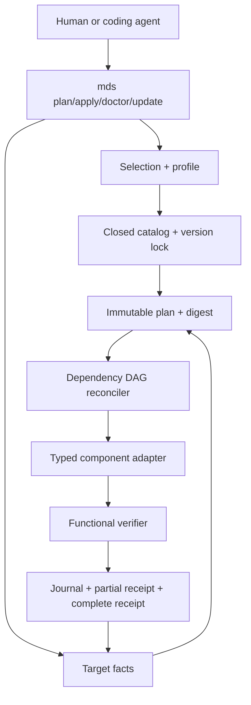
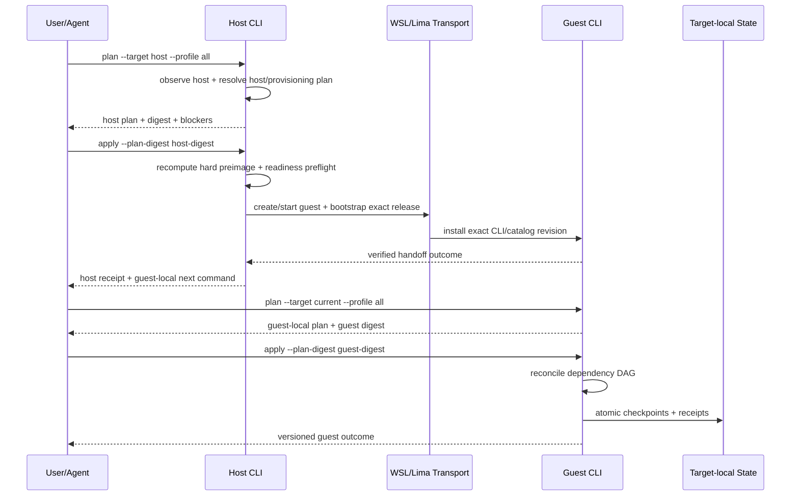
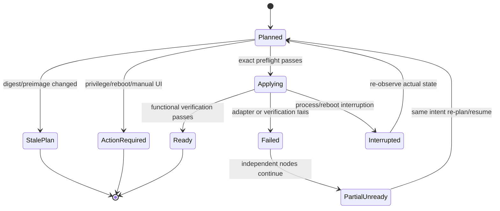

# ZZA-100 My Desk Setup 크로스플랫폼 개발 환경 부트스트랩 - Plan

> Canonical Notion:
> [ZZA-100 Plan](https://app.notion.com/p/3acef22ad4fc81a08204d8022f962bcb)
>
> 추적 티켓:
> [Linear ZZA-100](https://linear.app/zzanghyunmoo/issue/ZZA-100/my-desk-setup-%ED%81%AC%EB%A1%9C%EC%8A%A4%ED%94%8C%EB%9E%AB%ED%8F%BC-%EA%B0%9C%EB%B0%9C-%ED%99%98%EA%B2%BD-bootstrap-%EA%B5%AC%ED%98%84)
>
> 기준 요구사항:
> `[workspace] docs/brainstorms/2026-07-29-my-desk-setup-requirements.md`

## Goal Capsule

### Objective

새 macOS·Windows 머신에서 몇 개의 OS-native 명령만으로 host와 Ubuntu
Linux guest를 준비하고, 전체 또는 선택한 개발 환경을 결정적으로
계획·설치·검증·갱신할 수 있는 개인용 control plane을 만든다.

### Confirmed Planning Decisions

- 핵심 CLI는 Go 단일 바이너리로 구현한다.
- v1의 표준 guest는 Ubuntu 26.04 LTS 하나이며 WSL2와 Lima guest 생성까지
  제품이 담당한다.
- Docker Desktop은 설치하지 않고 Ubuntu guest 안의 Docker Engine과 CLI를
  사용한다.
- project checkout, build, test와 primary editor work는 Linux guest에서
  수행한다.
- 인증은 사용자가 각 도구에서 직접 수행하며 제품은 auth 명령·진단·credential
  보관을 제공하지 않는다.
- 기존 `settings` 저장소는 검증된 recovery bundle과 별도 파괴적 승인 뒤
  `my-desk-setup`으로 rename하고 orphan 이력으로 전환한다.
- recovery, local orphan baseline과 feature 구현·검토는 원격 mutation 없이
  먼저 완료한다. remote rename·force-push·branch 삭제·workspace gitlink
  이동은 검증된 최종 head와 복구 경로를 포함한 현재 turn 승인 뒤에만 실행한다.

### Delivery Gates

1. **Repository transition gate:** remote refs, root gitlink와 recovery
   bundle을 검증하고 rename·orphan·force-push·branch 정리 승인 packet을
   다시 제시한다.
2. **Planning-kernel gate:** closed catalog, target identity, deterministic
   plan digest와 no-mutation stale-plan 거부가 fake adapters에서 통과해야
   한다.
3. **Target adapter gate:** macOS host, Windows host, WSL Ubuntu와 Lima
   Ubuntu의 production artifact가 각 target에서 실제로 실행되어야 한다.
4. **Release gate:** 기능 검증, secret scan, target evidence와 root
   submodule pointer가 동일한 merged child commit을 가리켜야 한다.

---

## Product Contract

### Summary

`my-desk-setup`은 macOS·Windows host와 WSL·Lima Ubuntu guest의 목표 상태를
하나의 Environment Intent Graph에서 계산하는 개인용 환경 control plane이다.
`all`, profile, 개별 component와 interactive chooser는 같은 resolver를
사용하며 성공은 installer 종료 코드가 아니라 component별 기능 검증으로
판정한다.

계획은 기준 브레인스토밍 전체 범위를 다루되 Go 단일 바이너리, Ubuntu 26.04
LTS 단일 guest와 guest-local Docker Engine이라는 사용자 확정 결정을
적용한다. 다른 Linux 배포판, Docker Desktop, legacy Ansible 이식, auth
자동화, remove, offline bundle과 public extension marketplace는 active
scope에서 제외한다.

### Problem Frame

- 새 머신마다 설치 순서, package manager, PATH와 설정 예외를 다시 기억해야
  한다.
- host GUI와 Linux 개발 도구의 소유권이 섞이면 중복 설치와 잘못된 target
  mutation이 발생한다.
- 전체 설치와 선택 설치가 다른 경로를 쓰면 component·dependency·version·
  verification이 drift한다.
- `latest`를 apply 시점에 해석하면 같은 선언이 다른 환경을 만들고 기존 도구를
  몰래 갱신할 수 있다.
- 설치 exit code만 확인하면 실제 compile, editor startup, agent executable과
  Docker 연결 실패를 놓친다.
- 계정 인증을 설치에 결합하면 저장소가 credential 수명주기와 secret 보관
  책임을 떠안는다.

### Requirements Preservation

| Requirement | 계획에서 보존하는 계약 |
| --- | --- |
| R1–R6 | recoverable repo rename/orphan transition, 명시적 destructive approval, root submodule 이동, fresh-machine bootstrap, legacy source 제외 |
| R7–R13 | closed Environment Intent Graph, 단일 resolver, target-eligible `all`, interactive/noninteractive parity, deterministic ordering, 단일 state owner |
| R14 | host는 GUI·플랫폼 도구·host agent와 guest lifecycle/transport를 소유한다. 기존 Docker Desktop/host engine 문구는 사용자 확정에 따라 guest-local engine으로 대체한다. |
| R15–R20 | Ubuntu guest는 CLI·toolchain·Herdr·Neovim·agent·Docker Engine/CLI를 소유하고 GUI는 제외한다. Xcode/iOS는 macOS host 예외로만 표시한다. |
| R21–R27 | `plan`, `apply`, `doctor`, `update`, read-only/mutation 경계, dependency-scoped partial failure, target-local journal/receipt |
| R28–R31 | development core pin/lock, explicit latest-stable update, requested/installed/verified version 구분, unsupported truthfulness |
| R32–R36 | auth 명령·auth 진단·credential custody 금지, OS privilege와 service auth 분리 |
| R37–R40 | personal-first default, profile adaptation, functional verification, fixture와 실제 target evidence 분리 |

### Key Flows

- **F1 New-machine bootstrap:** host bootstrap → Go CLI 확보 → host
  `plan`/digest 확인 → host `apply`에서 WSL/Lima guest 생성·동일 release
  `mds` handoff → guest 안에서 별도의 guest-local `plan`/digest 확인 →
  guest-local `apply`와 기능 검증 → target별 secret-free receipt.
- **F2 All installation:** host와 guest의 `all`을 같은 graph에서 계산하고
  target별 action과 결과를 분리한다.
- **F3 Selective installation:** chooser 또는 stable args가 같은 Selection을
  만들며 dependency 외 unwanted component를 추가하지 않는다.
- **F4 Idempotent repair:** verified component는 재설치하지 않고 managed
  drift만 복구하며 user-owned state는 보존한다.
- **F5 Explicit update:** committed lock의 old/new version과 provenance,
  dependency 영향을 먼저 보여주고 확인된 digest만 적용한다.
- **F6 Doctor without auth:** executable, version, PATH, config, integration과
  bounded 기능만 검사하고 login/token 상태는 읽지 않는다.
- **F7 Repository transition:** recovery bundle과 local orphan/feature head
  검증 → approval packet → rename/orphan remote transition → branch/PR
  workflow → merged release commit 재검증 → root pointer 이동.

### Acceptance Coverage

| Acceptance example | 계획 검증 범위 |
| --- | --- |
| AE1 | macOS host + Lima guest의 target-eligible `all` golden plan과 실제 target evidence |
| AE2 | `notion-cli`만 선택할 때 Notion desktop action이 0개인 resolver test |
| AE3 | Windows host와 WSL guest action/receipt 분리 test |
| AE4 | initial catalog completeness matrix와 unsupported/action-required 명시 contract test |
| AE5 | 동일 desired state 두 번째 apply의 install action 0개와 verification refresh |
| AE6 | upstream newer release가 있어도 normal apply lock이 변하지 않는 test |
| AE7 | update old/new/diff 확인과 digest 승인 전 mutation 0 test |
| AE8 | 언어·build tool 최소 compile/run 및 Flutter/Neovim/Docker 기능 probe |
| AE9 | unauthenticated CLI/agent가 auth blocker 없이 local readiness를 통과하는 test |
| AE10 | 실패 node의 downstream만 blocked이고 독립 node가 계속되는 DAG recovery test |
| AE11 | host/guest agent state root와 receipt 분리 test |
| AE12 | bundle clone에서 old refs 복구와 승인 전 destructive command 0 검증 |
| AE13 | profile declaration 변경만으로 조합이 바뀌고 core 수정이 없는 contract test |

### Traceability Index

- Requirements: R1–R3, R6 → U1; R4 → U1/U9; R5 →
  U1/U3a/U3b/U6/U9; R7, R13, R37 → U2; R8–R11, R38 → U2/U4;
  R12 → U2/U4/U9; R14 → U3a/U6; R15–R16 → U3b/U7;
  R17–R18 → U2/U3b/U6/U7; R19 → U2/U3b/U7; R20 → U2/U3b/U6;
  R21 → U4; R22, R26 → U5; R23–R24 → U8; R25 →
  U4/U5/U8; R27 → U5/U9; R28–R29, R31 → U2/U6/U7/U8;
  R30 → U2/U4/U6/U7/U8; R32–R35 → U7/U8; R36 → U3a/U5/U6;
  R39 → U5/U7/U8/U9; R40 → U3b/U7/U9.
- Flows: F1 → U3a/U3b/U6; F2 → U3a/U3b/U4/U6/U7; F3 → U4/U7;
  F4 → U5/U7; F5–F6 → U8; F7 → U1.
- Acceptance examples: AE1 → U3a/U3b/U4/U9; AE2 → U2/U4/U7; AE3 →
  U3a/U3b/U4/U6/U9; AE4 → U2/U4/U7/U9; AE5 → U5/U9; AE6 →
  U6/U8/U9; AE7 → U8/U9; AE8 → U7/U8/U9; AE9 → U7/U8;
  AE10 → U5/U7; AE11 → U5/U6/U7/U9; AE12 → U1/U9; AE13 →
  U2/U9.

### Scope Boundaries

#### Included

- `settings` → `my-desk-setup` identity transition과 root submodule 이동
- Go CLI와 macOS shell/Windows PowerShell bootstrap
- Ubuntu 26.04 LTS WSL2/Lima guest provisioning
- host GUI/platform tools와 host AI agents
- guest CLI, language/build toolchain, Herdr, Neovim/NvChad, Docker
  Engine/CLI와 guest AI agents
- `plan`, `apply`, `doctor`, `update`, JSON output와 interactive chooser
- deterministic locks, exact plan digest, target-local recovery state와
  functional verification
- 네 target의 fixture 및 실제 evidence

#### Deferred to Follow-Up Work

- Proxmox target adapter와 Ubuntu VM/LXC provisioning
- component 제거와 `remove`
- offline cache/bundle
- Debian·Arch 등 추가 Linux 배포판
- public profile registry와 third-party adapter marketplace
- host-native toolchain/editor를 primary development environment로 운영하는 기능

#### Outside Product Identity

- account login, OAuth consent, token·cookie·password 수명주기
- secrets vault
- project별 dependency/build recipe 소유
- Proxmox, WSL, Lima, Docker 또는 Xcode 자체 재구현
- unsupported upstream artifact의 비공식 mirror 대체

---

## Planning Contract

### Target Repository and Path Notation

Primary target repository는 rename 후의 `zzanghyunmoo/my-desk-setup`이다.
아래의 일반 경로는 target repository root 기준이며, `[workspace]` 표기가 붙은
경로만 zWorkspaces root 기준이다.

### Key Technical Decisions

- **KTD1 — Go single binary:** CLI와 domain core는 Go로 구현하고 bootstrap은
  versioned release artifact와 checksum을 검증하는 POSIX shell/PowerShell만
  둔다.
- **KTD2 — One Ubuntu baseline:** v1 guest identity는 Ubuntu 26.04 LTS
  image URL·SHA-256, target kind, instance/distro name, OS version과
  architecture로 고정한다. target YAML 전체와 image identity는 canonical
  catalog revision과 plan action input에 포함한다. WSL은 checksum으로 고정한
  `.wsl` artifact를 `wsl.exe --install --from-file`로 설치하고 Lima는
  checksum으로 고정한 cloud image를 사용한다.
- **KTD3 — Two-phase guest-local authority:** host와 guest는 각각 독립된
  immutable plan과 digest를 가진다. host phase는 `wsl.exe`/`limactl`
  structured transport로 guest 생성과 같은 release의 Linux amd64/arm64
  archive URL·SHA-256을 전달해 `~/.local/bin/mds`를 owner-only·atomic하게
  준비하는 데서 끝난다. 그 뒤 사용자는 guest 안에서 두 번째 guest-local
  `plan`을 확인하고 별도 digest로 `apply`한다. 실제 Linux
  detect/apply/doctor는 검증된 같은 CLI/catalog revision을 guest 안에서
  실행하며 host가 guest filesystem을 직접 수정하지 않는다.
- **KTD4 — Closed declarative graph:** component/profile/target은 사람이
  편집 가능한 YAML로 선언하되 JSON Schema와 Go semantic validation으로
  unknown field, duplicate ID, cycle, conflict, ineligible installer와
  duplicate ownership을 fail closed한다.
- **KTD5 — Canonical digest:** sorted canonical JSON의 SHA-256에
  catalog/lock revision, stable target identity, selection, dependency
  expansion, requested/resolved version, mutation 안전성에 필요한 stable
  observed preimage, privilege/manual preflight와 ordered actions를 결합한다.
  reachability, service active 상태 같은 volatile readiness는 digest에 넣지
  않고 apply 직전 preflight에서 다시 관찰한다.
- **KTD6 — Exact preview/apply:** `plan`은 stdout/JSON에 digest를 출력할
  뿐 state를 쓰지 않는다. `apply`와 `update`는 exact digest를 요구하고 hard
  preimage를 첫 mutation 전에 재검증한다. hard mismatch는 `stale-plan`과
  mutation 0, volatile readiness 실패는 `action-required` 또는 typed
  execution failure로 구분한다.
- **KTD7 — DAG reconciliation:** action failure는 해당 node와 downstream만
  막고 독립 node는 계속한다. same-digest journal만 resume하며 다른 revision은
  actual state를 다시 관찰한다.
- **KTD8 — Three state layers:** target별 execution journal,
  last-complete desired-state receipt와 current partial action receipt를
  분리한다. state file은 secret-free, owner-only permission, bounded read와
  file sync → atomic rename → parent directory sync를 사용한다. evidence와
  release promotion directory도 같은 durable publication 경계를 사용한다.
  persisted diagnostic은 credential-shaped 값을 redact하고 reason code와
  bounded stdout/stderr만 보존한다.
- **KTD9 — Package ownership:** host OS package는 Homebrew/WinGet adapter,
  Ubuntu base는 apt adapter, development toolchain은 strict
  `catalog/mise.toml`과 official `catalog/mise.lock`의 exact
  platform별 URL·SHA-256 entry, vendor CLI/agent는 reviewed release adapter가
  소유한다. eligible platform에 artifact가 없으면 구체적 reason을 가진
  `action-required`/`unsupported`로 닫고, Homebrew Bundle과 moving install
  script를 canonical lock으로 사용하지 않는다. checkout의 CRLF 또는 단독 CR은
  loader에서 LF로 정규화하고, 그 LF-normalized exact content 및
  `versions.lock.yaml`과의 cross-lock 일치도를 catalog revision에 포함한다.
- **KTD10 — Guest-local containers:** WSL/Lima Ubuntu에 Docker Engine과
  CLI를 설치하며 Docker Desktop과 host Docker engine은 v1 catalog에서
  제외한다.
- **KTD11 — Capability/provider split:** Jira와 Confluence CLI capability는
  하나의 Atlassian `acli` physical component가 제공한다. Notion CLI는 공식
  `ntn`, Linear CLI는 pinned `schpet/linear-cli`, GitHub/GitLab은
  `gh`/`glab` adapter가 소유한다.
- **KTD12 — Managed/external/conflict:** exact version과 기능 검증을 통과한
  existing executable은 `external` 만족 상태로 인정할 수 있지만 receipt 없는
  config는 user-owned로 보고 overwrite하지 않는다.
- **KTD13 — Explicit update:** normal apply는 latest metadata를 조회하지
  않는다. `update`는 writable repository checkout의 명시적 `--catalog`
  경로에서만 candidate를 exact version/provenance와 lock diff로 만든다.
  embedded catalog는 read-only다. old/new lock, candidate target, lock
  publication을 journaled transaction intent로 묶어 중단 뒤 재실행이
  실제 state를 관찰하고 안전하게 완료 또는 action-required로 수렴하게 하며
  Git commit은 사용자 소유다. v1에서 세 mise lock/config 파일을 하나의
  transaction으로 게시하지 못하므로 mise-managed component update는 mutation
  전에 거부한다.
- **KTD14 — No auth surface:** auth/login command, token probe,
  organization access check와 credential-shaped schema field를 금지한다.
- **KTD15 — Stable automation contract:** interactive chooser와 flags는
  같은 Selection을 만들고 `plan`, `apply`, `doctor`, `update`, `catalog`,
  `version`은 versioned closed JSON envelope, stable status와 exit code를
  제공한다. `catalog --format json`은 agent가 지원 component와 capability를
  인증 없이 발견하는 canonical surface이고 기존 `version` 출력은
  backward-compatible하게 유지한다.
- **KTD16 — Recoverable identity transition:** orphan rewrite는 일반 feature
  PR과 분리된 one-time admin operation이며 verified bundle과 현재 turn의 별도
  승인 없이는 실행하지 않는다.
- **KTD17 — Reviewed trust roots:** checksum은 전송 무결성만 증명한다.
  artifact 신뢰는 reviewed Git commit, canonical lock/catalog와 공식
  publisher HTTPS/provenance에 묶는다. upstream이 signature/attestation을
  제공하면 검증하고, 제공하지 않으면 exact URL·digest 변경을 별도 review
  대상으로 남긴다. catalog-managed metadata/vendor URL은 userinfo·query·
  fragment 없는 HTTPS만 허용하고 redirect, timeout·size 초과와 unredacted
  URL error를 거부한다. exact SHA-256에 고정된 GitHub Release/bootstrap
  asset만 최대 3회의 credential-free HTTPS redirect를 허용한다. CI Action은
  full commit SHA로 pin하고 actual-target runner는
  `github.sha`의 protected non-fork ref만 실행하며 허용된 target/label pair,
  전용 credential-free OS account와 protected environment로 제한한다.

### High-Level Technical Design







### Target Identity and Outcomes

| Target | Stable identity fields | v1 provisioning |
| --- | --- | --- |
| macOS host | `darwin`, OS version, `arm64`/`amd64`, machine-local target ID | existing host |
| Windows host | `windows`, build, `amd64`/`arm64`, machine-local target ID | existing host |
| WSL guest | `wsl:<distro>`, WSL2, Ubuntu 26.04, arch, image/catalog revision | install WSL2 + pinned Ubuntu distro; reboot/first-user may be action-required |
| Lima guest | `lima:<instance>`, Lima version, Ubuntu 26.04 image digest, arch | create/start named pinned instance |

Component outcome은 `ready`, `external`, `unsupported`, `action-required`,
`conflict`, `failed`, `blocked`, `interrupted`, `unverifiable`로 닫고
dependency 원인은 별도 `blocked_by`와 reason code로 표현한다. target-local
aggregate는 `ready`, `partial-unready`, `stale-plan`, `cancelled` 중 하나로
계산하며 host와 guest 결과를 하나의 승인 digest로 합치지 않는다.

### Initial Component Ownership

| Surface | Components | Owner/adapter |
| --- | --- | --- |
| macOS host | WezTerm, Slack, KakaoTalk, Notion, Linear, Chrome, Lima, Claude Code, OpenCode, Codex | Homebrew formula/cask 또는 reviewed vendor release |
| Windows host | WezTerm, Slack, KakaoTalk, Notion, Linear, Chrome, WSL2, Claude Code, OpenCode, Codex | WinGet 또는 reviewed vendor release |
| macOS exception | Xcode/iOS toolchain | installed/external 또는 explicit manual action; guest 지원 금지 |
| Ubuntu base | Git, curl, CA certificates, archive tools, build-essential/C toolchain, pkg-config, bubblewrap | apt |
| Guest runtimes | Java, Kotlin, Go, Python, TypeScript, Dart/Flutter | mise + committed bootstrap lock; project-local selection은 mise와 각 project의 책임이며 mds state에서 제외 |
| Guest build | Gradle, uv, Bun | mise + committed lock |
| Guest terminal/editor | Herdr, Neovim, NvChad-derived managed config | reviewed release + managed templates |
| Guest agents | Claude Code, OpenCode, Codex | reviewed vendor release, normal apply auto-update disabled |
| Guest collaboration | Atlassian `acli`, Notion `ntn`, `schpet/linear-cli`, `gh`, `glab` | reviewed release/mise backend |
| Guest containers | Docker Engine, CLI, Compose plugin | Docker Ubuntu repository adapter |

### Agent-Native Operation

- 모든 human flow는 `--json`, stable target/component IDs와 noninteractive
  selection으로 agent도 수행할 수 있다.
- chooser는 UI 전용 상태를 만들지 않고 Selection 객체만 생성한다.
- apply/update는 명시적 digest와 privilege boundary를 요구하며 agent가 auth나
  destructive repository transition을 우회할 수 없다.
- doctor JSON은 component별 requested/installed/verified version, target,
  reason code와 recovery hint를 제공한다.
- `catalog --format json`과 `version --format json`은 설치 전 인증 없이 agent가
  capability와 CLI/catalog revision을 발견하는 stable machine-readable
  surface를 제공한다.

### Output Structure

```text
.
├── bootstrap/
│   ├── macos.sh
│   └── windows.ps1
├── cmd/mds/main.go
├── internal/
│   ├── adapters/{host,guest,managedfile,packages}/
│   ├── catalog/
│   ├── cli/
│   ├── doctor/
│   ├── execution/
│   ├── guest/
│   ├── output/
│   ├── planning/
│   ├── state/
│   ├── target/
│   ├── transport/
│   ├── ui/
│   ├── update/
│   └── version/
├── catalog/
│   ├── components/
│   ├── locks/
│   ├── mise.toml
│   ├── mise.lock
│   ├── profiles/
│   ├── schema/
│   └── targets/
├── templates/{herdr,nvim,shell}/
├── tests/
│   ├── adapters/
│   ├── contracts/
│   ├── fixtures/
│   ├── golden/
│   ├── integration/
│   └── target-evidence/
├── docs/{architecture,components,operations}/
└── .github/workflows/{ci,release,target-certification}.yml
```

### Phased Delivery

1. **Local recovery and baseline:** 원격을 변경하지 않고 verified recovery,
   local orphan baseline과 격리 feature branch를 준비한다.
2. **Planning kernel:** catalog, target identity, deterministic plan, exact
   digest와 fake-adapter apply/recovery.
3. **Production adapters:** host provisioning, Ubuntu guest creation, host/guest
   component catalog.
4. **Review and certification:** doctor, update, release artifacts, code/doc
   review와 네 target의 필수 실제 evidence를 최종 review head에 묶는다.
5. **Approval-gated remote cutover:** 현재 turn의 파괴적 승인 뒤 remote
   rename/orphan/branch 정리, child PR과 merge 후 release commit 재검증,
   workspace pointer finalization을 순서대로 수행한다.

---

## Implementation Units

### U1. Recoverable repository identity transition and Go baseline

**Goal:** 기존 `settings` 원격과 workspace gitlink를 복구 가능하게
`my-desk-setup` identity로 전환하고 정상 branch/PR 개발을 시작할 최소 Go
baseline을 만든다.

**Requirements:** R1–R6, R40, F7, AE12

**Dependencies:** 없음. 실제 mutation 전 별도 destructive approval 필수.

**Files:** `README.md`, `LICENSE`, `AGENTS.md`, `go.mod`, `go.sum`,
`cmd/mds/main.go`, `internal/version/version.go`, `.github/workflows/ci.yml`,
`tests/integration/repository_transition_test.go`, `[workspace] .gitmodules`,
`[workspace] projects/settings`, `[workspace] projects/my-desk-setup`

**Approach:** current root gitlink, remote default tip, 모든 remote branch/tag를
포함한 bundle을 만들고 별도 clone에서 object와 refs를 검증한다. 원격 mutation
없이 local orphan baseline과 non-main feature branch 구현·검토·release
evidence까지 준비한다. approval packet에는 검증된 exact head, repo/branch/refs,
rename, orphan default, force-push/branch cleanup, bundle path와 restore 명령을
포함한다. 승인 뒤에만 remote identity를 전환하고 이후 source change는
non-main branch/PR로 진행한다.

**Patterns to follow:** workspace standalone-project/submodule 지식 문서와
project main guard. Legacy Ansible source는 bundle에만 남고 새 tree에는
복사하지 않는다.

**Test scenarios:**

- Covers AE12. bundle clone에서 기존 default와 current gitlink tip을 모두 읽을
  수 있다.
- 승인 전 mutation command가 실행되지 않고 dry approval packet만 생성된다.
- clean root clone에서 새 path/URL/submodule init이 성공하고 old path가 없다.
- 새 project main 보호 hook이 direct commit/push를 거부한다.

**Verification:** remote rename/orphan 이후에도 bundle restore가 가능하고,
target repo의 첫 feature work가 ticket branch/PR로 시작되며 root에는 gitlink
metadata만 남는다.

### U2. Closed Environment Intent Graph, profiles and version lock

**Goal:** component, target eligibility, dependency, physical owner, version
policy와 verification을 하나의 닫힌 선언 계약으로 만든다.

**Requirements:** R7–R13, R17–R20, R28–R31, R37–R38, AE2, AE4, AE13

**Dependencies:** U1

**Files:** `catalog/schema/environment.schema.json`,
`catalog/schema/lock.schema.json`, `catalog/components/`,
`catalog/profiles/owner.yaml`, `catalog/profiles/minimal.yaml`,
`catalog/locks/versions.lock.yaml`, `catalog/mise.toml`, `catalog/mise.lock`,
`internal/catalog/types.go`, `internal/catalog/load.go`,
`internal/catalog/validate.go`, `internal/catalog/canonical.go`,
`tests/contracts/catalog_test.go`, `tests/fixtures/catalog/`

**Approach:** YAML을 strict schema로 읽어 Go domain type으로 변환한 뒤 semantic
validation과 canonical JSON digest를 수행한다. physical component와 제공
capability를 분리해 Atlassian `acli` 같은 단일 executable의 중복 ownership을
막는다. profile은 selection만 선언하고 명령이나 auth 데이터를 담지 않는다.
`all`은 사람이 관리하는 profile 파일이 아니라 target-eligible catalog
component의 합집합으로 resolver가 계산한다. mise config/lock은 strict mode로
로드하고 각 eligible architecture는 exact artifact URL·SHA-256 또는 구체적인
unavailable reason 중 정확히 하나를 가져야 한다. checkout line ending을 LF로
정규화한 config/lock exact content는 catalog revision에 포함하고
`versions.lock.yaml`과 tool/version/platform identity를 다시 대조한다.

**Test scenarios:**

- unknown field/ID/reference, duplicate owner, cycle, target-installer mismatch와
  credential-like field/value를 거부한다.
- Covers AE2. `notion-cli` selection이 Notion desktop을 resolve하지 않는다.
- Covers AE4. 모든 initial target/component cell이 supported, unsupported 또는
  action-required를 명시한다.
- mise lock의 platform artifact URL·SHA-256 누락, credential 포함 URL,
  ambiguous availability와 schema 밖 field를 거부한다.
- Covers AE13. 새 profile 조합이 core code 수정 없이 plan input으로 읽힌다.

**Verification:** schema와 semantic validation을 통과한 catalog만 revision을
만들며 동일 입력의 canonical digest가 platform과 map iteration에 관계없이 같다.

### U3a. Target discovery and transport

**Goal:** macOS/Windows/WSL/Lima target을 안전하게 식별하고 mutation 없는
discovery·identity·bounded transport 계약을 planner에 제공한다.

**Requirements:** R5, R14, R36, F1–F2, AE1, AE3

**Dependencies:** U2

**Files:** `catalog/targets/ubuntu-26.04.yaml`,
`internal/target/facts.go`, `internal/target/identity.go`,
`internal/target/discover.go`, `internal/transport/port.go`,
`internal/transport/local.go`, `internal/transport/wsl.go`,
`internal/transport/lima.go`, `tests/unit/target_identity_test.go`,
`tests/fixtures/targets/`

**Approach:** target ID에 host/guest kind, distro/instance, OS/image revision과
architecture 같은 stable identity를 포함하고 read-only discovery와 transport만
U4에 제공한다. reachability, guest 실행 상태와 systemd active 같은 volatile
readiness는 digest preimage와 분리해 apply 직전 다시 확인한다. 복수
distro/instance는 명시 선택을 요구한다. host transport는 동적 shell command
조립 없이 executable+argv 또는 고정된 reviewed shell snippet과 별도
argv/stdin으로 `wsl.exe`/`limactl`을 호출하고 timeout/output limit을
적용한다.

**Test scenarios:**

- 한 target은 자동 선택하고 복수 target은 explicit ID 없이는 mutation을
  거부한다.
- unreachable guest를 stable identity mismatch로 오분류하지 않고 volatile
  readiness/action-required로 보고한다.
- host와 guest의 stable target facts가 서로 섞이지 않는다.
- transport가 timeout/output cap을 지키고 credential-shaped diagnostics를
  redact한다.
- Covers AE1/AE3. macOS/Windows host와 Lima/WSL guest를 closed target kind로
  분류한다.

**Verification:** WSL과 Lima에서 동일한 Ubuntu stable identity 계약이
성립하고 planner가 discovery 결과를 mutation 없이 소비한다.

### U4. Unified selection, deterministic planner and CLI/TUI contract

**Goal:** `all`, profile, component, interactive chooser가 하나의 Selection과
planner를 통해 read-only plan과 stable JSON을 생성하게 한다.

**Requirements:** R8–R12, R21, R25, R30, R38, F2–F3, AE1–AE4

**Dependencies:** U2, U3a

**Files:** `internal/cli/root.go`, `internal/cli/arguments.go`,
`internal/cli/commands.go`, `internal/ui/chooser.go`,
`internal/planning/selection.go`, `internal/planning/resolver.go`,
`internal/planning/actions.go`, `internal/planning/digest.go`,
`internal/output/human.go`, `internal/output/json.go`,
`tests/unit/selection_test.go`, `tests/unit/resolver_test.go`,
`tests/unit/digest_test.go`, `tests/golden/plans/`

**Approach:** Cobra command surface는 `plan`, `apply`, `doctor`, `update`,
`catalog`, `version`을 공개하고 Bubble Tea chooser는 Selection 생성에만
사용한다. planner는 eligibility → dependency expansion → conflict/ownership
check → observation → ordered actions 순서로 immutable plan을 만든다. human과
JSON renderer는 같은 application result를 소비하며 `catalog --format json`과
`version --format json`은 기존 version 사용법을 깨지 않는 stable discovery
surface를 제공한다.

**Test scenarios:**

- all/profile/interactive/explicit components가 동등한 selection에 동일
  plan/digest를 만든다.
- guest all에 GUI action이 없고 host all에 guest toolchain action이 없다.
- unknown/duplicate component, invalid alias와 noninteractive ambiguity를 fail
  closed한다.
- `plan` 전후 state directory와 target preimage가 byte-identical하다.

**Verification:** 같은 inputs는 byte-deterministic JSON plan을 만들고 UI
유무가 resolver 결과를 바꾸지 않는다.

### U5. Exact apply, dependency-scoped recovery and target-local state

**Goal:** 사용자가 확인한 digest만 적용하고 부분 실패·중단 뒤 안전하게 수렴하는
실행 엔진을 만든다.

**Requirements:** R22, R25–R27, R36, R39, F4, AE5, AE10–AE11

**Dependencies:** U4

**Files:** `internal/execution/executor.go`, `internal/execution/dag.go`,
`internal/execution/preflight.go`, `internal/execution/runner.go`,
`internal/state/paths.go`, `internal/state/lock.go`,
`internal/state/journal.go`, `internal/state/receipt.go`,
`internal/state/ownership.go`, `internal/adapters/component.go`,
`tests/integration/apply_recovery_test.go`,
`tests/integration/stale_plan_test.go`,
`tests/integration/state_isolation_test.go`, `tests/fixtures/execution/`

**Approach:** digest/catalog/lock/stable target/hard preimage를 첫 write 전에
다시 계산하고 single-writer lock을 획득한다. reachability, systemd active 같은
volatile readiness는 mutation 직전 별도 preflight로 확인하며 failure를
`stale-plan`과 구분한다. 각 action 직전 preimage, 직후 functional verification과
journal checkpoint를 수행한다. privileged command는 noninteractive
apt/install/systemctl의 reviewed executable+argv allowlist만 허용하고 arbitrary
shell/service mutation은 거부한다. OS package transaction rollback을 약속하지
않고 action별 truth와 redacted bounded diagnostics/reason code를 남긴다.

**Test scenarios:**

- changed preimage/stale digest는 mutation 0으로 종료된다.
- Covers AE10. failure node downstream만 blocked이고 독립 node는 계속 ready가
  된다.
- crash가 package success와 journal write 사이에 발생해도 재관찰 후
  no-op/verify로 수렴한다.
- Covers AE5. 두 번째 apply에서 verified component install action은 0개다.
- host/guest state roots, locks와 receipts가 섞이지 않는다.
- symlink, non-regular state file와 filesystem root target을 거부한다.

**Verification:** partial execution이 complete receipt로 위장되지 않고
same-digest resume와 new-plan re-observation 모두 user-owned state를 보존한다.

### U3b. Ubuntu guest provisioning and verified handoff

**Goal:** host plan/apply로 Ubuntu 26.04 LTS guest와 동일 release의 guest-local
CLI를 준비한 뒤, 별도 guest-local plan/apply로 안전하게 handoff한다.

**Requirements:** R5, R15–R20, R40, F1–F2, AE1, AE3

**Dependencies:** U4, U5

**Files:** `catalog/targets/ubuntu-26.04.yaml`,
`internal/adapters/host/guest_runtime.go`, `internal/guest/provision.go`,
`internal/guest/ownership.go`, `bootstrap/macos.sh`,
`bootstrap/windows.ps1`, `tests/integration/guest_handoff_test.go`,
`tests/integration/host_bootstrap_test.go`

**Approach:** host immutable plan에는 WSL/Lima guest 생성·시작과 exact
image/release artifact identity만 포함한다. Lima는 architecture별 pinned
image URL·SHA-256을 stdin template로 전달하고 WSL은 pinned image artifact를
사용한다. 제품 receipt로 소유된 instance/distro만 mutate하며 같은 이름의
pre-existing unowned guest는 `conflict`/`action-required`로 중단한다. host는
provider 생성 전 `preparing` ownership intent를 기록하고 생성·시작과 image
marker 준비가 끝난 뒤에만 `committed`로 전환한다. transaction별 무작위
creation nonce를 host intent와 root-owned marker에 함께 기록하고, live
guest의 nonce가 committed record와 다르면 같은 이름의 replacement guest로
보고 자동 start/bootstrap을 거부한다. stopped 기존 guest는 marker를 mutation
없이 확인할 수 없으므로 사용자가 먼저 시작한 뒤 재검증한다. live guest와
`preparing` intent가 함께 발견되어도 자동 채택하지 않고 conflict로 중단한다.
host는
같은 release의 Linux binary와 catalog revision을 checksum 검증 후 guest에
owner-only·atomic 설치하고 verified handoff receipt와 guest-local 다음 명령을
출력한다. guest toolchain 설치는 host digest에 포함하지 않으며 사용자가 guest
안에서 새 plan과 digest를 확인한 뒤 실행한다. reboot, 최초 Linux user와
non-TTY privilege prompt는 action-required로 중단한다.

**Test scenarios:**

- host plan/apply가 guest 생성과 CLI handoff까지만 포함하고 guest component
  install action은 포함하지 않는다.
- pre-existing same-name unowned WSL/Lima guest를 overwrite하거나 재구성하지
  않는다.
- Lima architecture별 image URL/SHA-256과 handoff CLI/catalog revision이
  exact plan input과 receipt에 일치한다.
- systemd unavailable/inactive guest가 Docker 단계 전 guest-local preflight에서
  action-required를 보고한다.
- Covers AE1/AE3. host receipt와 이후 guest-local plan/receipt가 독립 digest와
  state root를 가진다.

**Verification:** WSL/Lima guest가 제품 소유권과 exact image/release
provenance를 가진 상태로 준비된다. 생성 시 root-owned
`/etc/mds/image-identity-v1`에 image URL·SHA-256과 creation nonce를 provision하고
일반 handoff와 certifier는 이 관측값을 embedded catalog 및 host ownership
record에서 보호 입력으로 전달한 nonce와 대조한다. catalog 값만으로 actual
image identity를 합성하지 않으며
host process는 guest-owned toolchain/config를 직접 변경하지 않는다.

### U6. Host bootstrap and component adapters

**Goal:** macOS와 Windows host에서 GUI, platform tool, guest runtime과 host
agents를 no-hidden-upgrade 정책으로 관리한다.

**Requirements:** R5, R14, R17–R18, R20, R28–R31, R36, F1–F2, AE3,
AE6, AE11

**Dependencies:** U3b, U5

**Files:** `internal/adapters/packages/homebrew.go`,
`internal/adapters/packages/winget.go`,
`internal/adapters/host/wezterm.go`,
`internal/adapters/host/desktop_apps.go`,
`internal/adapters/host/guest_runtime.go`,
`internal/adapters/host/agents.go`, `internal/adapters/host/xcode.go`,
`catalog/components/host/`, `tests/adapters/homebrew_test.go`,
`tests/adapters/winget_test.go`, `tests/adapters/host_components_test.go`,
`tests/integration/host_bootstrap_test.go`

**Approach:** normal apply는 committed resolved version만 소비한다. Homebrew는
auto metadata/update와 implicit upgrade를 억제하고 WinGet은 exact package
ID/version과 current state를 확인한다. GUI/Store/admin/reboot가 필요한 단계는
action-required로 드러낸다. macOS에 Homebrew가 없으면 moving installer를
자동 실행하지 않고 명시적인 prerequisite `action-required`를 반환한다.
Xcode는 external/manual component이며 Linux 지원으로 승격하지 않는다.

**Test scenarios:**

- package managers에 shell-free exact argv가 전달된다.
- Covers AE6. newer upstream이 있어도 normal apply가 installed version을
  변경하지 않는다.
- GUI Store login과 service auth command가 실행되지 않는다.
- host agents가 host target에만 설치되고 guest state를 사용하지 않는다.
- unsupported package/architecture는 success로 정규화되지 않는다.

**Verification:** macOS/Windows host golden plan과 fake adapter tests가 동일
ownership/status 계약을 따르고 production bootstrap이 checksum-verified
CLI까지 도달한다.

### U7. Ubuntu guest toolchain, editor, CLI, agents and Docker

**Goal:** Ubuntu guest에 초기 catalog 전체를 설치·구성·기능 검증하고 config
ownership을 안전하게 관리한다.

**Requirements:** R15–R19, R28–R35, R39–R40, F2–F4, AE2, AE4,
AE8–AE11

**Dependencies:** U3b, U5

**Files:** `internal/adapters/packages/apt.go`,
`internal/adapters/packages/mise.go`,
`internal/adapters/packages/vendor.go`,
`internal/adapters/guest/toolchains.go`,
`internal/adapters/guest/editor.go`,
`internal/adapters/guest/terminal.go`,
`internal/adapters/guest/agents.go`,
`internal/adapters/guest/collaboration.go`,
`internal/adapters/guest/docker.go`, `catalog/components/guest/`,
`catalog/locks/versions.lock.yaml`, `catalog/mise.toml`, `catalog/mise.lock`,
`templates/herdr/`, `templates/nvim/`, `templates/shell/`,
`tests/adapters/guest_components_test.go`,
`tests/integration/guest_all_test.go`, `tests/fixtures/home/`

**Approach:** apt는 Ubuntu system prerequisites와 Docker repository를,
strict official mise config/lock은 language/build version과 platform별 exact
artifact bytes를 소유한다. eligible architecture에는 exact URL·SHA-256 또는
구체적 unavailable reason이 있어야 하며 Flutter Linux arm64처럼 공식 artifact가
없는 cell은 성공으로 위장하지 않고 `action-required`로 남긴다. privileged
apt/install/systemctl 호출은 reviewed argv allowlist로 제한한다. NvChad-derived
config는 reviewed commit을 pin하고 pre-existing `~/.config/nvim`을 overwrite하지
않는다. Claude Code/OpenCode/Codex auto-update는 normal apply에서 비활성화하고
update만 움직인다. CLI와 agent verification은 login 없이 `--version`, help
또는 local bounded smoke만 실행한다. Docker는 systemd-active guest에서
guest-local daemon/socket만 소유하고 Docker Desktop 연동은 탐지 시 conflict로
처리한다.

**Test scenarios:**

- Covers AE8. Java/Kotlin/Go/Python/TypeScript/C/Dart 최소 compile/run과
  Gradle/uv/Bun/Flutter probe가 성공한다.
- Neovim headless startup, expected config/LSP declaration과 Herdr local
  startup을 검증한다.
- Docker daemon/CLI/Compose가 guest-local socket에서 smoke container를
  실행한다.
- Covers AE9. unauthenticated collaboration CLI/agent가 auth blocker를
  만들지 않는다.
- existing nvim config는 conflict/action-required이며 force overwrite하지
  않는다.
- Covers AE11. host와 guest agent binaries/receipts가 분리된다.
- platform별 mise artifact identity가 lock과 실제 install plan에서 일치하고
  unavailable cell은 구체적 reason으로 action-required가 된다.

**Verification:** WSL/Lima Ubuntu의 guest all이 동일 capability set을 ready로
만들거나 component별 honest unsupported/action-required를 남긴다.

### U8. Doctor and explicit update lifecycle

**Goal:** local readiness를 auth 없이 진단하고 reviewable lock diff를 통한
명시적 version movement를 구현한다.

**Requirements:** R23–R25, R28–R35, R39, F5–F6, AE6–AE9

**Dependencies:** U5–U7

**Files:** `internal/doctor/model.go`, `internal/doctor/checks.go`,
`internal/doctor/report.go`, `internal/update/candidate.go`,
`internal/update/lockdiff.go`, `internal/update/apply.go`,
`internal/cli/doctor.go`, `internal/cli/update.go`,
`tests/unit/doctor_test.go`, `tests/unit/update_test.go`,
`tests/integration/update_recovery_test.go`, `tests/golden/doctor/`

**Approach:** doctor는 current target을 기본으로 하고 multi-target은 명시
선택한다. 모든 probe는 timeout, noninteractive, no-auth와 bounded output을
선언한다. update는 latest-stable metadata를 조회해 exact version/checksum/
provenance와 lock preimage를 계획에 포함하되 writable repository checkout의
명시적 `--catalog`에서만 동작하고 embedded catalog update는 거부한다.
dirty/conflicting lock을 mutation 전에 거부한다. old lock 보존 → candidate
target apply → verified new lock publication의 transaction intent를 journal로
남기며 중단 뒤 재실행은 old/new lock과 actual target state를 관찰해 완료 또는
구체적 recovery action으로 수렴한다. candidate plan과 apply는 선택 component가 지원되는 모든
macOS/Windows/WSL/Lima × amd64/arm64 cell의 compatibility matrix를 계산하며,
vendor artifact는 eligible cell 하나라도 누락되면 lock publication을 거부한다.
metadata와 npm artifact fetch는 userinfo·query·fragment 없는 absolute HTTPS,
redirect 거부, timeout·body size cap과 redacted typed failure를 적용한다.
exact SHA-256에 고정된 vendor GitHub Release artifact만 credential-free HTTPS
redirect를 최대 3회 허용하고 final URL·body cap·checksum을 다시 검증한다.
mise-managed component는 3-file atomic transaction이 구현되기 전까지 update를
fail closed한다.

**Test scenarios:**

- Covers AE9. login/token/org access를 조회하지 않고 executable/config/
  integration만 보고한다.
- no-update, rate limit/DNS failure와 unsupported candidate가 lock/state를
  변경하지 않는다.
- Covers AE7. old/new/dependency diff와 exact digest 확인 후에만 lock/target이
  움직인다.
- update failure가 previous complete receipt를 보존하고 partial outcome을
  별도로 남긴다.
- target mutation 뒤 lock publication 직전 process crash를 주입하고 같은
  command 재실행이 duplicate mutation 없이 transaction을 완료하거나 명시적
  action-required로 수렴한다.
- invalid/stale/unreachable/internal update failure가 stable typed reason code와
  redacted bounded diagnostic을 제공한다.
- doctor JSON/human output이 같은 reason/status/version을 표현한다.

**Verification:** normal apply와 update의 version movement 경계가 test로
고정되고 doctor가 auth 없이 actionable local diagnosis를 제공한다.

### U9. Release artifacts, real-target certification and workspace finalization

**Goal:** production binary와 bootstrap을 release하고 네 target의 실제
evidence를 확보한 뒤 workspace submodule을 merged child commit으로 최종화한다.

**Requirements:** R4–R5, R12, R27, R39–R40, AE1, AE3–AE8, AE11–AE13

**Dependencies:** U1–U8

**Files:** `.github/workflows/release.yml`,
`.github/workflows/target-certification.yml`,
`scripts/build-release.sh`, `scripts/verify-release.sh`,
`scripts/certify-target.sh`, `tests/target-evidence/README.md`,
`docs/architecture/environment-control-plane.md`,
`docs/components/catalog.md`, `docs/operations/bootstrap.md`,
`docs/operations/recovery.md`, `docs/operations/update.md`,
`docs/operations/target-certification-runner.md`,
`[workspace] docs/works/2026-07-29-ZZA-100-my-desk-setup-work.md`,
`[workspace] .gitmodules`, `[workspace] projects/my-desk-setup`

**Approach:** darwin/windows/linux release artifacts와 checksums를 생성하고
bootstrap이 emitted artifact를 실제 실행한다. deterministic CI는
unit/contract/fake-adapter/artifact smoke를 수행하고 WSL/Lima nested
virtualization을 가장하지 않는다. workflow dependency는 full commit SHA로
pin하고 actual-target job은 허용된 target/runner label pair와 전용
credential-free account/protected environment에서 protected non-fork
`github.sha`만 checkout credentials 없이 검증한다. evidence는 runner temp의
clean workspace에서 생성하며 expected commit을 사용자 입력으로 받지 않는다.
target별 전용 runner의 OS 계정·work directory·exact label과 protected
environment를 준비하고, guest runner service는 host committed ownership
record의 provider/name/image/nonce를 live marker와 대조한 뒤 root-owned
service 환경에 고정한다. guest 재생성 시 service를 중지하고 nonce를 rotation한다.
실제
macOS/Windows/WSL/Lima에서 secret-free certification bundle을 수집해 target
fingerprint, catalog/plan digest, component outcomes와 verification만 보관한다.
certifier는 independently observed host/guest runtime identity를 production
binary에 전달하고 read-only plan의 exact digest를 실제 apply한다. 첫 receipt가
complete이면 같은 apply를 반복해 모든 action이 no-op인지 확인한 뒤 doctor를
실행한다. first/repeat receipt는 bundle manifest에 내장하고 reviewed action과
다시 대조한다.

PR 최신 head와 review marker가 묶인 커밋을 `review_commit`이라 한다. merge
결과가 다른 SHA이면 그것을 `release_commit`으로 정의하고 release artifact,
identity verification과 필수 target certification을 `release_commit`에서
다시 생성한다. publication과 root gitlink는 `review_commit`이 아니라 검증된
`release_commit`만 가리킨다.

**Test scenarios:**

- release archive의 binary가 clean environment에서 `plan --json`을 실행한다.
- 네 target evidence가 fixture와 구분되고 stale catalog/CLI revision을
  거부한다.
- actual target certification이 first apply complete, repeat apply all-no-op,
  target-native runtime identity와 doctor readiness를 모두 재검증한다. WSL/Lima
  guest는 dispatcher가 설정할 수 없는 target별 runner service의 root-owned
  환경에서 host committed ownership nonce를 받아 live root-owned marker와
  대조하고 target fingerprint와 plan digest에 결속한다.
- self-hosted certification이 `github.sha` 이외 commit, fork/unprotected ref,
  dirty workspace와 checkout credential persistence를 거부한다.
- secret scan이 auth file, token, cookie, 개인 absolute path를 발견하면
  publication을 막는다.
- child PR merge 뒤 root pointer가 merged closeout commit을 가리키고 clean
  clone/submodule init이 성공한다.

**Verification:** production artifact, docs, target evidence,
Notion/Linear/work evidence와 root gitlink가 같은 release/commit identity를
가리킨다.

---

## Verification Contract

### Deterministic CI

- `go test ./...`로 domain, schema, planner, DAG, state와 adapters를
  검증한다.
- OS별 GitHub runner에서 release binary와 bootstrap artifact smoke를 실행한다.
- network/package manager는 fake runner와 immutable fixtures로 검증하며 일반
  CI가 실제 workstation을 변경하지 않는다.
- golden plans는 catalog/lock revision과 target facts가 같을 때
  byte-identical이어야 한다.

### Real Target Certification

| Target | 필수 실제 증빙 |
| --- | --- |
| macOS host | bootstrap, host all plan/apply/doctor, Lima creation/handoff, repeat apply |
| Windows host | bootstrap, host all plan/apply/doctor, WSL2 Ubuntu creation/handoff, reboot resume |
| Lima Ubuntu | guest all, toolchain compile/run, Neovim/Herdr, agents/CLI no-auth readiness, Docker smoke |
| WSL Ubuntu | guest all, toolchain compile/run, Neovim/Herdr, agents/CLI no-auth readiness, Docker smoke |

Evidence는 `implemented`, `blocked`, `verified`를 구분한다. fixture pass만으로
실제 target을 verified로 올리지 않으며 blocked target을 전체 성공으로
정규화하지 않는다.

### Safety Invariants

- `plan`과 `doctor`는 target와 repository를 변경하지 않는다.
- hard stale digest/preimage는 첫 mutation 전에 실패하고 volatile readiness
  실패는 stale로 위장하지 않는다.
- external/user-owned config는 명시적 ownership 전환 없이 덮어쓰지 않는다.
- 제품 receipt가 소유하지 않았거나 root-owned marker의 creation nonce가
  committed receipt와 다른 same-name WSL/Lima guest는 변경하지 않는다.
  stopped existing guest는 mds가 자동 시작하지 않는다.
- WSL first-run은 기본 UID가 non-root이고 passwd home이 `/root`가 아니며
  현재 `$HOME`과 일치할 때만 완료로 본다. 그 전에는 guest-local bootstrap을
  실행하지 않는다.
- command runner는 동적으로 조립한 shell command string을 사용하지 않는다.
  필요한 shell 동작은 고정된 reviewed snippet과 별도 argv/bounded stdin으로
  제한하고, 모든 실행은 bounded output와 credential-free allowlist
  environment를 사용한다. Windows는 Job Object로 command tree를 격리한다.
  Unix는 원래 process group과 아직 식별 가능한 descendant를 종료하지만
  double-fork로 reparent된 daemon이나 WSL/Lima transport 밖의 guest process는
  완전 격리하지 못하므로 adapter는 reviewed foreground command만 실행한다.
- privileged runner는 reviewed noninteractive executable+argv allowlist 밖의
  sudo/apt/install/systemctl 또는 arbitrary service/shell mutation을 거부한다.
  catalog-originated verification은 privileged allowlist를 재사용할 수 없고
  embedded v1 catalog의 component별 `command`·`functional` 전체 argv와
  exact match인 probe만 transport에 전달한다. Docker의 고정 guest-local
  endpoint 변형 외에 추가 인자, 대체 path, Git alias, auth/token command와
  임의 interpreter source/file은 거부한다.
- catalog metadata와 npm URL은 credential-free absolute HTTPS이며 redirect,
  timeout/body cap 초과와 raw credential-bearing diagnostic을 거부한다. exact
  SHA-256에 고정된 vendor GitHub Release와 bootstrap asset만 최대 3회의
  credential-free HTTPS redirect를 허용하고 final URL, body cap과 checksum을
  다시 검증한다.
- plan, journal, receipt, logs와 evidence에는 credential 또는 auth 상태가 없다.
- unsupported/manual action은 결과에서 사라지지 않는다.

---

## Definition of Done

- `settings` 이력이 verified recovery bundle로 복구 가능하고 승인된
  `my-desk-setup` orphan identity가 존재한다.
- root workspace는 `projects/my-desk-setup` gitlink와 새 URL을 사용한다.
- Go release binary와 두 OS-native bootstrap이 clean host에서 최초 `plan`까지
  도달한다.
- Ubuntu 26.04 LTS WSL2/Lima guest가 제품에 의해 준비되고 같은 guest-local
  CLI/catalog revision을 실행한다.
- host guest-provisioning plan/apply와 guest-local toolchain plan/apply가
  별도 digest·확인·receipt를 가지며 host가 guest toolchain을 직접 설치하지
  않는다.
- initial host/guest catalog의 모든 requested node가 `ready`, 검증된
  `external` 또는 honest `unsupported`/`action-required`/`conflict` 결과를
  낸다.
- all/profile/component/interactive selection이 같은 resolver와 deterministic
  digest를 사용한다.
- repeat apply가 verified component를 재설치하지 않고 certification receipt도
  모든 action의 no-op 수렴을 증명하며 partial failure/resume이 dependency
  범위만 차단한다.
- normal apply는 version을 올리지 않고 update만 reviewable lock diff와 exact
  digest로 version을 이동한다.
- doctor가 functional failure를 찾지만 auth 상태와 credential을 읽지 않는다.
- macOS host, Windows host, WSL Ubuntu와 Lima Ubuntu의 actual target evidence가
  fixture와 분리되어 보관된다.
- 최신 child PR head의 code/doc review, merge closeout, Notion/Linear/work
  evidence와 root pointer가 완료된다.

---

## Dependencies and Risks

| Risk/Dependency | Mitigation |
| --- | --- |
| Ubuntu 26.04 WSL/Lima image identity drift | image URL/digest와 target facts를 lock하고 explicit update만 이동 |
| Homebrew/GUI app self-update | manager-owned version과 app-owned update 한계를 doctor에 표시; readiness를 거짓 pin으로 주장하지 않음 |
| WSL reboot/first-user and Windows elevation | preflight action-required, 자동 reboot 금지, journal 기반 resume |
| Package-manager non-atomic behavior | global transaction 약속 금지, action checkpoint와 actual-state re-observation |
| Update target mutation과 lock publication 사이 crash | journaled transaction intent, old/new lock 보존과 idempotent rerun recovery |
| Flutter Linux arm64 공식 artifact 부재 | platform availability를 lock에 명시하고 비공식 mirror 대신 action-required |
| AI agent moving installers/autoupdaters | reviewed release identity와 auto-update-off local config; unsupported이면 action-required |
| mise backend별 checksum/provenance 차이 | lock field completeness를 component contract로 검증하고 부족한 backend는 reviewed vendor adapter 사용 |
| NvChad/user config conflict | receipt 없는 config는 user-owned; overwrite/backup 자동화 금지 |
| Docker Engine in WSL/Lima lifecycle | systemd/socket functional probe와 guest-local ownership; Docker Desktop 병행 금지 |
| real WSL/Lima certification unavailable in hosted CI | actual machine evidence를 별도 required lane으로 유지하고 fixture를 verified로 승격하지 않음 |
| repository history rewrite | verified bundle, separate approval, restore rehearsal와 exact ref inventory |

## Alternatives Considered

- **TypeScript core:** 기존 oh-my-harness 패턴 재사용성은 높지만 fresh host에
  Node/Bun bootstrap dependency가 생겨 Go로 결정했다.
- **chezmoi as second state manager:** dotfile templating에는 적합하지만
  ownership/journal/preimage가 두 시스템으로 나뉘어 Go-managed templates로
  제한한다.
- **Homebrew Bundle as canonical host state:** 기본 upgrade semantics와 lock
  부재가 no-hidden-upgrade 요구와 맞지 않아 typed per-component adapter를
  선택한다.
- **Docker Desktop on Windows:** WSL integration은 편리하지만 Lima/미래
  Proxmox와 engine ownership이 달라져 guest-local Docker로 통일한다.
- **Arch or multi-distro guest:** v1 검증 matrix와 service portability를 줄이기
  위해 Ubuntu 26.04 LTS 하나로 고정하고 추가 distro는 후속으로 둔다.

## Sources and Research

### Local

- `[workspace] docs/brainstorms/2026-07-29-my-desk-setup-requirements.md`
- `[workspace] .gitmodules`
- legacy `settings` repository inventory
- `oh-my-harness` catalog, preview/apply, state and CLI patterns
- `[workspace] docs/solutions/workflow-issues/independent-projects-as-standalone-repos-submodules.md`
- `[workspace] docs/solutions/workflow/submodule-edit-and-pointer-bump.md`
- `[workspace] docs/solutions/architecture-patterns/home-ai-infra-linux-boundary-independent-clusters-and-layered-observability.md`

### External

- [Go supported targets](https://go.dev/doc/install/source)
- [Ubuntu 26.04 LTS release notes](https://documentation.ubuntu.com/release-notes/26.04/)
- [Microsoft WSL install](https://learn.microsoft.com/en-us/windows/wsl/install)
- [Lima templates](https://lima-vm.io/docs/templates/)
- [Lima shell](https://lima-vm.io/docs/reference/limactl_shell/)
- [mise configuration](https://mise.jdx.dev/configuration.html)
- [mise lockfile](https://mise.jdx.dev/dev-tools/mise-lock.html)
- [Homebrew Bundle/version behavior](https://docs.brew.sh/Brew-Bundle-and-Brewfile)
- [WinGet configure](https://learn.microsoft.com/en-us/windows/package-manager/winget/configure)
- [Docker Engine on Ubuntu](https://docs.docker.com/engine/install/ubuntu/)
- [Claude Code setup](https://docs.anthropic.com/en/docs/claude-code/getting-started)
- [OpenCode installation](https://opencode.ai/docs/)
- [Codex CLI manual](https://developers.openai.com/codex/)
- [Herdr](https://herdr.dev/)
- [Atlassian CLI](https://developer.atlassian.com/cloud/acli/guides/install-acli/)
- [Notion CLI](https://www.notion.com/en-gb/help/use-notion-from-your-terminal-with-notion-cli)
- [schpet/linear-cli](https://github.com/schpet/linear-cli)
- [chezmoi](https://www.chezmoi.io/)
