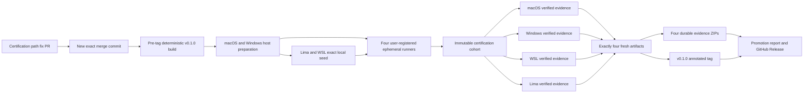

# ZZA-101 실제 4-target 인증 및 첫 release promotion - Plan

## Goal Capsule

### Objective

`my-desk-setup`의 인증 경로를 실제로 도달 가능하게 고친다. 새 merge
commit을 macOS host, Windows host, WSL Ubuntu 26.04 guest, Lima Ubuntu
26.04 guest에서 독립적으로 인증한 뒤 최초 `v0.1.0` 릴리스로 승격한다.

### Authority hierarchy

1. 이 계획과 [Linear ZZA-101](https://linear.app/zzanghyunmoo/issue/ZZA-101/my-desk-setup-실제-4-target-인증-및-release-promotion)이
   후속 범위의 authority다.
2. 선행 구현 계획과 ZZA-100 closeout은 현재 제품 계약의 authority다.
3. `projects/my-desk-setup/AGENTS.md`와 workspace `AGENTS.md`가 작업·Git·문서
   이중 발행 경계를 정한다.
4. 실제 target의 plan, receipt, doctor report와 GitHub artifact가 완료 여부의
   증거다.

### Stop conditions

- 한 target의 성공을 다른 target의 성공으로 추론하지 않는다.
- fixture, static test, `blocked` bundle과 이전 commit의 bundle을 actual
  verified evidence로 승격하지 않는다.
- credential, runner registration token, guest creation nonce 또는 개인 절대
  경로가 log, document, receipt나 artifact에 나타나면 중단한다.
- 새 code commit이 생기면 이전 release candidate와 actual evidence를 폐기하고
  새 identity로 네 target 전체를 다시 시작한다.
- 기존 `home-ai-infra` Lima guest를 시작·변경·채택해야만 진행할 수 있는
  상황에서는 중단하고 제품 소유 `mds` guest를 별도로 준비한다.

### Execution profile

- Primary repository: `projects/my-desk-setup`
- Tracker: Linear ZZA-101
- Canonical documentation: Notion plan과 ticket page
- Local evidence: `docs/works/2026-07-31-ZZA-101-my-desk-setup-actual-target-certification-work.md`
- Release target: ZZA-101 fix PR의 merge commit, version `0.1.0`
- Tail owner: release·Notion·KB·Linear closeout까지 이 계획을 실행하는 agent

## Product Contract

### Summary

병합본의 두 구조적 blocker를 제거한다. Release certification은 사용자 수동
경계를 포함한 `all` 대신 target별로 무인 수렴 가능한 네 certification
profile을 사용하며 네 target 모두에서 자동 설치 가능한 v1 catalog 전체를 검증한다.
첫 release의 Linux archive는 embedded checksum과 정확히
일치하는 local seed로 guest에 전달할 수 있게 하여 guest bootstrap과 release
promotion의 순환 의존을 끊는다.

### Problem Frame

병합본 `58b22df0dc80617be0ab11c3515bb79cfba0b14b`의 actual workflow는
`--all`을 강제한다. macOS plan은 Xcode를 설치 상태와 무관한 static
`action-required`로 생성하므로 `--require-publication-acceptable`에 도달할 수
없다.

Host release binary는 guest bootstrap URL을 최종 GitHub Release asset으로
embed한다. 첫 release 공개는 guest evidence를 요구하므로 공개 전 guest
bootstrap과 공개 후 asset 사용이 서로를 기다린다.

GitHub `main`은 보호되지 않았다. `target-certification` environment와
self-hosted target runner도 없다. Merge commit에서 성공한 workflow
`30533682703`은 fixture contract만 실행했고 Actual target job은 skip됐다.

현재 Mac에는 제품 소유 `mds` Lima guest, ownership record와 production
`mds` binary가 없다. 기존 `home-ai-infra` guest는 별도 사용자 자산이다.

### Actors

- A1. Owner/operator — plan과 digest를 확인하고 OS mutation을 승인한다.
- A2. GitHub environment reviewer — exact release identity와 runner target을
  확인하고 Actual target job을 승인한다.
- A3. Certification runner — 사용자·서비스 credential이 없는 전용 계정에서
  target 하나만 capture한다. GitHub runner 자체의 scoped control-plane
  credential은 유일한 예외이며 one-job ephemeral lifecycle로 격리한다.
- A4. Release workflow — 네 fresh artifact를 exact commit과 deterministic
  release에 결합한다.

### Requirements

#### Certification reachability

- R1. 별도 ZZA-101 branch와 PR에서 certification path를 고치며 project
  `main`에 직접 commit하거나 push하지 않는다.
- R2. `certification-macos-host`, `certification-windows-host`,
  `certification-wsl-guest`, `certification-lima-guest` profile은 각 exact
  target에서 static blocker 없이 해석되고 해당 target에서 자동 설치 가능한 v1
  카탈로그 전체를 검증한다. WSL은 Flutter를 포함하고 Linux arm64를 지원하지
  않는 Flutter만 Lima에서 `action-required`로 명시 제외한다. 수동·platform-limited
  component는 일반 `all`/`owner`의 정직한 blocker로만 유지한다.
- R3. 일반 `all`, `owner` profile과 수동 Xcode·platform limitation의 정직한
  상태 계약은 바꾸지 않는다.
- R4. 첫 release의 local guest seed는 embedded Linux archive SHA-256과
  byte-exact match할 때만 허용한다.
- R5. Local seed path와 bytes는 plan, receipt, evidence 또는 diagnostic에
  저장하지 않는다. Raw guest creation nonce도 runtime 비교와 root/owner-only
  local ownership state 밖에서는 저장하지 않고, plan/evidence에는
  domain-separated commitment만 기록한다.

#### Actual target evidence

- R6. macOS host, Windows host, WSL guest와 Lima guest를 각각 dedicated
  repository-level runner와 exact custom label로 인증한다. Host production
  binary 설치, plan/apply, local guest seed·ownership 생성과 host runner 실행은
  각 wave의 동일한 전용 host 계정과 home에서 수행한다. Workflow dispatch는
  사용자 경로를 입력받지 않고 target별 고정 production `mds` path와 released
  `mds-evidence` path(POSIX `/usr/local/bin/mds-evidence`, Windows
  `C:/ProgramData/my-desk-setup/bin/mds-evidence.exe`)만 사용하고 두 SHA-256을
  release manifest와 대조한다.
- R7. 각 target은 read-only plan, exact-digest first apply, 같은 digest의
  repeat all-no-op, doctor와 bounded functional probes를 통과한다.
- R8. Guest evidence는 owner-only host ownership record의 raw nonce에서 계산한
  commitment와 live root-owned `mds.guest-image/v3` marker에 저장된 공개 commitment가
  operator가 검토한 expected commitment와 일치해야 한다. Runner service는 WSL의
  `WSL_DISTRO_NAME=Ubuntu-26.04` 또는 Lima의 `LIMA_INSTANCE=mds` exact target
  identity만 상속하며 raw nonce를 runner 환경으로 전달하지 않는다. Raw nonce는
  argv, log, receipt와 uploaded artifact에 나타나지 않는다.
- R9. Account login, service auth, runner 등록과 registration token 입력은
  사용자가 직접 수행한다.

#### Promotion and closeout

- R10. Protected `main`, update/delete가 금지된 `v*` tag ruleset, reviewer가
  필요한 secret-free `target-certification` environment와 non-fork
  dispatch만 actual runner에 도달한다.
- R11. 같은 release commit과 immutable certification cohort에 target kind별
  성공 artifact가 정확히 하나여야 한다. Cohort는 첫 dispatch 직전 GitHub 서버
  UTC로 발급하고 각 runner clock skew를 60초 이하로 확인한다. 네 capture는
  5분 허용 skew를 제외하고 cohort 시작 뒤 4시간 안이며, promotion 시점 기준
  각각 24시간 이내여야 한다. 이전 cohort는 삭제하지 않고 promotion 입력에서
  제외한다.
- R12. `v0.1.0` tag는 네 `verified` evidence가 모두 성공한 뒤 같은 commit에
  만들며 생성 뒤 이동하거나 삭제하지 않는다.
- R13. Release workflow는 deterministic assets, promotion report와 선택된 네
  verified evidence bundle의 결정론적 ZIP을 재검증한 뒤 GitHub Release에 함께
  게시한다. Report는 원본 Actions artifact 이름과 ZIP SHA-256을 보존한다.
- R14. Release 뒤 local work/KB, Notion 기능 현황·ticket, Linear 상태와
  workspace submodule pointer를 같은 identity로 closeout한다.
- R15. Actual workflow는 `verified` bundle만 업로드하고 promotion은
  `blocked`를 허용하지 않는다. 업로드 직전에 exact file set, checksum,
  credential/nonce-field/개인 경로 scan과 Gitleaks를 독립 gate로 통과한다.
  Raw nonce는 GitHub 입력, runner 환경과 artifact에 처음부터 전달하지 않는다.

### Key Flows

- F1. Certification repair — ZZA-101 branch에서 profile과 exact local seed를
  구현하고 review·CI·guarded merge로 새 release authority를 만든다.
- F2. Pre-tag build — 새 merge commit과 `0.1.0`으로 deterministic
  `release-dist`를 만들고 exact manifest identity를 네 target에 배포한다.
- F3. Host/guest preparation — host plan을 먼저 확인하고 host apply/local seed로
  제품 소유 guest와 owner-only ownership record를 만든다. 공개 v3 marker commitment를
  대조하고 released certifier를 고정 path에 설치한 뒤 guest-local read-only
  `prepare`로 같은 CLI/catalog/plan identity를 확인한다.
- F4. Four-target capture — target별 dedicated runner가 first apply, repeat
  no-op, doctor와 probe를 capture하고 artifact를 하나씩 게시한다.
- F5. Promotion and closeout — exactly four fresh artifacts를 rehearsal한 뒤
  tag workflow로 release를 게시하고 Notion·KB·work·Linear·gitlink를 닫는다.

### Acceptance Examples

- AE1. Xcode가 없는 macOS에서 일반 `--all`은 계속 정직하게
  `action-required`다. `--profile certification-macos-host`는 static blocker
  없이 실행된다.
- AE2. Local seed가 embedded checksum과 다르면 guest mutation 전에
  실패한다.
- AE3. Exact local seed는 공개 release asset이 없어도 guest에 같은
  CLI/catalog revision을 준비한다.
- AE4. `home-ai-infra` Lima guest가 존재해도 시작·변경·채택하지 않고 새
  `mds` guest만 만든다.
- AE5. First apply가 complete이고 repeat apply의 모든 outcome이 no-op이며
  doctor가 ready일 때만 evidence가 `verified`다.
- AE6. 성공한 target을 습관적으로 재실행해 같은 kind artifact를 둘 만들지
  않는다.
- AE7. Artifact가 stale해지거나 code가 바뀌면 promotion하지 않고 새 exact
  identity에서 네 target을 다시 인증한다.
- AE8. Guest marker가 없거나 marker에서 계산한 commitment가 operator가
  검토한 expected commitment와 다르면 capture 전에 실패한다. 실제 nonce 값은
  GitHub input, runner environment, argv, log, plan과 evidence에 나타나지 않는다.
- AE9. Tag workflow는 exact commit의 네 artifact, content-addressed evidence
  ZIP과 release checksums를 검증하고 annotated tag message의 정확히 한 줄
  `Certification-Cohort: <selected-cohort>`를 확인한 뒤에만 release asset을
  게시한다.
- AE10. 네 capture가 cohort 시작 뒤 4시간을 넘기거나 한 bundle이 promotion
  시점 기준 24시간을 넘기면 같은 commit에서 새 cohort를 발급해 네 target
  전체를 다시 인증한다. Downloader는 선택된 cohort 안의 exactly-one만 승인하고
  이전 cohort를 duplicate로 오인하지 않는다.
- AE11. `blocked` 또는 leak scan 실패 bundle은 runner-local 진단으로만
  남고 GitHub artifact로 업로드되지 않는다.

### Success Criteria

- Certification path가 repo tests와 실제 target 모두에서 도달 가능하다.
- 네 target에 `verified` actual artifact가 하나씩 존재한다.
- `v0.1.0` GitHub Release, `mds.release-promotion/v2` report와 네 durable
  evidence ZIP이 같은 commit+cohort를 가리킨다.
- 사용자 auth 경계와 unsupported/action-required truthfulness가 유지된다.

### Scope Boundaries

#### Included

- 네 target별 certification profile과 fail-closed workflow mapping
- Exact-checksum local guest bootstrap seed
- Strict verified promotion, retry cohort와 pre-upload leak gate
- Nonce commitment와 ephemeral runner lifecycle
- Contract, integration, security tests와 runner runbook 보강
- GitHub protection, environment와 runner prerequisite
- 네 실제 target 인증, `v0.1.0` promotion과 closeout

#### Deferred to Follow-Up Work

- Certification target 추가
- Artifact signing·attestation 추가
- Runner lifecycle 자동화

#### Outside Product Identity

- Account/service login 자동화
- 기존 사용자 소유 도구의 hidden upgrade 또는 overwrite
- `home-ai-infra` guest 재사용 또는 변경
- 다른 Linux 배포판, Proxmox target과 Docker Desktop
- 실패를 `verified`로 바꾸거나 validator를 느슨하게 만드는 우회

### Traceability Index

- R1–R3, R15 → U1
- R4–R5, R8–R9 → U2
- R1, R9–R15 → U3
- R4–R11, R15 → U4, U5
- R11–R15 → U6
- F1 → U1–U3
- F2 → U3
- F3 → U2, U4, U5
- F4 → U4, U5
- F5 → U6
- AE1, AE11 → U1
- AE2–AE3 → U2, U4, U5
- AE4 → U2, U4
- AE5 → U4, U5
- AE6 → U4–U6
- AE7, AE10–AE11 → U3–U6
- AE8 → U2–U5
- AE9 → U3, U6

## Planning Contract

### Target repository and path notation

이 계획 파일은 workspace root에 있다. 모든 file path는 workspace
root-relative다. `projects/my-desk-setup/` 아래 변경은 child project branch와
PR을 사용한다. `docs/`와 최종 gitlink 변경은 root repository `main`에서
closeout guard를 만족한 뒤 직접 commit·push할 수 있다.

### Key Technical Decisions

- KTD1 — 새 merge commit이 release authority다. ZZA-101 code fix가 병합되면
  `58b22df…`는 선행 기준선으로만 남는다. 모든 build, evidence와 tag는 새
  merge commit을 사용한다.
- KTD2 — Target 조건을 profile schema에 새로 넣지 않고 네 target-specific
  certification profile을 둔다. Workflow는 exact target ID를 하나의 profile에
  fail-closed mapping한다. 네 profile은 target에서 `action-planned`인 v1 카탈로그
  전체를 포함하고 contract test가 누락을 막는다. WSL은 Flutter까지 포함하며
  Linux arm64 binary가 없는 Flutter만 Lima에서 명시 제외한다. Promotion report에 열거된 exact
  OS/architecture artifact만 actual-target certified이며 그 밖의 cross-built
  asset은 build/archive 검증만 받은 것으로 구분한다. 일반 `all`/`owner` 의미는
  기존 contract test로 보존한다.
- KTD3 — Local seed는 provenance override가 아니다. Host binary가 embed한
  canonical URL·SHA identity를 유지한다. Operator가 제공한 local archive
  bytes가 같은 SHA일 때만 download 대체 경로로 사용한다.
- KTD4 — Apply-only `--guest-bootstrap-archive <absolute-path>`가 local seed의
  유일한 operator interface다. 선택이 host guest-lifecycle을 포함하지 않으면
  flag를 거부하고, 생략하면 canonical HTTPS download를 사용한다. Host가
  선택한 guest architecture의 embedded artifact만 허용한다. Local path는
  semantic plan input이 아니며 digest, receipt나 persistent state에 넣지
  않는다.
- KTD5 — Pre-tag `Release` workflow dispatch에서 version `0.1.0`
  `release-dist`를 한 번 만든다. Tag build는 같은 commit date와 version으로
  byte-identical해야 한다.
- KTD6 — Runner는 target별 전용 OS account와 custom label 하나만 가진다.
  Host production binary 설치, plan/apply, local seed·ownership 생성과 host
  runner는 같은 전용 host account/home을 사용한다. Guest service는 exact
  `WSL_DISTRO_NAME`/`LIMA_INSTANCE`만 상속하고 raw nonce는 상속하지 않는다.
  GitHub 등록·token 입력과 one-job `--ephemeral` lifecycle은 사용자 작업이다.
  Job의 scoped `GITHUB_TOKEN`은 workflow에서 사용할 수 있으므로 contents
  read-only, pinned action과 ephemeral post-job unregister·scrub으로 경계를
  제한한다.
- KTD7 — U3가 첫 dispatch 직전 GitHub 서버 UTC로 strict immutable cohort ID
  `cert-<UTC YYYYMMDDThhmmssZ>-<commit8>`를 한 번 발급한다. 각 runner는 GitHub
  서버와 local UTC skew가 60초 이하인지 검사한다. U4/U5는 같은 ID를 소비하고
  네 capture를 5분 허용 skew를 제외한 시작 뒤 4시간 안에 끝낸다. Exactly-one과
  promotion 시점 기준 24시간 freshness는 선택된 commit+cohort 안에서 manifest
  capture 완료 시각으로 검증한다.
- KTD8 — Certification에서 product defect가 나오면 우회하지 않는다. Fix
  commit을 review한 뒤 새 commit에서 네 target 전체를 다시 시작한다.
- KTD9 — Release builder는 `mds.release/v2` manifest에 OS/architecture별 raw
  `mds-evidence` certifier asset과 SHA-256을 포함한다. Operator는 target 고정 path에
  그 asset을 설치하고 read-only `prepare`를 실행해 정확한 plan digest와 guest v3
  marker의 공개 commitment를 검토한다. Wrapper는 released certifier를 private
  snapshot으로 복사·hash해 실행하며 checkout의 Go toolchain을 인증 authority로
  사용하지 않는다. Raw nonce는 owner-only host ownership record에만 남고 runner
  environment, CLI argv, subprocess output와 error payload에 들어가지 않는다.
- KTD10 — Actual upload와 promotion은 `verified` 전용이다. Capture 실패
  bundle은 runner local에만 보존한다. 업로드 전 exact-file-set/checksum,
  credential/field-name/path scan과 Gitleaks를 통과한 bundle만 cohort 이름으로
  게시한다. Raw nonce는 runner/GitHub 경계 밖에 있으므로 업로드 단계가 그 값을
  알거나 fixed-string scan할 필요가 없다. Production `mds`는 no-follow/reparse
  거부로 만든 owner-only private snapshot을 checksum 검증한 뒤 모든 subprocess가
  그 snapshot만 실행한다.
- KTD11 — `v*` tag는 update/delete가 금지된다. `v0.1.0`은 approved commit의
  annotated tag이며 message에 정확히 한 줄
  `Certification-Cohort: <selected-cohort>`를 가진다. Tag workflow는 같은
  tag+commit의 idempotent draft에 deterministic release assets, promotion report와
  네 content-addressed evidence ZIP을 구성·재검증한 뒤 publish한다. 실패하면
  tag를 이동·삭제하지 않고 같은 identity로 재시도하며, byte mismatch면 version을
  미게시 상태로 폐기한다.

### Assumptions

다음 항목은 LFG headless planning에서 사용자 확인 없이 채운 가정이다.
`ce-doc-review`와 실행 전 operator review가 이를 다시 검사한다.

- 첫 공개 version은 `0.1.0`이다.
- 사용자는 macOS와 Windows 실제 머신에서 runner 등록과 OS-level 수동
  prerequisite를 직접 수행할 수 있다.
- Certification profile은 release 품질을 대표하지만 모든 수동 또는
  platform-limited component의 설치 가능성을 의미하지 않는다.
- GitHub public repository 기능으로 protected ref와 required-reviewer
  environment를 구성할 수 있다.

### High-Level Technical Design

### System-Wide Impact

- Catalog — 네 profile은 resolver와 catalog revision에 포함된다.
- CLI/adapter — local seed source와 released certifier 기반 read-only evidence
  preparation이 host guest handoff에 추가된다. Plan, doctor, update-plan,
  target-evidence, release와 release-promotion schema는 v2이며 receipt v1은 유지한다.
  Preparation은 `mds.certification-preparation/v1`, guest public marker는
  `mds.guest-image/v3`다.
- Transport — WSL/Lima는 embedded script를 command payload로 실행하고
  archive snapshot만 stdin으로 받는 같은 bounded byte-stream 계약을 쓴다.
- Evidence — raw nonce field를 공개 marker commitment로 바꾸고 cohort identity를
  manifest에 추가하므로 target/evidence schema와 tamper validation을 함께
  올린다. Receipt schema는 바꾸지 않는다.
- Security — local path, archive bytes와 raw nonce가 diagnostic/persistent
  evidence로 새지 않아야 한다. Failed bundle은 업로드하지 않는다.
- GitHub Actions — actual selection, protected ref, environment와 exact
  artifact cardinality가 release availability를 결정한다.
- Workspace — child merge commit이 최종 release identity가 되므로 root
  submodule pointer는 release closeout에서 한 번 갱신한다.

### Risks and Dependencies

- Xcode나 Flutter처럼 의도적으로 manual/platform-limited인 component를
  certification profile에 다시 넣으면 actual evidence가 영구 차단된다.
  Profile contract test로 blocker 0과 대표 capability coverage를 함께
  고정한다.
- Local seed가 canonical identity를 우회하면 supply-chain 경계가 무너진다.
  Embedded SHA exact match와 pre-mutation file validation을 요구한다.
- Successful artifact가 중복되면 downloader가 fail closed한다. 성공 target은
  선택한 cohort 안에서 재실행하지 않고 네 capture를 짧은 창에 묶는다. Cohort가
  stale되면 새 cohort로 네 target 전체를 다시 인증한다.
- Windows·WSL은 이 Mac에서 대신 검증할 수 없다. 실제 Windows operator와
  runner online 상태가 U5의 외부 dependency다.
- Runner registration은 user-owned auth/privilege dependency다. Guest raw nonce는
  owner-only host ownership record에만 남고 runner drop-in이나 GitHub input으로 전달하지
  않는다. Agent는 token이나 raw nonce를 요청·저장하지 않는다.
- GitHub runner agent는 scoped control-plane credential을 가진다. 사용자·서비스
  auth credential과 구분하고 one-job ephemeral registration, dedicated OS
  account와 post-job scrub으로 잔여 노출을 제한한다.
- Any code fix after capture invalidates all prior evidence. U4/U5 실행 전에
  code freeze를 선언한다.
- Signing과 independent attestation은 후속 범위이므로 첫 release provenance는
  GitHub control plane, exact checksum과 protected tag에 의존한다.

### Research and Sources

- `projects/my-desk-setup/.github/workflows/target-certification.yml` — current
  `--all`, protected-ref, environment와 exact runner-label contract
- `projects/my-desk-setup/.github/workflows/release.yml` — pre-tag build와
  tag-only promotion/publish contract
- `projects/my-desk-setup/internal/evidence/certify.go` — first apply, repeat
  no-op, doctor와 `verified` status calculation
- `projects/my-desk-setup/internal/adapters/host/guest_handoff.go` — embedded
  release URL/SHA guest bootstrap
- `projects/my-desk-setup/scripts/download-target-evidence.sh` — target
  kind당 artifact exactly-one gate
- `projects/my-desk-setup/docs/operations/target-certification-runner.md` —
  user-owned runner registration, nonce와 protected environment boundary
- `docs/solutions/architecture-patterns/authoritative-blocked-generation-is-not-feasibility-success.md`
  — blocked evidence를 feasibility success로 해석하지 않는 원칙
- `docs/solutions/workflow-issues/run-passport-contract-before-dependent-follow-ups.md`
  — exact identity를 후속 단계의 passport로 사용하는 원칙
- `docs/solutions/workflow/submodule-edit-and-pointer-bump.md` — child merge
  뒤 root gitlink closeout
- GitHub state audit, 2026-07-31 — main unprotected, environment/runners/tags/
  releases 없음, merge-commit fixture run만 성공
- Local read-only audit, 2026-07-31 — macOS `--all` Xcode blocker,
  user-owned Bun/Claude/Codex/OpenCode conflicts, product-owned `mds` guest
  부재

## Implementation Units

### Execution prerequisite

구현 파일을 바꾸기 전에 Linear ZZA-101을 `In Progress`로 전환하고
`origin/main`에서 `zza-101/actual-target-certification` branch를 만든다.
`docs/works/_template.md`로 work evidence를 초기화하고 canonical Notion ticket
page도 `In Progress`로 동기화한다. 이 prerequisite가 U1과 U2의 공통
선행조건이다.

### U1. Certification profile과 workflow contract

- Goal: `all`의 수동 경계를 보존하면서 actual release gate가 target별로
  도달 가능한 selection과 strict verified status를 사용하게 한다.
- Requirements: R1–R3, R15
- Flows: F1
- Acceptance: AE1, AE11
- Files:
  - `projects/my-desk-setup/catalog/profiles/certification-*.yaml`
  - `projects/my-desk-setup/.github/workflows/target-certification.yml`
  - `projects/my-desk-setup/cmd/mds-evidence/main.go`
  - `projects/my-desk-setup/internal/evidence/verify.go`
  - `projects/my-desk-setup/internal/catalog/`
  - `projects/my-desk-setup/tests/contracts/`
  - `projects/my-desk-setup/tests/target-evidence/README.md`
- Approach: Target-specific closed profile 네 개와 workflow의 exact
  target→profile allowlist를 추가한다. 네 profile 모두 target에서 자동 설치
  가능한 전체 v1 component를 선택한다. WSL만 Flutter를 포함하며 Lima의
  Flutter 제외는 `action-required` 근거로
  고정한다. Capture와 expected-plan input 설명을 같은 mapping으로 고정하고
  verifier를 `--require-verified`로 실행한다.
- Test scenarios:
  - 각 target fixture에서 대응 profile blocker가 0개고 다른 target profile은
    workflow mapping에서 선택할 수 없다.
  - Xcode를 직접 또는 `all`로 선택하면 기존 `action-required`가 유지된다.
  - 어떤 certification profile이 target-eligible automatable component 하나라도 빠뜨리면
    contract test가 실패하며 unknown ID와 schema drift도 fail closed한다.
  - `blocked` bundle은 publication-acceptable 여부와 무관하게 actual upload
    gate를 통과하지 못한다.
- Verification: catalog validation, golden plan과 workflow fixture가 selection
  contract와 verified-only gate를 증명한다.
- Dependencies: Execution prerequisite

### U2. 첫 release용 exact local guest seed

- Goal: 최종 release asset이 없어도 exact embedded Linux archive를 WSL/Lima
  guest에 안전하게 bootstrap한다.
- Requirements: R4–R5, R8–R9
- Flows: F1, F3
- Acceptance: AE2–AE4, AE8
- Files:
  - `projects/my-desk-setup/internal/adapters/host/guest_handoff.go`
  - `projects/my-desk-setup/internal/adapters/host/guest-bootstrap.sh`
  - `projects/my-desk-setup/internal/adapters/host/runtime.go`
  - `projects/my-desk-setup/internal/cli/`
  - `projects/my-desk-setup/internal/target/facts.go`
  - `projects/my-desk-setup/internal/evidence/certify.go`
  - `projects/my-desk-setup/internal/evidence/verify.go`
  - `projects/my-desk-setup/cmd/mds-evidence/main.go`
  - `projects/my-desk-setup/tests/adapters/`
  - `projects/my-desk-setup/tests/integration/guest_handoff_test.go`
  - `projects/my-desk-setup/docs/operations/target-certification-runner.md`
- Approach: Apply-only `--guest-bootstrap-archive`를 host guest-lifecycle
  selection에만 허용한다. 한 번 연 handle에서 no-follow/reparse-point,
  regular-file와 256 MiB 상한을 검사하고 private bounded snapshot을 만든다.
  POSIX는 no-follow open+`fstat`, Windows는 reparse point 거부와 write/delete
  sharing 차단을 사용한다. 같은 snapshot을 hash한 뒤 embedded SHA와
  일치하는 bytes만 archive stdin으로 전달한다. Guest는 private temp에서
  다시 hash한 뒤 첫 extraction/mutation을 시작한다. Fixed embedded bootstrap
  script는 command payload로 분리한다. Raw nonce는 owner-only host ownership
  record에서만 읽고 공개 v3 marker에는 KTD9 commitment만 기록한다. Guest
  certifier와 child process는 raw nonce를 전달받지 않는다.
- Test scenarios:
  - Exact seed가 WSL/Lima에서 같은 CLI/catalog identity로 수렴한다.
  - Checksum mismatch, symlink, non-regular file과 oversize를 mutation 전에
    거부한다.
  - Path swap, in-place rewrite, truncation과 oversize 경쟁에서도 검증한
    snapshot과 전달 bytes가 달라지지 않는다.
  - Interrupted seed를 재실행하면 기존 transaction contract로 수렴한다.
  - Error, receipt, plan과 evidence에 local path나 archive bytes가 없다.
  - Raw nonce가 runner environment, GitHub input, plan/evidence JSON, argv,
    output와 error payload에 없고 commitment 변조는 verifier가 거부한다.
  - Public URL download path의 기존 behavior가 유지된다.
- Verification: URL path와 local exact seed path가 같은 guest binary, image와
  ownership identity를 만든다. Upload 후보 file set에는 raw nonce가 없다.
- Dependencies: Execution prerequisite

### U3. PR 검증·병합과 certification control plane

- Goal: U1–U3의 모든 code-bearing 변경을 actual capture 전에 reviewed merge
  commit으로 고정하고 GitHub 보호 경계, shared cohort, deterministic pre-tag
  artifact와 durable promotion path를 준비한다.
- Requirements: R1, R9–R15
- Flows: F1–F2
- Acceptance: AE7–AE11
- Files:
  - `docs/works/2026-07-31-ZZA-101-my-desk-setup-actual-target-certification-work.md`
  - `projects/my-desk-setup/`의 U1–U3 diff
  - `projects/my-desk-setup/scripts/download-target-evidence.sh`
  - `projects/my-desk-setup/scripts/certification-clock.sh`
  - `projects/my-desk-setup/scripts/prepare-target-certification.sh`
  - `projects/my-desk-setup/scripts/run-release-certifier.sh`
  - `projects/my-desk-setup/cmd/mds-evidence/main.go`
  - `projects/my-desk-setup/internal/evidence/`
  - `projects/my-desk-setup/internal/release/release.go`
  - `projects/my-desk-setup/internal/release/promotion.go`
  - `projects/my-desk-setup/internal/release/promotion_test.go`
  - `projects/my-desk-setup/.github/workflows/target-certification.yml`
  - `projects/my-desk-setup/.github/workflows/release.yml`
  - GitHub branch, tag ruleset, environment와 runner external state
- Approach: Promotion code/workflow와 publication script까지 U3 PR에 포함해
  latest head에서 code/doc review marker와 CI를 만든 뒤 guarded merge한다. 새
  main에서 branch protection, `v*` tag ruleset과 secret-free environment를
  구성하고 deterministic pre-tag `release-dist`를 만든다. Production `mds`는
  no-follow/reparse 거부로 만든 private snapshot을 checksum 검증한 뒤 그 exact
  snapshot만 실행한다. Release manifest에 함께 고정된 target별 `mds-evidence`
  asset도 고정 path에서 private snapshot으로 복사·hash한 뒤 실행한다. Read-only
  `prepare`로 plan digest와 guest public commitment를 얻어 operator가 검토한 뒤
  dispatch한다. Capture는 v3 marker commitment와 exact guest target identity를
  검사하며, upload 직전 key/path scan과 Gitleaks를 수행한다. 첫
  dispatch 직전 `scripts/certification-clock.sh cohort <commit>`으로 shared cohort를
  한 번 발급하고 모든 runner의 60초 clock preflight를 통과시킨다. Selected
  cohort의 exactly-one을 검증하고 verified bundle 네 개를 deterministic ZIP으로
  만들어 원본 Actions artifact identity와 SHA-256을 promotion report에 결합한다.
- Test scenarios:
  - Unprotected ref에서는 Actual target이 skip된다.
  - Wrong target/label pair, wrong guest target env와 dirty runner workspace는 실패한다.
  - Guest marker/commitment missing·mismatch, host commitment presence와 neutral
    field/plaintext secret leak은 값을 출력하지 않고 upload 전에 실패한다.
  - Production path swap/in-place rewrite 중에도 검증되지 않은 bytes는 실행되지 않는다.
  - Invalid cohort, clock skew, 4시간 window, cross-cohort mix, selected-cohort
    duplicate와 24시간 stale evidence를 거부한다.
  - Failed/blocked/leaky bundle은 업로드 step에 도달하지 않는다.
  - Pre-tag artifact의 version, commit, date와 checksums가 manifest와 맞는다.
  - Evidence ZIP은 deterministic exact four-file archive이며 report digest와 맞는다.
- Verification: 새 merge commit의 CI가 green이다. GitHub API read가 protected
  ref, protected tag, environment와 exact ephemeral runner labels를 확인한다.
  두 번 빌드한 `release-dist`와 evidence archive가 각각 byte-identical이다.
- Dependencies: U1, U2

### U4. macOS host와 Lima guest actual certification

- Goal: 현재 Mac에서 제품 소유 `mds` guest만 준비하고 두 target의 성공
  artifact를 각각 한 번 만든다.
- Requirements: R4–R11, R15
- Flows: F3–F4
- Acceptance: AE2–AE8, AE10–AE11
- Files:
  - Target-local state와 runner directories
  - GitHub Actions run과 target evidence artifacts
- Approach: `mds-cert-macos` 전용 host account/home에서 read-only inventory와
  host read-only plan을 먼저 제시하고 사용자가 mutation을 확인한 뒤 같은 계정의
  host apply와 local seed로 `mds` Lima guest 및 owner-only ownership record를
  준비한다. Live v3 marker commitment를 host record와 대조하고 released certifier를
  고정 path에 설치·hash한 뒤 host/guest 각각에서 read-only `prepare`를 실행해 plan
  digest를 검토한다. U3가 발급한 shared cohort를 소비하고 ephemeral runner와
  environment approval을 완료한 뒤 exact inputs로 각각 한 번 dispatch한다.
- Test scenarios:
  - 기존 `home-ai-infra` guest는 실행 전후 불변이다.
  - Host runner environment에는 guest nonce가 없다.
  - Lima marker의 commitment가 operator 검토값과 exact match하고 service가
    `LIMA_INSTANCE=mds`를 상속하며 raw nonce는 상속하지 않는다.
  - First apply, repeat all-no-op와 doctor/probe가 성공한다.
  - Artifact kind, commit, binary, catalog와 plan identity가 exact match한다.
  - 두 artifact의 cohort와 manifest capture 완료 시각이 일치하는 promotion
    window에 있다.
- Verification: `macos-host`와 `lima-guest` 성공 run/artifact가 각각 정확히
  하나다.
- Dependencies: U3

### U5. Windows host와 WSL guest actual certification

- Goal: 실제 Windows와 WSL Ubuntu 26.04에서 두 target의 성공 artifact를
  각각 한 번 만든다.
- Requirements: R4–R11, R15
- Flows: F3–F4
- Acceptance: AE2–AE3, AE5–AE8, AE10–AE11
- Files:
  - Target-local state와 runner directories
  - GitHub Actions run과 target evidence artifacts
- Approach: `mds-cert-windows` 전용 host account/home에서 Windows host plan과
  WSL prerequisite를 먼저 확인하고 같은 계정으로 host apply, local seed와
  owner-only ownership을 준비한다. 사용자가 reboot와 first-user setup을 완료한
  뒤 live v3 marker commitment를 record와 대조하고 released certifier를 두 고정
  path에 설치·hash한다. Host/guest 각각의 read-only `prepare` digest를 검토하고
  ephemeral runner를 등록한다. U3가 발급해 U4가 소비한 같은 cohort로 두 dispatch를
  실행한다.
- Test scenarios:
  - Windows ownership record ACL은 owner와 허용 SID만 가진다.
  - WSL distro, image와 marker commitment가 exact match하고 runner service가
    `WSL_DISTRO_NAME=Ubuntu-26.04`를 상속하며 raw nonce는 상속하지 않는다.
  - Windows host runner에는 guest nonce가 없다.
  - Windows bash, Git, curl과 runner service prerequisite가 충족된다.
  - First apply, repeat all-no-op와 doctor/probe가 성공한다.
  - Artifact의 commit, cohort와 manifest capture 완료 시각이 U4와 같은
    promotion window에 있다.
- Verification: `windows-host`와 `wsl-guest` 성공 run/artifact가 각각 정확히
  하나다.
- Dependencies: U3

### U6. Promotion, v0.1.0 release와 closeout

- Goal: U3에서 code-frozen된 promotion path로 네 fresh artifact를 같은 commit의
  최초 release로 승격하고 추적 문서를 닫는다. U6에서는 code나 workflow를
  변경하지 않는다.
- Requirements: R11–R15
- Flows: F5
- Acceptance: AE6–AE7, AE9–AE10
- Files:
  - GitHub annotated tag, release와 promotion artifact
  - Durable target evidence ZIP 네 개
  - `projects/my-desk-setup` gitlink
  - `docs/works/2026-07-31-ZZA-101-my-desk-setup-actual-target-certification-work.md`
  - `docs/kb/developer-environments/2026-07-31-ZZA-101-my-desk-setup-actual-target-certification.md`
  - Canonical Notion feature status와 ticket page
- Approach: 이미 병합된 promotion implementation으로 선택한 cohort를 고정한
  local rehearsal을 실행해 duplicate, stale, non-verified와 identity mismatch를
  먼저 거부한다. `v*` ruleset을 재확인하고 approved commit에 annotated
  `v0.1.0` tag를 만들며 message에는 정확히 한 줄
  `Certification-Cohort: <selected-cohort>`를 넣는다. Push 전 tag object, resolved
  commit과 trailer cardinality를 확인한다. Workflow는 같은 tag+commit의 draft에
  deterministic release assets, promotion report와 네 content-addressed evidence
  ZIP을 idempotently stage하고 published bytes를 재검증한 뒤 publish한다. 실패
  시 tag를 이동·삭제하지 않고 같은 identity로 재시도한다. Release 성공 뒤
  Notion을 먼저 closeout한다. Local KB/work와 root gitlink를 동기화한 뒤 Linear를
  `Done`으로 바꾼다.
- Test scenarios:
  - Selected cohort의 exactly four `verified` target bundle만 허용하고
    `blocked`는 항상 거부한다.
  - Cohort 내부 duplicate, cross-cohort mix, manifest capture 완료 시각 기준
    stale evidence와 commit/catalog/binary/plan mismatch를 거부한다.
  - Tag rebuild가 pre-tag release와 byte-identical하다.
  - Partial draft retry는 같은 bytes로 수렴하고 tag를 이동하지 않는다.
  - Byte mismatch는 draft를 publish하지 않고 version을 미게시 상태로 남긴다.
  - Published checksums, promotion report와 네 evidence ZIP의 exact asset set,
    SHA-256 및 재다운로드 bytes를 다시 검증한다.
- Verification: GitHub Release, promotion report, root pointer, Notion,
  KB/work와 Linear가 같은 commit과 version을 가리킨다.
- Dependencies: U4, U5

## Verification Contract

### Repository quality gates

Child repository root에서 다음을 실행한다.

- `go test ./...`
- `go test -race ./...`
- `go vet ./...`
- `go build ./cmd/mds`
- `git diff --check`
- `actionlint -color`
- 모든 shell script의 `shellcheck`
- Darwin, Linux와 Windows의 amd64/arm64 cross build
- Windows test package cross-compile
- Deterministic release build와 `scripts/verify-release.sh`
- Gitleaks source-history와 release scan

### Review gates

- Project PR 최신 head에서 `ce-code-review`와 `ce-doc-review`를 실행한다.
- P0/P1은 merge 전에 해결한다.
- Code/doc passing marker는 latest head와 OWNER identity를 가져야 한다.
- Merge는 current-turn approval packet 뒤
  `runbooks/guarded-pr-merge.sh`로만 실행한다.

### Operational gates

- GitHub API read로 branch protection, environment와 runner labels를
  확인한다.
- 각 target 고정 production path에서 read-only `mds-evidence prepare`를 실행해
  CLI revision, catalog revision, plan digest, binary SHA-256과 guest commitment를
  얻고 release manifest 및 operator 승인값과 대조한다.
- Released `mds-evidence`를 target별 고정 path에 설치하고 `mds.release/v2`
  manifest SHA-256을 wrapper에 전달해 private snapshot의 same bytes만 실행한다.
  Actual target job은 Go toolchain 설치나 `go run`을 certifier authority로 사용하지 않는다.
- Actual evidence verifier를 `--require-verified`로 통과시킨다.
- Production `mds`는 no-follow/reparse 거부 private snapshot의 release SHA-256을
  검증하고 모든 subprocess가 그 exact snapshot만 실행하게 한다.
- Upload 직전 exact-file-set/checksum, credential/nonce-field/개인 절대 경로
  scan과 Gitleaks를 통과시킨다. Raw nonce는 runner/GitHub 경계에 전달하지 않는다.
- 첫 dispatch 직전 GitHub 서버 UTC로 cohort를 발급하고 각 runner의 clock skew가
  60초 이하인지 확인한다. 네 capture는 5분 허용 skew를 제외한 cohort 시작 뒤
  4시간 안이며 promotion 시점 기준 각각 24시간 이내여야 한다.
- Promotion rehearsal과 tag workflow에서 selected cohort의 exactly-four,
  deterministic checksum, 원본 Actions artifact identity와 네 durable evidence
  ZIP을 재검증한다.
- Tag 생성 직전과 release publish 뒤 API로 annotated `v0.1.0` tag가 approved
  commit과 exact `Certification-Cohort` 한 줄을 가리키고 update/delete protection이
  활성인지 재확인한다.
- CLI/automation 변경에는 browser UI가 없으므로 LFG browser test는
  `not applicable`로 work evidence에 기록한다.

## Definition of Done

- U1–U3의 모든 code-bearing 변경이 ZZA-101 PR로 review와 CI를 통과해
  actual capture 전에 merge·freeze됐다.
- GitHub 보호 경계와 네 one-job ephemeral runner가 scoped control-plane
  credential 격리 contract를 만족한다.
- macOS host, Windows host, WSL guest와 Lima guest가 같은 release commit에서
  `verified`다.
- Target kind별 성공 artifact가 정확히 하나다.
- `v0.1.0` GitHub Release, checksums, verified promotion report와 네 durable
  evidence ZIP이 exact asset set으로 게시됐다.
- 일반 `all`/`owner`의 manual·unsupported truthfulness와 auth 비자동화 경계가
  유지된다.
- Root submodule pointer, Notion, local work/KB와 Linear가 최종 release
  identity로 closeout됐다.
- 실패한 실험 코드, 임시 credential, stale runner worktree와 민감한
  nonce/path 출력이 남아 있지 않다.

### Per-unit completion

- U1: 각 target fixture에서 대응 certification profile blocker가 0개다. 네
  profile은 target에서 자동화 가능한 전체 v1 catalog를 포함하고, WSL Flutter
  포함 및 Lima Flutter `action-required` 제외가 검증된다. 일반 `all`
  truthfulness와 verified-only workflow도 회귀하지 않는다.
- U2: exact local seed가 URL path와 같은 identity로 수렴하며 unsafe input,
  TOCTOU와 raw nonce/path leakage test가 통과한다.
- U3: fix merge commit, protected branch/tag control plane, GitHub-time cohort,
  고정 production path와 read-only preparation, public commitment 경계, 네
  ephemeral runner, deterministic pre-tag artifact와 durable promotion path가
  준비됐다.
- U4: macOS와 Lima artifact가 selected cohort에서 exactly one, fresh,
  `verified`다.
- U5: Windows와 WSL artifact가 selected cohort에서 exactly one, fresh,
  `verified`다.
- U6: annotated `v0.1.0` release, promotion report, 네 durable evidence ZIP과
  모든 closeout artifact가 같은 commit+cohort identity를 가리킨다.
