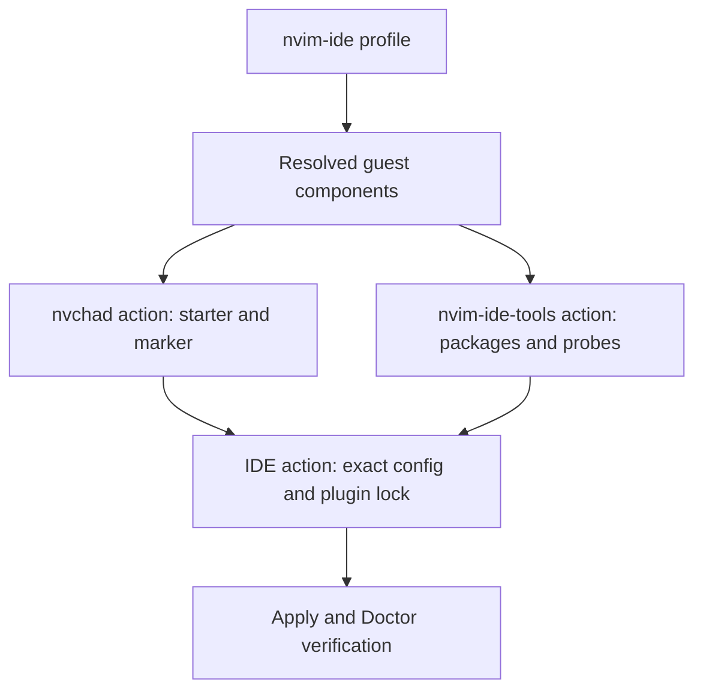
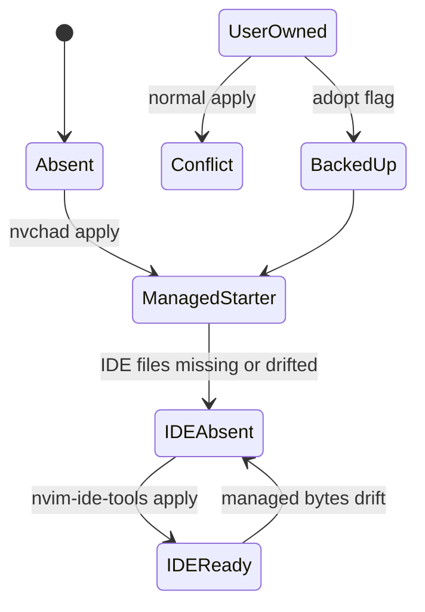

# ZZA-102 WSL NvChad IDE 재현 - Plan

**Target repository:** `zzanghyunmoo/my-desk-setup`

이 문서는 Notion [ZZA-102 WSL NvChad IDE 재현 계획](https://app.notion.com/p/3b1ef22ad4fc81048ec9ee92fedf0be9)을 canonical source로 동기화한 로컬 계획이다.

## Goal Capsule

- **Objective:** Linux guest에서 `mds apply --profile nvim-ide` 한 번으로 C++, Go, Python용 NvChad IDE를 재현한다.
- **Authority:** 사용자 결정과 이 Product Contract가 우선하며, catalog lock과 ownership 계약이 구현 세부사항을 제한한다.
- **Execution profile:** `catalog → editor ownership → IDE configuration → CLI → contract/runtime tests` 순서로 구현한다.
- **Stop conditions:** 사용자 소유 `~/.config/nvim`을 명시적 adoption 없이 변경하거나 인증·로그인을 자동화해야 하면 중단한다.
- **Tail ownership:** PR merge 전 최신 head의 CI와 code/doc review를 통과하고, merge 뒤 workspace KB·Notion·Linear closeout을 완료한다.

---

## Product Contract

### Summary

`nvim-ide`는 Linux guest에 필요한 C++, Go, Python runtime, Neovim/NvChad와 IDE 도구만 선택한다. 설치 결과는 exact artifact와 plugin revision, 실행 가능한 tool probe, mds ownership marker로 재검증할 수 있어야 한다. 이 범위는 상위 Product Contract의 guest ownership, pinned development core와 target evidence 결정을 구체화한다(see origin: `docs/brainstorms/2026-07-29-my-desk-setup-requirements.md`, R15, R28, R40).

### Problem Frame

수동으로 구성한 WSL NvChad 환경은 새 guest에서 같은 language server, formatter, linter와 debugger를 재현하기 어렵다. 기존 사용자 설정을 자동으로 덮어쓰면 복구 불가능한 손실이 생기고, 선택하지 않은 IDE 도구를 참조하는 설정을 게시하면 선택 설치 계약도 깨진다.

### Requirements

**Selection and reproducibility**

- R1. `nvim-ide` profile은 C++, Go, Python runtime과 Neovim, NvChad, IDE tooling만 선택하며 agent와 desktop component를 제외한다.
- R2. Neovim, NvChad starter, lazy.nvim, NvChad와 전체 plugin graph, Pyright는 reviewed immutable identity로 고정한다.
- R3. clangd, gopls, Pyright, clang-format, clang-tidy, lldb-dap, dlv, Ruff와 debugpy를 설치 후 실행 검증한다.
- R4. `nvchad` 단독 선택은 존재하지 않는 language tool을 참조하는 IDE 설정을 게시하지 않는다.

**Ownership and migration**

- R5. 일반 apply는 사용자 소유 `~/.config/nvim`을 변경하지 않고 conflict로 보고한다.
- R6. `--adopt-nvchad`를 명시한 apply만 기존 configuration을 UTC timestamp와 고유 suffix가 붙은 backup으로 보존한 뒤 mds 관리 상태로 전환한다.
- R7. 기존 mds-managed NvChad에 IDE 설정이 없거나 drift되면 `nvim-ide-tools` action이 이를 ready로 오판하지 않고 복구한다.

**Operational boundary**

- R8. editor, package manager와 AI agent의 인증·로그인·token 저장은 사용자가 직접 수행한다.

### Acceptance Examples

- AE1. 깨끗한 Ubuntu 26.04 WSL에서 `nvim-ide` profile을 apply하면 선택된 열 개 component가 모두 ready가 되고 agent/desktop component는 plan에 없다. Covers R1-R3.
- AE2. 사용자 소유 `~/.config/nvim`이 있는 상태에서 일반 apply를 실행하면 원본 tree가 그대로 남고 conflict가 보고된다. Covers R5.
- AE3. 같은 상태에서 `--adopt-nvchad`를 사용하면 원본 tree가 발견 가능한 backup으로 이동하고 managed marker가 게시된다. Covers R6.
- AE4. managed NvChad starter만 있거나 IDE 설정 한 파일이 drift된 상태에서 `nvim-ide-tools`를 apply하면 exact managed bytes와 plugin lock이 복구된다. Covers R4, R7.

### Scope Boundaries

- Windows host editor 설정, 사용자 설정의 자동 병합과 backup 자동 삭제는 범위 밖이다.
- WSL과 Lima가 공유하는 Linux guest profile 계약은 범위에 포함한다.
- 인증과 credential 관리는 범위 밖이며 사용자가 설치 후 직접 실행한다.
- 실제 Linux guest certification의 반복 운영은 별도 certification workflow가 소유한다.

---

## Planning Contract

### Key Technical Decisions

- KTD1. NvChad starter ownership과 IDE configuration ownership을 `nvchad`와 `nvim-ide-tools` action으로 분리한다. 이 경계가 R4의 선택 설치와 R7의 migration 복구를 동시에 보장한다.
- KTD2. user-owned tree는 in-place 수정하지 않고 명시적 adoption에서만 sibling backup으로 이동한다. 일반 apply와 update가 사용자 데이터를 암묵적으로 소유하지 않게 한다.
- KTD3. lazy.nvim bootstrap과 NvChad/plugin graph는 branch 이름이 아니라 40-character commit과 managed `lazy-lock.json`으로 고정한다. 실행 전후 실제 checkout의 HEAD와 clean 상태를 검증하고 content-addressed mds runtime 경로에서만 로드한다.
- KTD4. package catalog의 두 기본 probe는 빠른 관찰에 사용하고 전체 formatter/linter/debugger probe는 component verification에 추가한다. Doctor와 apply verification이 전체 readiness를 판정한다.
- KTD5. Neovim artifact authority는 vendor lock 하나로 유지하고 중복 mise Neovim entry를 제거한다.
- KTD6. CLI adapter 전달 값은 named option struct로 묶어 PR #2의 guest bootstrap archive와 `--adopt-nvchad`를 함께 보존한다.

### Assumptions

- Ubuntu 26.04 WSL과 Lima Ubuntu guest는 catalog에 선언한 apt package 이름과 executable을 제공한다.
- NvChad exact commit의 imported plugin set은 managed lock의 31개 entry와 일치하며 lazy.nvim bootstrap revision은 별도 단일 authority로 유지한다.
- 사용자는 privileged package 설치 전 guest에서 필요한 sudo preflight를 직접 수행한다.

### High-Level Technical Design

Profile resolution과 action ownership은 다음 방향으로 흐른다.

Neovim tree의 관찰·변경 상태는 ownership과 사용자의 adoption 선택으로 결정한다.

### Sequencing

U1이 exact catalog와 lock authority를 만든 뒤 U2가 ownership 및 IDE state transition을 구현한다. U3은 두 unit을 CLI에 연결하고 전체 계약·runtime 검증과 운영 문서를 완성한다.

---

## Implementation Units

### U1. Catalog graph and immutable identities

- **Goal:** Linux guest의 exact `nvim-ide` component graph와 단일 artifact/plugin authority를 정의한다.
- **Requirements:** R1-R4.
- **Dependencies:** 없음.
- **Files:** `catalog/components/guest.yaml`, `catalog/profiles/nvim-ide.yaml`, `catalog/profiles/certification-wsl-guest.yaml`, `catalog/profiles/certification-lima-guest.yaml`, `catalog/locks/versions.lock.yaml`, `catalog/mise.toml`, `catalog/mise.lock`, `tests/contracts/catalog_test.go`, `tests/golden/plans/notion-cli-lima.json`.
- **Approach:** `nvim-ide-tools`가 C/Go/Python tool dependencies를 소유하게 하고 exact profile set을 contract test로 고정한다. Neovim vendor lock과 plugin lock 외의 중복 version authority는 제거한다.
- **Patterns to follow:** 기존 capability resolution, target support matrix, catalog revision과 plan digest golden 계약을 따른다.
- **Test scenarios:**
  - Covers AE1. WSL target에서 `nvim-ide`를 resolve하면 기대한 열 개 component만 나오고 agent/gui kind는 없다.
  - Catalog bytes가 바뀌면 catalog revision과 golden plan digest가 함께 바뀐다.
  - WSL/Lima certification profile은 `nvim-ide-tools`와 모든 dependency를 blocker 없이 resolve한다.
- **Verification:** catalog validation과 golden plan exact-match 테스트가 통과하고 Neovim version authority가 vendor lock 하나만 남는다.

### U2. NvChad ownership and IDE configuration state

- **Goal:** user-owned tree를 보존하면서 starter와 IDE 설정을 독립적으로 관찰·게시·복구한다.
- **Requirements:** R2, R4-R7.
- **Dependencies:** U1.
- **Files:** `internal/adapters/guest/editor.go`, `internal/adapters/guest/editor_config.go`, `internal/adapters/guest/plugin_tree.go`, `internal/adapters/guest/ide.go`, `internal/adapters/guest/adapter.go`, `internal/adapters/guest/plugin_tree_test.go`, `internal/adapters/guest/editor_real_smoke_test.go`, `tests/adapters/guest_components_runtime_test.go`.
- **Approach:** `Editor`는 pinned starter와 marker, adoption backup을 소유하고 검토된 base plugin graph를 코드 실행 전에 준비한다. `IDE`는 managed marker를 확인한 뒤 exact config와 31-entry plugin lock을 durable write하며, 최종 headless restore/health 뒤 실제 checkout HEAD·clean 상태와 lock bytes를 재검증한다.
- **Execution note:** ownership refusal, adoption, missing-config migration과 drift repair 테스트를 먼저 실패시키고 state transition을 구현한다.
- **Patterns to follow:** 기존 `adapters.Component`의 Observe/Apply/Verify 계약, symlink refusal과 `internal/durable` atomic publication을 따른다.
- **Test scenarios:**
  - Covers AE2. user-owned regular directory와 symlink/non-regular path는 일반 apply에서 변경되지 않는다.
  - Covers AE3. explicit adoption은 원본 bytes를 timestamped backup에 보존하고 starter marker만 게시한다.
  - Covers AE4. starter가 ready여도 IDE config가 없으면 IDE observation은 absent이며 apply 후 exact bytes가 ready다.
  - Covers AE4. managed config 한 파일이 drift되면 absent로 관찰하고 apply가 exact bytes를 복구한다.
  - `nvchad` 단독 apply 뒤 LSP/plugin files가 존재하지 않는다.
  - lazy.nvim/NvChad commit과 lock의 31개 plugin commit이 모두 exact 40-character identity다.
  - 최초 plugin checkout이 없어도 Verify가 restore하고, checkout SHA 또는 실행 코드가 drift되면 ready를 거부한다.
  - 실제 Neovim은 base와 IDE 설정을 headless로 로드하고 restore/health를 완료하며 종료 코드 0으로 출력된 초기화 오류도 실패로 판정한다.
- **Verification:** adapter unit/race 테스트와 opt-in real Neovim smoke가 통과하고 일반 apply가 user-owned tree를 변경하지 않으며 managed drift는 복구된다.

### U3. CLI wiring, complete probes, and operator contract

- **Goal:** named adapter options와 full tool verification을 CLI에 연결하고 사용자가 재현·진단할 수 있는 계약을 문서화한다.
- **Requirements:** R3, R6-R8.
- **Dependencies:** U1, U2.
- **Files:** `internal/cli/apply.go`, `internal/cli/root.go`, `internal/cli/apply_internal_test.go`, `internal/cli/doctor.go`, `internal/cli/update.go`, `internal/adapters/packages/functional.go`, `internal/adapters/packages/mise_test.go`, `tests/unit/cli_test.go`, `docs/operations/wsl-nvchad-ide.md`.
- **Approach:** apply만 `AllowAdopt`를 전달하고 update는 `AllowReplace`만 전달한다. 선택 plan에 `nvchad`가 없으면 adoption flag를 mutation 전에 거부하며, component Verify가 전체 IDE executable을 bounded command로 실행한다.
- **Patterns to follow:** PR #2의 `adapterOptions`, catalog verification allowlist, action-required와 invalid-input error taxonomy를 따른다.
- **Test scenarios:**
  - `--adopt-nvchad`와 `--guest-bootstrap-archive`가 named options 경로에서 서로 손실되지 않는다.
  - 성공하는 WSL apply에서 `--adopt-nvchad`가 production adapter factory의 `AllowAdopt`까지 전달된다.
  - `nvchad`를 선택하지 않은 apply의 adoption flag는 invalid-input이고 state root를 만들지 않는다.
  - clangd/gopls가 있어도 clang-format, clang-tidy, lldb-dap, dlv, ruff 또는 debugpy probe가 실패하면 component Verify와 Doctor가 ready가 아니다.
  - auth/login/token 문자열이나 command가 plan, apply 또는 launcher에 추가되지 않는다.
- **Verification:** CLI/unit/package tests가 통과하고 운영 문서는 normal apply, adoption, backup 이름과 인증 경계를 정확히 설명한다.

---

## Verification Contract

| Gate | Command or evidence | Pass condition |
| --- | --- | --- |
| Go regression | `go test ./...` | 모든 package, contract, integration과 unit test 통과 |
| Race regression | `go test -race ./internal/adapters/... ./internal/cli/... ./tests/adapters ./tests/contracts ./tests/unit` | 영향 범위 race failure 없음 |
| Static analysis | `go vet ./...` | 진단 없음 |
| Command builds | `go build` for `cmd/mds`, `cmd/mds-evidence`, `cmd/mds-release` | 세 command 모두 build 성공 |
| Workflow and shell | `actionlint`, tracked shell scripts의 `shellcheck`, `git diff --check` | workflow, shell과 whitespace 진단 없음 |
| Contract proof | exact profile graph, ownership/migration, plugin lock와 tool probe tests | R1-R8과 AE1-AE4 회귀 테스트 통과 |
| Runtime proof | 실제 Neovim network smoke와 깨끗한 Ubuntu 26.04 WSL의 reviewed plan apply/doctor | 로컬 base·IDE plugin graph restore/health 통과, WSL 선택 component 전체 ready, auth 미실행 |
| Merge gate | 최신 PR head의 GitHub checks와 code/doc review markers | required check green, 두 marker pass |

---

## Risks & Dependencies

- Ubuntu package 이름이나 executable이 바뀌면 manager-owned IDE probe가 실패한다. Catalog target certification에서 이를 감지하고 version/target 계약을 함께 갱신한다.
- Pinned plugin commit이 upstream에서 제거되거나 NvChad exact commit과 호환되지 않으면 headless bootstrap이 실패한다. Lock update는 전체 graph 재생성과 runtime smoke evidence를 요구한다.
- Adoption은 원본을 backup으로 이동하는 명시적 mutation이다. backup 위치를 receipt와 운영 문서에서 발견 가능하게 유지하고 자동 삭제하지 않는다.
- 실제 guest runtime proof는 host와 WSL/Lima availability에 의존한다. 미실행 target은 자동 테스트와 구분해 work evidence에 기록한다.

---

## Definition of Done

- R1-R8과 AE1-AE4가 U1-U3의 test scenario와 verification evidence로 추적된다.
- U1은 exact Linux guest component graph와 단일 Neovim/plugin identity authority를 제공한다.
- U2는 user-owned refusal, explicit backup adoption, nvchad-only selection boundary와 managed IDE migration/drift repair를 제공한다.
- U3은 apply-only adoption, PR #2 option compatibility, 전체 IDE tool probe와 auth 제외 운영 문서를 제공한다.
- 최신 PR head의 로컬 검증, GitHub CI와 code/doc review가 통과한다.
- clean WSL runtime proof와 미실행 target이 work evidence에 구분되어 기록된다.
- 중복 계획·solution 사본, 실험용 코드와 생성된 build artifact가 최종 diff에 남지 않는다.
- Merge 뒤 KB, Notion 기능 현황·티켓 결과, work evidence와 Linear 상태를 closeout한다.

---

## Sources & Traceability

- Linear: [ZZA-102](https://linear.app/zzanghyunmoo/issue/ZZA-102/make-the-wsl-nvchad-cgopython-ide-reproducible-with-mds-apply)
- PR: [my-desk-setup #3](https://github.com/zzanghyunmoo/my-desk-setup/pull/3)
- Work evidence: `docs/works/2026-08-01-ZZA-102-wsl-nvchad-ide-work.md` in `zzanghyunmoo/Workspaces`
- Canonical Notion implementation: [ZZA-102 ticket](https://app.notion.com/p/3b1ef22ad4fc813d954be68816256def)
