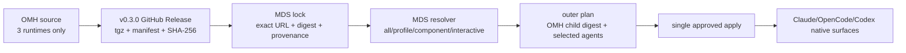

# Host Agent Harness 기본 설치 및 Pi 완전 제거 - Plan

## Goal Capsule

- **Objective:** macOS와 Windows host에서 `my-desk-setup`의 한 번의 preview/apply로
  Pi-free `oh-my-harness`, 공통 workflow 10개, OpenCode OMO Ultimate와 Codex
  LazyCodex OMO Light를 재현한다.
- **Product authority:**
  [Notion canonical requirements](https://app.notion.com/p/3b1ef22ad4fc81a69238fb03cf4b3438)
- **Tracking:**
  [Linear ZZA-103](https://linear.app/zzanghyunmoo/issue/ZZA-103/host-agent-harness-%EA%B8%B0%EB%B3%B8-%EC%84%A4%EC%B9%98-%EB%B0%8F-pi-%EC%99%84%EC%A0%84-%EC%A0%9C%EA%B1%B0)
  · [Notion ticket](https://app.notion.com/p/3b1ef22ad4fc8171ae2fe9b74843f4fb)
  · [OMH canonical implementation](https://app.notion.com/p/3b1ef22ad4fc816299bbc1445da68856)
- **Execution order:** `oh-my-harness` Pi purge와 self-contained release contract → local
  release fixture를 이용한 `my-desk-setup` 통합 → OMH `0.3.0` release → exact production
  lock과 macOS/Windows actual certification → 두 PR closeout과 root submodule pointer 갱신.
- **Open blockers:** 없음. 외부 release 설정과 실제 Windows runner 접근은 execution
  gate에서 확인하며, 인증과 사용자 home의 기존 Pi 데이터 삭제는 자동화하지 않는다.

---

## Product Contract

### Summary

macOS와 Windows host의 AI coding agent 환경은 `my-desk-setup`의 동일한 resolver와
preview-first apply 경로로 `oh-my-harness` 및 공통 workflow를 기본 설치한다.
OpenCode에는 OMO Ultimate를, Codex에는 LazyCodex OMO Light를 exact pin으로 설치하며,
`oh-my-harness`의 maintained tree와 release payload에서는 Pi 제품·호환·migration
surface를 완전히 제거한다.

### Requirements

- **R1.** macOS와 Windows의 기본 host plan은 `oh-my-harness`와 공통 workflow를
  포함해야 한다.
- **R2.** 전체 설치와 같은 resolver를 통해 harness와 agent를 선택적으로 설치할 수
  있어야 한다.
- **R3.** OpenCode OMO Ultimate와 Codex LazyCodex OMO Light를 exact provenance와
  digest로 설치해야 한다.
- **R4.** Claude Code, OpenCode, Codex의 runtime-native surface에 exact 공통 workflow
  `{goal, deep-research, ideation, brainstorm, plan, code-review, doc-review, skill-creator,
  ralph-loop, security-guidance}`를 적용해야 한다.
- **R5.** `oh-my-harness` maintained tree에는 Pi product, compatibility, migration,
  dependency, documentation 또는 test contract가 남지 않아야 한다.
- **R6.** 기존 사용자 소유 설정과 plugin registration을 보존하고 불일치 충돌은 첫
  mutation 전에 실패해야 한다.
- **R7.** `my-desk-setup`은 released `oh-my-harness`와 Node artifact identity 및 exact child
  preview digest를 outer plan digest에 결합해야 한다. agent가 없는 harness-only 선택도
  canonical empty child digest를 가져야 한다.
- **R8.** normal apply는 pinned release를 올리지 않으며 version 이동은 reviewable
  catalog/lock update로만 수행해야 한다.
- **R9.** auth, login, token과 credential 상태는 plan, apply, receipt, log와 doctor
  범위에서 제외해야 한다.
- **R10.** macOS와 Windows actual target에서 기본 설치, 선택 설치, repeat apply와
  conflict-preservation evidence를 남겨야 한다.

### Acceptance Examples

- **AE1.** 깨끗한 macOS host에서 기본 profile을 plan/apply하면 세 agent와 R4의 exact
  workflow 10개, OMO와 LazyCodex가 exact pin으로 준비된다.
- **AE2.** 깨끗한 Windows host에서 같은 profile을 적용하면 macOS와 같은 logical
  inventory가 native path와 launcher로 준비된다.
- **AE3.** harness만 선택한 plan은 agent executable을 임의로 추가하지 않는다.
- **AE4.** 같은 source, version, managed content와 registration identity의 plugin이 이미
  등록되어 있으면 repeat apply는 no-op이다.
- **AE5.** 같은 plugin ID가 다른 source, version, managed content 또는 registration
  identity로 존재하면 사용자 파일을 덮어쓰지 않고 conflict를 보고한다.
- **AE6.** OMH current tree나 packed release에서 Pi 관련 maintained product surface가
  발견되면 release gate가 실패한다.

### Scope Boundaries

- 기존 사용자 home의 Pi 데이터 자동 탐지 또는 삭제
- agent 및 외부 CLI의 인증 자동화
- Linux guest component inventory 재설계
- Codex LSP unsupported 경계를 ready로 승격
- 현재 한 사용자의 전체 개인 plugin inventory를 기본 profile에 복제
- Git history rewrite로 과거 Pi commit을 제거
- OMO 또는 LazyCodex를 현재 검증 pin보다 최신으로 올리는 별도 update

---

## Planning Contract

### Architecture



### Key Technical Decisions

#### KTD1. Physical removal, not inactive compatibility

`oh-my-harness` current tree와 release payload에서 Pi runtime, adapter, dependency,
v1 migration/removal preview, profile/catalog/receipt contract, docs, tests, scripts와
vocabulary를 제거한다. 삭제 사실을 기록하는 티켓·계획·work·KB는 root workspace와
Notion에 두어 OMH product tree에 새 Pi 유지 surface를 만들지 않는다. Git history와
사용자 home state는 건드리지 않는다.

#### KTD2. Preserve pins through complete offline snapshots

OMO Ultimate와 LazyCodex OMO Light의 현재 검증 pin `4.19.2`와 immutable provenance
검사를 보존한다. OpenCode OMO는 mutable registry spec을 설치 identity로 사용하지 않고
reviewed tarball과 실행에 필요한 exact dependency closure(`zod@4.1.8`)를 함께
content-addressed local snapshot으로 materialize한다. source archive, package/dependency
manifest, entry point와 전체 snapshot tree digest가 모두 맞은 뒤에만 local `file:` spec을
등록한다. exact prior reviewed remote spec만 upgrade 대상으로 분류하고 user-owned,
duplicate, malformed 또는 foreign registration은 충돌로 보존한다. 이 작업에서 upstream
최신 버전을 추종하는 것은 별도 reviewed lock update로 미룬다.

#### KTD3. Run OMH on an internal Node dependency

OMH의 `node >=22.19.0` runtime 계약을 Bun 호환으로 추정하지 않는다. MDS에 macOS와
Windows용 exact official Node `22.19.x` artifact를 lock한 `dependency-only` component를
추가하고 OMH component가 그것에만 의존하도록 한다. 이 component는 direct selection,
interactive picker와 `--all` root set에 노출하지 않고 dependency closure에서만 선택해,
일반 host language runtime이라는 공개 지원 계약을 만들지 않는다.

#### KTD4. GitHub Release is the immutable distribution seam

OMH는 `private: true` npm package이므로 npm publish 자격과 registry 설정을 새 범위로
넓히지 않는다. exact shrinkwrap에서 production dependency를 vendoring한 self-contained
staging tree를 만들고 canonical build 뒤 그 tree를 `.tgz`로 pack한다. 기존
`src/catalog/release.ts`와 `harness/catalog/release.json`을 확장해 전체 file manifest,
checksum, source commit/tree, catalog revision과 package version의 단일 authority로 삼아
GitHub Release에 non-overwrite로 발행한다. MDS는 URL, SHA-256과 provenance를 함께 pin한다.
publish 전 실패는 source SHA로 소유권이 증명된 draft와 업로드 자산을 보존해 운영자가
검사·재시도할 수 있게 한다. 실패 경로에서 draft를 자동 삭제하거나 published release를
overwrite/delete하지 않는다.

#### KTD5. Selection does not invent agents

MDS의 `oh-my-harness` component는 기존 `cli` kind를 재사용하고 agent component에
의존하지 않는다. `owner`, `--all`, host certification profile에서는 세 agent와 harness가
함께 선택되지만, `--component oh-my-harness`는 dependency-only Node와 harness CLI만
준비한다. OMH의 MDS 전용 `mds-host` profile은 CLI package를 전혀 소유하지 않고 exact
workflow 10개와 caller-supplied agent 집합만 합성한다. selected agents가 없으면 action과
native registration이 비어 있는 canonical empty child plan과 stable digest를 반환한다.
MDS는 agent executable의 유일한 owner이며 OMH child는 executable acquisition을 하지 않고
MDS가 제공한 executable identity만 preflight한다. MDS의 세 agent lock은 OMH release의
adapter와 동일한 native release archive, version, platform executable SHA-256을 사용한다.
Plan-time child preview 전에 선택된 agent artifact도 검증된 temporary snapshot으로
materialize해, apply가 설치할 동일 bytes를 OMH가 검사하도록 한다.

#### KTD6. One approval digest spans the child preview

MDS outer `planning.Action.Inputs`에 child schema/digest, 정렬된 workflow·agent·add-on
목록과 native-config의 domain-separated SHA-256 및 secret-free ownership summary를
포함한다. config 원문과 absolute path는 memory 밖으로 직렬화하지 않는다. plan은 exact
Node와 OMH archive를 temporary verified snapshot으로 materialize해 child preview를
실행하고 digest만 보존한다. apply는 모든 artifact와 child/config preflight를 다시 완료해
같은 digest를 확인한 뒤 첫 mutation을 허용한다. plan/apply/status/doctor는 하나의
composer를 사용하며 child나 preimage가 달라지면 stale-plan으로 중단한다.

#### KTD7. Fail closed at ownership and update boundaries

user-owned native registration이 source/version/content/registration 기준으로 다르면
overwrite하지 않는다. OMH child preview는 Claude, OpenCode, Codex의 native registration을
read-only로 검사하고 충돌 시 action을 전혀 만들지 않는다. MDS apply 앞의 plan-wide
read-only phase는 OMH child artifact, digest, native registration과 ownership 충돌을 먼저
재검증한 뒤에만 Apply를 시작하며, OMH와 무관한 adapter의 기존 preflight lifecycle은
변경하지 않는다. `mds update`가 child composition을 안전하게 지원하기 전까지 OMH version
이동은 reviewed catalog/lock PR에서만 허용하고 일반 update 경로는 명시적으로 실패한다.
auth, login, provider, model, telemetry consent는 child argv와 evidence에 포함하지 않는다.

### System-Wide Impact

- **Catalog:** OMH는 기존 `cli` kind를 쓰고 MDS schema에는 dependency-only selection
  policy가 추가된다. lock, host profile와 certification profile은 OMH와 internal Node
  runtime identity를 포함한다.
- **Planning:** I/O 없는 base resolver 위에 verified read-only child preview composition
  계층이 생기고 outer digest input이 확장된다.
- **Execution:** runner의 plan-wide read-only phase는 OMH child/native 경계만 선검증하고
  host router는 OMH에만 custom wrapper를 사용한다. 기존 package adapters의 preflight와
  install behavior는 유지한다.
- **State:** outer receipt와 evidence가 child digest/identity를 추적하지만 secret이나
  개인 absolute path는 저장하지 않는다. OMH receipt는 canonical resolution 뒤 실제로
  변경한 native config target을 기록하고, interrupted apply recovery는 당시 selection을
  묶어 다른 profile/agent/state root로 복구가 drift하지 않게 한다. 이전 selection-less
  OpenCode source-verification record는 호환 복구만 허용한다.
- **Release:** MDS schema/composer는 OMH local release fixture와 병행 개발할 수 있지만
  production lock, actual certification과 landing은 OMH release 뒤에 수행한다. 최종 landing은
  OMH → MDS → root submodule pointer 순서를 지킨다.
- **User data:** managed payload만 다루고 사용자 소유 native config와 기존 Pi home state는
  보존한다.

### Assumptions

- OMH next release version은 현재 `0.2.0`과 bytes/behavior가 구분되는 `0.3.0`이다.
- Node exact patch는 구현 시 공식 release artifact와 checksum을 검증해 lock한다.
- GitHub repository release workflow 실행 권한은 merge 시 확인할 수 있다. repository
  setting의 immutable-release 지원 여부와 무관하게 workflow non-overwrite와 consumer
  digest 검사를 필수로 둔다.
- Plan-time child bootstrap은 verified temporary snapshots만 만들고 managed state와 native
  config는 변경하지 않는다. apply는 같은 digest의 bytes를 reacquire하거나 검증된 cache
  hit만 사용한다.
- 실제 Windows certification runner가 일시적으로 unavailable이어도 Windows logical
  support를 simulated evidence로 대체하지 않는다.

### Risks and Mitigations

- **Broad legacy deletion:** active v2 call graph와 package allowlist를 먼저 고정하고 삭제
  후 full OMO/native registration suites를 실행한다.
- **Version drift/collision:** package/plugin/marketplace/MCP/native registration version을
  한 source에서 파생하고 coherence test를 둔다.
- **Agent artifact drift:** MDS agent lock과 OMH adapter의 native archive/version/executable
  SHA-256을 cross-repository fixture와 actual-target 검사로 결합한다.
- **Two-digest TOCTOU:** child preview와 preimage를 outer digest에 포함하고 apply 직전에
  재구성한다.
- **Release asset mutation/partial publish:** workflow는 current source SHA marker가 있는
  draft만 recoverable staging으로 취급하고 모든 asset/manifest/digest를 검증한 뒤 한 번의
  publish transition을 수행한다. 실패한 owned draft는 자동 삭제하지 않고 보존해 exact
  draft ID와 검증 실패를 이용한 수동 점검·재시도를 가능하게 한다. published release는
  overwrite/delete하지 않고 consumer SHA-256/provenance pin을 함께 사용한다.
- **Supply-chain first publish:** workflow 기본 권한은 비우고 release job에만
  `contents: write`를 부여한다. checkout credential persistence를 끄고 third-party actions를
  full commit SHA에 고정하며 tag가 reviewed main merge commit을 가리키지 않으면 실패한다.
- **Dependency closure:** release archive는 exact shrinkwrap의 production dependency와 전체
  file manifest를 포함한다. 각 runtime add-on snapshot도 reviewed entry point가 요구하는
  exact transitive runtime dependency까지 포함하고, empty npm cache와 network-disabled
  smoke를 통과해야 한다.
- **Hung child:** child process별 hard timeout과 전체 preview deadline을 두고 timeout이면
  process tree를 종료한 뒤 mutation 없는 deterministic blocker를 반환한다.
- **Windows path divergence:** shell-neutral executable/argv, `.exe`/verified shim과 actual
  Windows evidence를 요구한다.
- **Scope drift:** OMO/LazyCodex upgrade, Linux guest redesign, auth automation과 user-home
  cleanup을 별도 티켓으로 분리한다.

---

## Implementation Units

### U1. OMH 3-runtime contract와 physical purge

- **Goal:** OMH product tree와 package input을 Claude/OpenCode/Codex 전용으로 만든다.
- **Files:**
  - Modify: `projects/oh-my-harness/AGENTS.md`
  - Modify: `projects/oh-my-harness/README.md`
  - Modify: `projects/oh-my-harness/CONCEPTS.md`
  - Modify: `projects/oh-my-harness/.gitignore`
  - Delete: `projects/oh-my-harness/settings.example.json`
  - Delete: `projects/oh-my-harness/extensions/`
  - Delete: `projects/oh-my-harness/tsconfig.workspace-connectors-tests.json`
  - Delete: `projects/oh-my-harness/src/migration/v1.ts`
  - Rewrite only: `projects/oh-my-harness/docs/solutions/architecture-patterns/one-cli-policy-multiple-agent-surfaces.md`
    and `projects/oh-my-harness/docs/solutions/workflow/fixed-native-runtime-installation.md`
  - Modify: `projects/oh-my-harness/docs/solutions/conventions/cross-platform-node-harness-boundaries.md`
  - Modify: `projects/oh-my-harness/docs/solutions/workflow/unified-preview-first-management-cli.md`
  - Delete: every other Pi-matching legacy profile, blueprint, brainstorm, ideation, plan,
    solution and work document under `projects/oh-my-harness/docs/`
- **Approach:** active v2 compile/package call graph 밖의 extension bundle, v1 inspection과
  removal preview, Pi package/profile/history corpus를 제거한다. 위 네 allowlisted solution의
  immutable snapshot과 single-CLI 원칙만 3-runtime neutral pattern으로 다시 쓰고, 그 밖의
  matching document는 preservation 판단 없이 삭제한다. current contract는 retired runtime
  migration/removal 기능을 제공하지 않으며 사용자 local state를 추정하지 않는다.
- **Test scenarios:** current tree와 package input의 retired surface 0건, three-runtime exact
  set, no user-home mutation path.
- **Traceability:** R5, R6, R9 / AE5, AE6 / KTD1.
- **Dependencies:** 없음.

### U2. OMH generic contracts, exact add-ons와 `0.3.0` identity

- **Goal:** Pi-specific negative fixtures를 generic closed contract로 바꾸면서 OMO와
  LazyCodex 기능 및 package identity를 보존한다.
- **Files:**
  - Modify: `projects/oh-my-harness/src/catalog/load.ts`
  - Modify: `projects/oh-my-harness/src/environment/native-registration.ts`
  - Modify: `projects/oh-my-harness/harness/catalog/{agents.json,upstreams/registry.json,release.json}`
  - Modify: `projects/oh-my-harness/package.json`
  - Modify: `projects/oh-my-harness/npm-shrinkwrap.json`
  - Modify: `projects/oh-my-harness/.claude-plugin/marketplace.json`
  - Modify: `projects/oh-my-harness/plugins/oh-my-harness/{.claude-plugin,.codex-plugin}/plugin.json`
  - Modify: `projects/oh-my-harness/plugins/oh-my-harness/mcp/*.mjs`
  - Create: `projects/oh-my-harness/harness/profiles/mds-host.json`
  - Modify: desired-state/profile schemas and the OMH CLI preview contract
  - Modify/delete: Pi-specific fixtures under `projects/oh-my-harness/tests/`
- **Approach:** hardcoded `0.2.0` expected version을 단일 package/version contract에서
  파생하고 manifest, native registration과 release catalog를 `0.3.0`으로 동기화한다.
  Pi-only tests를 unknown runtime, exact `{claude,opencode,codex}` set, package allowlist와
  version coherence positive assertions로 교체한다. OMO/LazyCodex `4.19.2` acquisition,
  provenance, native collision와 recovery 경로는 유지한다. OpenCode는 reviewed tarball과
  exact dependency closure를 content-addressed local snapshot으로 만들고 그 entry point를
  `file:` spec으로 등록한다. exact prior remote spec은 안전하게 upgrade하되 다른 사용자
  plugin과 충돌 registration은 보존한다. `mds-host` profile은 CLI
  packages를 빈 집합으로, capabilities를 exact workflow 10개로 고정하며 agents를 caller
  override로 받는다. composition-only mode에서는 runtime acquisition을 금지하고 MDS가
  제공한 executable identity만 검사한다. child preview는 선택된 세 runtime 각각의
  source/version/content/registration identity와 local snapshot identity를 read-only 검사하고
  malformed, partial, duplicate 또는 user-owned collision이면 action 없는 blocked result를
  반환한다. 빈 agent
  집합에는 action/registration이 없는 canonical child plan과 stable digest를 반환한다.
- **Test scenarios:** unknown runtime rejection, exact three-runtime descriptors, all version
  surfaces coherent, OMO/LazyCodex acquisition and registration suites green, empty child stable
  digest, composition-only runtime ownership, Claude/OpenCode/Codex conflict fixtures의 null plan,
  zero mutation command와 zero managed-state mutation, repeat no-op.
- **Traceability:** R3-R6 / AE4-AE6 / KTD1, KTD2.
- **Dependencies:** U1.

### U3. OMH immutable GitHub Release artifact

- **Goal:** MDS가 source checkout이나 mutable latest 대신 검증된 OMH archive를 설치하게
  한다.
- **Files:**
  - Create: `projects/oh-my-harness/.github/workflows/release.yml`
  - Modify: `projects/oh-my-harness/scripts/release.mjs`
  - Modify: `projects/oh-my-harness/src/catalog/release.ts`
  - Create: `projects/oh-my-harness/src/catalog/release-command.ts`
  - Create: `projects/oh-my-harness/src/types/tar-stream.d.ts`
  - Modify: `projects/oh-my-harness/harness/catalog/release.json` and its schema
  - Modify: `projects/oh-my-harness/tests/release/release-manifest.test.ts`
  - Modify: `projects/oh-my-harness/tests/release/package-contents.test.ts`
- **Approach:** `v0.3.0` tag, package version, source commit/tree와 catalog revision을
  fail closed 검증한다. exact shrinkwrap으로 production-only dependency staging tree를 만든
  뒤 canonical `dist`와 함께 self-contained `.tgz`로 pack하고, canonical release catalog에
  full file manifest와 SHA-256 provenance를 기록한다. workflow 기본 permissions는 비우고
  publish job에만 `contents: write`를 부여한다. checkout credential persistence를 끄고 모든
  action을 full commit SHA로 고정하며 reviewed main merge commit이 아닌 tag와 기존
  published release/asset overwrite를 거부한다. asset은 source SHA marker가 있는 draft에
  모두 staging하고 API에서 exact filename/size/content digest를 재검증한 뒤 한 번의 publish
  transition을 수행한다. publish 전 실패나 취소 뒤에는 owned draft를 보존하고 exact draft
  ID를 오류에 포함해 수동 검사·재시도를 지원하며 published release는 변경하지 않는다.
  empty npm cache와 network-disabled clean
  location에서 version/preview, arbitrary-CWD와 platform launcher를 검사한다.
- **Test scenarios:** tag/version mismatch failure, duplicate asset failure, exact checksum,
  safe self-contained archive, full file manifest, network-disabled install/preview smoke,
  least-privilege workflow, reviewed-main tag and source/package identity equality, partial upload
  preserved draft inspection/retry와 published release non-overwrite.
- **Traceability:** R7, R8, R10 / F4 / KTD4.
- **Dependencies:** U2.

### U4. MDS harness schema, dependency-only Node와 local fixture

- **Goal:** published release를 기다리지 않고 host resolver와 selection contract를 구현하되
  Node를 user-facing language runtime으로 노출하지 않는다.
- **Files:**
  - Create: `projects/my-desk-setup/tests/fixtures/catalog/host-harness/`
  - Modify: `projects/my-desk-setup/catalog/schema/environment.schema.json`
  - Modify: `projects/my-desk-setup/internal/catalog/{types,validate}.go`
  - Modify: `projects/my-desk-setup/internal/catalog/resolve.go`
  - Modify: `projects/my-desk-setup/internal/planning/resolver.go`
  - Modify: `projects/my-desk-setup/internal/cli/arguments.go`
- **Approach:** 기존 `cli` kind의 OMH fixture와 `build` kind의 Node fixture, 세 agent의 exact
  native archive/version/executable SHA-256 fixture를 만들고 component
  selection policy에 `dependency-only`를 추가한다. dependency-only component는 direct
  selection, interactive roots와 `--all` root selection에서는 거부/제외하지만 OMH dependency
  closure에는 포함한다. fixture는 U3의 local self-contained archive와 exact Node checksum을
  사용한다. Plan-time에는 선택된 agent fixture도 verified temporary snapshot으로 materialize해
  child가 apply 예정 bytes를 검사한다. production embedded catalog/lock/profile 값은 U8에서
  U7 release identity와 동일한 adapter identity로 넣는다.
- **Test scenarios:** schema/fixture validation, dependency-only direct selection rejected,
  all/interactive roots hide Node, OMH-only closure includes Node but excludes agent executables,
  guest plan excludes host harness.
- **Traceability:** R1, R2, R7, R8 / AE1-AE3 / KTD3-KTD5.
- **Dependencies:** U3의 release contract와 local fixture.

### U5. MDS child preview composer와 host harness adapter

- **Goal:** OMH native plan을 MDS outer approval과 execution lifecycle 안에 안전하게
  결합한다.
- **Files:**
  - Create: `projects/my-desk-setup/internal/harness/preview.go`
  - Create: `projects/my-desk-setup/internal/artifact/snapshot.go`
  - Create: `projects/my-desk-setup/internal/planning/compose.go`
  - Create: `projects/my-desk-setup/internal/cli/plan_builder.go`
  - Create: `projects/my-desk-setup/internal/adapters/host/harness.go`
  - Modify: `projects/my-desk-setup/internal/adapters/component.go`
  - Modify: `projects/my-desk-setup/internal/adapters/host/adapter.go`
  - Modify: `projects/my-desk-setup/internal/adapters/router.go`
  - Modify: `projects/my-desk-setup/internal/transport/port.go`
- **Approach:** plan-time에 exact Node, self-contained OMH archive와 선택된 native agent
  artifact를 verified temporary snapshot으로 acquire/extract하고 fixed argv, bounded output,
  strict JSON으로 `mds-host` child preview를 실행한다. child environment는 deny-by-default로
  구성하고 platform별 system/temp/locale/home/config-root와 검증된 executable만 포함한 trusted
  `PATH`만 allowlist한다. token, key, cloud/repository credential 변수는 전달하지 않는다.
  process별 hard timeout과 전체 preview deadline을 적용하고 timeout이면 process tree를
  종료한 뒤 mutation 없는 deterministic blocker를 반환한다. resolver-selected agents와 MDS-owned
  executable identity만 전달하고 exact 10 workflow, agent-scoped OMO/LazyCodex, secret-free
  config digest/ownership summary와 child digest를 outer action inputs에 넣는다. 빈 agent
  집합도 canonical empty child digest를 받는다. custom host adapter는 approved digest만
  apply하고 runtime acquisition은 하지 않으며 exact release와 native readiness를
  observe/verify한다.
- **Test scenarios:** plan snapshot leaves managed state unchanged, deterministic sorted inputs,
  selected-agent-only/empty child plans, child/config digest changes alter outer digest, raw secret
  and absolute path never serialize, shell/auth argv absent, sentinel token/key environment가 child에
  없음, hung child의 process-tree 종료와 deterministic blocker, 세 runtime collision before
  mutation, apply exact child digest.
- **Traceability:** R1-R7, R9 / F1-F3 / AE1-AE5 / KTD5-KTD7.
- **Dependencies:** U4.

### U6. MDS lifecycle, receipt와 update gates

- **Goal:** stale, crash, retry, update와 evidence 경계에서도 하나의 approval contract를
  유지한다.
- **Files:**
  - Create: `projects/my-desk-setup/internal/planning/compose_test.go`
  - Create: `projects/my-desk-setup/internal/adapters/host/harness_test.go`
  - Modify: `projects/my-desk-setup/internal/execution/{preflight,runner}.go`
  - Modify: `projects/my-desk-setup/internal/cli/{root,apply,doctor,update}.go`
  - Modify: `projects/my-desk-setup/tests/contracts/catalog_test.go`
  - Modify: `projects/my-desk-setup/tests/unit/{selection,cli}_test.go`
  - Modify: `projects/my-desk-setup/tests/integration/{plan_readonly,apply_recovery,receipt_contract}_test.go`
  - Modify: `projects/my-desk-setup/internal/update/plan.go`
- **Approach:** root plan, apply, doctor와 update의 직접 `planning.Build` 호출을 공용
  `plan_builder`/composer로 교체한다. existing execution preflight를 모든 selected action의
  전역 lifecycle로 확장하지 않고, OMH action에 한해 child artifact/digest/native registration/
  ownership validation을 먼저 완료하는 plan-wide phase를 둔 뒤 apply loop를 시작한다.
  outer/inner digest와 action outcome은 secret-free
  receipt/evidence로 남기고 unsupported OMH update는 fail closed한다. crash 뒤 observation
  기반 수렴과 exact repeat no-op을 기존 runner recovery 모델에 연결한다.
- **Test scenarios:** any OMH child/native conflict gives zero apply calls, stale child gives zero apply
  calls, first apply then repeat no-op, crash recovery, conflict preserves files, every CLI entry
  uses one composer, receipt retains plan identity, update cannot bypass child approval, token-bearing
  fixture and absolute-home-path scan green.
- **Traceability:** R2, R6-R10 / AE3-AE5 / KTD6, KTD7.
- **Dependencies:** U5.

### U7. OMH PR, canonical review와 release handoff

- **Goal:** Pi-free OMH code를 reviewed main과 immutable `0.3.0` asset으로 만든다.
- **Files/evidence:**
  - `docs/works/2026-08-03-ZZA-103-oh-my-harness-pi-removal-release-work.md`
  - OMH PR comments/checks/release manifest and actual-target evidence
- **Approach:** project branch에서 U1-U3을 구현하고 최신 head에 `ce-code-review`와
  `ce-doc-review`를 수행한다. U4-U6의 local release fixture로 MDS child preview/apply 계약이
  green인 것을 tag 생성 전에 확인한다. passing marker와 guarded merge evidence를 준비한 뒤 별도
  current-turn approval packet을 받아 merge한다. merge commit에 tag를 만들고 release
  workflow 결과의 asset/provenance를 MDS lock handoff로 기록한다.
- **Test scenarios:** all canonical suites on macOS/Ubuntu/Windows, U4-U6 local MDS consumer
  contract, packed release clean verification, exact OMO/LazyCodex native discovery, draft-stage
  recovery와 release asset digest match.
- **Traceability:** R3-R10 / AE4-AE6.
- **Dependencies:** U1-U6.

### U8. MDS PR과 actual macOS/Windows certification

- **Goal:** released OMH를 기본·선택 설치하는 MDS의 실제 host evidence를 확보한다.
- **Files/evidence:**
  - `docs/works/2026-08-03-ZZA-103-my-desk-setup-host-harness-work.md`
  - Create: `projects/my-desk-setup/catalog/components/host-harness.yaml`
  - Modify: `projects/my-desk-setup/catalog/components/agents.yaml`
  - Modify: `projects/my-desk-setup/catalog/locks/versions.lock.yaml`
  - Modify: `projects/my-desk-setup/catalog/profiles/{owner,certification-macos-host,certification-windows-host}.yaml`
  - Modify: `projects/my-desk-setup/catalog/schema/lock.schema.json`
  - Modify: `projects/my-desk-setup/internal/adapters/host/{adapter,agents}.go`
  - `projects/my-desk-setup/.github/workflows/{ci,target-certification}.yml`
  - target evidence produced by `projects/my-desk-setup/scripts/certify-target.sh`
- **Approach:** U7의 published asset URL, SHA-256, source commit/tree, catalog revision과 exact
  Node patch/checksums을 embedded production lock에 넣는다. 세 agent는 OMH `0.3.0` adapter와
  동일한 native release archive, version과 platform executable SHA-256으로 lock하고
  owner/all/certification host가 세
  agents와 OMH를 선택하도록 한다. dependency-only Node는 OMH closure로만 포함한다. 이어
  macOS/Windows clean certification account에서 owner/default, harness-only, first apply,
  repeat apply, conflict preservation와 doctor readiness를 실행한다. evidence는 outer/inner
  digest와 exact identity만 포함하고 personal path와 auth material은 제거한다. 최신 head의
  code/doc review와 guarded merge evidence를 준비한다.
- **Test scenarios:** AE1-AE5 on both actual targets, certification evidence schema/scan,
  Windows native launcher and path, no auth command, exact repeat no-op.
- **Traceability:** R1-R10 / AE1-AE5.
- **Dependencies:** U4-U7 and U7의 published OMH identity.

### U9. Merge closeout과 reproducible workspace pointers

- **Goal:** merged product state, evidence와 parent workspace revision을 같은 상태로 닫는다.
- **Files:**
  - Create: `docs/kb/agent-tooling/2026-08-03-ZZA-103-host-agent-harness-pi-removal.md`
  - Modify: U7/U8 work evidence closeout sections
  - Modify: root `projects/oh-my-harness` and `projects/my-desk-setup` gitlinks
  - Update: Notion 기능 현황·티켓 pages and Linear ZZA-103
- **Approach:** OMH PR merge/release 뒤 MDS PR을 merge한다. 각 child closeout에 merge
  commit, KB/Notion link와 actual evidence를 기록한다. 마지막 closeout 뒤 Linear를 Done으로
  바꾸고 OMH → MDS 순서의 merged revisions로 root main submodule pointers를 commit/push한다.
- **Test scenarios:** guarded closeout check, root `git submodule status`, child HEAD equals
  origin/main, clean reproducible clone pointers, Notion/local/Linear links agree.
- **Traceability:** R10 and overall delivery governance.
- **Dependencies:** U7, U8.

---

## Verification Contract

### OMH canonical gates

```sh
npm ci --ignore-scripts
npm run typecheck
npm run build
npm run catalog:verify
npm run test:unit
npm run test:contracts
npm run test:integration
npm run test:runtime:claude
npm run test:runtime:opencode
npm run test:runtime:codex
npm run test:harness
npm run package:verify
git diff --check
```

The release gate additionally verifies the current tracked tree and packed artifact contain no
retired runtime directory, dependency, adapter, migration/removal contract, profile/catalog/receipt
key, test fixture, script or product-document reference. The packed archive must contain the exact
production dependency closure and full file manifest, and must run version/preview with an empty npm
cache and network disabled. The publishing workflow uses least privilege, full-SHA actions, a
reviewed-main tag check, recoverable draft staging, verified single publish transition and published
release non-overwrite semantics.

### MDS canonical gates

```sh
go test ./...
go test -race ./...
go vet ./...
go build ./cmd/mds ./cmd/mds-evidence ./cmd/mds-release
GOOS=windows GOARCH=amd64 go build ./cmd/mds ./cmd/mds-evidence ./cmd/mds-release
actionlint -color
git diff --check
```

Repository shell scripts are checked with `shellcheck` when available. Tests that need network use
controlled fixtures or verified local artifacts; canonical unit/contract gates do not resolve
`latest`.

### Actual-target gates

- **macOS:** clean certification user, owner/default apply, harness-only plan/apply, repeat no-op,
  conflict preservation, doctor ready, exact OMH/workflows/OMO/LazyCodex discovery.
- **Windows:** the same logical inventory through native executable/path handling and Windows CI
  plus actual certification runner evidence.
- **Security/evidence:** no auth/login command, credential-shaped material or personal absolute home
  path in plan, receipt, logs and evidence. Sentinel credentials are absent from the child environment;
  hung children are terminated within the process/overall deadlines without mutation.
- **Release:** downloaded `0.3.0` asset SHA-256 and provenance match MDS lock; source-checkout-only
  success is insufficient.

### Review and landing gates

- Each child project PR latest head has separate `ce-code-review` and `ce-doc-review` comments and
  a current `ce-review:v1` passing marker from an authorized collaborator.
- Every new commit makes old review evidence stale and requires both reviews again.
- Merge uses `runbooks/guarded-pr-merge.sh --workflow-evidence <work-file>` only after a current-turn
  approval packet names repo, PR, title, head/base, method, commit text, branch deletion and Linear
  transition.
- Root workspace main pointer commits happen only after corresponding child merges and closeout.

---

## Definition of Done

- [ ] OMH current tree와 release payload에는 Pi product/compatibility/migration surface가
  없고 Claude/OpenCode/Codex, 공통 workflow, OMO/LazyCodex canonical suites가 green이다.
- [ ] OMH `0.3.0` asset의 exact source provenance와 SHA-256이 발행되고 MDS lock에 동일하게
  고정된다.
- [ ] MDS default/all/profile/component flows가 단일 resolver와 approval digest를 사용하며
  harness-only는 agent executable을 추가하지 않고 stable empty child digest를 사용한다.
- [ ] Node는 OMH dependency-only runtime으로만 노출되고 MDS가 agent executable acquisition의
  유일한 owner이며 세 agent bytes/version/SHA-256은 OMH adapter identity와 일치한다.
- [ ] user-owned config conflict는 mutation 전에 실패하고 auth와 기존 Pi home data는
  untouched이다.
- [ ] macOS와 Windows actual certification evidence가 first apply, repeat no-op, conflict
  preservation, doctor readiness와 exact native discovery를 증명한다.
- [ ] 두 project PR의 latest-head code/doc reviews, guarded merges, work/KB/Notion closeout과
  Linear Done이 완료된다.
- [ ] root workspace main이 merged OMH와 MDS revisions를 submodule pointers로 재현한다.

## Open Questions

없음. Node exact patch/checksum과 release commit/tree 값은 U3/U4 사이의 generated immutable
handoff 값이며 제품 결정을 다시 요구하지 않는다.
