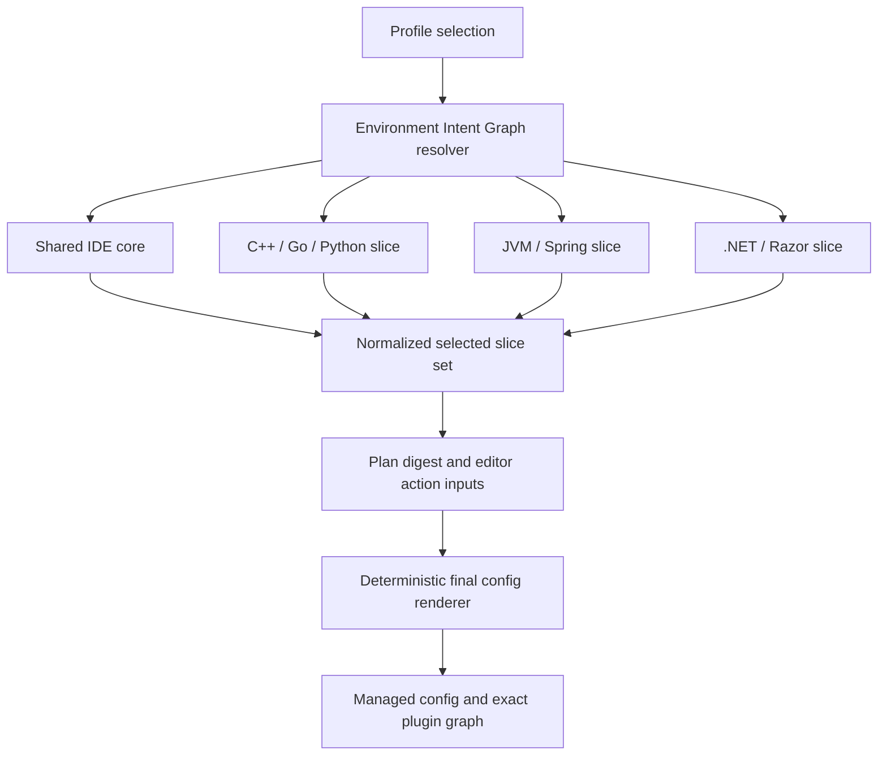
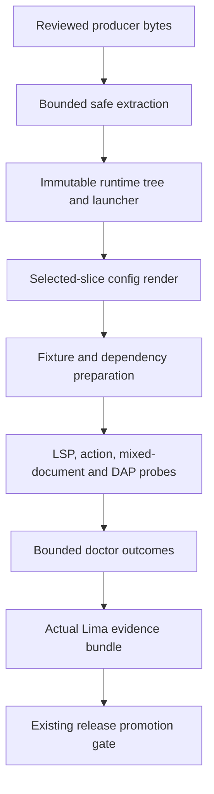
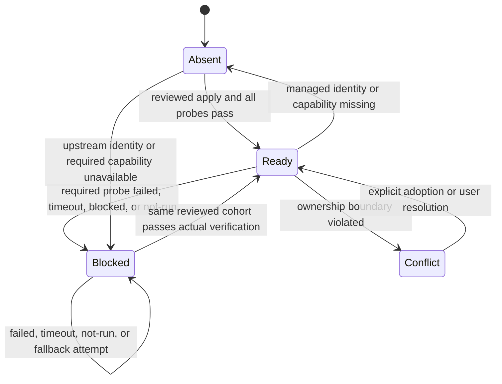

# Lima NvChad JVM and .NET IDE - Plan

## Goal Capsule

- **Objective:** MacBook의 Apple Silicon Lima Ubuntu guest에서 관리형 NvChad 하나로 기존 C++·Go·Python과 Java·Kotlin·C#의 편집, build, test, run, watch와 실제 breakpoint debugging을 제공한다.
- **Authority:** Notion canonical 요구사항, 이 Product Contract, Planning Contract, repository invariants 순으로 해석하며 구현 편의 때문에 acceptance를 낮추지 않는다.
- **Path ownership:** `docs/brainstorms/`, `docs/plans/`, `docs/works/`, `docs/solutions/`는 workspace repo 기준이다. `catalog/`, `internal/`, `tests/`, `.github/`, `scripts/`와 project `README.md`는 target repo `projects/my-desk-setup` 기준이다.
- **Execution profile:** workspace evidence와 Notion 구현 문서를 먼저 연 뒤 project repo의 별도 branch에서 구현하고 PR을 생성한다. LFG는 PR과 green CI까지 소유하며 merge는 별도 사용자 승인 전 실행하지 않는다.
- **Stop conditions:** exact upstream identity를 확정할 수 없거나 실제 Kotlin DAP, Spring, Razor/Blazor capability가 실패하면 placeholder나 fallback으로 우회하지 않고 해당 profile을 non-ready로 남긴다.
- **Ownership boundary:** user-owned `~/.config/nvim`은 명시적 adoption 없이는 읽기 전용 conflict 대상이며 managed config, runtime tree, fixture cache만 수리한다.
- **Workflow exceptions:** Linear ticket과 별도 persistent ideation artifact는 frontmatter의 사용자 승인 사유로 면제한다. Notion dual publishing, work evidence, project branch/PR, review와 actual-target evidence는 유지한다.

---

## Product Contract

Product Contract preservation: unchanged from the confirmed origin; planning resolves only implementation-owned questions and approved workflow waivers.

### Summary

Lima guest의 기본 NvChad 환경에 독립 JVM 및 .NET profile과 두 영역을 기존 언어 지원과 합친 full profile을 추가한다.
공통 실행 경험과 fail-closed verification을 도입해 Spring Boot와 ASP.NET Core API·MVC/Razor·Blazor의 실제 개발 결과를 ready 판정의 근거로 삼는다.

### Problem Frame

현재 관리형 NvChad IDE는 C++·Go·Python용 단일 `nvim-ide-tools` graph만 제공한다.
Java·Kotlin·Gradle은 catalog와 lock에 일부 존재하지만 Lima target에서 unsupported이고, .NET SDK·Roslyn/Razor·NetCoreDbg는 catalog와 editor configuration에 없다.
기존 package adapter는 단일 executable 발행을 전제로 하며 current doctor는 실제 project import, mixed-document LSP, run/watch와 breakpoint outcome을 증명하지 않는다.

### Requirements

**Profiles and target ownership**

- R1. 1차 지원은 Lima Ubuntu guest에 한정하며 language runtime, build tool, language server, debugger와 NvChad configuration은 guest가 소유해야 한다.
- R2. `nvim-ide-jvm`과 `nvim-ide-dotnet`은 독립 선택할 수 있어야 하며 `nvim-ide-full`은 두 profile과 기존 C++·Go·Python IDE capability를 합성해야 한다.
- R3. `lima-guest` 기본 profile은 `nvim-ide-full`을 선택해야 한다.
- R4. 신규 runtime, build tool, language server, debugger와 plugin은 review 가능한 immutable identity로 고정되어야 하며 normal apply가 이를 몰래 갱신해서는 안 된다.
- R5. 기존 사용자 소유 `~/.config/nvim`은 명시적인 adoption 없이 변경하지 않고, 기존 mds-managed configuration의 누락이나 drift만 안전하게 복구해야 한다.

**JVM and Spring Boot**

- R6. Java와 Kotlin source에서 project-aware navigation, completion, diagnostics, refactoring, formatting과 import 관리가 동작해야 한다.
- R7. Gradle wrapper 기반 Java·Kotlin 프로젝트의 import, build, test와 run이 project root에서 동작해야 한다.
- R8. Java Spring Boot source와 `application*.properties` 및 YAML에서 framework-aware navigation, completion과 diagnostics를 제공해야 한다.
- R9. Kotlin Spring Boot source는 Kotlin LSP의 언어 기능, Gradle project model과 Spring 설정 파일 지원을 제공해야 한다.
- R10. Java와 Kotlin application 및 test는 NvChad의 공통 debugging UI에서 breakpoint, continue, step-in, step-over와 variable inspection을 지원해야 한다.
- R11. 공식 Kotlin LSP가 선택된 Gradle/Spring Boot fixture에서 기능 검증을 통과하지 못하면 JVM profile을 ready로 판정해서는 안 된다.

**.NET and ASP.NET Core**

- R12. .NET SDK는 C# console, library와 test project 및 ASP.NET Core Web API·MVC/Razor·Blazor project를 restore, build, test와 run할 수 있어야 한다.
- R13. C# source에서 solution-aware navigation, completion, diagnostics, refactoring과 formatting이 동작해야 한다.
- R14. `.cshtml`과 `.razor`의 C#·HTML mixed document에서 completion, diagnostics, navigation과 formatting을 제공해야 한다.
- R15. ASP.NET Core project는 `launchSettings.json` profile을 존중하는 run과 watch를 제공하고 사용자가 launch profile을 선택할 수 있어야 한다.
- R16. C# application, ASP.NET Core server와 test는 NvChad의 공통 debugging UI에서 breakpoint, continue, step-in, step-over와 variable inspection을 지원해야 한다.

**Execution experience and verification**

- R17. 사용자는 NvChad 안에서 현재 project의 build, test, run, watch와 debug action을 발견하고 실행할 수 있어야 하며 실패 결과를 terminal 또는 diagnostic surface에서 확인할 수 있어야 한다.
- R18. 관리형 Neovim은 0.12 이상의 검토된 exact release를 사용하고 기존 C++·Go·Python LSP, formatter, lint와 DAP 기능을 보존해야 한다.
- R19. doctor는 executable 존재뿐 아니라 managed configuration, exact plugin/runtime identity와 언어별 실제 project capability를 검증해야 한다.
- R20. 선택된 profile의 필수 capability 하나라도 실패하면 apply 또는 doctor는 ready를 반환하지 않고 실패 지점을 식별해야 한다.

### Key Flows

- F1. Lima default provisioning
  - **Trigger:** 사용자가 MacBook의 Lima target에 기본 `lima-guest` profile을 plan하고 reviewed digest로 apply한다.
  - **Steps:** resolver가 full editor slice closure를 plan identity에 고정하고 guest adapter가 exact runtime, config, plugin graph와 verification fixtures를 적용한다.
  - **Outcome:** repeat plan/apply가 같은 identity와 no-op outcome을 보이며 전체 capability가 ready다.
- F2. JVM project workflow
  - **Trigger:** 사용자가 Gradle 기반 Java 또는 Kotlin Spring Boot project를 NvChad로 연다.
  - **Steps:** project root와 toolchain을 해석하고 LSP, build, test, run과 debug action을 공통 surface에서 실행한다.
  - **Outcome:** 언어별 필수 capability가 실제 결과로 확인되고 실패한 capability는 JVM 및 full readiness를 차단한다.
- F3. ASP.NET Core workflow
  - **Trigger:** 사용자가 Web API, MVC/Razor 또는 Blazor project를 연다.
  - **Steps:** SDK, solution/project와 launch profile을 해석하고 C#·mixed-document LSP, run/watch와 debug action을 실행한다.
  - **Outcome:** source 편집부터 server 실행과 breakpoint inspection까지 같은 environment에서 동작한다.
- F4. Managed repair
  - **Trigger:** managed configuration, plugin checkout, runtime tree 또는 verification fixture가 누락되거나 drift된다.
  - **Steps:** plan과 doctor가 owning capability를 식별하고 reviewed apply가 선택된 editor slice closure만 exact state로 복구한다.
  - **Outcome:** user-owned configuration과 검증된 인접 slice는 보존되고 managed state만 재현된다.

### Acceptance Examples

- AE1. 깨끗한 Apple Silicon Lima Ubuntu guest에서 기본 profile은 full closure를 plan하며 apply 뒤 repeat plan/apply가 같은 identity와 no-op outcome을 보인다.
- AE2. user-owned `~/.config/nvim`이 있으면 normal apply는 conflict를 반환하고 explicit adoption만 unique backup 뒤 managed ownership을 게시한다.
- AE3. Java Spring Boot fixture에서 Java 및 Spring navigation·completion·diagnostics, format, build, test, run과 실제 breakpoint debugging이 통과한다.
- AE4. Kotlin Spring Boot fixture에서 Kotlin navigation·completion·diagnostics·format, Spring config support, build, test, run과 실제 breakpoint debugging이 통과한다.
- AE5. Kotlin Spring source에 Java Spring Tools와 같은 bean·endpoint semantics가 없어도 AE4의 bounded capability가 모두 통과하면 ready일 수 있다.
- AE6. ASP.NET Core Web API와 MVC/Razor fixture에서 C#·`.cshtml` editing, restore, build, test, launch-profile run, watch와 실제 debugging이 통과한다.
- AE7. Blazor fixture에서 `.razor` mixed-document editing, run, watch와 실제 debugging이 통과한다.
- AE8. Neovim compatibility epoch 이동 뒤 기존 C++·Go·Python LSP, format, lint, DAP와 exact plugin checkout regression이 모두 통과한다.
- AE9. 필수 language server, debugger, mixed-document 또는 project-action probe가 실패·미실행·timeout이면 doctor와 certification은 ready/verified를 반환하지 않는다.

### Scope Boundaries

**Deferred to follow-up work**

- WSL guest의 JVM/.NET 지원과 Windows actual-target certification
- macOS host의 JDK, Kotlin, Gradle 또는 .NET SDK 직접 설치
- root workspace의 submodule pointer closeout과 merge KB는 project PR merge 승인 뒤 수행

**Outside this product's identity**

- Kotlin Spring source의 Java Spring Tools 동등 bean·endpoint semantic integration 개발
- Android, Kotlin Multiplatform, Unity, Xamarin 또는 .NET MAUI 전용 환경
- package feed credential, 개발용 HTTPS certificate trust 또는 로그인 자동화
- user-owned Neovim configuration의 무단 교체

### Success Criteria

- JVM-only와 .NET-only profile은 공통 IDE core 외의 다른 language slice를 끌어오지 않으며 full closure는 legacy+JVM+.NET의 정확한 합집합이다.
- normal apply는 exact production lock만 소비하고 moving feed, Mason install 또는 runtime latest resolution을 실행하지 않는다.
- production doctor와 actual Lima certification은 동일 project-action 및 protocol probe authority를 사용한다.
- repository의 기존 four-target release promotion gate는 Lima-first feature acceptance 때문에 약화되지 않는다.

### Sources

- `docs/brainstorms/2026-08-21-lima-nvchad-jvm-dotnet-requirements.md`
- `docs/solutions/architecture-patterns/managed-neovim-runtime-repair-boundaries.md`
- `docs/solutions/integration-issues/cross-repository-release-identity-chain.md`
- `internal/adapters/guest/editor_config.go`
- `internal/adapters/guest/plugin_tree.go`
- `internal/adapters/packages/vendor.go`
- `internal/artifact/snapshot.go`
- `internal/doctor/checks.go`
- [Neovim v0.12.4](https://github.com/neovim/neovim/releases/tag/v0.12.4)
- [Eclipse JDT Language Server](https://github.com/eclipse-jdtls/eclipse.jdt.ls)
- [Spring Tools](https://github.com/spring-projects/spring-tools/releases)
- [JetBrains Kotlin LSP](https://github.com/Kotlin/kotlin-lsp)
- [.NET release metadata](https://builds.dotnet.microsoft.com/dotnet/release-metadata/releases-index.json)
- [roslyn.nvim](https://github.com/seblyng/roslyn.nvim)
- [NetCoreDbg](https://github.com/Samsung/netcoredbg)

---

## Planning Contract

### Assumptions

- JVM-only와 .NET-only profile은 shared IDE core만 포함하고 기존 `nvim-ide` profile은 C++·Go·Python 의미를 보존한다.
- project root 또는 launch profile이 유일하면 자동 선택하고 동률 후보가 둘 이상이면 stable ordered picker를 제공한다.
- project action은 단일 NvChad palette에 `build`, `test`, `run`, `watch`, `debug-app`, `debug-test` 순서로 노출한다. 선택한 project가 지원하지 않는 action은 disabled reason을 표시하고, 취소는 부작용 없이 종료하며, 실패 결과는 동일 action이 연 terminal/diagnostic surface에 귀속한다.
- Gradle wrapper/import, MSBuild target, launch profile, watch 또는 debugger처럼 project-controlled code를 실행하기 전 canonical project identity에 대한 explicit workspace trust를 요구한다. Untrusted workspace는 non-executing text editing만 허용한다.
- managed server/debugger는 MDS exact identity를 따르며 user project의 Gradle wrapper, Java toolchain, `global.json`과 dependencies는 project authority로 존중한다.
- build, test, run, watch, debug-app과 debug-test는 공통 action vocabulary를 사용하고 UI와 headless verification이 같은 resolved action을 소비한다.
- 이 변경은 Lima actual evidence를 추가하지만 repository stable release의 기존 multi-target promotion breadth를 축소하지 않는다.
- Spring Tools, .NET SDK와 Roslyn/Razor의 미확정 exact payload는 U2에서 producer metadata와 checksum을 고정한 뒤에만 production catalog에 들어간다.

### Key Technical Decisions

- KTD1. **Profile composition stays in the Environment Intent Graph.** Profile nesting을 추가하지 않고 shared core, legacy, JVM과 .NET component/capability root를 기존 resolver로 합성한다. 이는 `ResolveProfile`과 `ResolveSelection`의 단일 의미를 보존한다.
- KTD2. **Selected editor slices are plan identity.** Planner가 normalized selected slice set을 각 editor action input과 digest에 고정하고 모든 editor action은 같은 pure renderer로 identical final config와 plugin expectation을 계산한다. 여러 action이 같은 managed path를 서로 다른 bytes로 쓰는 last-writer drift를 금지한다.
- KTD3. **Multi-file tools publish as immutable runtime trees.** Existing `Snapshotter`의 bounded safe extraction을 재사용하되 archive identity, normalized tree manifest, canonical launcher, ownership marker와 atomic directory publication을 하나의 contract로 추가한다. `Vendor.Install`의 single-executable path는 그대로 유지한다.
- KTD4. **Neovim and Razor form a compatibility epoch.** Neovim 0.12.4, NvChad/plugin commits, roslyn.nvim, Roslyn server, Razor payload와 delegated HTML language service는 partial upgrade할 수 없는 reviewed tuple로 다룬다. 기존 language regression과 `.cshtml`/`.razor`의 C#·HTML mixed-document probe가 모두 통과해야 epoch가 production lock이 된다.
- KTD5. **Server runtimes and project runtimes are separate authorities.** JDT LS, Spring Tools와 Kotlin LSP는 pinned private launcher/runtime을 사용하고 project Java/Gradle toolchain은 project metadata로 선택한다. .NET action은 managed SDK와 project `global.json`의 resolution 결과를 함께 보고한다.
- KTD6. **Project actions are typed, shell-free sessions.** Root detector가 executable, argv, cwd, bounded environment, timeout, output와 lifecycle을 가진 action을 만들고 NvChad palette와 production Verify가 함께 사용한다. Long-lived action은 `start`, bounded streamed I/O, `wait`, `cancel`, process-tree cleanup을 가진 companion session transport를 사용하고 `idle → selecting → running → succeeded|failed|cancelled`를 따른다. 같은 project의 long-lived action 재호출은 기존 task를 stop한 뒤 restart한다. Dynamic shell string, credential inheritance와 silent root/profile guessing을 허용하지 않는다.
- KTD7. **Capability receipts fail closed without carrying secrets.** 각 planning action은 bounded expected capability ID set을 plan identity에 고정하고 doctor/evidence component check는 versioned `CapabilityCheck` collection으로 artifact, config/plugin, LSP/mixed-document, project action, DAP와 actual-target 결과를 담는다. missing, duplicate, unknown, failed, timeout, blocked와 not-run은 aggregate를 non-ready로 만든다. Persisted receipt에는 raw environment, source content, DAP variable value와 unbounded stdout/stderr를 넣지 않고 기존 redaction/scanner를 통과한 bounded attribution만 허용한다.
- KTD8. **Fixtures and dependency caches are managed inputs, not user projects.** Source-controlled minimal fixtures, Gradle dependency-verification metadata, NuGet locked-mode files와 producer-built cache archives를 exact graph identity 아래 prepare한다. Cache는 content-addressed read-only manifest로 게시하며 Verify는 user-writable cache를 재사용하지 않고 network-disabled temporary fixture copy만 사용한다. Doctor는 user checkout을 수정하지 않는다.
- KTD9. **Project execution requires explicit trust.** Canonical root identity에 대한 user trust가 없으면 LSP의 project import를 포함한 Gradle wrapper, restore/build target, launch profile, watch와 DAP process를 시작하지 않는다. Trust prompt 취소와 no-candidate path는 typed non-ready reason을 반환하고 project 파일이나 managed state를 바꾸지 않는다.

### High-Level Technical Design

**Component composition**

**Apply and verification data flow**

**Readiness state transitions**

### Sequencing

U1 opens durable workflow evidence before implementation.
U2 fixes exact external identities and catalog contracts before any launcher depends on them.
U3 publishes runtime trees before U4 renders absolute launcher paths.
U5 establishes shared actions and probes before language slices specialize them.
U6 and U7 may proceed independently after U3-U5, but U8 requires both and the legacy regression lane.

### System-Wide Impact

- **Catalog and planning:** exact artifact and selected editor slice identities become part of canonical catalog/plan digest behavior.
- **Apply and repair:** multiple editor capabilities share managed paths while retaining ownership and adjacent-slice preservation.
- **Runtime:** Java, Kotlin and .NET language services add memory-heavy processes and per-project mutable caches; runtime trees remain immutable and cleanup is bounded.
- **Doctor and evidence:** verification grows from executable smoke to project/protocol outcome and can be slower; failure attribution must remain bounded and secret-free.
- **Developer UX:** root/profile ambiguity becomes an explicit picker rather than silent heuristics, and run/watch actions gain cancel and cleanup behavior.
- **Release operations:** actual Apple Silicon Lima evidence is required for feature verification while existing global promotion policy stays unchanged.

### Alternatives Considered

- **Profile nesting:** rejected because current profile schema intentionally selects components/capabilities and new nesting would create a second composition model.
- **One complete Lua config per profile:** rejected because duplicated final files drift and component action order can remove an earlier slice.
- **Mason or moving package feeds during apply:** rejected because normal apply must not resolve new identity and doctor must verify reviewed bytes.
- **One-file vendor extraction for language servers:** rejected because sibling JAR/DLL/runtime files are executable state and require whole-tree identity.
- **Handshake-only LSP/DAP verification:** rejected because it cannot prove mixed-document responses, verified breakpoint stops, scopes or variables.

### Risks and Mitigations

| Risk | Impact | Mitigation |
| --- | --- | --- |
| Kotlin Alpha DAP reports a breakpoint but never stops | JVM/full cannot meet required debugging | Require stopped event, stack/scopes/variables and step outcomes; preserve blocked evidence without fallback |
| Roslyn/Razor feed cadence breaks the compatibility tuple | C# may work while `.cshtml`/`.razor` silently regress | Pin the complete epoch and gate any partial update with mixed-document fixtures |
| Spring Tools payload provenance remains ambiguous | Unreviewed or incomplete JAR graph could ship | Resolve producer artifact, hash and extracted manifest in U2 before catalog eligibility changes |
| Full doctor becomes slow or network-dependent | Routine readiness checks become unreliable | Prepare exact dependencies during apply, run offline temporary fixture copies and record bounded per-capability timing |
| Untrusted project executes wrapper, build target, launch profile or debugger code | Guest files, credentials or network authority may be abused before user intent is known | Bind explicit trust to canonical project identity and prohibit every project-controlled process while untrusted |
| Action, diagnostic or DAP output leaks a secret into durable evidence | CI, doctor JSON or evidence archive can retain credentials | Persist only bounded redacted attribution and run canary-secret scans across every receipt surface |
| ASP.NET launch profile binds outside loopback | A development server may be exposed through Lima networking or host forwarding | Default run/watch and certification fixtures to ephemeral loopback; require an explicit per-action override for non-loopback |
| Shared editor repair removes an adjacent slice | Independent profile and full config drift | Bind normalized slice set into each action and add all composition/repair matrix tests |
| Multi-file extraction accepts unsafe or partial trees | Managed home paths or execution identity can be compromised | Reuse snapshot budgets/path checks, reject links/nonregular entries and atomically publish marker+manifest+tree |
| Neovim 0.12 breaks existing plugins | Existing C++·Go·Python capability regresses | Treat upgrade as compatibility epoch and require full exact plugin plus real legacy smoke before default switch |
| Actual Lima resources are insufficient | Certification times out or flakes | Bound concurrency/time/output, isolate caches and report blocked infrastructure separately from capability failure |

---

## Implementation Units

### U1. Open workflow evidence and implementation authority

- **Goal:** Create the workspace work evidence from the canonical template and a Notion implementation page before code changes.
- **Requirements:** R1-R5, R19-R20; workflow waivers and dual-publishing contract.
- **Dependencies:** None.
- **Files:** Workspace `docs/works/2026-08-21-NO-TICKET-lima-nvchad-jvm-dotnet-work.md`; no target-repo code files.
- **Approach:** Record `NO-TICKET`, both approved waivers, canonical Notion requirements/plan links, target branch, intended PR and verification baseline. Keep closeout pending and do not invent a Linear URL or status.
- **Patterns to follow:** `docs/works/_template.md` and the workspace Notion-first synchronization rules.
- **Test scenarios:** Test expectation: none — this unit establishes review and workflow evidence without product behavior.
- **Verification:** Work evidence is parseable, links the exact plan and Notion pages, and states all skipped workflow stages with concrete user-approved reasons.

### U2. Lock the external compatibility cohort and catalog contract

- **Goal:** Represent every JVM/.NET/Neovim runtime and plugin with reviewed platform identity before enabling Lima support.
- **Requirements:** R1-R4, R11-R12, R18-R20; F1; AE1, AE8-AE9.
- **Dependencies:** U1.
- **Files:** `catalog/components/guest.yaml`, `catalog/locks/versions.lock.yaml`, `catalog/mise.toml`, `catalog/mise.lock`, `catalog/schema/environment.schema.json`, `catalog/schema/lock.schema.json`, `internal/catalog/types.go`, `internal/catalog/validate.go`, `internal/catalog/canonical.go`, `internal/catalog/mise.go`, `tests/contracts/catalog_test.go`, `internal/catalog/validate_test.go`.
- **Approach:** Start from confirmed Neovim 0.12.4, JDT LS 1.60.0, java-debug 0.59.0, java-test 0.46.0, Kotlin LSP 262.9593.0 and NetCoreDbg 3.2.0-1092 identities. Resolve Spring Tools 5.2.0 payload, exact .NET 10 SDK arm64 patch, Roslyn/Razor tuple and delegated HTML language-server artifact from producer metadata, then store URL, checksum, layout, provenance and any independently verifiable signature/attestation. Add tree-publication metadata plus producer-built Gradle/NuGet fixture-cache archives and reject missing, floating or partial compatibility epochs. When an upstream exposes no signature, record the reviewed producer URL, release metadata and independently computed digest as the minimum provenance rather than implying signature verification.
- **Execution note:** This is supply-chain configuration; prove producer bytes and schema failure cases before enabling target eligibility.
- **Patterns to follow:** `internal/catalog/validate.go` strict validation, `internal/planning/compose.go` artifact identity binding and the cross-repository release identity chain learning.
- **Test scenarios:**
  - A complete Linux arm64 cohort validates and produces a deterministic canonical catalog revision independent of YAML ordering.
  - Missing tree manifest, launcher, checksum, platform artifact or one member of the Roslyn/Razor epoch fails catalog load before planning.
  - A fixture-cache archive without dependency graph identity, read-only manifest or exact producer digest fails catalog load.
  - `latest`, nightly or unreviewed feed references fail validation and normal apply inputs contain no update resolution.
  - Covers F1 / AE1. JVM-only, .NET-only and full profile candidates resolve only target-eligible exact dependencies.
- **Verification:** Catalog contract tests bind every production entry to reviewed source bytes and no Lima-supported component has an incomplete identity.

### U3. Publish immutable multi-file runtime trees

- **Goal:** Install and repair JAR/DLL/runtime bundles as whole manager-owned trees with exact observation.
- **Requirements:** R4-R5, R19-R20; F4; AE2, AE9.
- **Dependencies:** U2.
- **Files:** `internal/artifact/snapshot.go`, `internal/artifact/snapshot_test.go`, `internal/adapters/packages/adapter.go`, `internal/adapters/packages/runtime_tree.go`, `internal/adapters/packages/runtime_tree_test.go`, `internal/adapters/packages/vendor.go`, `internal/adapters/managedfile/managedfile.go`, `internal/durable/publication.go`, `internal/planning/compose.go`, `internal/planning/compose_test.go`.
- **Approach:** Reuse bounded download/extraction and durable directory publication. Materialize a normalized relative-path/type/digest manifest, publish marker+manifest+tree to a content-addressed root, and expose only a verified absolute launcher. Keep the existing single-executable vendor contract unchanged for its consumers.
- **Execution note:** Add characterization coverage for current vendor/snapshot behavior before extending the tree publication path.
- **Patterns to follow:** `internal/adapters/guest/plugin_tree.go` ownership and repair, `internal/durable/publication.go` staged rename and `internal/artifact/snapshot.go` traversal/link budgets.
- **Test scenarios:**
  - A valid tree archive publishes once and repeat apply observes the same manifest and performs no replacement.
  - Archive checksum, launcher checksum, tree manifest or required sibling mismatch leaves no partial final tree.
  - Absolute/traversal paths, symlink, hardlink, device, duplicate/case-collision and budget overflow are rejected without touching an external sentinel.
  - Interrupted replacement preserves the prior ready tree; drifted managed content becomes absent and reviewed apply restores it.
  - User-owned or unmarked destination is conflict and is never deleted or adopted implicitly.
  - Producer-built Gradle/NuGet fixture caches publish through the same content-addressed tree path, expose a read-only manifest and reject a drifted or user-writable cache.
- **Verification:** Runtime tree tests prove producer archive → extracted manifest → installed observation identity and safe recovery for every failure boundary.

### U4. Compose editor slices and move to the Neovim 0.12 epoch

- **Goal:** Replace the base/full editor dichotomy with deterministic shared-core, legacy, JVM and .NET slice composition while preserving ownership.
- **Requirements:** R2-R5, R18-R20; F1, F4; AE1-AE2, AE8-AE9.
- **Dependencies:** U2-U3.
- **Files:** `internal/planning/resolver.go`, `internal/planning/resolver_test.go`, `internal/adapters/guest/adapter.go`, `internal/adapters/guest/editor_config.go`, `internal/adapters/guest/editor.go`, `internal/adapters/guest/ide.go`, `internal/adapters/guest/plugin_tree.go`, `tests/adapters/guest_editor_runtime_test.go`, `internal/adapters/guest/editor_real_smoke_test.go`.
- **Approach:** Derive a normalized selected slice set from the resolved component closure and bind it to editor actions. Generalize plugin pins, generated config and expected checkout sets by slice while using one pure renderer so every action in a plan expects identical final bytes. Upgrade Neovim and the reviewed plugin graph as one compatibility epoch.
- **Patterns to follow:** Existing `basePluginSet`/`idePluginSet` superset observation, managed marker, exact checkout and base-repair-preserves-IDE tests.
- **Test scenarios:**
  - Base, legacy-only, JVM-only, .NET-only and full selections render deterministic distinct identities; full equals the exact union.
  - Every editor action in the same plan carries the same sorted slice input and writes identical shared file bytes regardless of action order.
  - Removing or adding a slice changes plan/config/plugin identity and repeat apply for an unchanged selection is no-op.
  - Covers F4 / AE2. Base or one-slice repair preserves every verified selected adjacent slice and refuses user-owned config.
  - Covers AE2. With explicit adoption, exactly one unique backup is created, managed ownership is published and subsequent observation becomes ready; normal apply without adoption remains conflict and leaves the user tree unchanged.
  - Covers AE8. Neovim 0.12.4 restores the exact plugin graph and legacy C++·Go·Python LSP/format/lint/DAP smoke stays green.
- **Verification:** Composition matrix, ownership attack tests and real headless plugin smoke pass with no unexpected checkout or legacy regression.

### U5. Add shared project actions and capability probes

- **Goal:** Give NvChad UI and production verification one typed root/action/lifecycle contract and one source-controlled fixture authority.
- **Requirements:** R7, R10, R12, R15-R17, R19-R20; F2-F3; AE3-AE7, AE9.
- **Dependencies:** U3-U4.
- **Files:** `internal/transport/session.go`, `internal/transport/session_test.go`, `internal/transport/local.go`, `internal/transport/lima.go`, `internal/transport/wsl.go`, `internal/adapters/guest/project_actions.go`, `internal/adapters/guest/project_actions_test.go`, `internal/adapters/guest/capability_probe.go`, `internal/adapters/guest/capability_probe_test.go`, `internal/doctor/model.go`, `internal/evidence/model.go`, `internal/adapters/guest/editor_config.go`, `internal/adapters/guest/fixtures/`, `tests/adapters/guest_editor_runtime_test.go`.
- **Approach:** Detect the nearest unique Gradle or .NET root and emit shell-free actions with bounded environment/output/timeout. A single candidate is automatic; multiple candidates use one stable picker, cancel is side-effect-free and no valid candidate is an attributable error. The palette uses the fixed common action order and publishes availability/reason state. Add a session-capable companion transport for long-lived local/Lima/WSL commands so production probes can stream, mutate a fixture, wait, cancel and clean the process tree while NvChad consumes the same serialized action definition. Require canonical-root workspace trust before every project-controlled process. Prepare exact fixture sources plus locked Gradle/NuGet caches during apply; Verify copies fixtures and content-addressed read-only caches to temporary workspaces, disables network and never reuses user caches.
- **Patterns to follow:** `transport.Command`, `internal/adapters/packages/functional.go`, read-only doctor Verify and managed runtime publication.
- **Test scenarios:**
  - Unique roots resolve automatically while equal nested Gradle, solution/project or launch-profile candidates return a stable selectable list; cancel performs no mutation and no-candidate returns an attributable reason.
  - Untrusted workspaces allow non-executing text editing but start no wrapper, import, restore, build target, launch profile, watch or DAP process; explicit trust is bound to the canonical root identity.
  - The common palette orders build/test/run/watch/debug-app/debug-test, shows disabled reasons and directs each action outcome to its own terminal/diagnostic surface.
  - Action sessions follow idle/selecting/running/succeeded|failed|cancelled; duplicate long-lived invocation stops and reaps the prior task before restart.
  - build/test/run actions expose bounded exit/output and cwd; failure, timeout and cancellation terminate all managed children and remain attributable.
  - watch observes a deterministic rebuild or restart after fixture edit, suppresses browser launch and shuts down cleanly.
  - UI commands and headless probe serialize/resolve the same action inputs and reject dynamic shell or inherited credential-bearing environment.
  - DAP probe requires breakpoint verified plus stopped source/line, stack, scopes, known variable presence, continue, step-in, step-over and clean termination.
  - Capability receipts reject missing/duplicate/unknown IDs and every non-pass status. Persisted results exclude raw environment, source content, DAP values and unbounded output, and canary secrets do not appear in doctor JSON or evidence archives.
  - Gradle verification metadata, NuGet locked mode and read-only cache manifests pass offline; any missing/drifted dependency or attempted network access fails the owning capability.
- **Verification:** Action contract tests and fixture probe characterization show the UI path and doctor path cannot disagree about command or capability outcome.

### U6. Implement the JVM and Spring Boot slice

- **Goal:** Provide Java and Kotlin Gradle/Spring editing, actions and real application/test debugging on Lima arm64.
- **Requirements:** R1-R11, R17-R20; F2; AE3-AE5, AE9.
- **Dependencies:** U2-U5.
- **Files:** `catalog/components/guest.yaml`, `catalog/profiles/nvim-ide-jvm.yaml`, `internal/adapters/guest/editor_config.go`, `internal/adapters/guest/capability_probe.go`, `internal/adapters/guest/fixtures/jvm-java-spring/`, `internal/adapters/guest/fixtures/jvm-kotlin-spring/`, `internal/adapters/packages/functional.go`, `tests/adapters/guest_editor_runtime_test.go`, `tests/adapters/guest_jvm_ide_test.go`, `tests/contracts/catalog_test.go`.
- **Approach:** Launch JDT LS, Spring Tools, java-debug/test and Kotlin LSP from verified runtime trees with per-project mutable workspaces. After workspace trust, use project Gradle wrapper/toolchain authority, keep server runtimes private, expose shared actions, and keep Kotlin Spring semantics bounded to the Product Contract. Kotlin DAP remains required for ready and has no silent fallback.
- **Patterns to follow:** Absolute managed Neovim launcher verification, exact plugin/runtime observation and offline functional scenarios.
- **Test scenarios:**
  - Covers F2 / AE3. Java Spring fixture imports and returns expected Java/Spring source plus properties/YAML navigation, completion, diagnostics, rename/refactoring, organize-import and formatting edits.
  - Java Gradle build/test/bootRun succeeds, a deterministic failure reaches the output surface, and application/test DAP observes stop, variable presence, continue, step-in and step-over.
  - Covers F2 / AE4. Kotlin Spring fixture imports and returns expected Kotlin navigation, completion, diagnostics, rename/refactoring, organize-import and format plus Spring config support.
  - Kotlin Gradle build/test/run succeeds and application/test DAP observes a real stopped event, variable presence, continue, step-in and step-over; handshake-only success fails the capability.
  - Covers AE5. Missing Java-equivalent Kotlin Spring bean/endpoint semantics does not fail the bounded contract, while missing Kotlin language/config/DAP capability does.
  - Kotlin LSP crash, stale workspace or Gradle import timeout stays isolated to the JVM slice and makes JVM/full non-ready.
- **Verification:** JVM-only profile passes exact config/plugin/runtime checks and all Java/Kotlin fixture outcomes on the production Verify path.

### U7. Implement the .NET, Razor and Blazor slice

- **Goal:** Provide C#, ASP.NET Core API/MVC/Razor/Blazor editing, actions and real application/test/server debugging on Lima arm64.
- **Requirements:** R1-R5, R12-R20; F3; AE6-AE7, AE9.
- **Dependencies:** U2-U5.
- **Files:** `catalog/components/guest.yaml`, `catalog/profiles/nvim-ide-dotnet.yaml`, `internal/adapters/guest/editor_config.go`, `internal/adapters/guest/capability_probe.go`, `internal/adapters/guest/fixtures/dotnet-console-test/`, `internal/adapters/guest/fixtures/dotnet-webapi/`, `internal/adapters/guest/fixtures/dotnet-mvc-razor/`, `internal/adapters/guest/fixtures/dotnet-blazor/`, `tests/adapters/guest_editor_runtime_test.go`, `tests/adapters/guest_dotnet_ide_test.go`, `tests/contracts/catalog_test.go`.
- **Approach:** Run exact .NET SDK, Roslyn/Razor, delegated HTML language service and NetCoreDbg trees from absolute launchers. After workspace trust, resolve `global.json`, solution/project and `Project` launch profiles deterministically. Co-host Razor through Roslyn, delegate contained HTML requests to the pinned HTML service, exclude deprecated RZLS/OmniSharp paths, and exercise mixed documents with the same action/probe infrastructure. Managed run/watch accepts loopback application URLs by default; wildcard or non-loopback binding requires an explicit per-action override, while certification always uses an ephemeral loopback port with browser launch and host forwarding disabled.
- **Patterns to follow:** Compatibility epoch validation, managed runtime trees, stable root picker and typed transport commands.
- **Test scenarios:**
  - C# console/library/test fixture resolves exact SDK and returns navigation, completion, diagnostics, rename and formatting edits.
  - Covers F3 / AE6. Web API and MVC/Razor fixtures restore/build/test, honor selected launch profile, run/watch with clean lifecycle and return delegated C#·HTML `.cshtml` mixed-document outcomes.
  - Covers F3 / AE7. Blazor fixture returns delegated `.razor` C#·HTML completion, diagnostics, navigation and formatting, then run/watch succeeds.
  - Console/test/ASP.NET DAP observes breakpoint stop, known variable presence, continue, step-in, step-over and terminate through NetCoreDbg.
  - Wildcard/non-loopback launch URLs are rejected until an explicit per-action override; certification stays on an ephemeral loopback port without browser launch or host forwarding.
  - Multiple solutions/projects/profiles require explicit stable selection; missing SDK, incompatible Roslyn/Razor epoch or port conflict returns attributable non-ready output.
  - Deprecated RZLS, OmniSharp or moving Roslyn feed reference is absent from production config and fails catalog/config regression tests if introduced.
- **Verification:** .NET-only profile passes exact SDK/server/plugin/runtime identity plus C#, Razor, Blazor, action and DAP production probes.

### U8. Switch the Lima default and certify the full profile

- **Goal:** Make full IDE the Lima default, connect fail-closed outcomes to doctor/evidence and capture actual Apple Silicon Lima proof without weakening release policy.
- **Requirements:** R1-R20; F1-F4; AE1-AE9.
- **Dependencies:** U6-U7.
- **Files:** `catalog/profiles/nvim-ide-full.yaml`, `catalog/profiles/lima-guest.yaml`, `catalog/profiles/certification-lima-guest.yaml`, `internal/doctor/checks.go`, `tests/unit/doctor_test.go`, `internal/evidence/certify.go`, `internal/evidence/verify.go`, `internal/evidence/evidence_test.go`, `internal/release/promotion_test.go`, `.github/workflows/target-certification.yml`, `scripts/prepare-target-certification.sh`, `scripts/certify-target.sh`, `tests/target-evidence/README.md`, `README.md`, `docs/components/catalog.md`, `docs/operations/bootstrap.md`, `docs/operations/wsl-nvchad-ide.md`, `docs/operations/target-certification-runner.md`.
- **Approach:** Define `nvim-ide-full`, `lima-guest` and `certification-lima-guest` with the same legacy, JVM and .NET component/capability roots without profile nesting, then assert their resolved editor closures are equal. Bind the expected capability IDs into plan actions and map the versioned nested outcomes to owning component reason codes, rejecting missing, duplicate, unknown or non-pass results. Run clean apply, repeat no-op, drift repair and the full fixture matrix on the reviewed project head in an aarch64 Lima guest; persist only bounded redacted receipts bound to target/image/binary/catalog/plan identities.
- **Patterns to follow:** `internal/evidence.Certify`, bounded doctor snapshots, target certification scripts and the unchanged multi-target release promotion contract.
- **Test scenarios:**
  - Covers F1 / AE1. Default and certification Lima profiles resolve the same automatable full closure and repeat planning preserves digest.
  - Catalog contract proves the three profiles list equivalent component/capability roots and that no profile selects another profile ID.
  - Each missing/failed/timeout/not-run JVM, .NET, mixed-document, action or DAP receipt maps to its component and makes doctor/report/evidence non-ready.
  - Missing, duplicate or unknown capability IDs fail schema verification; canary secrets from environment, launch settings, diagnostics, action output and DAP responses never appear in doctor JSON, CI output or evidence archives.
  - Covers F4. Injected config/plugin/runtime/fixture drift is diagnosed and reviewed apply repairs only managed state; user-owned sentinel and verified adjacent slices remain unchanged.
  - Covers AE8. Full legacy regression passes on Neovim 0.12.4 alongside JVM and .NET services.
  - Covers AE3-AE9. Actual Apple Silicon Lima clean apply, repeat no-op and complete fixture matrix produce verified evidence only when every required outcome passes.
  - Existing release promotion tests continue to require their original target set and reject a Lima-only proof as global promotion evidence.
- **Verification:** Unit/contract/integration suites are green, docs describe current eligibility honestly, and an actual Lima evidence bundle is verified or the work remains blocked with durable reason rather than reported complete.

---

## Verification Contract

| Gate | Commands or evidence | Required outcome |
| --- | --- | --- |
| Go behavior | `go test ./...` and targeted editor/catalog/artifact/doctor suites during units | All feature and regression tests pass without cached false positives |
| Concurrency safety | `go test -race ./...` | No data race in renderer, adapter, probe or evidence paths |
| Static quality | `go vet ./...` and `go build ./cmd/mds ./cmd/mds-evidence ./cmd/mds-release` | Vet is clean and all production commands build |
| Repository hygiene | `git diff --check`, `actionlint -color`, and shellcheck for changed scripts when available | No whitespace, workflow or shell findings |
| Real Neovim | Opt-in managed Neovim plugin smoke on the exact 0.12.4 epoch | Headless startup, restore, checkhealth, exact checkout and legacy language smoke pass |
| Project capability | Production `Verify` against prepared JVM and .NET fixtures | Required LSP, mixed-document, action, watch and DAP outcomes pass offline from temporary copies |
| Actual target | Reviewed binary on a clean Apple Silicon `lima-guest:mds` run | Apply complete, repeat all-no-op, doctor ready and evidence bundle verifies exact identities |
| Workflow evidence | Workspace work doc and Notion implementation page | Commands/results, skipped checks, blockers, PR URL and canonical links stay synchronized |

Actual Lima evidence is a release-quality gate, not a substitute for unit/contract tests.
If network, runner or upstream capability prevents the actual gate, `implemented` may be reported but this plan's Definition of Done is not met and LFG must return a blocker.

---

## Definition of Done

### Global

- The plan file remains an implementation-ready decision artifact and work progress lives only in work evidence, git and PR state.
- Linear and persistent ideation remain the only waived workflow stages; Notion, work evidence, branch/PR and review gates are complete.
- Normal apply consumes exact production identities and never downloads a moving version or changes a lock.
- JVM-only, .NET-only and full profiles satisfy their declared closures without user-owned config mutation.
- Every required LSP, mixed-document, project-action and DAP capability is observed by production Verify and fails closed.
- Clean and repeat Apple Silicon Lima runs produce a verified evidence bundle for the same immutable project head.
- Existing C++·Go·Python behavior and global release promotion breadth remain green.
- Dead-end adapters, experimental fallback configurations, temporary fixture output and abandoned code are removed from the final diff.
- The project branch is pushed and its PR has green CI; merge and post-merge closeout wait for explicit user approval.

### Per Unit

- U1 is done when workspace/Notion implementation evidence exists with exact waivers and no fabricated tracker data.
- U2 is done when every external cohort member has reviewed source, version, checksum, layout and strict validation.
- U3 is done when runtime trees publish, observe and repair atomically with the full unsafe-archive and ownership matrix passing.
- U4 is done when all editor slice combinations render the same plan-bound expectation per action and Neovim 0.12 legacy regression passes.
- U5 is done when UI and production Verify share one action/root/lifecycle contract and real DAP outcome schema.
- U6 is done when Java and Kotlin Spring fixtures meet the bounded JVM contract including actual application/test debugging.
- U7 is done when C#, Razor and Blazor fixtures meet editing, action, watch and actual debugging contracts.
- U8 is done when Lima defaults to full, doctor/evidence are fail-closed and the actual Apple Silicon bundle verifies the full matrix.
