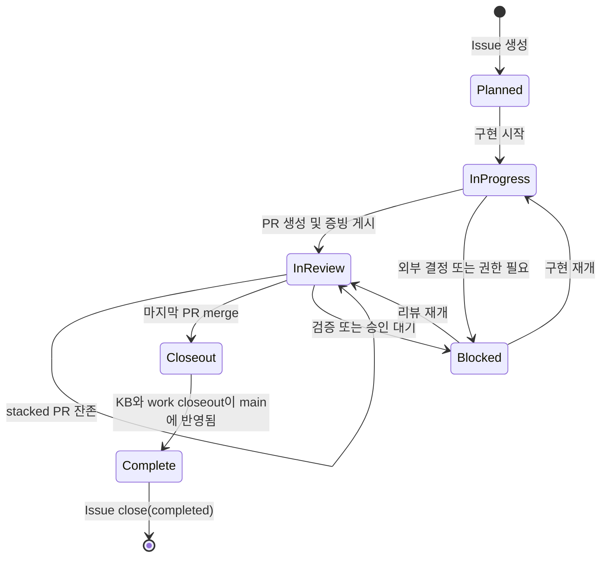
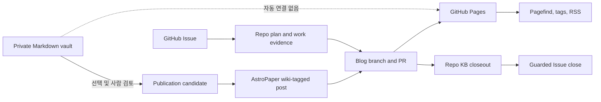

# GitHub-native 개인 지식 및 작업 관리 워크플로 구축 - Plan

## Goal Capsule

- **Objective:** 개인 작업의 제어면을 GitHub Issue/PR로, 장기 지식의 원본을 저장소
  Markdown으로 단일화하고, 비공개 Obsidian 노트에서 기존 AstroPaper/Pagefind 블로그로
  안전하게 승격하는 경계를 구축한다.
- **Product authority:** [GitHub Issue GH-7](https://github.com/zzanghyunmoo/Workspaces/issues/7)과
  [요구사항 문서](../brainstorms/2026-08-24-github-native-personal-knowledge-requirements.md).
- **Delivery boundary:** root 워크스페이스는 `main` 직접 반영을 유지한다. 블로그 변경은
  별도 branch/PR로 전달하고, private repo 최초 기본 브랜치 push와 모든 PR merge는 각각
  사용자 승인 뒤에만 실행한다.
- **Execution direction:** legacy `compound-work/v1`을 그대로 보존한 채 GitHub-native
  `compound-work/v2`를 추가하고, 새 계약을 GH-7 자체에 dogfood한다.

## Product Contract

### Summary

새 작업은 GitHub Issue와 저장소 Markdown만으로 계획·구현·리뷰·closeout을 추적한다.
공개 지식은 기존 블로그의 `wiki` 분류와 Pagefind를 재사용하고, private vault는 자동으로
공개 빌드에 연결하지 않는다.

### Problem Frame

현재 활성 가드레일과 템플릿은 Linear 상태와 Notion 이중 발행을 완료 조건으로 요구한다.
개인 운영에서는 같은 사실을 GitHub, Linear, Notion, 로컬 문서에 반복해 적어야 하고,
merge 이후에도 여러 시스템의 상태를 다시 맞춰야 한다. 반면 코드, 리뷰, 배포, 검증 근거는
이미 GitHub와 저장소에 있으므로 외부 제어면을 추가할수록 원본이 분산된다.

공개 사이트도 AstroPaper, RSS, 태그, Pagefind, GitHub Pages가 이미 작동한다. 이번 작업은
이를 교체하지 않고 지식 탐색 진입점만 추가한다. 개인 초안은 공개 저장소와 물리적으로
분리한 일반 Markdown vault에 두고, 선택된 글만 사람의 공개 판단을 거쳐 기존 content
contract로 옮긴다.

### Requirements

- **R1.** 새 작업은 GitHub Issue URL과 `GH-<number>`를 canonical ticket으로 사용한다.
- **R2.** 열린 Issue는 정확히 하나의 lifecycle label을 가지며, 최종 closeout이 기본 브랜치에
  반영된 뒤 lifecycle label을 제거하고 Issue를 닫는다.
- **R3.** GitHub Project는 선택적인 조회용 projection이며 Issue와 저장소 문서를 대체하지
  않는다.
- **R4.** PR은 Issue와 work evidence를 연결하며, stacked PR이 남은 동안 자동 close keyword를
  사용하지 않는다.
- **R5.** ideation, requirements, plan, work, KB, solution은 지정된 `docs/` Markdown을
  canonical source로 사용한다.
- **R6.** 새 워크플로는 Notion 이중 발행과 Linear 상태 동기화를 요구하지 않는다.
- **R7.** 기존 Linear/Notion 기반 문서와 `compound-work/v1`은 역사 증거로 계속 검증된다.
- **R8.** GitHub Wiki는 canonical 문서 표면으로 사용하지 않는다.
- **R9.** 개인 노트는 공개 블로그와 다른 private Git repository에 일반 Markdown으로 둔다.
- **R10.** 노트 작성 규칙은 표준 Markdown 링크를 기본으로 하고 공개 계약이 Obsidian 전용
  block reference에 의존하지 않는다.
- **R11.** 공개 승격은 자동 동기화가 아니라 선택·검토·정규화한 문서를 블로그 branch/PR로
  옮기는 흐름이다.
- **R12.** private 경로, 원문, 첨부파일, 고유 canary가 public build와 Pagefind에 포함되지
  않았음을 검사한다.
- **R13.** 기존 AstroPaper 배포, RSS, 태그, 전체 글 목록, Pagefind 검색을 유지한다.
- **R14.** `wiki` 글은 기존 블로그 안의 별도 진입점과 기존 검색에서 찾을 수 있다.
- **R15.** 블로그 변경은 해당 저장소의 branch/PR/Pages 검증 규칙을 따른다.

### Key Flows



- **F1. Work lifecycle:** Issue 생성 → lifecycle label 전이 → plan/work 연결 → PR 리뷰 →
  guarded merge → closeout → guarded Issue 종료.
- **F2. Private capture:** private vault에 일반 Markdown으로 기록 → private Git으로 백업 →
  공개 표면과 분리 유지.
- **F3. Public promotion:** 선택한 노트 검토 → 민감 정보와 private link 제거 → AstroPaper
  frontmatter와 표준 링크로 정규화 → blog PR → build/Pagefind 검증.



### Acceptance Examples

- **AE1 — lifecycle:** GH-7 work evidence가 matching Issue URL을 가지며
  `status:in-progress`에서 `status:in-review`로 전이한다. 마지막 merge 뒤에도 closeout
  commit 전에는 Issue가 열려 있다.
- **AE2 — compatibility:** v2 문서는 Notion/Linear 필드 없이 통과하고 기존 v1 fixture는
  수정 없이 계속 통과한다. v2의 `NO-TICKET`, Issue 번호 불일치, 복수 lifecycle label은
  거부된다.
- **AE3 — private boundary:** private fixture의 고유 문구·경로·wikilink·승인되지 않은
  attachment 이름은 public `dist`와 Pagefind에 없고, 승인된 candidate만 검색된다.
- **AE4 — public regression:** `wiki` 글이 전용 진입점과 Pagefind에서 보이면서 기존 posts,
  tags, RSS와 Pages build가 유지된다.

### Success Criteria

- GitHub-native evidence와 Issue 상태를 검사하는 자동화 테스트가 통과한다.
- live 템플릿과 가드레일에서 필수 Notion/Linear 필드가 제거되고 v1 회귀 테스트가 유지된다.
- Issue → plan/work → PR → KB의 양방향 추적 링크를 GH-7에서 실제로 확인할 수 있다.
- private vault가 blog build input이 아니며 privacy canary 검사가 통과한다.
- 기존 블로그의 format, lint, Astro build, Pagefind, RSS 회귀 검사가 통과한다.

### Scope Boundaries

- AstroPaper를 Starlight 또는 Quartz로 교체하지 않는다.
- GitHub Wiki를 만들거나 문서 원본으로 사용하지 않는다.
- Qdrant, FastEmbed, 벡터 DB, Markdown 임베딩 동기화, 검색 MCP를 추가하지 않는다.
- private-to-public 자동 게시 또는 vault 전체 색인을 만들지 않는다.
- 역사 문서의 Notion/Linear 링크를 일괄 수정하지 않는다.
- root `main`을 PR-only로 바꾸거나 GitHub ruleset/required check를 강제하지 않는다.

## Planning Contract

### Assumptions

- 사용자의 실행 지시를 scoping confirmation 생략 승인으로 해석한다. 여기 적힌 추론은
  구현 중 계약 충돌이 발견되면 임의 확대하지 않고 별도 결정으로 돌린다.
- 열린 Issue의 lifecycle label은 `status:planned`, `status:in-progress`,
  `status:in-review`, `status:blocked`만 사용하고 정확히 하나만 둔다. closeout 동안에는
  `status:in-review`를 유지하고, 완료 시 lifecycle label을 제거한 뒤 close reason
  `completed`로 Issue를 닫는다. 취소는 close reason `not planned`로 구분한다.
- private repository 이름은 `zzanghyunmoo/notes-private`로 가정한다. 같은 이름의 repository가
  이미 있으면 덮어쓰지 않고 owner와 PRIVATE visibility를 확인한다. 없으면 빈 PRIVATE remote를
  먼저 만든 뒤 공개 workspace 밖에 clone해 scaffold한다. 최초 기본 브랜치 push 전에는
  프로젝트 main 보호 규칙의 승인 packet을 제시한다.
- GitHub Project 권한은 현재 token에 없으므로 v2 rollout의 blocking dependency가 아니다.
  이후 권한이 주어지면 lifecycle을 `Status` 한 필드에 projection한다.
- 블로그 PR의 work evidence는 root 저장소가 소유한다. 기존 gate가 evidence를 root
  `origin/main`에서 읽고 PR metadata/review comment는 blog repository에서 확인하는
  cross-repo 예외를 문서화하고 회귀 테스트로 고정한다.

### Key Technical Decisions

#### KTD1. `compound-work/v1` 보존과 v2 schema dispatch

기존 validator의 v1 분기를 약화하거나 역사 문서를 변환하지 않는다. 공통 parser와 URL,
PR, review marker, merge SHA helper는 재사용하되 `workflow_schema`에서 v1/v2를 명시적으로
분기한다. v2는 GitHub Issue URL과 repo artifact만 요구하며 Notion/Linear 필드를 알지 못한다.
KB 검증도 parent work schema에 따라 legacy 필드와 v2 필드를 구분한다.

v2 work frontmatter는 다음 계약을 공유한다. `ticket_url`의 owner/repo/number가 Issue
identity이며 `ticket_id`는 그 번호의 짧은 표현이다. `pr_url`과 `remaining_prs`는 다른
repository를 가리킬 수 있고, 이때에도 Issue identity는 `ticket_url`에서만 가져온다.

| 필드 | 형식 | 상태별 규칙 |
| --- | --- | --- |
| `workflow_schema` | `compound-work/v2` | 항상 필수 |
| `ticket_id` | `GH-<positive integer>` | 항상 필수, `ticket_url` 번호와 일치 |
| `ticket_url` | `https://github.com/<owner>/<repo>/issues/<number>` | 항상 필수 |
| `ticket_completion` | `pending` 또는 `complete` | final closeout 전 `pending` |
| `remaining_prs` | 쉼표로 구분한 GitHub PR URL | final closeout의 `complete`일 때 비어 있어야 함 |
| `ideation_status`, `plan_status` | `complete` 또는 `waived` | complete면 repo path, waived면 사유 필수 |
| `work_status` | `in_progress` 또는 `complete` | PR review 전까지 `in_progress` |
| `pr_url` | 단일 GitHub PR URL | PR 생성 뒤 필수, Issue repo와 달라도 됨 |
| `closeout_status` | `pending` 또는 `complete` | merge 전 `pending` |
| `merged_pr_url`, `merge_commit`, `kb_paths`, `closeout_completed_at` | URL/SHA/path/timestamp | closeout complete일 때 필수 |

v2 work 본문은 `작업 목표`, `주요 변경 지점`, `검증`, `GitHub 추적`, `Merge closeout`을
사용한다. v2 KB는 `title`, `ticket`, `ticket_url`, `merged_pr`, `merge_commit`,
`work_evidence`, `last_verified`와 기존 기능 상태·경계·검증·운영 section을 요구한다.
Notion/Linear 필드는 v2에서 선택 필드로도 해석하지 않는다.

#### KTD2. Issue는 remote truth, Markdown은 durable evidence

Issue body는 목표, 현재 상태, canonical 문서와 PR 링크를 담는 짧은 index로 유지한다.
세부 요구사항·계획·구현 로그·검증·운영 지식은 repo Markdown이 소유한다. pre-merge는
Issue가 open이고 `status:in-review`인지 검사한다. intermediate stacked closeout은 Issue를
열어 두고, finalizer만 `origin/main`의 완성된 closeout과 모든 PR merge를 확인한 뒤
열린 lifecycle label을 제거하고 close reason `completed`로 Issue를 닫는다.

#### KTD3. 상태 변경은 재실행 가능하고 종료만 guarded wrapper를 사용한다

일반 label 전이는 현재 상태를 조회한 뒤 비-lifecycle label을 보존하고 lifecycle label만
한 요청에서 교체한다. mutation 직후 다시 읽어 열린 Issue에 lifecycle label이 정확히 하나인지
검증한다. Issue 종료는 dry-run을 지원하는 wrapper로만 수행하며, 매 실행마다 label 제거,
close state, close reason, closeout acknowledgement를 독립적으로 재검증한다. 이미 closed인
Issue도 acknowledgement가 남아 있으면 no-op으로 끝내지 않고 미완료 단계만 복구한다.

#### KTD4. GitHub Project는 비차단 projection이다

Project owner/number와 추가 token scope가 없는 상태에서도 Issue, PR, docs, gate가 모두
동작한다. Project 연결 실패는 core lifecycle 실패가 아니라 `projection pending`으로
보고하며 별도의 truth나 completion gate를 만들지 않는다.

#### KTD5. private와 public은 자동 import가 없는 물리적 경계다

private repo URL, 경로, symlink, content loader를 blog repo에 추가하지 않는다. 공개 승격은
선택한 문서 하나와 필요한 asset만 publication candidate로 복사하고, 공개 전 검사는 private
wikilink/embed/block reference, 민감정보 형태, 승인되지 않은 asset과 canary 유출을 거부한다.
공개 근거에는 private 원본 경로나 본문을 기록하지 않는다.

#### KTD6. 공개 wiki는 기존 content collection의 분류와 탐색을 확장한다

새 content schema나 사이트를 만들지 않는다. 일반 AstroPaper post에 `wiki` tag를 붙이고,
기존 collection/filter/Card를 사용한 `/wiki` entry point와 header navigation을 추가한다.
Pagefind, RSS, tags, posts는 같은 canonical collection을 계속 소비한다.

#### KTD7. 저장소별 landing과 사람 승인 경계를 분리한다

root 계약·문서는 root `main`에 반영할 수 있다. blog source는 child repository branch/PR로
전달하고 최신 head의 code/doc review marker를 다시 검증한 뒤 merge approval packet에서
멈춘다. cross-repo marker는 blog head와 root evidence commit/blob SHA를 함께 고정한다.
blog merge 뒤 root gitlink와 final evidence를 갱신한다. private repo의 최초 main push도
repo, branch, 파일, commit, remote를 명시한 승인 packet 전에는 실행하지 않는다.

cross-repo review marker는 다음 v2 형식을 사용하고 code/doc 댓글을 분리한다.

```html
<!-- ce-review:v2 type=code ticket=GH-7 head_sha=<blog-sha> evidence_commit=<root-sha> evidence_blob=<blob-sha> verdict=pass -->
```

## Implementation Units

### U1. v1 characterization과 GitHub-native v2 evidence contract

- **Files:** `runbooks/compound_workflow_gate.py`,
  `runbooks/tests/test_compound_workflow_gate.py`
- **Approach:** 현재 v1 fixture와 오류 계약을 명시적으로 보존한 뒤 schema dispatcher,
  matching `GH-<number>`/Issue URL, schema별 필수 section/field, v2 KB 계약을 추가한다. local
  `validate-work`는 remote 호출 없이 구조만 검사한다.
- **Test scenarios:** v1 complete/in-progress/waiver/Notion URL/stacked closeout 회귀, v2의
  Notion 없는 정상 문서, URL host·owner·repo·번호 불일치, `GH-0` placeholder, `NO-TICKET`,
  schema별 KB matching과 merge SHA 검증.
- **Requirements:** R1, R5, R6, R7.
- **Dependencies:** 없음.

### U2. Issue lifecycle remote gate와 guarded finalizer

- **Files:** `runbooks/compound_workflow_gate.py`, `runbooks/guarded-pr-merge.sh`,
  `runbooks/finalize-github-issue.sh`, `runbooks/tests/test_compound_workflow_gate.py`,
  `runbooks/tests/test_workflow_shell_guards.sh`
- **Approach:** 기존 PR metadata adapter와 동일한 fail-closed 방식으로 Issue metadata를 읽는다.
  v2 pre-merge는 open/`status:in-review`를 요구한다. intermediate ack는 Issue를 open으로,
  final ack는 main의 closeout, closed/completed reason, lifecycle label 부재를 요구한다.
  finalizer는 dry-run, expected-state precondition, 단계별 reconciliation, already-complete
  no-op, partial failure 후 재실행을 지원한다.
- **Test scenarios:** open/in-review happy path, closed·missing·multiple/wrong label 거부,
  auth/invalid JSON/cross-repo Issue 실패, stacked PR open 유지, unmerged remaining PR 거부,
  premature close 거부, final close/label cleanup/ack 재시도와 no-op, record-before-merge와
  approval bypass 금지.
- **Requirements:** R1, R2, R4.
- **Dependencies:** U1.

### U3. live templates, GitHub Issue intake와 운영 문서 전환

- **Files:** `AGENTS.md`, `CONCEPTS.md`, `.github/ISSUE_TEMPLATE/work.yml`,
  `.github/pull_request_template.md`,
  `docs/works/README.md`, `docs/works/_template.md`, `docs/kb/README.md`,
  `docs/kb/_template.md`, `docs/solutions/conventions/pr-description-template.md`,
  `runbooks/github-native-workflow.md`, `runbooks/install-main-guard-hooks.sh`
- **Approach:** forward 템플릿을 `compound-work/v2`로 바꾸고 v1을 read-only legacy로
  설명한다. Issue form은 문제·범위·완료 증거 링크를 받되 문서 본문을 복제하지 않는다.
  PR은 non-closing Issue reference와 work evidence를 요구한다. 기존 pre-push와 로컬 gate를
  delivery gate로 유지하고, root가 PR-only/ruleset을 채택하기 전에는 비차단 GitHub Actions를
  새로 만들지 않는다. lifecycle labels를 idempotent하게 생성하고 GH-7을
  `status:in-progress`로 전이해 dogfood를 시작한다.
- **Test scenarios:** live template에 mandatory Notion/Linear field 없음, historical allowlist는
  유지, issue form syntax, PR template non-closing link, label provisioning 재실행, local gate green.
- **Requirements:** R1, R2, R3, R4, R5, R6, R7, R8.
- **Dependencies:** U1, U2.

### U4. GH-7 work evidence와 agent resume 경로 dogfood

- **Files:** `docs/works/2026-08-24-GH-7-github-native-personal-knowledge-work.md`,
  `runbooks/tests/test_compound_workflow_gate.py`
- **Approach:** 새 v2 template로 GH-7 evidence를 만들고 requirements/plan/Issue를 연결한다.
  Issue timeline, lifecycle label, work evidence만으로 새 process가 다음 작업을 결정할 수 있게
  한다. 별도 agent checkpoint DB는 만들지 않는다. 실제 PR 이후 전이와 final closeout dogfood는
  U7이 소유한다.
- **Test scenarios:** planned → in-progress evidence 생성과 두 중단점 재개, Issue와 docs의 링크
  추적, Project 권한 부재 시 core lifecycle 지속.
- **Requirements:** R1, R2, R3, R4, R5.
- **Dependencies:** U3.

### U5. private vault scaffold와 공개 승격 검증 경계

- **Files:** `runbooks/private-knowledge-publishing.md`,
  `runbooks/check_publication_candidate.py`, `runbooks/guarded-publication-push.sh`,
  `runbooks/tests/test_check_publication_candidate.py`, private repo의 `README.md`,
  `.gitignore`, `_templates/note.md`, `inbox/`, `notes/`, `assets/`, `publish/`
- **Approach:** public repo에는 promotion 계약과 검사기만 둔다. private repo는 Obsidian이
  그대로 열 수 있는 일반 Markdown 구조로 만든다. 빈 remote를 먼저 PRIVATE로 생성·검증하고
  공개 Workspaces tree 밖의 전용 clone에만 scaffold를 생성하며 `.obsidian/workspace*`, trash,
  secret 파일을 제외한다. explicit repo path를 받는 main-guard 설치 경로로 외부 clone에도
  workspace hook을 설치하고, root `git ls-files`에는 vault 파일이 없어야 한다. 검사기는 candidate
  하나와 remote base..HEAD의 모든 신규 commit/reachable blob을 검사해 private wikilink/embed,
  block reference,
  absolute/private path, secret-shaped text, local attachment와 지정 canary의 public
  artifact 노출을 fail closed한다. private repo 최초 main push는 승인 packet 이후다.
- **Public push boundary:** private note에서 만든 publication candidate는 검사와 사용자 공개
  승인을 precondition으로 가진 wrapper만 push할 수 있다. wrapper는 private 본문·경로를
  출력하지 않는다. 기존 공개 글과 코드만 바꾸는 U6 bootstrap은 private promotion이 아니므로
  일반 blog branch 규칙을 따른다.
- **Test scenarios:** 표준 Markdown candidate 통과, private wikilink/embed/block reference와
  절대 경로·local attachment 거부, 민감정보 fixture, 신규 commit/reachable blob과 new asset
  검사, secret을 추가한 뒤 후속 commit에서 삭제한 history fixture 거부, 고유 canary가 blog
  `dist`/Pagefind에 없음을 확인, 로그에 private 본문·경로 미출력, root tracked-file negative
  assertion, 외부 clone의 미승인 main push 차단. binary asset 승격은 v2 rollout에서 자동
  허용하지 않는다.
- **Requirements:** R9, R10, R11, R12.
- **Dependencies:** U3.

### U6. AstroPaper 안의 wiki 탐색 표면과 검색 회귀

- **Files:** `blogs/src/pages/wiki.astro`, `blogs/src/components/Header.astro`,
  `blogs/src/data/blog/*.md`, `blogs/README.md`, `blogs/package.json`, blog smoke test script
- **Approach:** blog child repository의 별도 branch에서 기존 collection과 정렬/filter/Card를
  재사용해 `/wiki`를 추가하고 header에 노출한다. 신규 공개 글을 만들지 않고 이미 공개된
  `home-ai-platform-series.md`에 `wiki` tag를 추가해 bootstrap fixture로 사용한다. Wiki는 기존
  posts의 필터 진입점이므로 `/wiki`에서만 Wiki nav를 활성화하고 `/posts/<slug>` 상세에서는
  Posts nav를 유지한다. 글이 0개면 설명과 Posts/Search 링크를 표시한다. 생성된 Pagefind API를
  사용하는 smoke test로 title 검색을 확인하고 기존 posts/tags/RSS 결과도 검사한다. private
  repo는 build input에 추가하지 않는다.
- **Test scenarios:** `npm run format:check`, `npm run lint`, `npm run build`, `/wiki` 목록과
  wiki post route, Pagefind 검색 hit, RSS/posts/tags 유지, `/wiki`/post 상세 active state,
  empty state, `aria-current`, focus-visible, mobile keyboard/touch navigation, private
  canary·경로·asset 부재.
- **Requirements:** R11, R12, R13, R14, R15.
- **Dependencies:** U5.

### U7. cross-repo PR, pointer 반영과 final closeout

- **Files:** root-hosted GH-7 work evidence, `blogs` submodule gitlink,
  `docs/kb/workflow-issues/2026-08-24-GH-7-github-native-personal-knowledge.md`
- **Approach:** blog PR 생성 후 URL을 root evidence와 GH-7에 연결하고 최신 head에서
  `ce-code-review`/`ce-doc-review` 댓글을 각각 게시한다. root checkout의 origin/main evidence를
  사용해 blog PR을 검증하는 예외를 runbook대로 실행한다. review marker와 approval packet은
  blog head SHA와 함께 root evidence commit SHA 및 evidence blob SHA를 고정하고, merge gate가
  해당 blob이 root `origin/main`에 그대로 있는지 검증한다. merge approval packet에서 멈추고,
  승인·merge 뒤 root gitlink와 KB/work closeout을 반영한다. private repo 최초 push는 blog PR
  준비·리뷰와 독립된 별도 approval packet으로 처리한다. 실제 in-review → stacked → closeout →
  complete 흐름을 여기서 dogfood하고, 마지막 remaining PR과 closeout이 끝나면 guarded
  finalizer로 GH-7을 닫고 acknowledgement를 실행한다.
- **Test scenarios:** root evidence에서 blog PR head/review 검증, 새 commit 뒤 stale marker 거부,
  blog merge 전 root gitlink 불변, merge 후 gitlink가 exact merge commit을 가리킴, closeout 전
  Issue close 거부, root evidence revision mismatch 거부, KB/work/main/Issue complete 상태 일치.
- **Requirements:** R2, R4, R5, R11, R12, R13, R14, R15.
- **Dependencies:** U4, U6.
- **Completion gates:** private repo 최초 push 승인, blog PR merge 승인.

## Verification Contract

### Root contract gates

```sh
python3 -m unittest discover -s runbooks/tests -p 'test_*.py'
bash runbooks/tests/test_workflow_shell_guards.sh
python3 runbooks/compound_workflow_gate.py validate-work \
  --evidence docs/works/2026-08-24-GH-7-github-native-personal-knowledge-work.md
git diff --check
```

### Blog gates

```sh
cd blogs
npm run format:check
npm run lint
npm run build
npm run test:knowledge
```

### External and privacy evidence

- `gh issue view 7 --repo zzanghyunmoo/Workspaces`에서 open이면 lifecycle label 하나,
  closed/completed이면 lifecycle label이 없음을 확인한다.
- blog PR의 latest head SHA와 code/doc review marker가 일치하는지 pre-merge gate로 확인한다.
- review marker의 root evidence commit/blob SHA가 현재 root `origin/main`의 같은 work evidence와
  일치하는지 확인한다.
- private canary와 private source/attachment 표식이 blog `dist`와 Pagefind asset에 없음을
  publication checker로 확인한다.
- private remote는 `visibility: PRIVATE`를 확인한 뒤에만 최초 push approval packet을 만든다.
- GitHub Project scope가 없다는 이유로 core gates를 실패시키지 않는다.

## Risks and Controls

- **v1 역사 증거 회귀:** schema dispatch 전에 v1 characterization tests를 고정하고 historical
  문서를 일괄 편집하지 않는다.
- **Issue와 evidence split-brain:** Issue가 먼저 닫혔거나 closeout만 complete인 상태를 audit
  error로 취급한다. finalizer는 main과 remote truth를 함께 검사한다.
- **부분 상태 변경과 동시 실행:** lifecycle label mutation 뒤 remote를 다시 읽고 finalizer는
  label/close/ack를 단계별로 reconcile한다. Project 실패는 core lifecycle을 되돌리지 않는다.
- **공개 branch의 조기 노출:** public repo의 unmerged branch도 공개될 수 있으므로 민감정보
  검토와 canary 검사를 첫 push 전에 완료한다. PR review와 merge 승인은 별도다.
- **private 원본 유출:** private repo를 submodule, symlink, build input으로 연결하지 않고
  public evidence에는 destination diff와 검증 결과만 기록한다.
- **cross-repo 완료 오판:** `remaining_prs`에 전체 GitHub PR URL을 기록하고 review marker를
  blog head와 root evidence revision의 tuple에 묶는다. blog merge와 root gitlink/closeout이
  모두 끝나기 전 GH-7을 닫지 않는다.
- **로컬 guard 우회:** 이번 범위에서는 기존 pre-push와 local validator/tests를 유지한다.
  root PR/ruleset을 채택할 때 checked-in CI를 후속으로 추가하며, merge 실행은 기존 approval
  packet과 guarded script만 사용한다.
- **인증 범위 부족:** 현재 `gh` identity/scope만 사용하고 token을 저장하거나 다른 credential을
  탐색하지 않는다. Project scope 부족은 명시적으로 보고하고 나중에 reconcile한다.

## Landing Strategy

1. root에서 U1–U4와 U5의 public runbook/checker를 구현·검증하고 GH-7 evidence를
   `origin/main`에 게시한다.
2. 빈 private remote를 생성해 PRIVATE visibility를 확인하고 공개 Workspaces tree 밖에 clone해
   explicit repo path로 main guard를 설치한 뒤 scaffold를 검증한다. 최초 main push 직전에
   PRIVATE visibility를 다시 확인하고 repo/branch/files/commit/remote approval packet을 제시한다.
3. blog child repository에서 U6 branch/PR을 만들고 root evidence에 PR URL을 게시한다.
4. blog latest head에 code/doc review를 실행하고 별도 댓글과 passing marker를 게시한다.
5. blog PR merge 직전에 repo, PR, head→base, merge method, commit, branch 삭제, Issue 상태
   계획을 포함한 approval packet을 제시한다. 승인 전 merge하지 않는다.
6. 승인·merge 뒤 root gitlink, work evidence, KB를 갱신하고 root `main`에 push한다.
7. finalizer dry-run이 green이면 GH-7의 lifecycle label을 제거하고 reason `completed`로 close한
   뒤 closeout debt를 acknowledge한다. 후속 PR이 남아 있으면 Issue를
   `status:in-review`로 유지한다.

## Definition of Done

- U1–U7의 코드·문서·검증이 완료되고 root 및 blog gate가 모두 green이다.
- GH-7에서 Issue → requirements/plan/work → blog PR → KB를 따라갈 수 있다.
- 신규 v2 evidence는 Notion/Linear 없이 통과하고 legacy v1 suite는 회귀하지 않는다.
- private vault의 최초 push가 명시 승인과 PRIVATE visibility 확인을 거쳐 완료됐다.
- blog PR이 명시 승인 뒤 merge되고 root gitlink가 merge commit을 가리킨다.
- 최종 merge와 closeout 뒤 GH-7에 lifecycle label이 없고 reason `completed`로 closed됐으며
  closeout debt가 acknowledge됐다.

## Approval-bound Handoff

승인 전까지는 전체 Definition of Done을 충족한 것으로 표시하지 않는다. private 최초 push
또는 blog merge 승인을 기다릴 때에는 실행된 검증, green PR, exact approval packet,
`ticket_completion: pending`, 실제 `remaining_prs`, 현재 Issue lifecycle label을 work evidence에
기록하고 `status:blocked` 또는 `status:in-review`로 멈춘다. 승인 뒤 U7과 final closeout을
재개한다.
